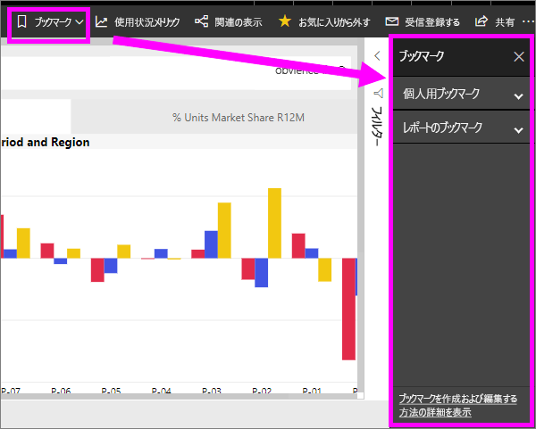
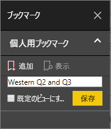
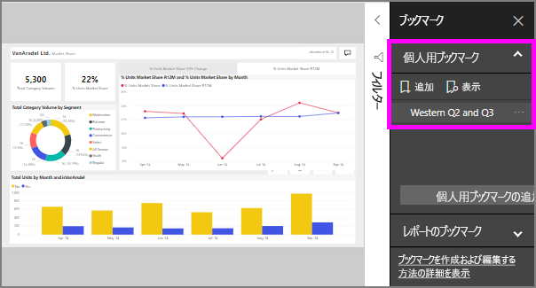

# ブックマークとは
ブックマークは、フィルター、スライサー、そのビジュアルの状態を含む、レポート ページの現在構成されているビューをキャプチャします。 ブックマークを選択すると Power BI に戻ることがそのビュー。 ブックマークの 2 種類があります - 自分やレポートで作成されたものを作成するもの*デザイナー*します。

## Power BI でブックマークを使用して詳細情報を共有し、ストーリーを作成する 
ブックマークの数多くの用途があります。 興味がある情報を検出し、それを保持する--後で返すことができますので、ブックマークを作成するとします。 ままにし、現在の作業を保持する、ブックマークを作成する必要があります。 ブックマークたびにするため、レポートの既定のビューは、返すには、レポート ページのビューが最初に開くことを行うこともできます。 

コレクションを作成することも、ブックマークのし、その後、一連のストーリーに指示する詳細情報を強調表示するプレゼンテーションでは、各ブックマークをステップの順序で配置します。  

## ブックマークの使用
ブックマーク ウィンドウを開くには、次のように選択します。**ブックマーク**、メニュー バーから。 レポートのパブリッシュされた元のビューに戻るに、次のように選択します。**既定値にリセット**します。

### レポートのブックマーク
場合、レポート*デザイナー*レポートのブックマークが含まれている下で見つかります、**ブックマークをレポート**見出し。 

そのレポートの表示に変更するブックマークを選択します。 

### 個人用ブックマーク

ブックマークを作成すると、次の要素がブックマークと共に保存されます。

* 現在のページ
* フィルター
* スライサー、スライサーの種類 (たとえば、ドロップダウンまたはリスト) とスライサーの状態を含みます
* ビジュアルの選択状態 (クロス強調表示フィルターなど)
* 並べ替え順序
* ドリルの場所
* 表示 ( **[選択]** ウィンドウで指定されたオブジェクトの表示)
* 表示されているオブジェクトのフォーカスまたは **Spotlight** モード

ブックマークで表示させたいようにレポート ページを構成します。 意図したとおりにレポート ページとビジュアルを配置できたら、 **[ブックマーク]** ウィンドウの **[追加]** を選んでブックマークを追加します。 この例では、地域および日付の一部のフィルターを追加しました。 

**Power BI**ブックマークを作成し、汎用的な名前または入力した名前が付けられます。 できます*の名前を変更*、*削除*、または*更新*ブックマークには、ブックマークの名前の横にある省略記号を選択し、表示されるメニューからアクションを選択します。

ブックマークを作成したら、内のブックマークを選択するだけで表示できます、**ブックマーク**ウィンドウ。 

<!--
## Arranging bookmarks
As you create bookmarks, you might find that the order in which you create them isn't necessarily the same order you'd like to present them to your audience. No problem, you can easily rearrange the order of bookmarks.

In the **Bookmarks** pane, simply drag-and-drop bookmarks to change their order, as shown in the following image. The yellow bar between bookmarks designates where the dragged bookmark will be placed.

The order of your bookmarks can become important when you use the **View** feature of bookmarks, as described in the next section. 

-->

## スライド ショーとしてのブックマーク
順序で、ブックマークを表示または提示は、次のように選択します。**ビュー**から、**ブックマーク**スライド ショーを開始するウィンドウ。

**表示**モードのときに注意する機能がいくつかあります。

1. ブックマークの名前は、キャンバスの下部にあるブックマークのタイトル バーに表示されます。
2. ブックマークのタイトル バーにある矢印を使って、次または前のブックマークに移動できます。
3. **表示**モードを終了するには、 **[ブックマーク]** ウィンドウの **[終了]** を選ぶか、ブックマークのタイトル バーにある **[X]** を選びます。 

**表示**モードのときは、 **[ブックマーク]** ウィンドウの [X] をクリックしてウィンドウを閉じ、プレゼンテーション用のスペースを大きくすることができます。 また、**表示**モードでは、すべてのビジュアルは対話形式になり、他の場合の対話操作と同様に、クロス強調表示に使うことができます。 

<!--
## Visibility - using the Selection pane
With the release of bookmarks, the new **Selection** pane is also introduced. The **Selection** pane provides a list of all objects on the current page and allows you to select the object and specify whether a given object is visible. 

You can select an object using the **Selection** pane. Also, you can toggle whether the object is currently visible by clicking the eye icon to the right of the visual. 

When a bookmark is added, the visible status of each object is also saved based on its setting in the **Selection** pane. 

It's important to note that **slicers** continue to filter a report page, regardless of whether they are visible. As such, you can create many different bookmarks, with different slicer settings, and make a single report page appear very different (and highlight different insights) in various bookmarks.

## Bookmarks for shapes and images
You can also link shapes and images to bookmarks. With this feature, when you click on an object, it will show the bookmark associated with that object. This can be especially useful when working with buttons; you can learn more by reading the article about [using buttons in Power BI](desktop-buttons.md). 

To assign a bookmark to an object, select the object, then expand the **Action** section from the **Format Shape** pane, as shown in the following image.

Once you turn the **Action** slider to **On** you can select whether the object is a back button, a bookmark, or a Q&A command. If you select bookmark, you can then select which of your bookmarks the object is linked to.

There are all sorts of interesting things you can do with object-linked bookmarking. You can create a visual table of contents on your report page, or you can provide different views (such as visual types) of the same information, just by clicking on an object.

When you are in editing mode you can use ctrl+click to follow the link, and when not in edit mode, simply click the object to follow the link. 

## Bookmark groups

Beginning with the August 2018 release of **Power BI Desktop**, you can create and use bookmark groups. A bookmark group is a collection of bookmarks that you specify, which can be shown and organized as a group. 

To create a bookmark group, hold down the CTRL key and select the bookmarks you want to include in the group, then click the ellipses beside any of the selected bookmarks, and select **Group** from the menu that appears.

**Power BI Desktop** automatically names the group *Group 1*. Fortunately, you can just double-click on the name and rename it to whatever you want.

With any bookmark group, clicking on the bookmark group's name only expands or collapses the group of bookmarks, and does not represent a bookmark by itself. 

When using the **View** feature of bookmarks, the following applies:

* If the selected bookmark is in a group when you select **View** from bookmarks, only the bookmarks *in that group* are shown in the viewing session. 

* If the selected bookmark is not in a group, or is on the top level (such as the name of a bookmark group), then all bookmarks for the entire report are played, including bookmarks in any group. 

To ungroup bookmarks, just select any bookmark in a group, click the ellipses, and then select **Ungroup** from the menu that appears. 

Note that selecting **Ungroup** for any bookmark from a group takes all bookmarks out of the group (it deletes the group, but not the bookmarks themselves). So to remove a single bookmark from a group, you need to **Ungroup** any member from that group, which deletes the grouping, then select the members you want in the new group (using CTRL and clicking each bookmark), and select **Group** again. 
-->

## 制限事項と考慮事項
このリリースの**ブックマーク**には、注意すべきいくつかの制限事項と考慮事項があります。

* ほとんどのカスタム ビジュアルは、ブックマークでうまく機能します。 ブックマークとカスタム ビジュアルで問題が発生する場合は、そのカスタム ビジュアルの作成者に連絡して、ブックマークのサポートをそのビジュアルに追加するよう依頼してください。 
* ブックマークを作成した後でレポート ページにビジュアルを追加した場合、ビジュアルは既定の状態で表示されます。 ブックマークを作成した後でページにスライサーを追加した場合も、スライサーは既定の状態で動作します。
* ブックマークを作成した後でビジュアルを移動すると、ブックマークに反映されます。 
* 一般に、ブックマークを受けない場合、レポート*デザイナー*レポートを再パブリッシュまたは更新します。 ただし、デザイナーが、ブックマークで使用されるフィールドを削除するなど、レポートに主要な変更を行った場合、メッセージが表示されます、エラー、次回そのブックマークを開こうとするとします。 

<!--
## Next steps
spotlight?
-->
