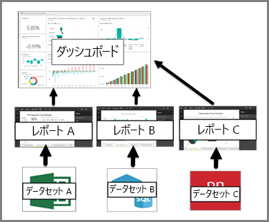

# Power BI サービスの利用者向けのダッシュボード

Power BI の "***ダッシュボード***" は、視覚化を使ってストーリーを伝える単一のページであり、キャンバスと呼ばれることもよくあります。 ダッシュボードは 1 ページに制限されているため、適切に設計されたダッシュボードには、そのストーリーの最も重要な要素のみが含まれます。

ダッシュボードに表示される視覚化は "*タイル*" と呼ばれ、レポートからダッシュボードに "*ピン留め*" されます。 Power BI を初めて使うときは、[Power BI の基本的な概念](end-user-basic-concepts.md)に関するページを読むと基礎がよくわかります。

> [!NOTE]
> ダッシュボードは、Power BI サービスの機能であり、Power BI Desktop では使用できません。 モバイル デバイスでは、ダッシュボードを作成することはできませんが、[表示して共有する](mobile/mobile-apps-view-dashboard.md)ことはできます。
> 
> 

ダッシュボード上の視覚化はレポートから取得され、各レポートは 1 つのデータセットが基になっています。 実際、ダッシュボードは基になっているレポートとデータセットへの入り口と考えることもできます。 視覚化を選ぶと、その作成に使われたレポート (およびデータセット) に行き着きます。

## ダッシュボードの利点
ダッシュボードは、ビジネスを注視し、答えを探し、すべての最も重要なメトリックを一目で見るための、素晴らしい手段です。 ダッシュボード上の視覚化は、1 つまたは複数の基になっているデータセット、および 1 つまたは複数の基になっているレポートから取得できます。 ダッシュボードは、オンプレミスのデータとクラウドで生成されたデータを結合し、データの存在する場所に関係なく統合された表示を提供します。

ダッシュボードは単なる美しい画像ではありません。高度な対話機能とカスタマイズ機能を備え、基になっているデータが変化するとタイルが更新されます。

## ダッシュボードとレポート
レポートも視覚化が表示されたキャンバスであるため、ダッシュボードと混同されることがよくあります。 しかし、大きな違いがいくつかあります。

| **機能** | **ダッシュボード** | **レポート** |
| --- | --- | --- |
| ページ |1 ページ |1 ページ以上 |
| データ ソース |ダッシュボードごとに、1 つ以上のレポートおよび 1 つ以上のデータセット |レポートごとに 1 つのデータセット |
| Power BI Desktop での使用可能性 |いいえ |はい、Desktop でレポートを作成して表示できます |
| ピン留め |現在のダッシュボードの既存の視覚化 (タイル) を他のダッシュボードにピン留めすることだけが可能です |任意のダッシュボードに視覚化を (タイルとして) ピン留めできます。 任意のダッシュボードにレポート ページ全体をピン留めできます。 |
| 購読 |ダッシュボードをサブスクライブすることはできません。 |レポート ページはサブスクライブできます。 |
| フィルター処理 |フィルター処理またはスライスはできません |さまざまな方法でフィルター処理、強調表示、スライスできます |
| 通知の設定 |特定の条件が満たされたときにユーザーにメールを送る通知を作成できます |いいえ |
| おすすめ |1 つのダッシュボードを "おすすめの" ダッシュボードとして設定できます |おすすめのレポートを作成することはできません |
| 自然言語クエリ |ダッシュボードから利用できます |レポートからは利用できません |
| 視覚化の種類の変更 |いいえ。 つまり、レポートの所有者がレポートの視覚化の種類を変更した場合でも、ダッシュボードにピン留めされた視覚化は更新されません |はい |
| 基になっているデータセットのテーブルとフィールドの表示 |いいえ。 データをエクスポートすることはできますが、ダッシュボード自体でテーブルとフィールドを表示することはできません。 |はい。 データセットのテーブル、フィールド、値を表示することができます。 |
| 視覚化の作成 |[タイルの追加] を使ってダッシュボードにウィジェットを追加ことだけできます |編集アクセス許可があれば、さまざまな種類のビジュアルの作成、カスタム ビジュアルの追加、ビジュアルの編集、その他が可能です |
| カスタマイズ |視覚化 (タイル) の移動と配置、サイズ変更、リンクの追加、名前の変更、削除、全画面表示などを行うことができます。 ただし、データと視覚化自体は読み取り専用です。 |読み取りビューでは、発行、埋め込み、フィルター、エクスポート、.pbix としてのダウンロード、関連コンテンツの表示、QR コードの生成、Excel での分析、その他を行うことができます。  編集ビューでは、これまで説明したこと、およびさらに多くのことを実行できます。 |

## ダッシュボードの "作成者" とダッシュボードの "利用者"
自分の役割に応じて、自分で使用するために、または同僚と共有するためにダッシュ ボードを作成する場合があります。 ダッシュボードを作成して共有する方法を覚えておく必要があります。 また、他のユーザーからダッシュボードを受け取る場合もあるため、 ダッシュボードを理解して操作する方法を理解する必要があります。

役割別にダッシュボードを使い始めるときに役立つトピックを以下に示します。

Power BI Pro は、ダッシュボードの共有、および共有ダッシュボードの表示の両方に必要です。

### ダッシュボードを受け取って利用する場合
* [サンプル ダッシュボード](../sample-tutorial-connect-to-the-samples.md)のツアーを利用してダッシュボードに慣れます。
* [ダッシュボードのタイル](end-user-tiles.md)およびタイルを選んだときの結果について学習します。
* ダッシュボードの個々のタイルを追跡し、特定のしきい値に達したときにメールを受け取りたい場合は、 [タイルに通知を作成](end-user-alerts.md)します。
* ダッシュボードに質問したい場合は、 [Power BI Q&A](end-user-q-and-a.md) を使ってデータについて質問し、視覚化の形式で回答を受け取る方法を学習します。

> [!TIP]
> 知りたいことがここで見つからない場合は、左側の目次で探してください。
> 

## 次の手順
[Power BI とは?](../power-bi-overview.md)  
[Power BI - 基本的な概念](end-user-basic-concepts.md)  