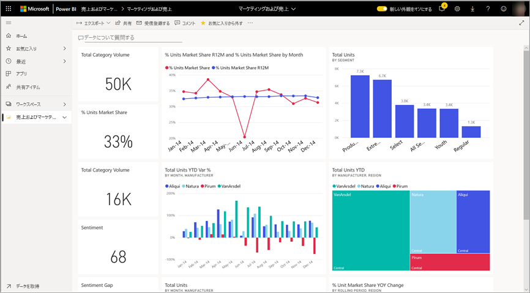
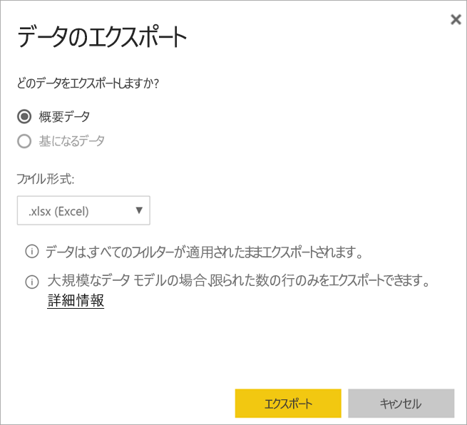
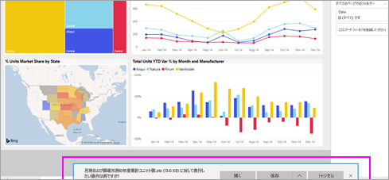

# ビジュアルからデータをエクスポートする
ビジュアルの作成に使用されているデータを確認したい場合は、[Power BI でそのデータを表示する](end-user-show-data.md)か、またはそのデータを Excel にエクスポートすることができます。 データをエクスポートするオプションを使用するには、特定の種類のライセンスと、コンテンツの編集アクセス許可が必要です。 エクスポートできない場合は、Power BI 管理者に問い合わせてください。 

## Power BI ダッシュボード上のビジュアルから

1. Power BI ダッシュボードから始めます。 ここでは、"***マーケティングと売上サンプル***" アプリのダッシュボードを使用しています。 [このアプリは AppSource.com からダウンロード](https://appsource.microsoft.com/en-us/product/power-bi/microsoft-retail-analysis-sample.salesandmarketingsample-preview?flightCodes=e2b06c7a-a438-4d99-9eb6-4324ce87f282)できます。

    

2. ビジュアルをポイントすると省略記号 [...] が表示され、クリックするとアクション メニューが表示されます。

    

3. **[Excel にエクスポート]** を選択します。

4. 次に行われることは、使用しているブラウザーによって異なります。 ファイルを保存するように求められるか、またはブラウザーの下部にエクスポートされたファイルへのリンクが表示される場合があります。 

    

5. Excel でファイルを開きます。  

    

## レポート内のビジュアルから
レポート内のビジュアルから、.csv または .xlsx (Excel) 形式として、データをエクスポートできます。 

1. ダッシュボードでタイルを選択して、基になっているレポートを開きます。  この例では、上と同じビジュアル *Total Units YTD Var %* を選択しています。 

    

    このタイルは "*売上とマーケティング サンプル*" のレポートから作成されたものであるため、そのレポートが開きます。 また、選択したタイル ビジュアルが含まれるページが開きます。 

2. レポートでタイルを選択します。 右側の **[フィルター]** ウィンドウに注意してください。 このビジュアルにはフィルターが適用されています。 フィルターの詳細については、[レポートでのフィルターの使用](end-user-report-filter.md)に関する記事を参照してください。

    ![選択された [フィルター] ウィンドウ](media/end-user-export/power-bi-export-filter.png)

3. ビジュアルの右上隅にある省略記号を選択します。 **[データのエクスポート]** を選択します。

    

4. 概要データまたは基になるデータをエクスポートするオプションが表示されます。 "*売上およびマーケティング サンプル*" アプリを使用している場合、 **[基になるデータ]** は無効になります。 ただし、両方のオプションが有効になるレポートもあります。 ここでは、その違いについて説明します。

    **[概要データ]** : ビジュアルで表示されている内容のデータをエクスポートする場合、このオプションを選択します。  この種類のエクスポートでは、ビジュアルの作成に使用されたデータのみが表示されます。 ビジュアルにフィルターが適用されている場合は、エクスポートしたデータもフィルター処理されています。 たとえば、このビジュアルの場合、エクスポートには 2014 年と中央地域のみのデータ、そして次の 4 つの製造元のデータのみが含まれます: VanArsdel、Natura、Aliqui、Pirum。
  

    **[基になるデータ]** : ビジュアルに表示されているデータに**加えて**、基になるデータセットからの追加データをエクスポートする場合は、このオプションを選択します。  これには、データセットには含まれているものの、ビジュアルでは使用されていないデータが、含まれる場合があります。 

    

5. 次に行われることは、使用しているブラウザーによって異なります。 ファイルを保存するように求められるか、またはブラウザーの下部にエクスポートされたファイルへのリンクが表示される場合があります。 

    

6. Excel でファイルを開きます。 エクスポートされたデータの量を、ダッシュボードの同じビジュアルからエクスポートしたデータと比べてください。 違うのは、このエクスポートには**基になるデータ**が含まれているためです。 

    

## 次の手順

[視覚化の作成に使用されたデータを表示する](end-user-show-data.md)