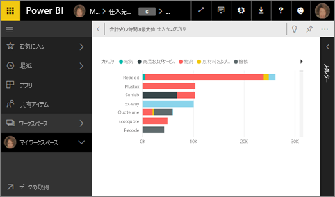

# コンテンツを詳細に表示する: フォーカス モードと全画面表示モード

<iframe width="560" height="315" src="https://www.youtube.com/embed/dtdLul6otYE" frameborder="0" allowfullscreen></iframe>

フォーカス モードと全画面表示モードは、ビジュアル、レポート、ダッシュボードで詳細を表示する 2 つの方法です。  主な違いは、全画面表示ではコンテンツを囲むすべてのウィンドウが削除されるのに対し、フォーカス モードではビジュアルを引き続き操作することができます。 類似点と相違点について詳しく見てみましょう。  

|コンテンツ    | フォーカス モード  |全画面表示モード  |
|---------|---------|----------------------|
|ダッシュボード     |   不可能     | はい |
|レポート ページ   | 不可能  | はい|
|レポートの視覚エフェクト | はい    | はい |
|ダッシュボード タイル | はい    | はい |
|Windows 10 モバイル | 不可能 | はい |

## 全画面表示モードの概要

メニューやナビゲーション バーを表示せずに、Power BI サービスのコンテンツ (ダッシュボード、レポート ページ、タイル、視覚エフェクト) を表示します。  いつでもひと目でコンテンツの全体図のみを把握できます。 このモードはテレビ モードとも呼ばれます。   

全画面表示モードを開くには、フォーカス モードのダッシュボード、レポート、タイル、ビジュアルの上部にある Power BI サービスのメニュー バーで**全画面表示**アイコン  を選択します。  選択したコンテンツが画面全体に表示されます。
Power BI Mobile を使用している場合、[全画面は Windows 10 Mobile アプリで使用できます](./mobile/mobile-windows-10-app-presentation-mode.md)。 

全画面表示モードの使用例:

* ミーティングや会議でダッシュボード、タイル、ビジュアル、またはレポートをプレゼンテーションする
* オフィスの専用の大型画面やプロジェクターに表示する
* 小さな画面に表示する
* ロック モードで再表示する -- 元のレポートやダッシュボードを開かずに、画面をタッチしたり、タイルにマウスでポイントしたりできます。

## フォーカス モードとは何ですか。
"***フォーカス***" モードでは、ビジュアルまたはタイルを拡大 (ポップアウト) し、詳細を確認することができます。  ダッシュボードやレポートが少し混み合っていて、1 つのビジュアルだけを拡大して見たいことがあるでしょう。  これは、フォーカス モードを使用するのに最適です。  

フォーカス モードでは、Power BI の "*コンシューマー*" は、このビジュアルを作成するときに適用されたフィルターを操作できます。  Power BI サービスでは、ダッシュボードのタイルまたはレポートのビジュアルでフォーカス モードを使用できます。

## 全画面表示モードでの操作
ダッシュボードまたはレポートのページを全画面表示モードで開くには、全画面表示アイコンを選択します  (上部のナビゲーション バー)。 全画面表示モードにした後は、マウスまたはカーソルを移動するとコンテキスト メニューが表示されます。 全画面表示はさまざまなコンテンツで使用できるので、コンテキスト メニューのオプションはそれぞれで少し異なりますが、それ自体でよくわかるようになっています。  アイコンをポイントすると定義が表示されます。

ダッシュボードのメニュー    
    

レポート ページのメニュー    
    

  * ![[戻る] アイコン](media/end-user-focus/power-bi-back-icon.png)    
  前のページに移動するには、ブラウザーの **[戻る]** ボタンをクリックします。 前のページが Power BI ページの場合、それも全画面表示モードで表示されます。  全画面表示モードは閉じるまで保持されます。

  * ![[印刷] アイコン](media/end-user-focus/power-bi-print-icon.png)    
  全画面表示モードでダッシュボードまたはレポート ページを印刷するには、このボタンを使用します。

  * ![[画面に合わせる] アイコン](media/end-user-focus/power-bi-fit-to-width.png)    
    スクロールバーを利用せずにダッシュボードを最大サイズで表示するには、 **[画面に合わせる]** ボタンを使用します。  

    

  * ![[幅に合わせる] アイコン](media/end-user-focus/power-bi-fit-width.png)       
    スクロール バーは気にならないが、ダッシュボードを使用できる領域の幅いっぱいに表示したいことがあります。 **[幅に合わせる]** ボタンを選択します。    

    ![[画面に合わせる] アイコン](media/end-user-focus/power-bi-fit-to-width-new.png)

  *        
    全画面表示レポートでは、矢印を利用してレポートのページ間を移動します。    
  * 全画面表示モードを終了するには、 **[全画面表示を閉じる]** アイコンを選択します。

      ![[全画面表示を閉じる] アイコン](media/end-user-focus/exit-fullscreen-new.png)

## フォーカス モードでの操作
フォーカス モードを開には、ダッシュボードのタイルでの方法と、レポートの視覚エフェクトでの方法の 2 種類があります。

### ダッシュボードでのフォーカス モード
1. Power BI サービスでダッシュボードを開きます。

2. ダッシュボードのタイルまたはレポートの視覚エフェクトをポイントし、省略記号 [...] を選択して、 **[フォーカス モードで開く]** を選択します。

    .

2. タイルが開き、レポート キャンバス全体に拡張されます。

   

3. [フィルター] ウィンドウを展開すると、このビジュアルに適用されているすべてのフィルターが表示されます。

   ![[フィルター] ウィンドウのフォーカス モード](media/end-user-focus/power-bi-focus-filters.png)

4. [フィルターを変更](end-user-report-filter.md)し、データで興味深い発見を探すことにより、詳しく探索します。  

5. フォーカス モードを閉じ、ダッシュボードに戻るには、 **[フォーカス モードの終了]** (ビジュアルの左上隅) を選択します。

        

## レポートの視覚化のフォーカス モード
1. Power BI サービスでレポートを開きます。  この例では、小売の分析のサンプルを使用して示します。

1. レポートが開いたら、**District Monthly Sales タブ**を選択します。

2. 左下隅の面グラフをポイントし、**フォーカス モード** アイコン  を選択します。  

   
2. 視覚化が開き、キャンバス全体に拡張されます。

   
3. 必要に応じて、[フィルター] ウィンドウを展開し、このビジュアルに適用されているフィルターを操作します。 データを詳しく調べて、新しい分析情報や質問への回答を探します。 "*コンシューマー*" は、新しいフィルターの追加、視覚エフェクトで使用されているフィールドの変更、新しい視覚エフェクトの作成を行うことはできません。  ただし、既存のフィルターに対する変更は、Power BI を終了するときに保存されます。 Power BI に変更を保存したくない場合は、 **[既定値にリセット]** を選択します。 ![[既定値にリセット] ボタン](media/end-user-focus/power-bi-resets.png)  

   ![[フィルター] 画面のフォーカス モード](media/end-user-focus/power-bi-display-focus-filters3.png)

5. フォーカス モードを閉じ、レポートに戻るには、 **[レポートに戻る]** (ビジュアルの左上隅) を選択します。

      

## 考慮事項とトラブルシューティング
* レポート内のビジュアルと共にフォーカス モードを使用する場合は、すべてのフィルターを表示して操作できます:ビジュアル レベル、ページ レベル、ドリルスルー、レポート レベル。    
* ダッシュボードの視覚化でフォーカス モードを使用する場合は、ビジュアル レベルのフィルターのみを表示して、操作することができます。

## 次の手順
[レポートの表示設定](end-user-report-view.md)