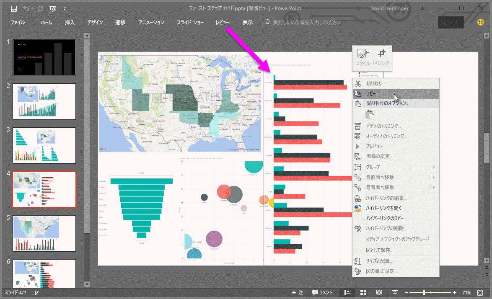

# Power BI から PowerPoint にレポートをエクスポートする
Power BI では、レポートを **Microsoft PowerPoint** に発行して、Power BI レポートに基づくスライド デッキを簡単に作成できます。 **PowerPoint にエクスポート**すると、次のようになります。

* Power BI レポートの各ページは、PowerPoint では個別のスライドになります
* Power BI レポートの各ページは、単一の高解像度のイメージとして PowerPoint にエクスポートされます
<!-- * The filters and slicers settings that you added to the report are preserved. -->
* PowerPoint に、Power BI レポートへのリンクが作成されます 

**Power BI レポート**は、**PowerPoint** に短時間でエクスポートできます。 次のセクションで説明する手順に従うだけです。

## Power BI レポートを PowerPoint にエクスポートする方法
Power BI サービスで、レポートを選択してそれをキャンバス上に表示します。 また、 **[ホーム]** ページや **[アプリ]** など、左側のナビゲーション ウィンドウで選択した場所からのレポートを選択することもできます。

![メニュー バーの [ファイル]、[PowerPoint へのエクスポート] を指している矢印](media/end-user-powerpoint/power-bi-publish.png)

PowerPoint にエクスポートするレポートがキャンバスに表示されている場合は、Power BI サービスのメニュー バーから **[ファイル] > [PowerPoint へのエクスポート]** を選択します。

![左のナビゲーション バーの [マイ ワークスペース]、[ファイル] ドロップダウンが選択された状態のクローズ アップ](media/end-user-powerpoint/powerbi_to_powerpoint_1.png)
   
表示されるポップアップには、 **[現在のビュー]** または **[既定のビュー]** を選択するオプションがあります。  **[現在のビュー]** では現在の状態でレポートがエクスポートされ、スライサーとフィルターの値に対して行ったアクティブな変更が含まれます。  ほとんどのユーザーは、このオプションを選択します。  または、 **[既定のビュー]** を選択するとレポートは (作成者が共有したときの) 元の状態でエクスポートされ、元の状態に対して行った変更は反映されません。
    
さらに、レポートの非表示のタブをエクスポートするかどうかを選択するチェック ボックスがあります。  ブラウザーに表示されるレポートのタブのみをエクスポートしたい場合は、このチェック ボックスをオンにするだけです。  すべての非表示タブをエクスポートに含めたい場合は、オフのままにします。  チェック ボックスがグレー表示になっている場合は、レポートには非表示タブはありません。  選択を行った後、 **[エクスポート]** をクリックして続行します。

レポートが PowerPoint にエクスポートされていることを示す通知バナーが、Power BI サービス ブラウザー ウィンドウの右上隅に表示されます。 これには数分間かかる場合があり、レポートのエクスポート中も Power BI で作業を進めることができます。

完了すると、Power BI サービスのエクスポート処理が終了したことが通知バナーで示されます。

ファイルは、ブラウザーがダウンロードしたファイルを表示する場所から使用できます。 次の図では、ブラウザー ウィンドウ下部のダウンロード バナーとして表示されています。

これで完了です。 ファイルをダウンロードし、PowerPoint で開き、他の PowerPoint デッキと同様に変更したり拡張したりできます。

## エクスポートした PowerPoint ファイルの確認
Power BI でエクスポートした PowerPoint ファイルを開くと、便利な要素がいくつかあることに気付きます。 次の図を見てから、番号に対応する説明で機能を確認してください。

1. スライド デッキの最初のページには、レポートの名前と、スライド デッキの基になっているレポートを表示する **[Power BI で表示する]** リンクが含まれます。
2. レポートに関する有用な情報も表示されます。エクスポートされたレポートの基になっている *前回のデータ更新* 日時や、Power BI レポートを PowerPoint ファイルにエクスポートした日時を示す *ダウンロード* 日時などです。
3. 左側のナビゲーション ウィンドウを見るとわかるように、各レポート ページは異なるスライドになっています。 
4. 公開されたレポートは Power BI の言語設定かブラウザーのロケール設定に基づいてレンダリングされます。 言語の優先順位を表示または設定するには、歯車アイコン  **、[設定]、[全般]、[言語]** の順に選択します。 ロケール情報については、「[Power BI でサポートされる言語と国/地域](../supported-languages-countries-regions.md)」を参照してください。
5. PowerPoint プレゼンテーションにはカバー スライドが含まれますが、そこには正しいタイム ゾーンの時刻がエクスポートされます。

個々のスライドを見ると、各ビジュアルが独立した画像になっていることがわかります。

>[!NOTE]
> レポート ページごとにビジュアルを 1 つ含める動作は、新しい動作となります。 ビジュアルごとに独立したイメージを指定していた以前の動作は、現在実装されていません。 
 

PowerPoint デッキや高解像度画像についての作業を自由に行うことができます。

## 制限事項
**PowerPoint へのエクスポート**機能を使用するときに留意する必要のある注意事項と制限事項がいくつかあります。

* 現在、**R ビジュアル**はサポートされていません。 このようなビジュアルは空の画像として PowerPoint にエクスポートされ、サポートされていないビジュアルであるというエラー メッセージが表示されます。
* **認定を受けた** **カスタム ビジュアル** はサポートされます。 カスタム ビジュアルの認定を受ける方法など、認定を受けたカスタム ビジュアルの詳細については、「[カスタム ビジュアルの*認定*を受ける](../power-bi-custom-visuals-certified.md)」を参照してください。 認定を受けていないカスタム ビジュアルはサポートされず、空の画像として PowerPoint にエクスポートされ、サポートされていないビジュアルであるというエラー メッセージが表示されます。
* 現在、レポート ページが 30 ページを超えるレポートはエクスポートできません。
* レポートを PowerPoint にエクスポートする処理には、数分かかる場合があります。 必要な時間に影響する要因としては、レポートの構造や、Power BI サービスの現在の負荷などがあります。
* Power BI サービスで **[PowerPoint へのエクスポート]** メニュー項目を使用できない場合は、テナント管理者が機能を無効にしている可能性があります。 詳細については、テナント管理者に問い合わせてください。
* 背景画像はグラフの境界領域でトリミングされます。 PowerPoint にエクスポートする前に背景画像を削除することを強くお勧めします。
* PowerPoint のページは、Power BI レポートの元のページのサイズまたは寸法に関係なく、常に標準の 9:16 サイズで作成されます。
* Power BI テナント ドメイン外のユーザーによって所有されているレポート (組織外のユーザーが所有していて、そのユーザーから共有されているレポートなど) は、PowerPoint に発行できません。
* 組織外の人 (つまり、Power BI テナント内にいないユーザー) とダッシュボードを共有している場合、そのユーザーは共有されたダッシュ ボードに関連付けられているレポートを PowerPoint にエクスポートできません。 たとえば、ユーザー aaron@contoso.com は david@cohowinery.com と共有することができます。 しかし、david@cohowinery.com は関連付けられたレポートを PowerPoint にエクスポートできません。
* エクスポートは、以前のバージョンの PowerPoint では機能しない可能性があります。
* 前述のように、各レポート ページは、PowerPoint ファイルに単一のイメージとしてエクスポートされます。
* Power BI サービスでは、Power BI の言語設定を PowerPoint のエクスポート用の言語として使用します。 言語の優先順位を表示または設定するには、歯車アイコン  **、[設定]、[全般]、[言語]** の順に選択します。
* エクスポートした PowerPoint ファイルの、表紙スライドの **[Downloaded at]\(ダウンロードした時刻\)** は、お使いのコンピューターのタイム ゾーンにおけるエクスポート時の時刻に設定されます。
* 現在、エクスポートに [現在の値] を選択した場合、URL フィルターは適用されません。

## 次の手順
[レポートの印刷](end-user-print.md)
