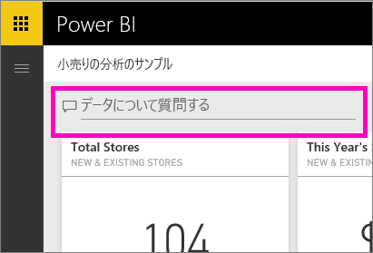
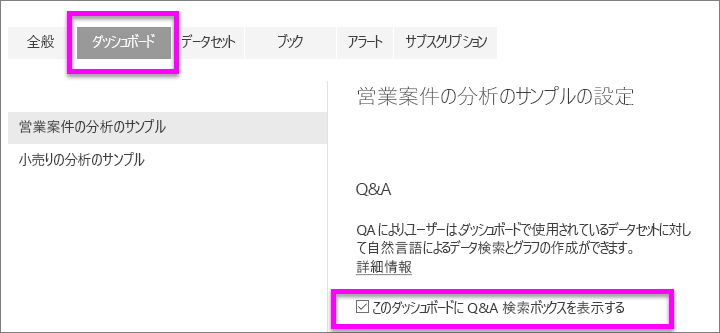
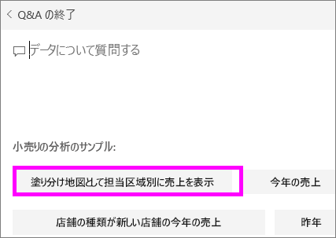

# Power BI **コンシューマー**のための Q&A
## Q&A とは
自然言語を使用して質問するのが、データから回答を得る最も速い方法である場合があります。 たとえば、「昨年の総売り上げはいくらですか」という質問です。  
Q&A を使用すると、直感的な自然言語の機能を使ってデータを調査し、チャートやグラフの形式で質問に対する回答を受け取ることができます。 Q&A は、検索エンジンとは異なります。Q&A は Power BI 内のデータに関する結果だけを提供します。

**Power BI Q & A** は英語で寄せられた自然言語クエリの回答のみをサポートします。 Power BI 管理者によって有効にできるスペイン語で使用できるプレビューがあります。

**Power BI Q&A** は Pro または Premium ライセンスで利用できます。 
>

質問をすることは、始まりにすぎません。  質問の検索条件を限定あるいは拡大したり、信頼に値する新しい情報を明らかにしたり、詳しい情報に的を絞ったり、ズームアウトしてより広い視野を得たりして、データの調査を楽しんでください。 分析や発見を行うことによって喜びを得ることができます。

エクスペリエンスはまったくの対話型で、しかも高速です。 メモリ内の記憶域を使用するため、ほぼ瞬時に応答します。

## Q&A はどこで使用できますか。
Power BI サービスのダッシュボード、Power BI モバイルのダッシュボードの下部、Power BI Embedded の視覚エフェクトの上に Q&A があります。 デザイナーから編集アクセス許可を与えられていない場合、利用者は Q&A を使ってデータを探すことはできますが、Q&A で作成された視覚エフェクトを保存することはできません。

## Q&A は、回答する方法をどのように知るのでしょうか。
Q&A は、ダッシュボードに関連付けられているすべてのデータセットで回答を探します。 ダッシュボードでデータセットにタイルがある場合、Q&A はそのデータセットで回答を探します。 

## どのように始めますか。
最初に、内容を理解します。 ダッシュボードとレポートで視覚エフェクトを眺めてください。 自分が利用できるデータの型と範囲の感じをつかみます。 それからダッシュボードに戻り、質問ボックスにカーソルを置きます。 これで Q&A 画面が開きます。

 

* 視覚エフェクトの軸のラベルと値に "売上"、"アカウント"、"月"、"営業案件" が含まれている場合は、自信を持って次のような質問をすることができます。「どの "*アカウント*" の "*営業案件*" が一番多いか」または「月別の "*売上*" を棒グラフとして表示する」。

* Google Analytics に Web サイトのパフォーマンス データがある場合は、Web ページの利用に費やした時間、固有のページのアクセス数、ユーザーの契約率に関する Q&A を行えます。 あるいは、人口統計データのクエリを実行している場合は、年齢および場所ごとの世帯収入に関する質問をする場合があります。

画面の下に、役に立つ項目が他にも表示されます。 データセットごとに Q&A からキーワードが提示されます。サンプルを提示したり、質問を提案したりすることもあります。 いずれかを選択し、質問ボックスに追加します。 

Q&A の回答支援機能としては他にプロンプト、オートコンプリート、視覚的ヒントがあります。 

 

### Q&A はどの視覚化を使用しますか。
Q&A は、表示されているデータに基づいて最適な視覚化を選びます。 基になるデータセットにあるデータは、特定の種類またはカテゴリとして定義されることがあります。Q&A はこれを利用して表示方法が分かります。 たとえば、データが日付型として定義されている場合は、折れ線グラフで表示される可能性が高くなります。 市区町村として分類されているデータは、マップとして表示される可能性が高くなります。

また、Q&A に独自の質問を追加して、使用する視覚化を Q&A で指定することもできます。 しかし、Q&A が常に要求した種類の視覚化でデータを表示できるとは限らないことにご注意ください。 Q&A は実行可能な視覚エフェクトの種類の一覧を提示した上でユーザーにプロンプトを表示します。

## 考慮事項とトラブルシューティング
**質問**:このダッシュボードに Q&A が表示されません。    
**回答 1**:質問ボックスが表示されない場合、最初に設定を確認してください。 それを行うには、Power BI ツール バーの右上隅にある歯車アイコンを選択します。   

次に、**[設定]** > **[ダッシュボード]** の順に選択します。 **[このダッシュボードに Q&A 検索ボックスを表示する]** の隣にチェックマークがあることを確認します。
  

**回答 2**:ダッシュボードの "*デザイナー*" や管理者が Q&A をオフにすることがあります。 オンに戻しても問題ないか担当者に確認してください。   

**質問**:質問を入力しても、求めている結果が表示されません。    
**回答**:ダッシュボードの "*デザイナー*" にお問い合わせください。 Q&A の結果を改善するためにデザイナーができることがたくさんあります。 たとえば、デザイナーは、簡単に理解される言葉を使用するようにデータセットの列名を変更できます (`CustFN` の代わりに `CustomerFirstName`)。 デザイナーはデータセットのことをよく理解しているため、役に立つ質問を考え、Q&A キャンバスに追加できます。

## 次の手順

