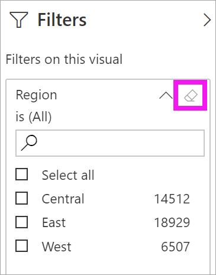

# レポート フィルター ウィンドウの使用方法

この記事では、Power BI サービスのレポートの **[フィルター]** ウィンドウについて説明します。 このフィルターを使用すると、お使いのデータの新しい分析情報を得ることができます。

Power BI でデータをフィルター処理方法は多数あります。 フィルターの詳細については、[Power BI レポートでのフィルターと強調表示](../power-bi-reports-filters-and-highlighting.md)に関するページをご覧ください。

![矢印が [フィルター] オプションを指しているブラウザー上のレポートのスクリーンショット。](media/end-user-report-filter/power-bi-report.png)

## レポート フィルター ウィンドウの操作

同僚とレポートを共有する場合は、必ず **[フィルター]** ウィンドウを探してください。 レポートの右端に沿って折りたたまれている場合があります。 それを選択して展開します。

![[フィルター] ウィンドウが展開されているレポートのスクリーン ショット。](media/end-user-report-filter/power-bi-expand-filter-pane.png)

**[フィルター]** ウィンドウには、レポート *デザイナー*によってレポートに追加されたフィルターが含まれています。 お客様のような*コンシューマー*は、既存のフィルターを操作して、その変更内容を保存できますが、新しいフィルターをレポートに追加することはできません。 たとえば、上のスクリーンショットでは、デザイナーによって次の 3 つのページ レベル フィルターが追加されています: **Segment is All (セグメントはすべて)** 、**Year is 2014 (年は 2014)** 、**Region is Central (地域は中部)** 。 これらのフィルターを操作して変更することはできますが、4 番目のページ レベル フィルターを追加することはできません。

Power BI サービスでは、 **[フィルター]** ウィンドウで加えたすべての変更はレポートに保持されます。 それらの変更は、サービスによってレポートのモバイル バージョンに回されます。

**[フィルター]** ウィンドウを設計者の既定値にリセットするには、上部のメニュー バーから **[既定値にリセット]** を選択します。

![[既定値にリセット] アイコンのスクリーンショット。](media/end-user-report-filter/power-bi-reset-icon.png) 

## レポート ページのすべてのフィルターを表示する

**[フィルター]** ウィンドウには、デザイナーによってレポートに追加されたすべてのフィルターが表示されます。 **[フィルター]** ウィンドウは、フィルターに関する情報を表示し、それらを操作できる領域でもあります。 行った変更を保存したり、 **[既定値にリセット]** を使用してフィルターを元の設定に戻したりします。

保存したい変更がある場合は、個人用ブックマークを作成することもできます。 詳細については、[ブックマーク](end-user-bookmarks.md)に関するページをご覧ください。

**[フィルター]** ウィンドウでは、複数の種類のレポート フィルター (レポート、レポート ページ、ビジュアル) が表示され、それらを管理します。

この例では、3 個のフィルターがあるビジュアルが選択されています。 レポート ページにも、 **[このページでフィルター]** という見出しの下にフィルターがあります。 また、レポート全体にも **[日付]** フィルターがあります。

一部のフィルターの横には **(すべて)** があります。 **(すべて)** とは、フィルターにすべての値が含まれていることを意味します。 上のスクリーンショットの **[Segment(All)]** \(セグメント (すべて)\) は、このレポート ページにすべての製品セグメントに関するデータが含まれることを示します。 

このレポートを表示するユーザーは、だれでもこれらのフィルターを操作できます。

### ビジュアルに適用されたフィルターのみを表示する

特定のビジュアルに適用されたフィルターの詳細を知るには、ビジュアルの上にマウスを置き、フィルター アイコン  を表示します。 そのフィルター アイコンを選択し、そのビジュアルに影響するすべてのフィルターやスライサーなどが含まれるポップアップを表示します。 ポップアップのフィルターには、 **[フィルター]** ウィンドウに表示されるのと同じフィルターに加えて、選択したビジュアルに影響する追加のフィルターが含まれます。

![それらのフィルターが [フィルター] ウィンドウのどこを指すかを矢印が示す、フィルター一覧のスクリーンショット。](media/end-user-report-filter/power-bi-hover-filters.png)

このビューで表示できるフィルターの種類は次のとおりです。

- 基本フィルター
- スライサー
- クロス強調表示
- クロス フィルター処理
- 高度なフィルター
- 上位 N のフィルター
- 相対日付フィルター
- 同期スライサー
- 含める/除外するフィルター
- URL を使って渡されるフィルター

この例は次のとおりです。
1. **[含む]** は、ビジュアルがクロスフィルター処理されていることを示します。 これは、このレポート ページの他のビジュアルの 1 つで、Utah、Colorado、Texas 州が選択されていることを意味します。 この例では、それはマップです。 それら 3 つの州を選択すると、他のすべての州のデータが、選択した横棒グラフに表示されなくなります。  

1. **Date (日付)** は、このレポートのすべてのページに適用されているフィルターです。

1. **Region is Central (地域は中部)** と **Year is 2014 (年は 2014)** は、このレポート ページに適用されているフィルターです。

4. **Manufacturer is VanArsdel, Natura, Aliqui, or Pirum (製造元は、VanArsdel、Natura、または Pirum)** は、このビジュアルに適用されているフィルターです。

### フィルターで検索する

フィルターには、値が多数あることがあります。 検索ボックスを使用すると、目的の値を検索して選択できます。

### フィルターの詳細を表示

フィルターについて理解するには、利用可能な値とその数を確認します。  フィルターの詳細を表示するには、フィルター名の横にある矢印の上にカーソルを置いて選択します。
  

### フィルター選択の変更

データの分析情報を検索する方法の 1 つには、フィルターの操作があります。 選択されているフィルターを変更するには、フィールド名の横のドロップダウン矢印を使用します。  フィルターおよび Power BI がフィルター処理するデータの種類に応じて、オプションは一覧からの単純な選択から、日付または数値の範囲の識別におよびます。 下記の詳細フィルターでは、ツリーマップの **[Total Units YTD]** \(個数合計 YTD\) フィルターを 2,000 と 3,000 に変更しました。 この変更により、ツリーマップから Pirum が削除されたことに注意してください。
  

> [!TIP]
> 一度に 1 つ以上のフィルター値を選択するには、CTRL キーを押しながら保持します。 ほとんどのフィルターでは、複数の選択がサポートされています。

### フィルターを既定にリセットする

フィルターに加えたすべての変更を取り消すには、上部のメニュー バーから **[既定値にリセット]** を選択します。  この選択により、フィルターはレポート デザイナーで設定された元の状態に戻ります。

![[既定値にリセット] オプションのスクリーンショット。](media/end-user-report-filter/power-bi-reset-icon.png)

### フィルターのクリア

フィルターを (すべて) にリセットするには、フィルター名の横にある消しゴム アイコンを選択してクリアします。

  
<!--  too much detail for consumers

## Types of filters: text field filters
### List mode
Ticking a checkbox either selects or deselects the value. The **All** checkbox can be used to toggle the state of all checkboxes on or off. The checkboxes represent all the available values for that field.  As you adjust the filter, the restatement updates to reflect your choices. 

Note how the restatement now says "is Mar, Apr or May".

### Advanced mode
Select **Advanced Filtering** to switch to advanced mode. Use the dropdown controls and text boxes to identify which fields to include. By choosing between **And** and **Or**, you can build complex filter expressions. Select the **Apply Filter** button when you've set the values you want.  

## Types of filters: numeric field filters
### List mode
If the values are finite, selecting the field name displays a list.  See **Text field filters** &gt; **List mode** above for help using checkboxes.   

### Advanced mode
If the values are infinite or represent a range, selecting the field name opens the advanced filter mode. Use the dropdown and text boxes to specify a range of values that you want to see. 

By choosing between **And** and **Or**, you can build complex filter expressions. Select the **Apply Filter** button when you've set the values you want.

## Types of filters: date and time
### List mode
If the values are finite, selecting the field name displays a list.  See **Text field filters** &gt; **List mode** above for help using checkboxes.   

### Advanced mode
If the field values represent date or time, you can specify a start/end time when using Date/Time filters.  

-->

## 次の手順

[レポート ページでビジュアル相互間でクロスフィルター処理とクロス強調表示を行う](end-user-interactions.md)方法と理由について