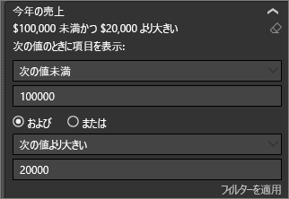

# レポート フィルター ウィンドウの使用方法
この記事では、レポート フィルター ウィンドウを参照してくださいを Power BI サービスでは。 データで新しい洞察を得るには、フィルターを使用します。

Power BI でデータをフィルター処理するには、さまざまな方法があります。最初に「[フィルター処理と強調表示](../power-bi-reports-filters-and-highlighting.md)」をお読みになることをおすすめします。

## レポート フィルター ウィンドウの操作
同僚とレポートを共有する場合は、必ず **[フィルター]** ウィンドウを探してください。 レポートの右端に沿って折りたたまれている場合があります。 それを選択して展開します。   

[フィルター] ウィンドウには、レポート *デザイナー*によってレポートに追加されたフィルターが含まれています。 *コンシューマー*同様は、既存のフィルターを使用し、変更内容を保存できる操作しますが、レポートに新しいフィルターを追加することはできません。 たとえば、上のスクリーンショットでは、デザイナーによって 2 つのページ レベル フィルターが追加されています:セグメント化し、年を実行します。 これらのフィルターを操作および変更することはできますが、3 番目のページ レベル フィルターを追加することはできません。

Power BI サービスでは、フィルター ペインで加えた変更はすべてを保持し、それらの変更は、レポートのモバイル バージョンにによって渡されるを報告します。 フィルター ウィンドウを設計者の既定値にリセットするには、上部のメニューバーから **[既定値にリセット]** を選択します。  

   

## レポート ページのすべてのフィルターを表示します。
[フィルター] ウィンドウでレポートに追加されたすべてのフィルターが表示されます、*デザイナー*します。 フィルター ウィンドウも領域のフィルターに関する情報を表示、操作できます。 作成または使用して変更を保存する**既定値にリセット**フィルターの設定を元に戻す。

保存する変更がある場合は、個人のブックマークを作成することもできます。  詳細については、次を参照してください。[レポートにブックマークを追加](end-user-bookmarks.md)します。

ビジュアル、レポート ページ、およびレポート全体に適用されるものが表示され、フィルター ペインで、管理されるレポート フィルターの種類をいくつかあります。

この例では、2 つのフィルターのあるビジュアルを選びました。 レポート ページにも下に一覧表示、フィルター、**このページでフィルター**見出し。 レポート全体の日付フィルターがあります。

いくつかのフィルターの横に **[All]** と表示されているのは、すべての値がフィルターに含まれることを意味します。  たとえば、 **Segment(All)** 上記のスクリーン ショットでわかりますこのレポートのページにすべての製品セグメントに関するデータが含まれています。  その一方で、ページ レベルのフィルターの**リージョンが西**レポート ページに、西部リージョンのデータのみが含まれることがわかります。

このレポートを表示するユーザーは、だれでもこれらのフィルターを操作できます。

### ビジュアルに適用されるフィルターのみを表示します。
特定のビジュアルに適用されるフィルターの詳細を取得するには、ポインターを合わせるフィルター アイコンを表示するビジュアルします。 すべてのフィルター、スライサー、そのために、そのビジュアルに影響を与えずにポップアップ表示にそのフィルターのアイコンを選択します。 ポップアップ表示されるフィルターに表示される同じフィルター、**フィルター**ウィンドウ。 

 
このビューには表示フィルターの種類を次に示します。
- 基本フィルター
- スライサー
- クロス強調表示
- クロス フィルター処理
- 高度なフィルター
- 上位 N のフィルター
- 相対日付フィルター
- 同期スライサー
- 含める/除外するフィルター
- URL を使って渡されるフィルター

例では、下。
1. 縦棒グラフがクロス フィルター処理されたことを確認できます。
2. **含まれる**のクロス フィルター処理であることがわかります**セグメント**、し、3 つが含まれています。 
3. スライサーが適用されている**四半期**します。
4. **リージョン**はこのレポートのページにフィルターを適用し、
5. **isVanArsdel**と**年**が適用されるフィルターをこのビジュアルにします。

### フィルターで検索する
場合によってフィルター値の長いリストことができます。 検索ボックスを使用して、検索して、使用値を選択します。 

### フィルターの詳細を表示
詳細については、フィルターを見て数、使用可能な値にあります。  カーソルを合わせると、フィルター名の横の矢印を選択して、フィルターの詳細を表示します。 
  

### フィルター選択の変更
データの洞察を検索する方法の 1 つでは、フィルターと対話します。 フィールド名の横にあるドロップダウン矢印を使用してフィルター選択を変更することができます。  フィルターおよびフィルター選択されているデータの種類に応じて、オプションの一覧から日付または数値の範囲を特定するための単純な選択範囲は範囲です。 次の高度なフィルターでフィルターが変更されました**合計ユニット YTD**に 2,000 ~ 3,000 にツリーマップ上でします。 ツリーマップから Prirum が削除されることに注意してください。 
  

> [!TIP]
> を一度に 1 つ以上のフィルター値を選択するには、CTRL キーを押しながら保持します。 ほとんどのフィルターは、複数選択をサポートします。 

### 既定値にフィルターをリセットします。
バックアップをすべて変更する場合、フィルターに行った**既定値にリセット**上部のメニュー バー。  レポートによって設定された元の状態にフィルターを元に戻しますこの*デザイナー*します。 

    
### フィルターのクリア
設定するには 1 つだけのフィルターがあるかどうかは **(すべて)** 、消しゴム アイコンを選択して消去フィルター名の横にあります。
  
<!--  too much detail for consumers

## Types of filters: text field filters
### List mode
Ticking a checkbox either selects or deselects the value. The **All** checkbox can be used to toggle the state of all checkboxes on or off. The checkboxes represent all the available values for that field.  As you adjust the filter, the restatement updates to reflect your choices. 

Note how the restatement now says "is Mar, Apr or May".

### Advanced mode
Select **Advanced Filtering** to switch to advanced mode. Use the dropdown controls and text boxes to identify which fields to include. By choosing between **And** and **Or**, you can build complex filter expressions. Select the **Apply Filter** button when you've set the values you want.  

## Types of filters: numeric field filters
### List mode
If the values are finite, selecting the field name displays a list.  See **Text field filters** &gt; **List mode** above for help using checkboxes.   

### Advanced mode
If the values are infinite or represent a range, selecting the field name opens the advanced filter mode. Use the dropdown and text boxes to specify a range of values that you want to see. 

By choosing between **And** and **Or**, you can build complex filter expressions. Select the **Apply Filter** button when you've set the values you want.

## Types of filters: date and time
### List mode
If the values are finite, selecting the field name displays a list.  See **Text field filters** &gt; **List mode** above for help using checkboxes.   

### Advanced mode
If the field values represent date or time, you can specify a start/end time when using Date/Time filters.  

-->

## 次の手順
[レポート ページでビジュアル相互間でクロスフィルター処理とクロス強調表示を行う方法と理由について](end-user-interactions.md)