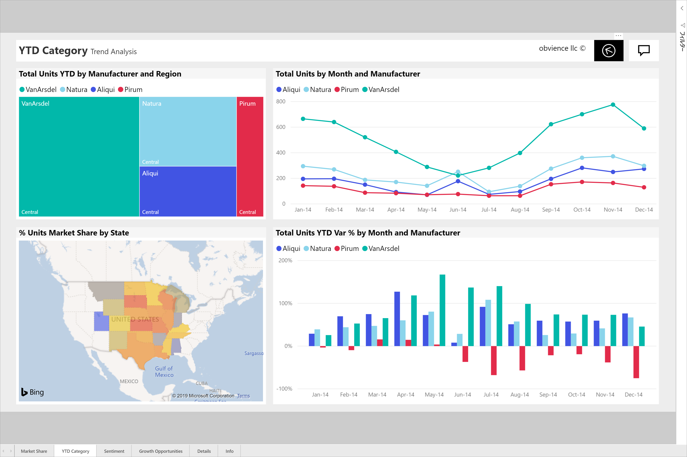

# レポート ページの表示を変更します。
レポートは、さまざまな画面サイズや縦横比に多数のさまざまなデバイスで表示します。  変更する方法は、ニーズに合わせてレポートのページが表示されます。    

## [表示] メニューを表示します。
選択した幅とサイズにレポート ページを表示する表示 メニューのオプションについて柔軟性します。

- 小型デバイスでレポートを表示しているし、タイトルと凡例を表示するが難しいとします。  選択**ビュー** > **実際のサイズ**レポート ページのサイズを増やします。 レポートを移動するには、スクロール バーを使用します。 

    

- 別のオプションを選択して、レポートを画面の幅に合わせては**幅に合わせる**します。 これにより、垂直スクロール バーの使用可能性がありますが必要です。

  

- すべてのスクロール バーをしたくない、画面のサイズを最大限に利用する場合は。  選択**ページに合わせる**します。

   

   
- 最後のオプションでは、**全画面表示**、影響を与えず、ヘッダーなしのレポート ページが表示されます。 全画面表示には、詳細が見にくい小さな画面に適して可能性があります。  全画面表示では、大画面の表示、対話的に操作するユーザーにレポート ページを射影する場合に、適切な選択肢場合もあります。  

    

レポートを終了すると、表示設定には保存されませんが、既定値に戻します。 これらの設定を保存するために重要な場合を使用して、[ブックマーク](end-user-bookmarks.md)します。 

## 次の手順
[Cortana 用レポートの作成](../service-cortana-answer-cards.md)
