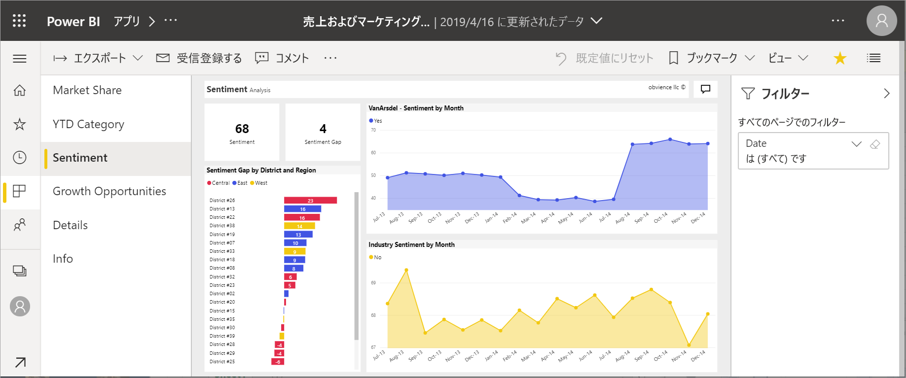

# Power BI のレポート

Power BI レポートはデータセットのマルチパースペクティブ表示です。データセットからのさまざまな結果や分析情報がビジュアルによって表されます。  レポートでは、単一のビジュアルを使用することも、各ページでさまざまなビジュアルを使用することもできます。 職務に応じて、レポートを*デザイン*する人になる場合があります。 また、レポートを*使用*する人になる場合もあります。

このレポートには 6 つのページ (またはタブ) があり、現在表示されているのは **[センチメント]** ページです。 このページには 5 つの異なるビジュアルとページ タイトルがあります。 *フィルター* ウィンドウでは、すべてのレポート ページに 1 つのフィルターが適用されていることが示されます。 フィルター ウィンドウを折りたたむには、矢印 ( **>** ) を選択します。

Power BI を初めて使うときは、「[Power BI サービスのコンシューマーの基本的な概念](end-user-basic-concepts.md)」を読むと基礎がよくわかります。 レポートは、モバイル デバイス上で表示、共有、および注釈を付けることができます。 詳細については、「[Power BI モバイル アプリのレポートを調べる](mobile/mobile-reports-in-the-mobile-apps.md)」を参照してください。

## レポートの利点

Power BI では、1 つのデータセットに基づいてレポートが作成されます。 レポートの*デザイナー*は、情報のひとかたまりを表すビジュアルをレポート内に作成します。 ビジュアルは静的なものではありません。  基になるデータが変化すると、更新されます。 ビジュアルとフィルターを使用してデータを詳しく調べ、分析情報を得たり、答えを探したりすることができます。 レポートはダッシュボードと同様に高度な対話機能とカスタマイズ機能を備えています。

### コンテンツを安全に操作する

フィルタリング、スライシング、サブスクライブ、エクスポートなど、コンテンツを調べて操作しても、レポートを壊すことはできません。 作業が基になるデータセットまたは元の共有コンテンツに影響することはありません。 これは、ダッシュボード、レポート、アプリに適用されます。

> [!NOTE]
> データを破損することはできないことを覚えていてください。 Power BI は、何かを破損する心配をせずに探索や実験ができる素晴らしい場所です。

### 変更を保存する、または既定の設定に戻す

それは変更を保存できないという意味ではありません。 保存はできます。ただし、それらの変更が反映されるのはコンテンツの自分の表示だけです。 レポートの元の既定の表示に戻すには、 **[既定値にリセット]** を選択します。

![[既定値に戻す] アイコンのスクリーンショット。](./media/end-user-reports/power-bi-reset.png)

## ダッシュボードとレポート

[ダッシュボード](end-user-dashboards.md)もビジュアルが表示されたキャンバスであるため、レポートと混同されることがよくあります。 しかし、大きな違いがいくつかあります。  

| **機能** | **ダッシュボード** | **レポート** |
| --- | --- | --- |
| ページ |1 ページ |1 ページ以上 |
| データ ソース |ダッシュボードごとに、1 つ以上のレポートおよび 1 つ以上のデータセット |レポートごとに 1 つのデータセット |
| フィルター処理 |フィルター処理またはスライスはできません |さまざまな方法でフィルター処理、強調表示、スライスできます |
| 通知の設定 |ダッシュボードで特定の条件が満たされたときにユーザーにメールを送る通知を作成できます |いいえ |
| 特性 |1 つのダッシュボードをおすすめのダッシュボードとして設定できます |おすすめのレポートを作成することはできません |
| 基になっているデータセットのテーブルとフィールドの表示 |いいえ。 データをエクスポートすることはできますが、ダッシュボード自体でデータセットのテーブルとフィールドを表示することはできません |はい。 表示アクセス許可のあるデータセットのテーブル、フィールド、値を表示することができます |
| カスタマイズ |いいえ  |フィルタリング、エクスポート、関連コンテンツの表示、ブックマークの追加、QR コードの生成、Excel での分析、その他を行うことができます |

<!--| Available in Power BI Desktop |No |Yes, can create and view reports in Desktop |
| Pinning |Can pin existing visuals (tiles) only from current dashboard to your other dashboards |Can pin visuals (as tiles) to any of your dashboards. Can pin entire report pages to any of your dashboards. | -->

## レポート デザイナーとレポート コンシューマー

自分の役割に応じて、自分で使用するためや同僚と共有するためにレポートを作成する*デザイナー*になる場合があります。 レポートを作成して共有する方法を覚えておく必要があります。

また、他のユーザーからレポートを受け取る*コンシューマー*になる場合もあります。 レポートを理解し、処理する方法を知る必要があります。 レポート *コンシューマー*の場合、次のリンクが役立ちます。

* まず、[Power BI サービスのツアー](end-user-basic-concepts.md)を利用して、レポートとレポート ツールをどこで探せばよいかを理解します。
* [レポートを開く](end-user-report-open.md)方法と、[読み取りビュー](end-user-reading-view.md)で実行できるすべての対話的操作について学習します。
* いずれかの[サンプル](../sample-tutorial-connect-to-the-samples.md)のツアーを利用してレポートに慣れます。  
* レポートでどのデータセットが使われているか、また、どのダッシュボードにレポートからタイルがピン留めされているかを確認するには、「[Power BI サービスで関連するコンテンツを表示する](end-user-related.md)」を参照します。

> [!TIP]
> 知りたいことがここで見つからない場合は、左側の目次を使用して、*レポート*に関するすべての記事から探してください。

## 次の手順

[レポートを開いて表示する](end-user-report-open.md)    
[Power BI サービスのダッシュボード](end-user-dashboards.md)