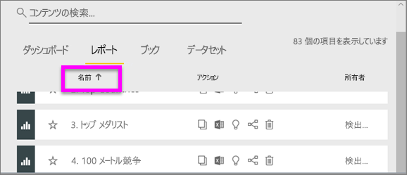
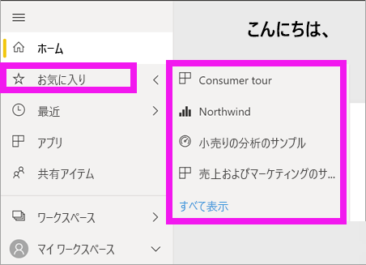

# ナビゲーション: Power BI サービスでコンテンツの検索、探索、並べ替えを行う

[!INCLUDE [power-bi-service-new-look-include](../includes/power-bi-service-new-look-include.md)]

Power BI サービスでコンテンツ間を移動する方法はたくさんあります。 ワークスペース内のコンテンツは、種類 (ダッシュボードとレポート) ごとにまとめられています。  また、コンテンツは使用方法 (お気に入り、最近、アプリ、自分と共有、おすすめ) によっても整理されています。 ワン ストップ ナビゲーションの場合、Power BI *ホーム*ですべてのコンテンツが 1 ページにまとめられます。 コンテンツへのこれらの異なる経路により、Power BI サービス内で必要な内容をすばやく見つけることができます。  

## ワークスペース内のナビゲーション

通常、Power BI "*コンシューマー*" には 1 つのワークスペースしかありません: **[マイ ワークスペース]** です。 **[マイ ワークスペース]** には、Microsoft のサンプルをダウンロードした場合、または独自のダッシュボード、レポート、またはアプリを作成するか、ダウンロードした場合にのみコンテンツが含まれます。  

**[マイ ワークスペース]** 内では、Power BI サービスによって、コンテンツが種類 (ダッシュボード、レポート、ブック、データセット) 別に分けられています。 ワークスペースを選ぶと、この編成方法で表示されます。 この例で、 **[マイ ワークスペース]** には 1 つのダッシュボード、1 つのレポート、0 個のワークブック、1 つのデータセットが含まれています。

________________________________________
## 検索フィールドを使ったナビゲーション
**[マイ ワークスペース]** コンテンツ ビューを使用して、コンテンツの検索、フィルター処理、並べ替えを行います。 検索フィールドに、ダッシュボード、レポート、ブック、または所有者の名前のすべてまたは一部を入力します。  

コンテンツの構成物が少しだけの場合は、検索や並べ替えの必要はありません。  しかし、ダッシュボードとレポートの一覧が長い場合は、検索や並べ替えが非常に役立ちます。 たとえば、以下のレポートの一覧には、83 個の項目があります。 

コンテンツは、名前または所有者で並べ替えることもできます。 **[名前]** の右にある上矢印をご覧ください。 現在、83 個の項目が名前のアルファベット順に昇順で並べられています。 並べ替え順序を降順に変更するには、 **[名前]** を選択します。 上矢印が下矢印に変わります。

並べ替えることができるのは一部の列に限られます。 列見出しの上にカーソルを合わせると、並べ替えることができる列を確認できます。

___________________________________________________________________
## ナビ ペインを使ったナビゲーション
ナビ ペインでは、必要なものを迅速に見つけることができる方法でコンテンツが分類されています。  

- 自分と共有されているコンテンツは、 **[自分と共有]** に表示されます。
- 最近表示したコンテンツは **[最近]** に表示されます。 
- アプリを見つけるには、 **[アプリ]** を選択します。
- **[ホーム]** は、最も重要なコンテンツ、推奨されるコンテンツ、学習ソースが掲載された単一ページ ビューです。

さらに、コンテンツに[お気に入り](end-user-favorite.md)および[おすすめ](end-user-featured.md)のタグを付けることができます。 最も頻繁に表示すると予想されるダッシュボードを選び、それを*おすすめ*のコンテンツとして設定します。 Power BI サービスを開くたびに、このおすすめのダッシュボードが最初に表示されます。 頻繁に参照するダッシュボードとアプリがたくさんありますか? それらをお気に入りに設定すると、常にナビ ペインから使うことができます。

.

## 考慮事項とトラブルシューティング
* データセットでは、所有者は **[並べ替え]** を使用できません。

## 次の手順
[レポートでビジュアルを並べ替える](end-user-change-sort.md)

他にわからないことがある場合は、 [Power BI コミュニティを利用してください](https://community.powerbi.com/)。
