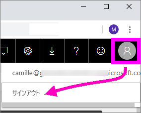

# Power BI サービスにサインインする

## Power BI アカウント
Power BI にサインインするには、アカウントが必要です。 Power BI アカウントを入手するには 2 つの方法があります。 1 つ目は、会社で従業員向けに Power BI ライセンスを購入する方法です。 2 つ目は、個人で無料試用版または個人ライセンスにサインアップする方法です。 この記事では 1 つ目のシナリオについて説明します。

## 初めてサインインする

### ステップ 1: ブラウザーを開く
Power BI サービスはブラウザーで実行されます。  そのため、まず最初に、お好きなブラウザーを開き、「**app.powerbi.com**」と入力します。

### ステップ 2: メール アドレスを入力する
初めてサインインするときは、メール アドレスの入力を求められます。  これは、Power BI にサインアップするために使用された職場または学校のメール アドレスです。  

Power BI 管理者からのメールを受信トレイで確認します。 ほとんどの管理者は、一時パスワードを含むウェルカム メールを送信します。 このメール アカウントをサインインに使用します。 

 
### ステップ 3: 新しいパスワードを作成する
Power BI 管理者から一時パスワードが送られてきた場合は、それを **[現在のパスワード]** フィールドに入力します。 このパスワードをメールで受け取っていない場合は、Power BI 管理者に問い合わせてください。

![[サインイン] フィールドに入力されたメール アドレス](media/end-user-sign-in/power-bi-login2.png)

Power BI では資格情報が記憶されるので、次にサインインするときにユーザー名 (メール アドレス) を入力する必要はありません。 

### ステップ 4: ホーム ページを確認する
Power BI に初めてアクセスしたときは、**ホーム** ページが開きます。 **ホーム** ページが開かない場合は、左側のナビゲーション ウィンドウで選択します。 

![[サインイン] フィールドに入力されたメール アドレス](media/end-user-sign-in/power-bi-home-select.png)

[ホーム] ページには、自分が使用するアクセス許可を持っているすべてのコンテンツが表示されます。 最初は、ホーム ページにあまりコンテンツが表示されないかもしれませんが、心配しないでください。同僚と Power BI を使い始めれば変わります。 

![[サインイン] フィールドに入力されたメール アドレス](media/end-user-sign-in/power-bi-home2.png)

Power BI でホーム ページを開きたくない場合は、代わりに[**おすすめ**ダッシュボードまたはレポートを設定](end-user-featured.md)して開くことができます。 

## コンテンツを安全に操作する
***コンシューマー***として、他のユーザーから共有されたコンテンツを操作し、データを探索して、ビジネスに関する決定を行います。  フィルター、スライス、サブスクライブ、エクスポート、サイズ変更などの操作を行っても、基になっているデータセットや元の共有コンテンツ (ダッシュボードとレポート) が影響を受けることはありません。 Power BI は、探索や実験のための安全な場所です。 それは変更を保存できないという意味ではありません。保存できます。 ただし、それらの変更が反映されるのはコンテンツの**自分の**表示だけです。 また、ボタンをクリックするだけで、簡単に元の既定のビューに戻すことができます。

## Power BI サービスからサインアウトする
Power BI を閉じたりサインアウトしたりするときに変更が保存されるので、中断したところから作業を再開できます。

Power BI を閉じるには、作業しているブラウザー タブを閉じるだけです。 

![[x] を選択してタブを閉じる](media/end-user-sign-in/power-bi-close.png) 

コンピューターを共有している場合は、Power BI を閉じるたびにサインアウトすることをお勧めします。  サインアウトするには、右上隅にあるプロファイルの画像を選択して、**[サインアウト]** を選択します。それ以外の場合は、完了したら単にブラウザーのタブを閉じます。

 

## トラブルシューティングと考慮事項
- 個人として Power BI にサインアップした場合は、サインアップに使用したメール アドレスでサインインします。

- 複数のアカウントで Power BI を使用している場合は、サインインするときに一覧からアカウントの選択を求められ、その後でパスワードを入力します。 

## 次の手順
[Power BI アプリを表示する](end-user-app-view.md)
