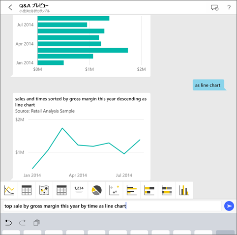
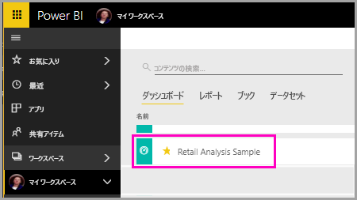
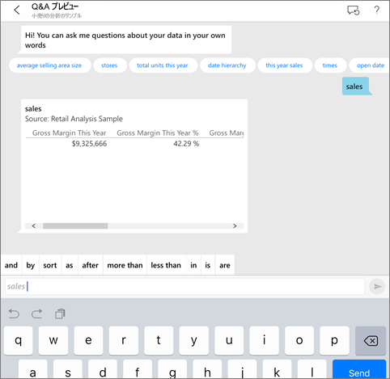
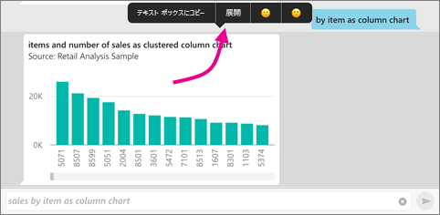
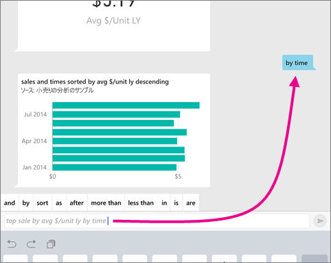

# iOS アプリの Q&A 仮想アナリスト - Power BI

データについて学習する最も簡単な方法は、自分の言葉でデータについて質問することです。 この記事では、iPad、iPhone、iPod Touch で Microsoft Power BI モバイル アプリの Q&A 仮想アナリストを使用して、サンプル データについて質問したり、おすすめのインサイトを見たりします。 

適用対象:

|  |  |
|:--- |:--- |
| iPhone |iPad |

Q&A 仮想アナリストは、Power BI サービスの基になる Q&A データにアクセスする対話型の BI エクスペリエンスです [(https://powerbi.com)](https://powerbi.com)。 それはデータの分析情報を示します。質問は、キー入力することも、音声入力することもできます。

Power BI にサインアップしていない場合は、[無料の試用版にサインアップ](https://app.powerbi.com/signupredirect?pbi_source=web)してください。

## 前提条件

### Power BI for iOS アプリをインストールする
Apple App Store から iPad、iPhone、iPod Touch に [iOS アプリをダウンロード](https://go.microsoft.com/fwlink/?LinkId=522062 "iPhone アプリのダウンロード")します。

次のバージョンが Power BI for iOS アプリをサポートしています。
- iOS 10 以降の iPad。
- iOS 10 以降の iPhone 5 以上。 
- iOS 10 以降の iPod Touch。

### サンプルをダウンロードする
最初の手順は、Power BI サービスの小売りの分析のサンプルと営業案件の分析のサンプルをダウンロードすることです。

**小売りの分析のサンプルを取得する**

1. Power BI サービス (app.powerbi.com) を開いてサインインします。

2. ナビ ペインで、 **[ワークスペース]** 、 **[マイ ワークスペース]** の順に選択します。

3. 左下隅にある **[データを取得]** を選びます。
   
    

3. [データの取得] ページで、 **[サンプル]** アイコンを選択します。
   
   

4. **[小売りの分析のサンプル]** を選択します。
 
    
 
8. **[接続]** を選択します。  
  
   
   
5. Power BI がコンテンツ パックをインポートし、新しいダッシュボード、レポート、データセットを現在のワークスペースに追加します。
   
   

**営業案件の分析のサンプルを取得する**

- 小売りの分析サンプルと同じ手順を実行します。ただし、手順 4 では、 **[営業案件の分析のサンプル]** を選択します。

    
  
これで、iOS デバイスでサンプルを表示する準備ができました。

## iPhone または iPad で質問してみる
1. iPhone または iPad で、 >  **[ワークスペース]**  >  **[マイ ワークスペース]** をタップします。[小売りの分析のサンプル] ダッシュボードが開きます。

2. ページの下部 (iPad ではページの上部) にある操作メニューから、Q&A 仮想アナリスト アイコンをタップします。
     Q&amp;A 仮想アナリストにより、作業を開始するいくつかの候補が提供されます。
3. 「**表示**」と入力し、候補リストから **[sales]\(販売\)** をタップして、 **[送信]** ![[送信] アイコン](./media/mobile-apps-ios-qna/power-bi-ios-qna-send-icon.png) をタップします。

    
4. キーワードから **[by]** (グループ化) をタップし、候補リストから **[item]** (アイテム) をタップして、 **[送信]**  をタップします。

    
5. キーワードから **[as]** (として) をタップし、縦棒グラフアイコン  をタップして、 **[送信]**  をタップします。
6. 表示されたグラフを長押しし、 **[展開]** をタップします。

    

    アプリでグラフがフォーカス モードで開きます。

    
7. 左上隅にある矢印をタップして、Q&A 仮想アナリスト チャット ウィンドウに戻ります。
8. テキストを削除して最初からやり直す場合は、テキスト ボックスの右側にある [X] をタップします。
9. 新しい質問をしてみます。キーワードから **[top]\(上位\)** をタップし、 **[sale by avg $/unit ly]\(平均金額/ユニット別売上\)**  >  **[送信]**  の順にタップします。

    
10. キーワードから **[by]** (グループ化) をタップし、候補リストから **[time]** (時間) をタップして、 **[送信]**  をタップします。

     
11. 「**as**」 (として) と入力し、候補リストから折れ線グラフ アイコン  をタップして、 **[送信]**  をタップします。

    

## 音声で質問してみる
Power BI モバイル アプリでは、キー入力の代わりに音声を使って、データに関する質問ができるようになりました。

1. Q&A 仮想アナリスト アイコンをタップします。  をタップします。
2. マイク アイコン  をタップします。

    

1. マイク アイコンがアクティブになったら、音声入力を始めます。 たとえば、"時間ごとの平均単価" と言ってから、 **[送信]**  をタップします。

    

### 音声テキスト変換を使うときのプライバシーに関する質問
Apple iOS 開発者ガイドで、「[What's New in iOS](https://go.microsoft.com/fwlink/?linkid=845624)」(iOS の新機能) の音声認識に関するセクションをご覧ください。

## ヘルプとフィードバック
* ヘルプが必要な場合は、 "Hi" (ハイ) または "Help" (ヘルプ) と話しかけると、新しい質問の開始に関するアシスタンスが表示されます。
* 結果についてフィードバックする場合は、 グラフまたは他の結果を長押しし、笑顔またはしかめっ面をタップします。

    

    お客様のフィードバックは匿名です。質問への回答の質を向上させるために利用させていただきます。

## Q&A 仮想アナリストの結果を向上させる
データセットに対して Q&A 仮想アナリストを使用する場合に結果を向上させるには、質問を絞り込むか、データセットを拡張します。

### 質問方法
* iOS モバイル アプリの Q&A 仮想アナリストまたは Power BI サービスの [Q&A で質問するためのヒント](../end-user-q-and-a-tips.md)に従います。

### データセットを拡張する方法
* [データを Q&A および Q&A 仮想アナリストに適合させる](../../service-prepare-data-for-q-and-a.md)には、Power BI Desktop または Power BI サービスでデータセットを拡張します。

## 次の手順
* [Power BI での Q&A](../end-user-q-and-a.md)
* わからないことがある場合は、 [Power BI コミュニティのモバイル アプリ セクション](https://go.microsoft.com/fwlink/?linkid=839277)をご覧ください
