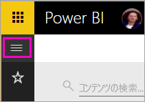
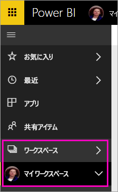
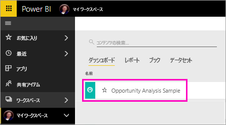
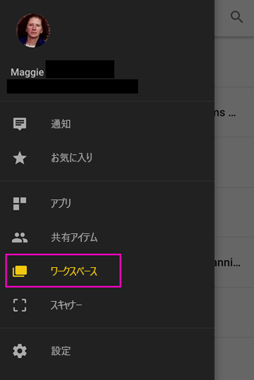
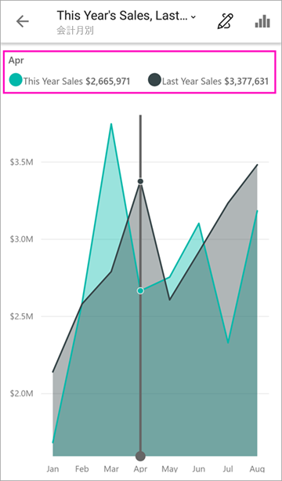
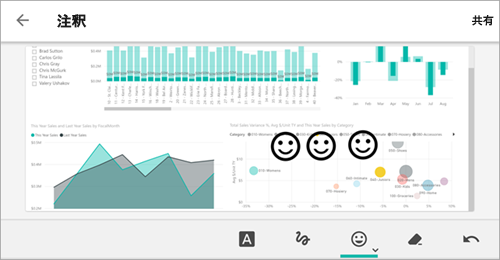
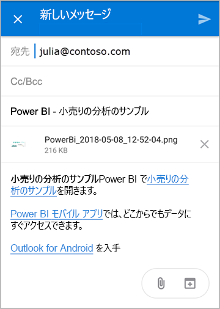

# クイック スタート:Power BI モバイル アプリでダッシュボードとレポートを調べる
このクイック スタートでは、Android フォンで Power BI モバイル アプリを使ってサンプルのダッシュボードとレポートを調べます。 他のモバイル アプリでも同じようにできます。 

適用対象:

|  |  |  |  |
|:--- |:--- |:--- |:--- |
| iPhone | iPad | Android | Windows 10 |

ダッシュボードは、会社のライフ サイクルとプロセスへの入口です。 ダッシュボードには、ビジネスの現在の状態を 1 つの場所から監視する概要が表示されます。 レポートは、データの対話型表示で、データから得られるさまざまな発見と分析情報を表す視覚エフェクトが含まれます。 

## 前提条件

### Power BI にサインアップする
Power BI にサインアップしていない場合は、[無料の試用版にサインアップ](https://app.powerbi.com/signupredirect?pbi_source=web)してください。

### Power BI for Android アプリをインストールする
Google Play ストアから [Power BI for Android アプリをダウンロードします](https://go.microsoft.com/fwlink/?LinkID=544867)。

Power BI は、Android 5.0 以降のオペレーティング システムを搭載する Android デバイスで動作します。 お使いのデバイスでバージョンを確認するには、 **[設定]**  >  **[端末情報]**  >  **[Android バージョン]** の順に移動します。

### 小売りの分析のサンプルをダウンロードする
クイック スタートの最初のステップでは、Power BI サービスで小売りの分析のサンプルをダウンロードします。

1. ブラウザーで Power BI サービスを開き (app.powerbi.com)、サインインします。

1. グローバル ナビゲーション アイコンを選んでナビ ペインを開きます。

    

2. ナビ ペインで、 **[ワークスペース]**  >  **[マイ ワークスペース]** の順に選択します。

    

3. 左下隅にある **[データを取得]** を選びます。
   
    

3. [データを取得] ページで、 **[サンプル]** アイコンを選びます。
   
   

4. **[小売りの分析のサンプル]** を選択します。
 
    
 
8. **[接続]** を選択します。  
  
   ![[小売りの分析のサンプル] - [接続]](./media/mobile-apps-quickstart-view-dashboard-report/retail16.png)
   
5. Power BI がサンプルをインポートし、新しいダッシュボード、レポート、データセットを [マイ ワークスペース] に追加します。
   
   

これで、Android デバイスでサンプルを表示する準備ができました。

## Android デバイス上でダッシュボードを表示する
1. Android デバイスにおいて Power BI アプリを開き、Power BI アカウントの資格情報 (ブラウザーの Power BI サービスで使ったものを同じです) を使ってサインインします。

1.  左上隅にあるグローバル ナビゲーション ボタン .

2.  **[ワークスペース]**  >  **[マイ ワークスペース]** の順にタップします

    

3. 小売りの分析のサンプル ダッシュボードをタップして開きます
 
    ![[マイ ワークスペース] のダッシュボード](./media/mobile-apps-quickstart-view-dashboard-report/power-bi-android-quickstart-open-retail.png)
   
    ダッシュボード名の下の表示 (この例では文字 "C") は、各ダッシュボード内のデータを分類する方法を示しています。 詳細については、[Power BI でのデータの分類](../../service-data-classification.md)に関するページを参照してください。

    Power BI ダッシュボードは、Android フォンでは少し異なる外観です。 すべてのタイルは同じ幅で表示され、上から下に 1 つずつ配置されます。

4. タイトル バーの星形アイコン  をタップして、これをお気に入りのダッシュボードにします。

    モバイル アプリでお気に入りにすると Power BI サービスでもお気に入りになり、逆の場合も同じです。

4. 下にスクロールし、"This Year's Sales, Last Year's Sales" 塗りつぶし折れ線グラフをタップします。

    

    フォーカス モードで開きます。

7. フォーカス モードで、グラフの "Apr" をタップします。 グラフの上部に 4 月の値が表示されます。

    

8. 右上隅の [レポート] アイコン ![[レポート] アイコン](./media/mobile-apps-quickstart-view-dashboard-report/power-bi-android-quickstart-report-icon.png) をタップします。 このタイルに関連するレポートが、横モードで開きます。

    

9. バブル チャートで黄色の "040 - Juniors" バブルをタップします。 他のグラフの関連する値が強調表示されることを確認してください。 

    

10. 上にスワイプして下部のツール バーを表示し、鉛筆アイコンをタップします。

    

11. 注釈ツール バーのスマイル アイコンをタップし、レポート ページに笑顔を追加します。
 
    

12. 右上隅にある **[共有]** をタップします。

1. メール アドレスを入力し、必要に応じてメッセージを追加します。  

    

    このスナップショットを、組織の内部または外部にいる誰とでも共有できます。 相手が組織の内部にいて自分の Power BI アカウントを持っている場合は、小売りの分析サンプルのレポートを開くこともできます。

## リソースをクリーンアップする

このクイックスタートが完了した後、希望する場合は、小売りの分析のサンプルのダッシュ ボード、レポート、およびデータセットを削除できます。

1. Power BI サービス (app.powerbi.com) を開いてサインインします。

2. ナビ ペインで、 **[ワークスペース]**  >  **[マイ ワークスペース]** の順に選択します。

    お気に入りを示す黄色のアスタリスクがわかりますか。

3. **[ダッシュ ボード]** タブで、小売りの分析ダッシュ ボードの横にあるゴミ箱を **[削除]** アイコンを選択します。

    

4. **[レポート]** タブを選び、小売りの分析のレポートでも同様にします。

5. **[レポート]** タブを選び、小売りの分析のデータセットでも同様にします。

## 次の手順

このクイック スタートでは、Android デバイスを使ってサンプルのダッシュボードとレポートを調べました。 Power BI サービスでの作業についてさらにご覧ください。 

> [!div class="nextstepaction"]
> [クイック スタート:Power BI サービス内の移動](../end-user-experience.md)

