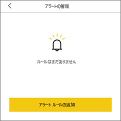
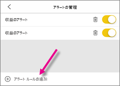
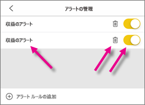
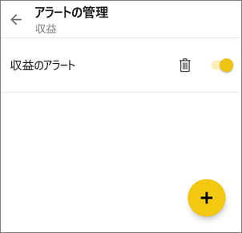
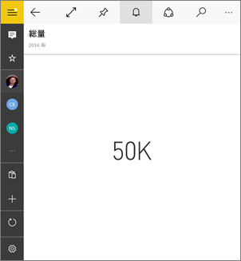
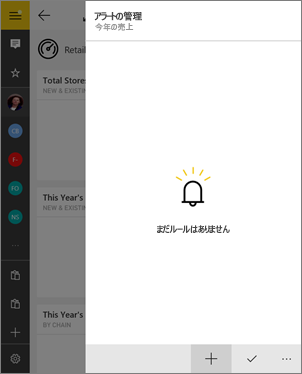
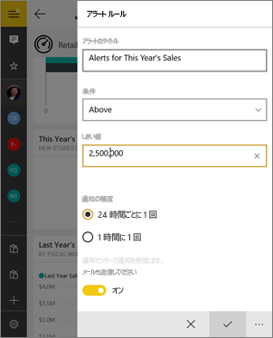
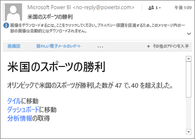

# Power BI モバイル アプリでデータ アラートを設定する
適用対象:

|  |  |  |  |  |
|:--- |:--- |:--- |:--- |:--- |
| iPhone |iPad |Android フォン |Android タブレット |Windows 10 デバイス |

アラートは、Power BI モバイル アプリと Power BI サービスのダッシュボードで設定できます。 アラートは、ユーザーが設定した制限を超えてタイルのデータが変化したことをユーザーに通知します。 アラートは、カードやゲージなどの単一の数値を含むタイルに対して動作しますが、ストリーミング データでは動作しません。 モバイル デバイスで設定したデータ アラートを Power BI サービスで見ることができます。また、その逆も可能です。 ダッシュボードやタイルのスナップショットを共有する場合でも、設定したデータ アラートのみを表示できます。

Power BI Pro のライセンスがある場合、または共有ダッシュボードが Premium 容量である場合は、タイルにアラートを設定できます。 

> [!WARNING]
> データ ドリブン アラート通知は、データに関する情報を提供します。 デバイスが盗まれた場合、Power BI サービスに移動し、すべてのデータ ドリブン アラート ルールをオフにすることをお勧めします。 
> 
> 詳しくは、[Power BI サービスのデータ アラートの管理](../../service-set-data-alerts.md)に関するページを参照してください。
> 
> 

## iPhone または iPad でのデータ アラート
### iPhone または iPad でアラートを設定する
1. ダッシュボード内の数値タイルまたはゲージ タイルをタップしてフォーカス モードで開きます。  
   
   
2. ベルのアイコン  をタップして、アラートを追加します。  
3. **[アラート ルールの追加]** をタップします。
   
   
4. 上限値または下限値のどちらでアラートを受け取るかを選択し、値を設定します。
   
   
5. アラートの受け取りを 1 時間単位または 1 日単位のどちらにするか、およびアラートと共に電子メールも受信するかどうかを決定します。
   
   > [!NOTE]
   > 期間中にデータが実際に更新されない限り、毎時間または毎日アラートを受け取ることはありません。
   > 
   > 
6. アラートのタイトルも変更できます。
7. **[保存]** をタップします。
8. 1 つのタイルに、上限と下限両方のしきい値のアラートを設定できます。 **[アラートの管理]** で **[アラート ルールの追加]** をタップします。
   
   

### iPhone または iPad でアラートを管理する
モバイル デバイスでは個別のアラートを管理できますが、[Power BI サービスではすべてのアラートを管理](../../service-set-data-alerts.md)できます。

1. ダッシュボードで、アラートのある数値タイルまたはゲージ タイルをタップします。  
   
   
2. ベルのアイコン  をタップします。  
3. アラートの名前をタップして編集するか、スライダーをタップして電子メール アラートをオフにするか、ごみ箱をタップしてアラートを削除します。
   
    

## Android デバイスでのデータ アラート
### Android デバイスでアラートを設定する
1. Power BI ダッシュボードで、数値タイルまたはゲージ タイルをタップして開きます。  
2. ベルのアイコン  をタップして、アラートを追加します。  
   
   
3. プラスのアイコン [+] をタップします。
   
   
4. 上限値または下限値のどちらでアラートを受け取るかを選択し、値を入力します。
   
   
5. **[完了]** をタップします。
6. アラートの受け取りを 1 時間単位または 1 日単位のどちらにするか、およびアラートと共に電子メールも受信するかどうかを決定します。
   
   > [!NOTE]
   > 期間中にデータが実際に更新されない限り、毎時間または毎日アラートを受け取ることはありません。
   > 
   > 
7. アラートのタイトルも変更できます。
8. **[保存]** をタップします。

### Android デバイスでアラートを管理する
Power BI モバイル アプリでは個別のアラートを管理でき、[Power BI サービスではすべてのアラートを管理](../../service-set-data-alerts.md)できます。

1. ダッシュボードで、アラートのあるカード タイルまたはゲージ タイルをタップします。  
2. 塗りつぶされたベルのアイコン  をタップします。  
3. アラートをタップして、値を変更したり、オフにしたりします。
   
    
4. 同じタイルに別のアラートを追加するには、プラス記号アイコン (+) をタップします。
5. アラートをすべて削除するには、ゴミ箱アイコン  をタップします。

## Windows デバイスでのデータ アラート
### Windows デバイスでデータ アラートを設定する
1. ダッシュボード内の数値タイルまたはゲージ タイルをタップして開きます。  
2. ベルのアイコン  をタップして、アラートを追加します。  
   
   
3. プラスのアイコン [+] をタップします。
   
   
4. 上限値または下限値のどちらでアラートを受け取るかを選択し、値を入力します。
   
   
5. アラートの受け取りを 1 時間単位または 1 日単位のどちらにするか、およびアラートと共に電子メールも受信するかどうかを決定します。
   
   > [!NOTE]
   > 期間中にデータが実際に更新されない限り、毎時間または毎日アラートを受け取ることはありません。
   > 
   > 
6. アラートのタイトルも変更できます。
7. チェック マークをタップします。
8. 1 つのタイルに、上限と下限両方のしきい値のアラートを設定できます。 **[アラートの管理]** でプラス記号 [+] をタップします。
   
   

### Windows デバイスでアラートを管理する
Power BI モバイル アプリでは個別のアラートを管理でき、[Power BI サービスではすべてのアラートを管理](../../service-set-data-alerts.md)できます。

1. ダッシュボードで、アラートのあるカード タイルまたはゲージ タイルをタップします。  
2. ベルのアイコン  をタップします。  
   
   
3. アラートをタップして、値を変更したり、オフにしたりします。
   
    
4. アラートをまとめて削除するには、右クリックまたは長押しして、 **[削除]** をタップします。

## アラートの受信
モバイル デバイスの Power BI [通知センター](mobile-apps-notification-center.md)または Power BI サービスで、アラートと共に、他のユーザーによって共有するように設定された新しいダッシュボードについての通知を受信します。

データ ソースは多くの場合、毎日更新するように設定されますが、さらに頻繁に更新されるものもあります。 ダッシュボードのデータが更新されるとき、追跡対象データがユーザー設定のしきい値のいずれかに達した場合は、いくつかの処理が行われます。

1. Power BI は、(オプションの選択に応じて) 前回のアラート送信から 1 時間以上または 24 時間以上経過しているかどうかを確認します。
   
   データがしきい値を超えている場合に限り、1 時間ごと、または 24 時間ごとに、アラートを受け取ります。
2. 電子メールを送信するようにアラートを設定した場合は、次のようなメールを受信します。
   
   
3. Power BI は、メッセージを**通知センター**に追加し、新しいアラート アイコンを該当するタイル  に追加します。
4. [グローバル ナビゲーション] ボタン  をタップして [**通知センター**を開き](mobile-apps-notification-center.md)、アラートの詳細を表示します。
   
      

> [!NOTE]
> アラートは更新されたデータでのみ動作します。 データが更新されると、Power BI はそのデータにアラートが設定されているかどうかを確認します。 データがアラートのしきい値に達した場合、アラートがトリガーされます。
> 
> 

## ヒントとトラブルシューティング
* 現在、Bing タイルまたは日付/時刻メジャーを含むカード タイルについては、アラートがサポートされていません。
* アラートは、数値データでのみ機能します。
* アラートは更新されたデータでのみ動作します。 静的データでは動作しません。
* アラートは、ストリーミング データを含むタイルでは機能しません。

## 次の手順
* [Power BI サービスでアラートを管理する](../../service-set-data-alerts.md)
* [Power BI モバイル通知センター](mobile-apps-notification-center.md)
* わからないことがある場合は、 [Power BI コミュニティで質問してみてください](http://community.powerbi.com/)。

