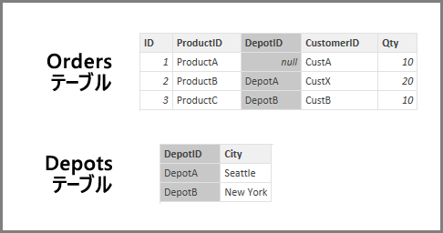

# Power BI Desktop で参照整合性設定を想定する
**DirectQuery** を利用し、データ ソースに接続するとき、 **[参照整合性を想定]** 選択を使用し、より効率的なクエリをデータ ソースに対して実行します。 この機能には基礎となるデータに関していくつかの要件があり、**DirectQuery** の利用時にのみ利用できます。

**[参照整合性を想定]** を設定すると、データ ソースに対するクエリで **OUTER JOIN** ステートメントではなく **INNER JOIN** ステートメントを使用できるようになり、クエリの効率性が上がります。

## [参照整合性を想定] を使用するための要件
これは高度な設定であり、**DirectQuery** を利用してデータに接続するときにのみ有効になります。 **[参照整合性を想定]** を正しく動作させるには、次の要件を満たす必要があります。

* リレーションシップの **[From]** (参照元) 列のデータを *Null* または *空* にしない
* **[From]** (参照元) 列のデータにはそれぞれ **[To]** (参照先) 列に対応する値があります。

このコンテキストでは、 **[From]** (参照元) 列は *[一対多]* 関係の *[多]* になります。あるいは、 *[一対多]* 関係の最初の表の列になります。

## [参照整合性を想定] の使用例
次の例は、データ接続で **[参照整合性を想定]** を使用した場合の動作を示しています。 この例では、**Orders**、**Products**、**Depots** テーブルを含むデータ ソースに接続しています。

1. 次の画像では、**Orders** テーブルと **Products** テーブルを確認できます。**Orders[ProductID]** と **Products[ProductID]** の間に参照整合性が存在することを確認してください。 **Orders** テーブルの **[ProductID]** 列が *Null* になることはありません。すべての値は **Products** テーブルにも表示されます。 そのため、 **[参照整合性を想定]** は、より効率的なクエリを得るために設定してください (この設定を使用してビジュアルに表示される値が変わることはありません)。
   
   
2. 次の画像では、**Orders[DepotID]** と **Depots[DepotID]** の間に参照整合性がないことに注意してください。一部の *Orders* に関して、**DepotID** が *Null* になっているためです。 そのため、 **[参照整合性を想定]** を *設定しない* でください。
   
   
3. 最後になりますが、次のテーブルの **Orders[CustomerID]** と **Customers[CustID]** の間には参照整合性がありません。**CustomerID** には、*Customers* テーブルにはない値がいくつか含まれています (この例では *CustX*)。 そのため、 **[参照整合性を想定]** を *設定しない* でください。
   
   

## [参照整合性を想定] を設定する
この機能を有効にするには、次の画像のように **[参照整合性を想定]** の隣にあるチェックボックスを選択します。

選択すると、*Null* や一致しない行がないことが確認する目的でデータに対して設定が検証されます。 *ただし* 、値の数が非常に多い場合、検証しても、参照整合性問題がないことは保証されません。

また、検証は関係を追加したときに行われ、追加後のデータ変更は *反映されません* 。

## [参照整合性を想定] を間違えて設定した場合
データに参照整合性の問題があるときに **[参照整合性を想定]** を設定すると、エラーは起こりません。 ただし、明らかなデータの不整合が確認できます。 たとえば、上記の **Depots** テーブルの関係の場合、次のような現象が起こります。

* 合計 *Order Qty* を示すビジュアルが値として 40 を示す。
* 合計 *Order Qty by Depot City* を示すビジュアルの合計値がたった *30* を示す。**DepotID** が *Null* の Order ID 1 が含まれていないためです。

## 次の手順
[DirectQuery](desktop-use-directquery.md) の詳細

[Power BI リレーションシップ](desktop-create-and-manage-relationships.md)の詳細

[Power BI Desktop のリレーションシップ ビュー](desktop-relationship-view.md)の詳細

