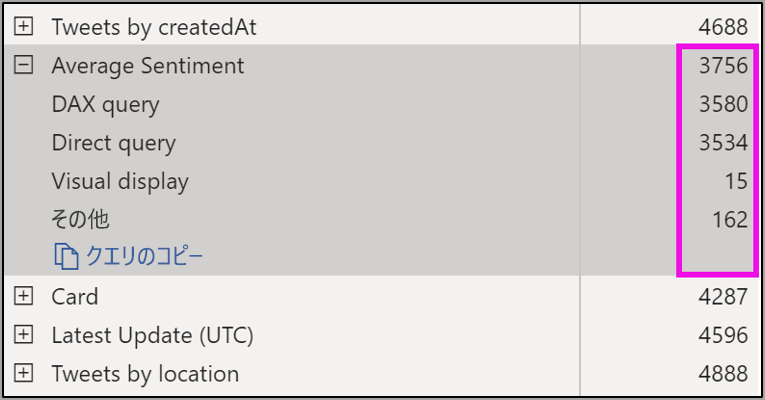
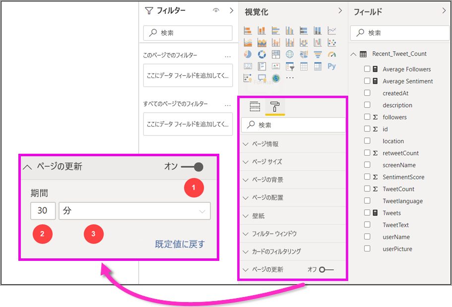

# Power BI Desktop でのページの自動更新 (プレビュー)

重要なイベントを監視する場合、ソース データが更新された場合にすぐにデータを更新することが重要です。 たとえば、製造業では、機械が誤動作している場合、またはそれに近い状態の場合に把握できることが重要です。

Power BI のページの自動更新 (APR) 機能を使用すると、アクティブなレポート ページから、定義した間隔で [DirectQuery ソース](https://docs.microsoft.com/power-bi/desktop-directquery-about)の新しいデータのクエリを実行することができます。

## ページの自動更新の使用

このプレビュー バージョンでは、Power BI Desktop のページの自動更新機能を有効にする必要があります。 **[ファイル]、[オプションと設定]** の順に移動し、 **[オプション]** を選択し、左側のウィンドウで **[プレビュー機能]** を選択します。 *[Automatic page refresh]\(ページの自動更新\)* の横にあるチェックボックスをオンにして機能を有効にします。 ページの自動更新は、DirectQuery データ ソースでのみ使用できます。

ページの自動更新を使用するには、更新を有効にするレポート ページを選択します。 **[視覚化]** ウィンドウで **[書式設定]** アイコン (ペイント ローラー) を選択し、ウィンドウの下部付近にある **[ページの更新]** を見つけます。 

![[ページの更新] の場所](media/desktop-automatic-page-refresh/automatic-page-refresh-01.png)

次の図は、 **[ページの更新]** カードを示します。 番号付きの要素の説明について、次のいくつかの段落で説明します。

![[ページの更新] カード](media/desktop-automatic-page-refresh/automatic-page-refresh-02.png)

1.  [Automatic Page Refresh]\(ページの自動更新\) スライダー - ページの更新のオン/オフを切り替えます
2.  ページ更新間隔の値 - 更新間隔の数値
3.  ページ更新間隔の単位 - ページを更新する間隔の単位

ここでは、ページの更新を有効にし、更新期間を選択できます。 既定値は 30 分です。最小更新間隔は 1 秒です。 設定した間隔でレポートの更新が開始されます。 

## ページの更新間隔の決定

ページの自動更新が有効な場合、Power BI Desktop からは常に DirectQuery ソースにクエリが送信されます。 クエリが送信されてからデータが返されるまでには遅延があります。そのため、更新間隔を短くするには、構成された間隔内でクエリからクエリ対象のデータが正常に返されることを確認する必要があります。 間隔内にデータが返されない場合、ビジュアルが構成よりも頻繁に更新されない状況になります。

ベスト プラクティスとして、更新間隔は、想定する新しいデータの到着率と一致する必要があります。

* 新しいデータが 20 分ごとにソースに到着する場合、更新間隔を 20 分未満にすることはできません。 

* 新しいデータが毎秒到着する場合、間隔を 1 秒に設定する必要があります。 

1 秒のような短い更新間隔の場合、直接クエリ データ ソースの種類、クエリで生じる負荷、容量のデータ センターからレポート閲覧者までの距離なども考慮する必要があります。 

これは、Power BI Desktop のパフォーマンス アナライザーを使用して見積もることができます。これにより、各ビジュアル クエリにソースからの結果を受け取る十分な時間があるかどうかと、時間がかかっている個所を確認できます。 パフォーマンス アナライザーの結果に基づいて、データ ソースを調整し、変更を加えることができます。また、レポート内の他のビジュアルやメジャーを試してみることもできます。

次の図は、パフォーマンス アナライザーの DirectQuery の結果を示しています。

このデータ ソースについて他の特性を考えてみましょう。 

1.  データは 2 秒の速度で到着します。 
2.  パフォーマンス アナライザーは、最大クエリ + 表示時間が約 4.9 秒 (4688 ミリ秒) で表示されます。 
3.  データ ソースは、1 秒あたり約 1,000 個の同時クエリを処理するように構成されています。 
4.  約 10 人のユーザーが同時にレポートを表示すると想定しています。

その結果、次のようになります。

* **5 個ビジュアル x 10 人のユーザー = 約 50 個のクエリ**

この計算の結果、データ ソースがサポートできる負荷よりもはるかに多くの負荷がかかります。 データは 2 秒の速度で到着するため、これを更新頻度にする必要があります。 ただし、クエリが完了するまでに約 5 秒かかるため、5 秒を超える値に設定する必要があります。 

また、レポートにはクラウドでホストされている Analysis Services インスタンスが使用されるため、レポートをサービスに発行したときに、これが異なる結果になる場合があることに注意してください。 必要に応じて、更新間隔を調整することもできます。 

クエリと更新のタイミングを考慮するために、Power BI では、残りの更新クエリがすべて完了すると、次の更新クエリのみが実行されます。 そのため、更新間隔がクエリの処理にかかる時間よりも短い場合でも、Power BI では残りのクエリが完了した後にのみ再更新されます。 

次に、容量の管理者としてパフォーマンスの問題が発生した場合に検出して診断する方法を見てみましょう。 パフォーマンスとトラブルシューティングに関するその他の質問と回答については、この記事で後述する**ページの自動更新に関する FAQ** セクションも参照できます。

## Power BI サービスでのページの自動更新

Power BI Desktop で作成され、Power BI サービスに発行されたレポートのページの自動更新間隔を設定することもできます。 

Power BI サービスのレポートに対するページの自動更新は、Power BI Desktop の構成と同様の手順で構成されます。 次の図は、Power BI サービスの **[ページの更新]** の構成を示しています。

1.  [Automatic Page Refresh]\(ページの自動更新\) スライダー - ページの更新のオン/オフを切り替えます
2.  ページ更新間隔の値 - 更新間隔の数値 (整数にする必要があります)
3.  ページ更新間隔の単位 - ページを更新する間隔の単位

### ページの更新間隔

Power BI サービスで許容されるページの更新間隔は、レポートのワークスペースの種類の影響を受けます。 これは、次のすべてのレポートに適用されます。

* ページの自動更新が有効なワークスペースへのレポートの発行
* 既にワークスペースにあるページの更新間隔の編集
* サービスでのレポートの直接作成

Power BI Desktop に更新間隔の制限はありません。更新間隔は毎秒の頻度に設定できます。 ただし、レポートが Power BI サービスに発行されると、特定の制限が適用されます。これについては以下のセクションで説明します。

### 更新間隔に関する制限事項

Power BI サービスでは、ワークスペースや、Premium サービスが使用されているかどうかなどの要因に基づいて、ページの自動更新の制限が適用されます。

このしくみをわかりやすくするために、[容量とワークスペース](whitepaper-powerbi-premium-deployment.md#capacities)に関する背景から説明します。

**容量**は、Power BI コンテンツのホストと配信に使用される一連のリソース (ストレージ、プロセッサ、およびメモリ) を表す Power BI の中心的な概念です。 容量は共有または専用です。 **共有容量**は他の Microsoft のお客様と共有されますが、**専用容量**は単一のお客様専用です。 専用容量については、[Premium 容量](whitepaper-powerbi-premium-deployment.md#capacities)に関する記事を参照してください。

共有容量の場合、ワークロードは他のお客様と共有される計算リソースで実行されます。 容量はリソースを共有する必要があるため、最大モデル サイズ (1 GB) や最大日次更新頻度 (1 日 8 回) の設定など、"*フェア プレイ*" を確保するための制限が課されます。

Power BI の**ワークスペース**は容量内にあり、セキュリティ、コラボレーション、およびデプロイ コンテナーを表します。 各 Power BI ユーザーには、**マイ ワークスペース**と呼ばれる個人用のワークスペースが用意されます。 追加のワークスペースを作成することで、コラボレーションや配置を有効にすることができます。これらは**アプリのワークスペース**と呼ばれます。 既定では、ワークスペース (個人用のワークスペースも含む) は、**共有容量**内に作成されます。

2 つのワークスペース シナリオの詳細を次に示します。

**共有ワークスペース** - 通常のワークスペース (Premium 容量の一部ではないワークスペース) の場合、ページの自動更新の最小間隔は 30 分 (許容される最小間隔) です。

**Premium ワークスペース** - Premium ワークスペースでページの自動更新を使用できるかどうかは、Premium 管理者が Power BI Premium の容量に対して設定したワークロード設定によって変わります。 ページの自動更新を設定する機能に影響する可能性がある変数は 2 つあります。

 1. "*機能のオン/オフ*": 容量管理者がこの機能を無効にすることを決定した場合、発行されたレポートでどの種類のページの更新も設定できません。

 2. "*最小更新間隔*": この機能を有効にする場合、容量管理者は最小更新間隔を設定する必要があります。 間隔が最小値よりも少ない場合、Power BI サービスでは、容量管理者によって設定された最小間隔に合わせて間隔が上書きされます。

次の表は、この機能を使用できる場所と、各容量の種類と[ストレージ モード](whitepaper-powerbi-premium-deployment.md#model-storage-modes)の制限を詳しく説明したものです

| ストレージ モード | 専用容量 | 共有された容量 |
| --- | --- | --- |
| 直接クエリ | **サポートされている** – はい。  **最小更新間隔** – 1 秒  **容量管理者のオーバーライド** – はい。 | **サポートされている** – はい。  **最小更新間隔** – 30 分  **容量管理者のオーバーライド** – いいえ。 |
| インポート | **サポートされている** – いいえ。  **最小更新間隔** – N/A。  **容量管理者のオーバーライド** – N/A。 | **サポートされている** – いいえ。  **最小更新間隔** – N/A。  **容量管理者のオーバーライド** – N/A。 |
| 混合モード (DQ + その他) | **サポートされている** – はい。  **最小更新間隔** – 1 秒  **容量管理者のオーバーライド** – はい。 | **サポートされている** – はい。  **最小更新間隔** – 30 分  **容量管理者のオーバーライド** – いいえ。 |
| ライブ接続 AS | **サポートされている** – いいえ。  **最小更新間隔** – N/A。  **容量管理者のオーバーライド** – N/A。 | **サポートされている** – いいえ。  **最小更新間隔** – N/A。  **容量管理者のオーバーライド** – N/A。 |
| ライブ接続 PBI | **サポートされている** – いいえ。  **最小更新間隔** – N/A。  **容量管理者のオーバーライド** – N/A。 | **サポートされている** – いいえ。  **最小更新間隔** – N/A。  **容量管理者のオーバーライド** – N/A。 |

> [!NOTE]
> ページの自動更新対応レポートを Power BI Desktop からサービスに発行するときに、データセット設定メニューで DirectQuery データ ソースの資格情報を指定する必要があります。

## 考慮事項と制限事項

Power BI Desktop または Power BI サービスでページの自動更新を使用する場合に注意が必要な点がいくつかあります。

* ページの自動更新では、Import、LiveConnect、および Push ストレージ モードはサポートされません。  
* 少なくとも 1 つの DirectQuery データ ソースを持つ複合モデルがサポートされています。
* Power BI Desktop に更新間隔の制限はなく、1 秒間隔にすることができます。 レポートが Power BI サービスに発行されると、このドキュメントで既に説明したように、特定の制限が適用されます。

### パフォーマンス診断

ページの自動更新は、シナリオを監視し、急速に変化するデータを探索する場合に便利です。 ただし、容量またはデータ ソースに過度の負荷がかかることがあります。

データ ソースに過度の負荷がかからないように、Power BI には次の保護策が用意されています。

1. 対話型のクエリ (ページの読み込み、クロス フィルタリングのビジュアルなど) が確実に優先されるように、すべてのページの自動更新クエリは**低い**優先度で実行されます。
2. 次の更新サイクルの前にクエリが完了しない場合、前のクエリが完了するまで、Power BI から新しい更新クエリは発行されません。 たとえば、更新間隔を 1 秒に設定し、クエリにかかる平均時間が 4 秒の場合、Power BI からは実質的に 4 秒ごとにクエリが発行されます。

それでもパフォーマンスのボトルネックが発生する可能性がある領域は 2 つあります。

1. **容量:** クエリは、まず Premium 容量に到達し、レポートの視覚化から生成された DAX クエリが折りたたまれ、ソース クエリに評価されます。
2. **直接クエリのデータ ソース:** 前の手順で変換されたクエリは、ソースに対して実行されます。 これは、SQL Server、SAP Hana ソースなどです。

管理者は [Premium メトリック アプリ](service-admin-premium-monitor-capacity.md)を使用して、低優先度のクエリによって使用されている容量のサイズを視覚化できます。

低優先度のクエリは、ページの自動更新クエリとモデル更新クエリで構成されます。 現在、ページの自動更新クエリとモデル更新クエリの負荷を区別する方法はありません。

容量が低優先度のクエリで過負荷になっていることがわかった場合は、次のいくつかの操作を実行できます。

1. より大きな Premium SKU を依頼します。
2. レポートの所有者に連絡し、更新間隔を短くするように依頼します。
3. 容量管理者ポータルでは、次のことができます。
  1. その容量のページの自動更新を無効にします
  2. 最小更新間隔を上げます。これは、その容量のすべてのレポートに影響します。

### よく寄せられる質問

このセクションでは、一般的な質問とその回答について説明します。 

1. 私はレポート作成者です。 デスクトップでレポートの更新間隔を 1 秒に定義しましたが、発行後、サービスでレポートが更新されません。

    * そのページについて、ページの自動更新がオンになっていることを確認します。 この設定はページごとに行われるため、更新するレポートの各ページで設定をオンにする必要があります。
    * 更新間隔が 30 分でロックされない場合、Premium 容量がアタッチされたワークスペースにアップロードしたことを確認します。
    * レポートが Premium ワークスペースにある場合は、管理者に、アタッチされた容量に対してこの機能が有効なことを確認します。 さらに、容量の最小更新間隔がレポートよりも低いか同じであることを確認します。

2. 私は容量管理者です。ページの自動更新間隔の設定を変更しましたが、反映されません。 言い換えると、有効にしましたが、レポートは想定よりも遅い速度で更新されているか、更新されません。

    * 容量管理者 UI で行われたページの自動更新設定の変更は、レポートに反映されるまでに最大 5 分かかります。
    * 容量のページの自動更新を有効にするだけでなく、表示するレポートのページについても有効にする必要があります。

3. レポートは混合モードで動作しています (DQ + Import)。 一部のビジュアルは更新されません。

    * ビジュアルが Import テーブルを参照している場合は、これが想定されます。 ページの自動更新は Import ではサポートされません。
    * このセクションの質問 1 を参照してください。

4. レポートはサービスで正常に更新されていましたが、突然停止しました。

    * ページを更新して、問題が自動的に解決されるかどうかを確認してください。
    * 容量管理者に問い合わせてください。機能を無効にしたか、最小更新間隔を上げた可能性があります (質問 2 を参照してください)。

5. 私はレポート作成者です。 ビジュアルが指定した頻度で更新されません。 更新間隔が長くなっています。

    * クエリの実行に時間がかかると、更新間隔が遅れます。 ページの自動更新では、すべてのクエリの実行が完了するまで待ってから、新しいものが実行されます。
    * 容量管理者が、レポートに設定したものよりも高い最小更新間隔を設定している可能性があります。 容量管理者に問い合わせ、低くするように依頼してください。

6. ページの自動更新クエリはキャッシュから提供されますか。

    * いいえ、すべてのページの自動更新クエリでは、キャッシュされたデータはバイパスされます。

## 次の手順

詳しくは、次の各記事をご覧ください。

* [Power BI で DirectQuery を使用する](desktop-directquery-about.md)
* [パフォーマンス アナライザーを使用してレポート要素のパフォーマンスを確認する](desktop-performance-analyzer.md)
* [Power BI Premium 容量の展開と管理](whitepaper-powerbi-premium-deployment.md)
* [Power BI Desktop のデータ ソース](desktop-data-sources.md)
* [Power BI Desktop でのデータの整形と結合](desktop-shape-and-combine-data.md)
* [Power BI Desktop で Excel ブックに接続する](desktop-connect-excel.md)   
* [Power BI Desktop にデータを直接入力する](desktop-enter-data-directly-into-desktop.md)   
