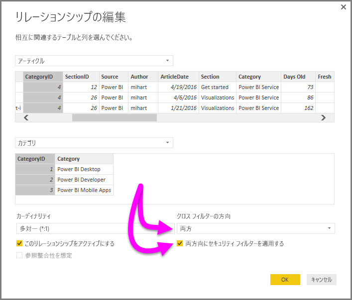

# Power BI Desktop での DirectQuery を使用する双方向のクロス フィルタリング

テーブルをフィルター処理してデータの適切なビューを作成するレポート作成者 (およびデータ モデラー) にとって、レポートへのフィルター処理の適用方法の決定は困難な問題です。テーブルのフィルター コンテキストはリレーションシップの一方の側でのみ保持されており、目的の結果を得るためには複雑な DAX 式が必要になることがよくあります。

双方向のクロス フィルタリングを使用すると、関連するテーブルを処理するときのフィルターの適用方法に関して制御可能な範囲が広がり、テーブル リレーションシップの*両方の*側でフィルターを適用できるようになります。 この機能は、テーブル リレーションシップのもう一方の側の第 2 の関連テーブルにフィルター コンテキストを伝達することによって実現されます。

## 双方向のクロス フィルタリング用の詳細なホワイトペーパー
Power BI Desktop での双方向のクロス フィルタリングについては、[詳細なホワイトペーパー](http://download.microsoft.com/download/2/7/8/2782DF95-3E0D-40CD-BFC8-749A2882E109/Bidirectional%20cross-filtering%20in%20Analysis%20Services%202016%20and%20Power%20BI.docx)を参照してください (同じ動作の SQL Server Analysis Services 2016 についても説明されています)。

* 「[Bidirectional cross-filtering for Power BI Desktop](http://download.microsoft.com/download/2/7/8/2782DF95-3E0D-40CD-BFC8-749A2882E109/Bidirectional%20cross-filtering%20in%20Analysis%20Services%202016%20and%20Power%20BI.docx)」 (Power BI Desktop 向けの双方向のクロス フィルタリング) ホワイトペーパーをダウンロードする

## DirectQuery の双方向のクロス フィルタリングを有効にする

クロス フィルタリングを有効にするには、リレーションシップの **[リレーションシップの編集]** ダイアログ ボックスで、以下を選択する必要があります。

* **[クロス フィルターの方向]** は、**[双方向]** に設定する必要があります
* **[両方向にセキュリティ フィルターを適用する]** もオンにする必要があります

  

> [!NOTE]
> Power BI Desktop でクロス フィルタリングの DAX 式を作成するときは、*UserName* ではなく *UserPrincipalName* (多くの場合ユーザーのログインと同じ、<em>joe@contoso.com</em> など) を使用します。 そのため、*UserName* (または、たとえば EmployeeID) を *UserPrincipalName* にマップする関連テーブルの作成が必要になることがあります。

詳細な情報、および双方向のクロス フィルタリングの動作の例については、前に示した[ホワイトペーパー](http://download.microsoft.com/download/2/7/8/2782DF95-3E0D-40CD-BFC8-749A2882E109/Bidirectional%20cross-filtering%20in%20Analysis%20Services%202016%20and%20Power%20BI.docx)を参照してください。

