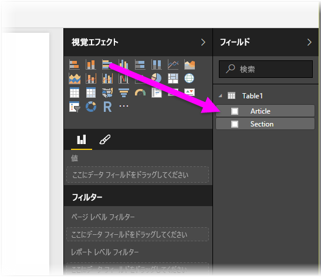

# Power BI Desktop にデータを直接入力する
Power BI Desktop では、データを直接入力して、レポートや表示でそのデータを使用できます。 たとえば、ブックや Web ページの一部をコピーし、Power BI Desktop に貼り付けることができます。

データを直接入力するには、**[ホーム]** リボンの **[データの入力]** を選択します。

ソースからデータを読み込むときと同じように、必要であれば Power BI Desktop によってデータの小さな変換が行われます。 たとえば、次のケースでは、最初の行がヘッダーに変換されます。

Power BI Desktop に取り込む前に入力した (または貼り付けた) データを整形する必要がある場合は、[編集] を選択して **[クエリ エディター]** を表示して、データを整形および変換できます。 または、**[読み込み]** ボタンを選択して、そのままデータをインポートできます。

**[読み込み]** を選択すると、データから新しいテーブルが作成されて、**[フィールド]** ウィンドウで使用できるようになります。 次の図では、*Table1* という名前の既定の新しいテーブルが表示され、その中には 2 つのフィールドが作成されています。

このように、Power BI Desktop には簡単にデータを入力できます。

この後は、Power BI Desktop でそのデータを使用して、表示やレポートを作成したり、Excel ブック、データベース、他のデータ ソースなどの他のデータに接続してインポートしたりできます。

### 次の手順
Power BI Desktop を使用して接続できるデータの種類は他にもあります。 データ ソースの詳細については、次のリソースを参照してください。

* [Power BI Desktop とは何ですか?](desktop-what-is-desktop.md)
* [Power BI Desktop のデータ ソース](desktop-data-sources.md)
* [Power BI Desktop でのデータの整形と結合](desktop-shape-and-combine-data.md)
* [Power BI Desktop で Excel ブックに接続する](desktop-connect-excel.md)   
* [Power BI Desktop で CSV ファイルに接続する](desktop-connect-csv.md)   

