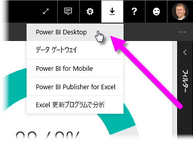
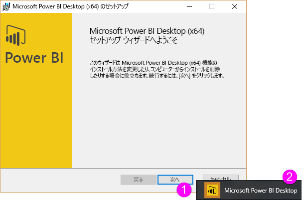

# Power BI Desktop の取得
**Power BI Desktop** では、データを視覚化する高度なクエリ、モデル、レポートを作成できます。 **Power BI Desktop** を使うと、データ モデルを作成し、レポートを作成し、Power BI サービスに発行することで作業を共有することができます。  **Power BI Desktop** は無料でダウンロードできます。

**Power BI Desktop** は 2 つの方法で取得でき、次のセクションではそれぞれについて説明します。

* 直接**ダウンロード**する (パッケージをダウンロードしてコンピューターにインストール)
* **Microsoft ストア**からアプリとしてインストールする

どちらの方法でも最新バージョンの **Power BI Desktop** がコンピューターにインストールされますが、注目すべきいくつかの違いがあります。これについては以下のセクションで説明します。

## Power BI Desktop をダウンロードする
**Power BI Desktop** の最新バージョンをダウンロードするには、Power BI サービスの右上隅からダウンロード アイコンを選択し、 **[Power BI Desktop]** を選択します。

また、次のダウンロード ページから Power BI Desktop の最新バージョンをダウンロードすることもできます。

* [**Power BI Desktop のダウンロード** (32 ビットと 64 ビットの両バージョン)](https://powerbi.microsoft.com/desktop).
  
  

どちらの方法でダウンロードしても、**Power BI Desktop** のダウンロードが終わると、インストール ファイルを実行するよう求められます。

2019 年 7 月リリース以降、**Power BI Desktop** は、サポートされているすべての言語を含む 1 つの .exe インストール パッケージとしてリリースされています。 32 ビット バージョンと 64 ビット バージョン用に個別の .exe ファイルがあります。 2019 年 9 月リリースの後は .msi パッケージが廃止されます。その後、インストールには .exe 実行可能ファイルを使用する必要があります。 この方法により、(特に管理者の場合) 配布、更新、およびインストールがはるかに簡単で便利になります。 また、コマンドライン パラメーターを使用してインストール プロセスをカスタマイズすることもできます。詳細については、この記事で後述する「[インストール時にコマンドライン オプションを使用する](#using-command-line-options-during-installation)」セクションを参照してください。

インストール パッケージを起動すると、**Power BI Desktop** がアプリケーションとしてインストールされ、デスクトップ上で実行されます。

> [!NOTE]
> 同じコンピューターに **Power BI Desktop** のダウンロード (MSI) バージョンと **Microsoft ストア** バージョンをインストールすること (*サイド バイ サイド* インストールとも呼ばれます) はサポートされていません。
> 
> 

## Microsoft ストアからアプリとしてインストールする
次のリンクを使って、Microsoft ストアから **Power BI Desktop** を取得することもできます。

* [**Microsoft ストア**から **Power BI Desktop** をインストールする](http://aka.ms/pbidesktopstore)

  

Microsoft ストアから **Power BI Desktop** を入手するといくつかの利点があります。

* **自動更新** - Windows は最新バージョンが入手できるようになるとすぐ自動的にダウンロードするので、バージョンは常に最新の状態です。
* **ダウンロード量が少なくなる** - **Microsoft ストア**では、各更新で変更されたコンポーネントのみがコンピューターにダウンロードされるようになっています。結果的に、各更新のダウンロード量が少なくなります。
* **管理者特権が必要ない** - パッケージを直接ダウンロードしてインストールする場合は、インストールが正常に完了するには管理者が行う必要があります。 Microsoft ストアから **Power BI Desktop** を入手するときは、管理者特権は必要 "*ありません*"。
* **IT のロールアウトが可能** - **Microsoft ストア** バージョンの方が組織内の全ユーザーへのデプロイ ("*ロールアウト*") が簡単であり、**ビジネス向け Microsoft ストア**から **Power BI Desktop** を入手できるようにすることができます。
* **言語検出** - **Microsoft ストア** バージョンにはサポート対象のすべての言語が含まれ、コンピューターを起動するたびに使われている言語が確認されます。 これは、**Power BI Desktop** で作成されるモデルのローカライズにも影響します。たとえば、組み込みの日付階層は、.pbix ファイルが作成されたときに **Power BI Desktop** で使われていた言語と一致します。

Microsoft ストアからの **Power BI Desktop** のインストールには、以下で示すようないくつかの考慮事項と制限があります。

* SAP コネクタを使う場合、SAP ドライバー ファイルを *Windows\System32* フォルダーに移動することが必要な場合があります。
* Microsoft ストアから **Power BI Desktop** をインストールしても、.exe バージョンのユーザー設定はコピーされません。 必要に応じて、最近使ったデータ ソースに再接続し、データ ソースの資格情報を再入力します。 

> [!NOTE]
> 同じコンピューターに **Power BI Desktop** のダウンロード (MSI) バージョンと **Microsoft ストア** バージョンをインストールすること (*サイド バイ サイド* インストールとも呼ばれます) はサポートされていません。 手動で **Power BI Desktop** をアンインストールしてから、**Microsoft ストア**から Power BI Desktop をダウンロードする必要があります。
> 
> [!NOTE]
> **Power BI Desktop** の Power BI Report Server バージョンは、この記事で説明されているバージョンとは異なるものであり、別途インストールします。 **Power BI Desktop** の Report Server バージョンについては、「[Power BI Report Server の Power BI レポートの作成](report-server/quickstart-create-powerbi-report.md)」をご覧ください。
> 
> 

## Power BI Desktop の使用
**Power BI Desktop** を実行すると、 *[ようこそ]* 画面が表示されます。

![Power BI Desktop の [ようこそ] 画面](media/desktop-get-the-desktop/getpbid_05.png)

**Power BI Desktop** を初めて使う場合は (インストールがアップグレードではない場合)、フォームに入力していくつかの質問に回答すること、または先に進む前に **Power BI サービス**にサインインすることを求められます。

ここから、データ モデルやレポートの作成を開始し、Power BI サービス上で他のユーザーと共有することができます。 この記事の末尾にある「**詳細**」では、**Power BI Desktop** の使用を開始するのに役立つガイドへのリンクを紹介しています。

## 最小要件
**Power BI Desktop** の実行に必要な最小要件は、次のとおりです。

* Windows 7 または Windows Server 2008 R2 以降
* .NET 4.5
* Internet Explorer 10 以上
* **メモリ (RAM):** 1 GB 以上使用可能、1.5 GB 以上を推奨します。
* **ディスプレイ:** 1440 x 900 以上または 1600 x 900 (16:9) を推奨します。 1024 x 768 または 1280 x 800 などのより低い解像度は推奨されていません。特定のコントロール (起動画面を閉じるなど) は、これらの解像度を超えて表示されるためです。
* **Windows 表示設定:** テキスト、アプリ、その他の項目のサイズが 100% より大きくなるように表示設定を変更してある場合、**Power BI Desktop** の使用を続けるために閉じたり応答したりする必要がある特定のダイアログを表示できないことがあります。 この問題が発生した場合は、Windows で **[設定] > [システム] > [表示]** に移動して **[表示設定]** を確認し、スライダーを使って表示設定を 100% に戻します。
* **CPU:** 1 ギガヘルツ (GHz) または高速な x86 ビットまたは x64 ビットのプロセッサを推奨します。

## 考慮事項と制限事項

Power BI Desktop での経験が常に素晴らしいものであることを望んでいます。 そうはいっても、問題が発生する可能性はあるので、このセクションでは、Power BI Desktop で発生することがある問題に対処するための解決策と提案を示します。 

### インストール時にコマンドライン オプションを使用する 

Power BI Desktop をインストールするときに、コマンドライン スイッチを使用してプロパティとオプションを設定できます。 これは、複数の組織間全体で Power BI Desktop のインストールを管理または促進にする管理者の場合に特に便利です。 これらのオプションは、.msi および .exe のインストールに適用されます。 

|コマンドライン オプション  |動作  |
|---------|---------|
|-q、-quiet、-s、-silent     |サイレント インストール         |
|-passive     |インストール時に進行状況バーのみを表示します         |
|-norestart     |コンピューターの再起動要件を抑制します         |
|-forcerestart     |プロンプトを表示せずにインストール後にコンピューターを再起動します         |
|-promptrestart     |コンピューターの再起動が必要かどうかをユーザーに確認します (既定値)         |
|-l<>、-log<>     |<> で指定されたファイルを使用して、インストールを特定のファイルに記録します         |
|-uninstall     |Power BI Desktop をアンインストールします         |
|-repair     |インストールを修復します (現在インストールされていない場合はインストールします)         |
|-package、-update     |Power BI Desktop をインストールします (-uninstall または -repair が指定されていない場合は既定値)。         |

### Power BI Desktop の以前のリリースを使用しているときの問題

古いバージョンの **Power BI Desktop** を使用すると、次のようなエラーが発生するユーザーがいます。 

    "We weren't able to restore the saved database to the model" 

通常、Power BI Desktop の最新バージョンに更新すると、この問題は解決します。

### 通知の無効化
最新バージョンの Power BI Desktop に更新し、機能、パフォーマンス、安定性、その他の改善の進歩を活用することをお勧めします。 組織によっては、ユーザーが新しいバージョンのたびに更新することを望まない場合があります。 以下の手順でレジストリを変更することにより、通知を無効にすることができます。

1. レジストリ エディターを使用して、*HKEY_LOCAL_MACHINE\SOFTWARE\Microsoft\Microsoft Power BI Desktop* に移動します
2. そこに、次の設定で新しいエントリを作成します:*REG_DWORD :DisableUpdateNotification*
3. 新しいエントリの値を **1** に設定します。

変更を有効にするには、コンピューターを再起動する必要があります。

### Power BI Desktop で画面の一部を読み込む

特定の画面解像度が構成されている場合など、ある種の状況では、Power BI Desktop で大きな黒い領域を含むコンテンツが表示されることがあります。 これは、一般に、項目の表示方法に影響する最近のオペレーティング システムの更新によるものであり、Power BI Desktop によるコンテンツの表示方法の直接的な結果ではありません。 それでも、大きな黒い領域が表示されるのは目障りなので、次の手順によりこの問題に対処できます。

1. [スタート] ボタンをクリックし、表示される検索バーに "*blurry*" と入力します。
2. 表示されるダイアログで、次のオプションを選択します: *[Let Windows fix apps that are blurry]\(Windows に不明瞭なアプリを修正させる\)* 。
3. Power BI Desktop を再起動します。

この問題は、今後の Windows 更新プログラムのリリースで解決される可能性があります。 
 

## 次の手順
以下のガイドは、**Power BI Desktop** をインストールした後で、すばやく作業を開始するのに役立ちます。

* [Power BI Desktop とは何ですか?](desktop-what-is-desktop.md)
* [Power BI Desktop でのクエリの概要](desktop-query-overview.md)
* [Power BI Desktop のデータ ソース](desktop-data-sources.md)
* [Power BI Desktop におけるデータへの接続](desktop-connect-to-data.md)
* [Power BI Desktop でのデータの整形と結合](desktop-shape-and-combine-data.md)
* [Power BI Desktop での一般的なクエリ タスク](desktop-common-query-tasks.md)   

