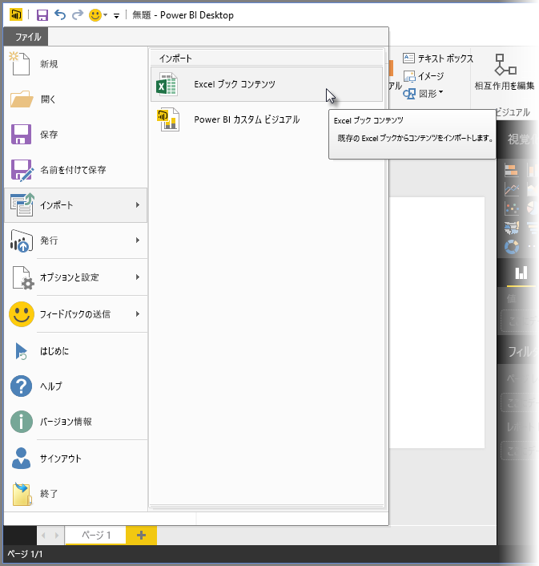
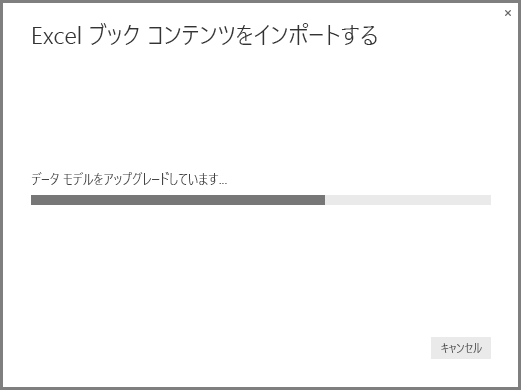
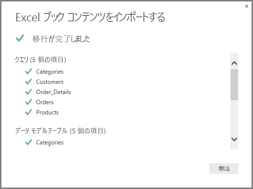

# Power BI Desktop に Excel ブックをインポートする
**Power BI Desktop** を使用すると、Power Query のクエリ、Power Pivot のモデル、Power View ワークシートが格納されている Excel ブックを Power BI Desktop に簡単にインポートすることができます。 レポートと視覚化は Excel ブックに基づいて自動的に作成されます。一度インポートしたら、Power BI Desktop を使用してこれらのレポートを引き続き改良して調整でき、その際には既存の機能や、Power BI Desktop の毎月の更新でリリースされる新機能を利用することができます。

今後、Excel と Power BI Desktop の間の追加の通信 (インポート/エクスポートなど) も提供される予定です。現在のところ、ブックを Power BI Desktop にインポートすることができ、この機能によって既存の Excel ユーザーは Power BI Desktop を使い始めることができます。

## Excel ブックのインポート方法
ブックをインポートするには、Power BI Desktop から **[ファイル]\>、[インポート]、\>[Excel ブック コンテンツ]** の順に選びます。

ウィンドウが表示され、インポートするブックを選択できます。 現在、ブック内のオブジェクトのサイズや数に制限はありませんが、ブックが大きくなるにつれて、Power BI Desktop が分析とインポートに要する時間が増加します。

> [!NOTE]
> **[OneDrive for Business の共有]** フォルダーまたは **[Office 365 グループ]** フォルダーから Excel ファイルを読み込むかインポートするには、Excel ファイルの URL を使用し、それを Power BI Desktop の **Web** データ ソースに入力します。 **OneDrive for Business** URL を適切にフォーマットするために必要な手順がいくつかあるため、詳細および一連の適切な手順については、「[Use OneDrive for Business links in Power BI Desktop (Power BI Desktop で OneDrive for Business リンクを活用する)](desktop-use-onedrive-business-links.md)」をご覧ください。
> 
> 

ブックを選ぶと、Power BI Desktop はブックを分析し、Power BI Desktop ファイル (.pbix) に変換します。 このアクションは、1 回限りのイベントです。次の手順でいったん Power BI Desktop ファイルを作成すると、Power BI Desktop ファイルは元の Excel ブックに依存しなくなり、元のブックに影響を与えることなく、変更 (および保存や共有) できるようになります。

インポートが完了すると、 **[概要]** ページが表示され、変換された項目についての説明と、インポートできなかった項目の一覧が表示されます。

**[閉じる]** を選ぶと、Power BI Desktop にレポートが読み込まれます。 Excel ブックをインポートした後の Power BI Desktop を次の図に示します。Power BI Desktop では、ブックの内容に基づいて自動的にレポートが読み込まれます。

これでブックがインポートされるので、Power BI Desktop に含まれるすべての機能を使用して、新しい視覚化の作成、データの追加、新しいレポートのページの作成などのレポート操作を続けることができます。

## インポートされるブック要素
Power BI Desktop は、Excel で一般的に *オブジェクト*と呼ばれる次の要素をインポートできます。

| Excel ブック内のオブジェクト | Power BI Desktop ファイルの最終結果 |
| --- | --- |
| Power Query のクエリ |Excel からの Power Query のすべてのクエリは、Power BI Desktop のクエリに変換されます。 Excel ブックで定義されたクエリ グループがあれば、Power BI Desktop で同じ組織が複製されます。 Excel で [接続の作成のみ] が設定されていない限り、すべてのクエリが読み込まれます。 読み込み動作は、Power BI Desktop の **クエリ エディター** の **[ホーム]** タブにある **[プロパティ]** ダイアログからカスタマイズできます。 |
| Power Pivot の外部データ接続 |Power Pivot の外部データ接続はすべて、Power BI Desktop ではクエリに変換されます。 |
| リンク テーブルまたは現在のブックのテーブル |データ モデルにリンクされているか、クエリにリンクされているワークシートのテーブルが Excel にある場合 (*[ソース テーブル]* または M の *Excel.CurrentWorkbook()* 関数を使用)、次のオプションが提示されます。 <ol><li>Power BI Desktop ファイルにテーブルをインポートします。 このテーブルは、データの 1 回限りのスナップショットで、その後は Power BI Desktop でテーブルのデータを編集することはできません。 このオプションを使用して作成されたテーブルは、100 万文字 (合計。すべての列のヘッダーとセルを組み合わせたもの) のサイズ制限があります。</li><li>元のブックへの接続を保持します。 別の方法として、元の Excel ブックへの接続を保持することができます。Power BI Desktop の Excel ブックに対して作成された他のクエリと同様に、Power BI Desktop はこのテーブルの最新のコンテンツを更新のたびに取得します。</li></ul> |
| データ モデルの計算列、メジャー、KPI、データのカテゴリとリレーションシップ |これらのデータ モデル オブジェクトは、Power BI Desktop の同等のオブジェクトに変換されます。 **イメージ**など、Power BI Desktop で利用できない特定のデータのカテゴリがあることにご注意ください。 このような場合は、対象の列のデータ カテゴリの情報がリセットされます。 |
| Power View ワークシート |Excel の Power View ワークシートごとに新しいレポート ページが作成されます。 これらのレポート ページの名前と順序は、元の Excel ブックと一致します。 |

## ブックのインポートの制限
Power BI Desktop には、ブックをインポートする際に次のようないくつかの制限があります。

* **Analysis Services 表形式モデルへの外部接続:** Excel 2013 では、SQL Server Analysis Services 表形式モデルへの接続を作成し、データをインポートせずにこれらのモデルの上に Power View レポートを作成することができます。 現在、この種の接続は Power BI Desktop への Excel ブックのインポートの一部としてサポートされていません。 回避策としては、Power BI Desktop でこれらの外部接続を再作成する必要があります。
* **階層:** 現在は、Power BI Desktop でこの種類のデータ モデル オブジェクトはサポートされていません。 そのため、Power BI Desktop への Excel ブックのインポートの一部として、階層はスキップされます。
* **バイナリ データ列:** 現在は、Power BI Desktop でこの種類のデータ モデル列はサポートされていません。 バイナリ データ列は、Power BI Desktop の結果のテーブルから削除されます。
* **サポートされていない Power View の要素:** テーマや特定の種類の視覚化 (再生軸のある散布図、ドリルダウン動作) など、Power View のいくつかの機能が Power BI Desktop で利用できません。 これらの視覚化はサポートされていないため、Power BI Desktop レポートの該当する場所に *サポートされていない視覚化* というメッセージが表示され、必要に応じてこれを削除したり、再構成したりできます。
* **Power Query の** ***[ソース テーブル]***、 **または M の**  ***Excel.CurrentWorkbook*** **を使用した名前付き範囲**:この名前付き範囲のデータの Power BI Desktop へのインポートは現在サポートされていませんが、Power BI Desktop の更新プログラムに含まれる予定です。 現時点では、これらの名前付き範囲は、外部の Excel ブックへの接続として Power BI Desktop に読み込まれます。
* **PowerPivot から SSRS:** PowerPivot の SQL Server Reporting Services (SSRS) への外部接続は現在サポートされていません。これは、そのデータ ソースが現在 Power BI Desktop で利用できないためです。

