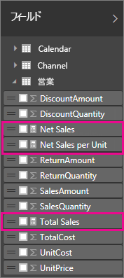
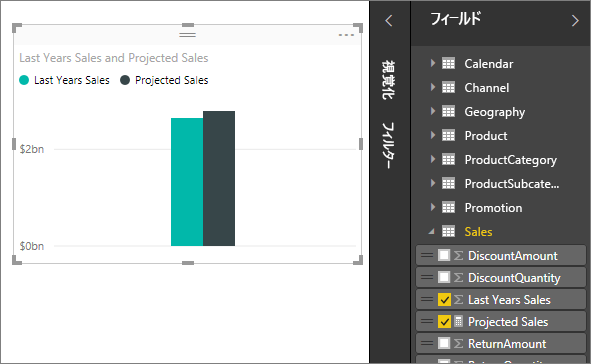

# Power BI Desktop のメジャー

**Power BI Desktop** では、わずか数クリックで、データに対する洞察を作成できます。 しかし、場合によっては、最も重要な質問に答えるために必要なものが、データに含まれていないことがあります。 メジャーは、それを入手するために役立ちます。

メジャーは、最も一般的なデータ分析のいくつかに使用します。 たとえば、合計、平均、最小値、最大値、カウントや、DAX の数式を使用して自分で作成する高度な計算などが挙げられます。 メジャーの計算結果は、ユーザーがレポートを操作するたびに変化するため、アドホック データ探索を高速で、また動的に実行できます。 詳しく見てみましょう。

## メジャーについて

**Power BI Desktop** では、**レポート ビュー**または**データ ビュー**でメジャーを作成し、使用します。 ユーザーが自分で作成したメジャーは、フィールド リストに、計算機のアイコン付きで表示されます。 メジャーには任意の名前を付け、他のフィールドと同じように、新規または既存の視覚エフェクトを追加することができます。

> [!NOTE]
> ダイアログ ボックスから選ぶことができる既製の**クイック メジャー**もあります。 メジャーをすばやく作成することができ、自動的に作成される DAX 式を確認できるため DAX 構文の勉強にも適しています。 詳しくは、[クイック メジャー](desktop-quick-measures.md)に関する記事をご覧ください。
> 
> 

## Data Analysis Expressions (DAX)

メジャーは、数式の結果を計算します。 独自のメジャーを作成するときは、[Data Analysis Expressions](https://msdn.microsoft.com/library/gg413422.aspx) (DAX) 数式言語を使用します。 DAX には 200 を超える関数、演算子、およびコンストラクトから成るライブラリが含まれています。 このライブラリは、メジャーを作成する際の柔軟性が非常に高く、データ分析に必要なほとんどすべての計算結果を得ることができます。

DAX の数式は、Excel の数式とよく似ています。 DAX には、DATE、SUM、LEFT など、Excel と同じ関数も多く含まれています。 ただし、DAX の関数は、Power BI Desktop で取り扱っているようなリレーショナル データを操作することを意図しています。

## 例を見てみましょう
Jan は、Contoso 社の営業マネージャーです。 彼女は、次の会計年度の販売店売上予測を提供するように依頼されました。 そこで、Jan は昨年度の売上高に基づき、今後 6 か月間に予定されている各種のプロモーションの成果として年率 6% の売上増加を見込んで予測を立てることにしました。

推定値を報告するため、Jan は Power BI Desktop に昨年度の売上データをインポートします。 "Reseller Sales" テーブルに、"SalesAmount" フィールドがあることを確認します。 インポートしたデータには昨年度の売上高だけが含まれているので、Jan は "SalesAmount" フィールドの名前を "Last Years Sales" に変更します。 次に Jan は "Last Years Sales" をレポート キャンバスにドラッグします。 昨年度のすべての販売店の売上合計を示す単一の値として、グラフによる視覚エフェクトが表示されます。

ここで、Jan は自分で指定しなくても、数式が 1 つ自動的に用意されたことに気付きます。 Power BI Desktop により、"Last Years Sales" に含まれるすべての値の合計を計算する独自のメジャーが作成されました。

しかし、次の会計年度の売上予測を計算するメジャーが必要です。このメジャーでは、事業に 6% の増加を見込んで、昨年度の売上に 1.06 を乗算して計算します。 この計算については、自分で独自のメジャーを作成します。 新しいメジャーを作成する機能を使用して、新しいメジャーを作成し、次のような DAX 式を入力します。

    Projected Sales = SUM('Sales'[Last Years Sales])*1.06

この後、新しい Projected Sales メジャーをグラフにドラッグします。

このように、Jan は迅速に、最小限の労力で、売上予測を計算するメジャーを作成できました。 Jan はさらに、特定の販売店をフィルター処理したり、レポートに他のフィールドを追加したりして、予測データをさらに分析することができます。

## メジャー用のデータ カテゴリ

メジャー用のデータ カテゴリを選択することもできます。 

特に、それを行うと、メジャーを使用して URL を動的に作成し、データ カテゴリを Web URL としてマークすることができます。 

メジャーを Web URL として表示するテーブルを作成すれば、ご自分の選択内容に基づいて作成された URL をクリックすることができます。 これは特に、[URL フィルター パラメーター](service-url-filters.md)を使用して他の Power BI レポートにリンクする場合に役に立ちます。

## 詳細情報
この記事では、メジャーについてごく簡単に説明しました。独自のメジャーを作成する方法の詳細については、他の記事を参照してください。 「[チュートリアル:Power BI Desktop で独自のメジャーを作成する](desktop-tutorial-create-measures.md)」を必ず参照して、サンプル ファイルをダウンロードし、さまざまなメジャーを作成する方法についてステップ バイ ステップの説明をお読みください。  

DAX についてもう少し詳しく知るには、「[Power BI Desktop における DAX の基本事項](desktop-quickstart-learn-dax-basics.md)」をご覧ください。 「[Data Analysis Expressions (DAX) リファレンス](https://msdn.microsoft.com/library/gg413422.aspx)」では、関数、構文、演算子、名前付け規則のそれぞれに関する詳しい記事を紹介しています。 Excel 内の Power Pivot および SQL Server Analysis Services で DAX が利用されるようになって数年が経ち、その他にも多くのリソースが利用可能になりました。 「[DAX リソース センター Wiki](http://social.technet.microsoft.com/wiki/contents/articles/1088.dax-resource-center.aspx)」をぜひご確認ください。ここでは、BI コミュニティで影響力を持つメンバーが DAX の知識を公開しています。

