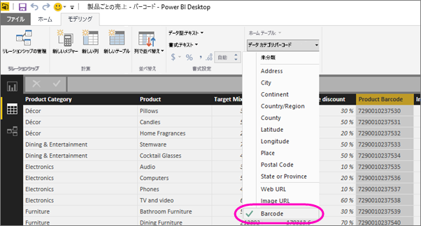

# モバイル アプリ向けの Power BI Desktop でバーコードにタグ付けする
Power BI Desktop で列の[データを分類](desktop-data-categorization.md)し、Power BI Desktop がレポートの表示での値の処理方法を認識できるようにすることができます。 列を**バーコード**として分類することもできます。 iPhone の [Power BI アプリで製品のバーコードをスキャン](consumer/mobile/mobile-apps-scan-barcode-iphone.md)すると、そのバーコードに含まれるレポートが表示されます。 モバイル アプリでレポートを開くと、Power BI によってレポートが自動的にフィルター処理されて、そのバーコードに関連するデータだけが表示されます。

1. Power BI Desktop でデータ ビューに切り替えます。
2. バーコード データがある列を選択します。 後の「[サポートされるバーコード形式](#supported-barcode-formats)」の一覧を参照してください。
3. **[モデリング]** タブで、**[データ カテゴリ]** > の **[バーコード]** を選択します。
   
    
4. レポート ビューで、バーコードによってフィルター処理する表示にこのフィールドを追加します。
5. レポートを保存して、Power BI サービスに発行します。

[iPhone 用 Power BI アプリ](consumer/mobile/mobile-iphone-app-get-started.md)でスキャナーを開き、バーコードをスキャンすると、レポートの一覧にこのレポートが表示されます。 レポートを開くと、スキャンした製品のバーコードによって表示がフィルター処理されます。

## サポートされるバーコード形式
Power BI レポートでタグを付けることができる場合、Power BI は次のバーコードを認識します。 

* UPCECode 
* Code39Code  
* A39Mod43Code 
* EAN13Code 
* EAN8Code  
* 93Code  
* 128Code 
* PDF417Code 
* Interleaved2of5Code 
* ITF14Code 

## 次の手順
* [iPhone の Power BI アプリからバーコードをスキャンする](consumer/mobile/mobile-apps-scan-barcode-iphone.md)
* [iPhone でのバーコードのスキャンに関する問題](consumer/mobile/mobile-apps-scan-barcode-iphone.md#issues-with-scanning-a-barcode)
* [Power BI Desktop でのデータ分類](desktop-data-categorization.md)  
* わからないことがある場合は、 [Power BI コミュニティで質問してみてください](http://community.powerbi.com/)。

