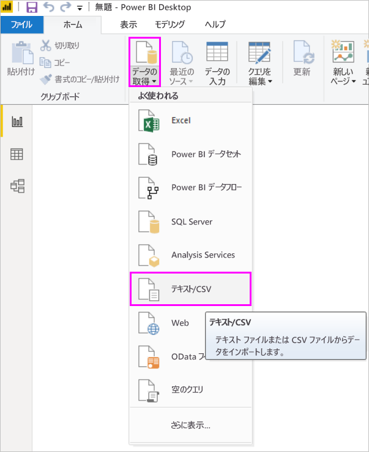
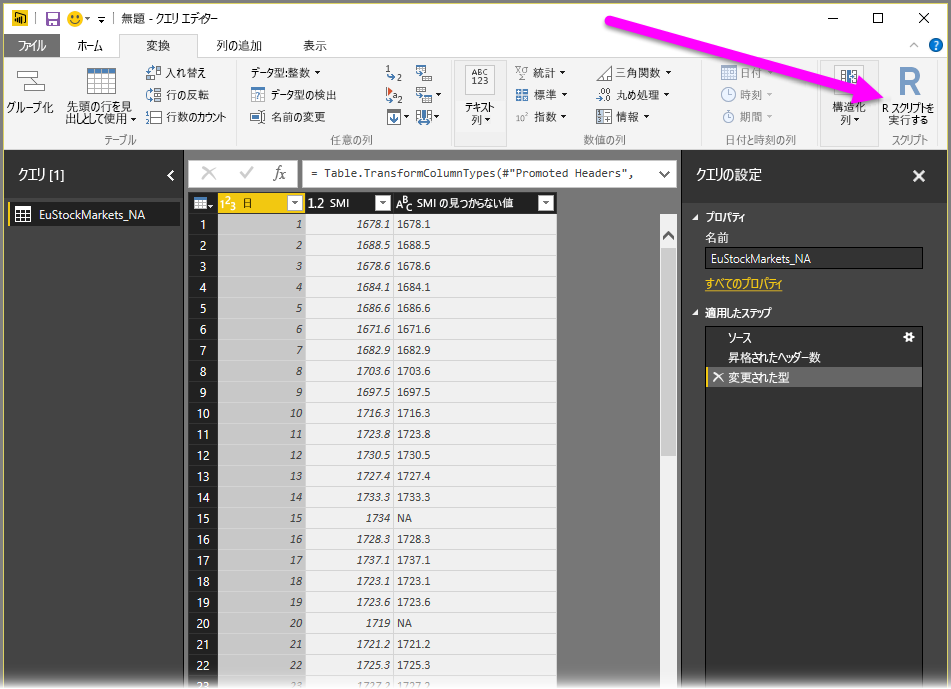
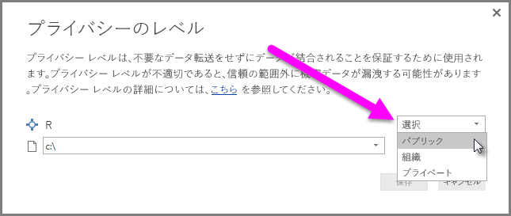
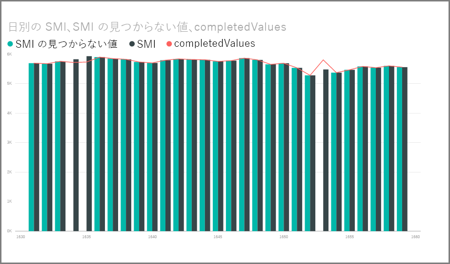
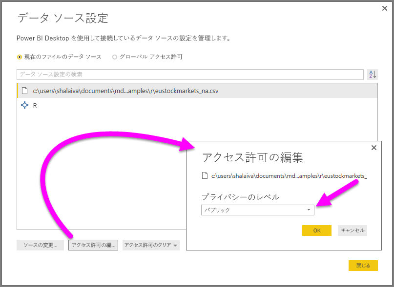

# <a name="use-r-in-query-editor"></a>クエリ エディターで R を使用する

[**R**](https://mran.microsoft.com/documents/what-is-r) は、多くの統計学者、データ科学者、データ アナリストが使用する強力なプログラミング言語です。 Power BI Desktop の**クエリ エディター**で **R** を使用すると、次のことができます。

* データ モデルの準備

* レポートの作成

* データ クレンジング、高度なデータ整形、データセット分析の実行。これには、欠損データの補完、予測、クラスタリングなどが含まれます。  

## <a name="install-r"></a>R をインストールする

**R** は、[Revolution Open ダウンロード ページ](https://mran.revolutionanalytics.com/download/)と [CRAN リポジトリ](https://cran.r-project.org/bin/windows/base/)から無料でダウンロードできます。

### <a name="install-mice"></a>mice をインストールする

R 環境に [**mice** ライブラリ](https://www.rdocumentation.org/packages/mice/versions/3.5.0/topics/mice)がインストールされている必要があります。 **mice** がないと、サンプル スクリプト コードは正常に動作しません。 **mice** パッケージには、欠損データを処理するメソッドが実装されています。

**mice** をインストールするには:

1. R.exe プログラムを起動します (たとえば、C:\Program Files\Microsoft\R Open\R-3.5.3\bin\R.exe)。  

2. インストール コマンドを実行します。

   ``` 
   >  install.packages('mice') 
   ```

## <a name="use-r-in-query-editor"></a>クエリ エディターで R を使用する

**クエリ エディター**で **R** を使用する方法を示すために、.csv ファイルに含まれているサンプル株式市場データセットを使用して、次の手順を行います。

1. [**EuStockMarkets_NA.csv** ファイルをダウンロードします](http://download.microsoft.com/download/F/8/A/F8AA9DC9-8545-4AAE-9305-27AD1D01DC03/EuStockMarkets_NA.csv)。 ファイルを保存した場所を忘れないようにします。

1. **Power BI Desktop** にファイルを読み込みます。 **[ホーム]** リボンで、 **[データの取得] > [テキスト/CSV]** を選択します。

   

1. ファイルを選択してから、 **[開く]** を選択します。 CSV データが **[Text/CSV file]\(テキスト/CSV ファイル\)** ダイアログに表示されます。

   

1. データが読み込まれると、 **[フィールド]** ウィンドウに表示されます。

   

1. **クエリ エディター**を開くには、 **[ホーム]** リボンの **[クエリを編集]** を選択します。

   

1. **[変換]** リボンで、 **[R スクリプトを実行する]** を選択します。 **[R スクリプトを実行する]** エディターが表示されます。  

   15 行目と 20 行目のデータが欠損しています。この画像に表示されない他の行にも欠損しているデータがあります。 次の手順は、R によってこれらの行がどのように自動的に補完されるかを示しています。

   

1. この例では、次のスクリプト コードを入力します。 '&lt;Your File Path&gt;' は、ローカル ファイル システム上の **EuStockMarkets_NA.csv** のパス (たとえば C:/Users/John Doe/Documents/Microsoft/EuStockMarkets_NA.csv) に置き換えます

    ```r
       dataset <- read.csv(file="<Your File Path>/EuStockMarkets_NA.csv", header=TRUE, sep=",")
       library(mice)
       tempData <- mice(dataset,m=1,maxit=50,meth='pmm',seed=100)
       completedData <- complete(tempData,1)
       output <- dataset
       output$completedValues <- completedData$"SMI missing values"
    ```

    > [!NOTE]
    > フィルターが適用された新しいデータセットを適切に作成するには、*output* という名前の変数を上書きすることが必要な場合があります。

7. **[OK]** を選択すると、**クエリ エディター**にデータ プライバシーに関する警告が表示されます。

   
8. Power BI サービスで R スクリプトを正しく動作させるためには、すべてのデータ ソースを **[パブリック]** に設定する必要があります。 プライバシー設定とその意味に関する詳細については、「[プライバシー レベル](desktop-privacy-levels.md)」を参照してください。

   

   **[保存]** を選択すると、スクリプトが実行されます。 **[フィールド]** ウィンドウに **completedValues** という新しい列が表示されます。 行 15 や行 18 行など、いくつかの行でデータ要素が不足しています。 次のセクションでは、R がデータ要素の不足を処理するしくみを確認します。

   わずか 5 行の R スクリプトで、**クエリ エディター**は予測モデルで不足値を埋めました。

## <a name="create-visuals-from-r-script-data"></a>R スクリプト データからビジュアルを作成する

これで、R スクリプト コードと **mice** ライブラリで不足値を補うしくみを示すビジュアルを作成できます。次の画像のようになります。



完成したすべてのビジュアルを 1 つの **Power BI Desktop** .pbix ファイルに保存し、データ モデルとその R スクリプトを Power BI サービスで使用することができます。

> [!NOTE]
> これらの手順をすべて完了した [.pbix ファイルをダウンロード](http://download.microsoft.com/download/F/8/A/F8AA9DC9-8545-4AAE-9305-27AD1D01DC03/Complete%20Values%20with%20R%20in%20PQ.pbix)できます。

Power BI サービスに .pbix ファイルをアップロードしたら、サービス データ更新と更新されたビジュアルを有効にするために、追加の手順を行う必要があります。  

* **データセットの定期更新を有効にする** - データセットを含むブックを R スクリプトで定期的に更新する方法については、「[スケジュールされた更新の構成](refresh-scheduled-refresh.md)」を参照してください。**Personal Gateway** に関する情報もあります。

* **Personal Gateway をインストールする** - ファイルと **R** が配置されているマシンに **Personal Gateway** がインストールされている必要があります。 Power BI サービスではそのブックにアクセスされ、更新されたすべてのビジュアルが再レンダリングされます。 詳細については、「[Power BI で個人用ゲートウェイを使用する](service-gateway-personal-mode.md)」を参照してください。

## <a name="limitations"></a>制限事項

**クエリ エディター**で作成された R スクリプトを含むクエリにはいくつかの制限事項があります。

* すべての R データ ソース設定が **[パブリック]** に設定されている必要があります。 また、**クエリ エディター**のクエリの他のすべての手順も、パブリックにする必要があります。 データ ソース設定にアクセスするには、**Power BI Desktop** で、 **[ファイル]、[オプションと設定]、[データ ソース設定]** の順に選択します。

  

  **[データ ソース設定]** ダイアログで、データ ソースを選択し、 **[アクセス許可の編集]** をクリックします。 **[プライバシー レベル]** を **[パブリック]** に設定します。

      
* R のビジュアルやデータセットの定期更新を有効にするには、**スケジュール更新**を有効にし、ブックと **R** が配置されているコンピューターに **Personal Gateway** をインストールする必要があります。それぞれの詳細な情報については、この記事の前のセクションにリンクがあります。

R とカスタム クエリを利用すれば、さまざまなデータ表示が可能です。いろいろ試してください。

## <a name="next-steps"></a>次の手順

* [R の概要](https://mran.microsoft.com/documents/what-is-r) 

* [Power BI Desktop で R スクリプトを実行する](desktop-r-scripts.md) 

* [Power BI で外部 R IDE を使用する](desktop-r-ide.md) 

* [Power BI サービスの R パッケージ](service-r-packages-support.md)
