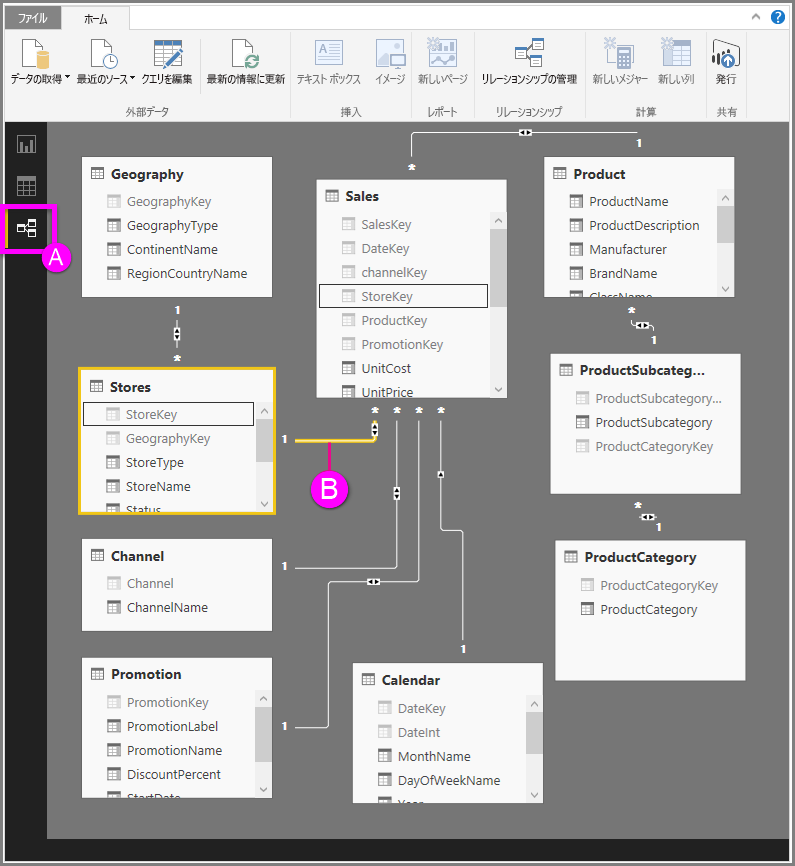

# Power BI Desktop のリレーションシップ ビュー
**リレーションシップ ビュー**には、モデル内のすべてのテーブル、列、リレーションシップが表示されます。 これは、モデルに多数のテーブル間の複雑な関係が含まれる場合に特に役立ちます。

では、見てみましょう。

**A.**   [リレーションシップ ビュー] アイコン - クリックすると、リレーションシップ ビューにモデルが表示されます。

**B.**  リレーションシップ – リレーションシップの上にカーソルを置くと、使用されている列が表示されます。 リレーションシップをダブルクリックすると、**[リレーションシップの編集]** ダイアログ ボックスが開き、リレーションシップが表示されます。 

上の図では、*Stores* テーブルに*StoreKey* 列があり、この列は *Sales* テーブル (同様に *StoreKey* 列を持つ) に関連があることがわかります。 これは*多対一* (\*: 1) 関係であることがわかり、線の中央のアイコンは、クロス フィルターの方向が *両方* に設定されていることを示します。 アイコン上の矢印は、フィルター コンテキストのフローの方向を示しています。

リレーションシップについて詳しくは、「[Power BI Desktop でのリレーションシップの作成と管理](desktop-create-and-manage-relationships.md)」をご覧ください。

