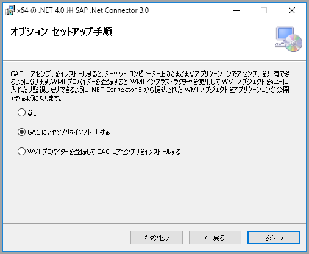
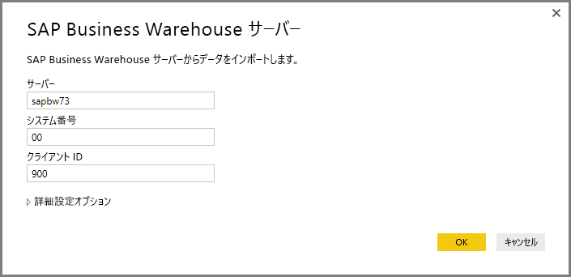
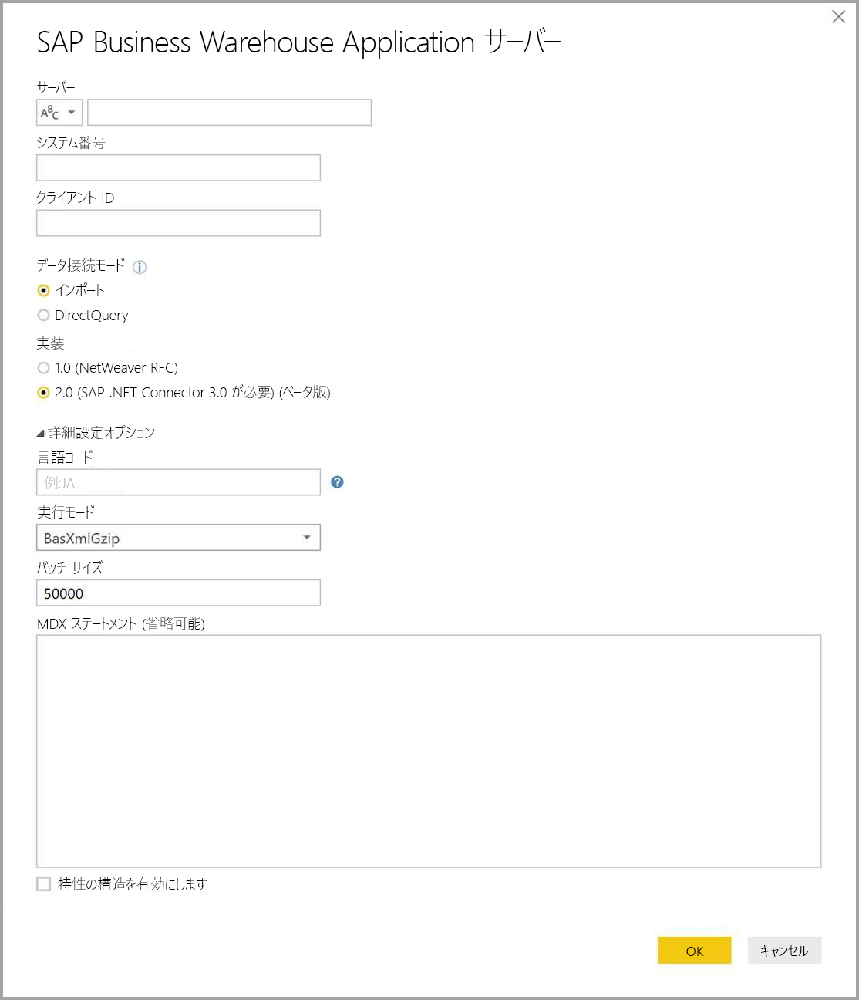
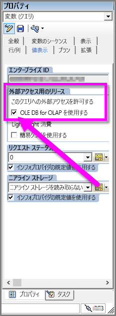

# Power BI Desktop で SAP BW Connector を使用する
Power BI Desktop で、**SAP BusinessWarehouse (BW)** のデータにアクセスできます。

SAP のお客様が既存の SAP Business Warehouse (BW) システムに Power BI を接続することで得られる利点については、[Power BI と SAP BW に関するホワイトペーパー](https://aka.ms/powerbiandsapbw)をご覧ください。 DirectQuery と SAP BW を使用する方法については、「[DirectQuery と SAP Business Warehouse (BW)](desktop-directquery-sap-bw.md)」という記事をご覧ください。

2018 年 6 月リリース以降の (および 2018 年 10 月リリースで一般公開されている) **Power BI Desktop** では、パフォーマンスと機能が大幅に向上した実装で SAP BW Connector を使用することができます。 この更新バージョンの SAP BW Connector は Microsoft によって開発され、**Implementation 2.0** と呼ばれています。 **SAP BW Connector** のバージョン 1 (v1) または **Implementation 2.0 SAP Connector** のどちらかを選ぶことができます。 以下のセクションでは、各バージョンのインストールについて順番に説明します。 Power BI Desktop から SAP BW に接続するときは、どちらか一方または両方のコネクタを選ぶことができます。

可能な場合は常に、**Implementation 2.0 SAP Connector** を使うことをお勧めします。

## SAP BW Connector バージョン 1 のインストール
可能な限り、Implementation 2.0 SAP Connector　を使うことをお勧めします (次のセクションの手順をご覧ください)。 このセクションでは **SAP BW Connector** のバージョン 1 のインストールについて説明します。次の手順に従ってインストールできます。

1. ローカル コンピューターに **SAP NetWeaver** ライブラリをインストールします。 **SAP NetWeaver** ライブラリは、SAP の管理者から入手するか、[SAP Software Download Center](https://support.sap.com/swdc) から直接入手してください。 **SAP Software Download Center** は構成が頻繁に変更されるので、サイトのナビゲーションに関する具体的なガイダンスはありません。 通常、**SAP NetWeaver** ライブラリは、SAP クライアント ツールのインストールにも含まれます。
   
   最新バージョンをダウンロードできる可能性がある場所は、*SAP Note #1025361* に記載されています。 **SAP NetWeaver** ライブラリのアーキテクチャ (32 ビットまたは 64 ビット) がインストールされている **Power BI Desktop** と一致することを確認した後、SAP Note に従って **SAP NetWeaver RFC SDK** に含まれるすべてのファイルをインストールします。
2. **[データの取得]** ダイアログの **[データベース]** カテゴリに **[SAP Business Warehouse Application サーバー]** と **[SAP Business Warehouse メッセージ サーバー]** のエントリが含まれるようになります。
   
   ![SAP の [データの取得] オプション](media/desktop-sap-bw-connector/sap_bw_2a.png)

## Implementation 2.0 SAP Connector のインストール

SAP Connector の **Implementation 2.0** には、SAP .NET Connector 3.0 が必要です。 次のリンクを使って SAP の Web サイトから [SAP .NET Connector 3.0 をダウンロード](https://support.sap.com/en/product/connectors/msnet.html)できます。

* [SAP .NET Connector 3.0](https://support.sap.com/en/product/connectors/msnet.html)

ダウンロードへのアクセスには、有効な S-user が必要です。 SAP Basis チームに連絡して SAP .NET Connector 3.0 を入手することをお勧めします。 

コネクタには 32 ビット バージョンと 64 ビット バージョンがあり、お使いの Power BI Desktop のインストールと一致するバージョンを選ぶ "*必要があります*"。 この記事を書いている時点で、Web サイトには次の 2 つのバージョンが掲載されています (.NET 4.0 Framework 用)。

* SAP Connector for Microsoft .NET 3.0.20.0 for Windows 32-bit (x86) as zip file (6.896 KB), January 16, 2018
* SAP Connector for Microsoft .NET 3.0.20.0 for Windows 64-bit (x64) as zip file (7.180 KB), January 16, 2018

インストールするときは、 **[Optional setup steps]\(オプション セットアップ手順\)** ウィンドウで、次の図のように *[Install assemblies to GAC]\(アセンブリを GAC にインストール\)* オプションを選択します。

> [!NOTE]
> SAP BW 実装の最初のバージョンでは Netweaver DLL が必要でした。SAP Connector の Implementation 2.0 を使用しており、最初のバージョンを使用していない場合、Netweaver DLL は必要ありません。

## SAP BW Connector 機能のバージョン 1
Power BI Desktop でバージョン 1 の **SAP BW Connector** を使うと、**SAP Business Warehouse Server** キューブからデータをインポートすること、または DirectQuery を使うことができます。 

**SAP BW コネクタ**の詳細および DirectQuery でそれを使う方法については、「[DirectQuery と SAP Business Warehouse (BW)](desktop-directquery-sap-bw.md)」をご覧ください。

接続するときは、 *[サーバー]* 、 *[システム番号]* 、 *[クライアント ID]* を指定して接続を確立する必要があります。

また、 **[詳細設定オプション]** として、言語コードと、指定したサーバーに対して実行するカスタム MDX ステートメントの 2 つを指定できます。

MDX ステートメントを指定しなかった場合、 **[ナビゲーター]** ウィンドウが表示されます。このウィンドウには、サーバーで利用可能なキューブのリストのほか、項目をドリルダウンし、利用可能なキューブからディメンションやメジャーなどの項目を選択するオプションが表示されます。 Power BI は、[BW Open Analysis Interface OLAP BAPI](https://help.sap.com/saphelp_nw70/helpdata/en/d9/ed8c3c59021315e10000000a114084/content.htm) によって公開されているクエリとキューブを公開しています。

サーバーから 1 つ以上の項目を選択すると、選択項目に基づいた出力テーブルのプレビューが作成されます。

**[ナビゲーター]** ウィンドウではいくつかの **[表示オプション]** を選ぶことができ、以下のことが可能です。

* ***[選択された項目のみ]* または *[All Items]\(すべての項目\)* (既定のビュー) を表示:** このオプションは、選択した項目の最終セットを確認するのに役立ちます。 *[プレビュー]* エリアの*列名*を選択しても、同様の確認ができます。
* **[Enable Data Previews]\(データ プレビューの有効化\) (既定の動作):** このダイアログ内でデータ プレビューを表示するかどうかを選択できます。 データ プレビューを無効にすると、プレビューのためのデータが必要なくなるため、サーバー呼び出しの量が減ります。
* **[技術名]:** SAP BW はキューブ内のオブジェクトの*技術名*の概念をサポートしています。 技術名を使うと、キューブの所有者がキューブ内のオブジェクトの*物理名*だけでなく、*ユーザー フレンドリ*名も公開できます。

![[ナビゲーター] ウィンドウ](media/desktop-sap-bw-connector/sap_bw_6.png)

**[ナビゲーター]** で必要なオブジェクトをすべて選択したら、 **[ナビゲーター]** ウィンドウの下部にある次のボタンのいずれかを選択して次の処理を決定することができます。

* **[読み込む]** を選択すると、出力テーブル作成のため、Power BI Desktop のデータ モデルへすべての行のセットの読み込みを開始します。その後は **[レポート]** ビューへ移ってデータを視覚化したり、 **[データ]** ビューまたは **[リレーションシップ]** ビューを使用してさらに修正を加えたりできます。
* **[編集]** を選択すると **[クエリ エディター]** が開き、Power BI Desktop のデータ モデルにすべての行のセットを読み込む前に、追加でデータの変換とフィルタリングを実行できます。

Power BI Desktop では **SAP BW** のキューブから情報をインポートするだけでなく、他のさまざまなデータ ソースからもデータをインポートし、1 つのレポートにまとめることができます。 これにより、**SAP BW** のデータに加えて、レポートや分析の際のさまざまな興味深いシナリオが得られます。

## Implementation 2.0 SAP BW Connector の使用

SAP BW Connector の Implementation 2.0 を使うには、新しい接続を作成する必要があります。 新しい接続を作成するには、次の手順のようにします。

1. **[データを取得]** ウィンドウで、 **[SAP Business Warehouse Application サーバー]** または **[SAP Business Warehouse メッセージ サーバー]** を選びます。

2. 新しい接続ダイアログが表示され、実装を選択できます。 **[Implementation 2.0]** を選ぶと、次の図に示すように、[実行モード]、[バッチ サイズ]、[特性の構造を有効にします] の各オプションが有効になります。

    

3. **[OK]** を選ぶと、以降の **[ナビゲーター]** エクスペリエンスは、前のセクションで説明したバージョン 1 の SAP BW Connector と同じです。 

### Implementation 2.0 の新しいオプション 

Implementation 2.0 は以下のオプションをサポートします。

1. **ExecutionMode** - サーバーでクエリを実行するために使われる MDX インターフェイスを指定します。 有効なオプションは次のとおりです。

        a. SapBusinessWarehouseExecutionMode.BasXml
        b. SapBusinessWarehouseExecutionMode.BasXmlGzip
        c. SapBusinessWarehouseExecutionMode.DataStream

    このオプションの既定値は、SapBusinessWarehouseExecutionMode.BasXmlGzip です。

    大きいデータセットで長い待ち時間が発生するときは、*SapBusinessWarehouseExecutionMode.BasXmlGzip* を使うとパフォーマンスが向上することがあります。

2. **BatchSize** - MDX ステートメントを実行するときに一度に取得する最大行数を指定します。 行数を少なくすると、大きいデータセットを取得するときに、サーバーの呼び出し回数が増えます。 行数を多くするとパフォーマンスが向上する可能性がありますが、SAP BW サーバーでメモリの問題が発生する場合があります。 既定値は 50,000 行です。

3. **EnableStructures** - 特性の構造を認識するかどうかを示す論理値です。 このオプションの既定値は false です。 選択できるオブジェクトの一覧に反映されます。 ネイティブ クエリ モードではサポートされていません。

**ScaleMeasures** オプションは、この実装では廃止されました。 動作は設定 *ScaleMeasures = false* と同じであり、スケーリングされていない値を常に表示します。

### Implementation 2.0 でのその他の機能強化 

次の箇条書きに、新しい実装でその他に強化された機能の一部を示します。

* パフォーマンスの向上
* 数百万データ行を取得し、バッチ サイズ パラメーターによって微調整する機能。
* 実行モードを切り替える機能。
* 圧縮モードのサポート。 待ち時間の長い接続または大規模なデータセットに特に有効です。
* Date 変数の検出の向上
* [実験] Date (ABAP 型 DATS) および Time (ABAP 型 TIMS) ディメンションの、テキスト値ではなく、それぞれ日付および時刻としての公開。
* 例外処理の向上。 BAPI の呼び出しで発生したエラーが表示されるようになりました。
* BasXml および BasXmlGzip モードでの列の折りたたみ。 たとえば、生成された MDX クエリは 40 列を取得するのに対し、現在の選択で必要なのは 10 列だけの場合、この要求がサーバーに渡されて、取得されるデータセットが小さくなります。

### Implementation 2.0 を使用するための既存レポートの変更 

既存のレポートで **Implementation 2.0** を使うように変更することは、インポート モードでのみ可能であり、次の手動手順が必要です。

1. 既存のレポートを開き、リボンの **[クエリを編集]** を選んで、更新する SAP Business Warehouse クエリを選びます。

2. クエリを右クリックし、 **[詳細エディター]** を選びます。

3. **[詳細エディター]** で、SapBusinessWarehouse.Cubes の呼び出しを次のように変更します。 

    a. 次の例に示すようなオプション レコードがクエリに既に含まれるかどうかを確認します。

    

    b. 含まれる場合は、Implementation 2.0 のオプションを追加し、次のように ScaleMeasures オプションが存在する場合は削除します。

    

    c. クエリにオプション レコードがまだ含まれていない場合は、単に追加します。 たとえば、次のようなクエリがあるとします。

    

    d. 単に次のように変更します。

    

4. SAP BW Connector の Implementation 2.0 とバージョン 1 の SAP BW Connector の間に互換性があるようにするためのすべての作業が行われています。 ただし、使われている SAP BW MDX 実行モードの違いによる相違が存在する可能性があります。 何らかの不一致を解決するには、実行モードを切り替えてみてください。

## トラブルシューティング
このセクションでは、**SAP BW** Connector に関するトラブルシューティング状況 (および解決策) を説明します。

1. **SAP BW** からの数値データで、桁区切りがコンマではなくピリオドになります。 たとえば、1,000,000 が 1.000.000 として返されます。
   
   **SAP BW** が返す 10 進数の小数点記号には、" *,* " (コンマ) または " *.* " (ピリオド) が使われます。 **SAP BW** が小数点記号にどちらを使うかを指定するため、**Power BI Desktop** によって使われるドライバーは *BAPI_USER_GET_DETAIL* を呼び出します。 この呼び出しから返される **DEFAULTS** という名前の構造体には、"*10 進形式表記法*" が格納されている *DCPFM* という名前のフィールドがあります。 次の 3 つの値のいずれかになります。
   
       ‘ ‘ (space) = Decimal point is comma: N.NNN,NN
       'X' = Decimal point is period: N,NNN.NN
       'Y' = Decimal point is N NNN NNN,NN
   
   正しくないデータで *BAPI_USER_GET_DETAIL* を呼び出すと次のようなメッセージでエラーになる (正しくないデータが表示される) 問題がお客様から報告されています。
   
       You are not authorized to display users in group TI:
           <item>
               <TYPE>E</TYPE>
               <ID>01</ID>
               <NUMBER>512</NUMBER>
               <MESSAGE>You are not authorized to display users in group TI</MESSAGE>
               <LOG_NO/>
               <LOG_MSG_NO>000000</LOG_MSG_NO>
               <MESSAGE_V1>TI</MESSAGE_V1>
               <MESSAGE_V2/>
               <MESSAGE_V3/>
               <MESSAGE_V4/>
               <PARAMETER/>
               <ROW>0</ROW>
               <FIELD>BNAME</FIELD>
               <SYSTEM>CLNTPW1400</SYSTEM>
           </item>
   
   このエラーを解決するには、Power BI で使われている SAPBW ユーザーに *BAPI_USER_GET_DETAIL* の実行権限を付与するよう、SAP 管理者に依頼する必要があります。 また、このトラブルシューティング ソリューションで前述したように、ユーザーが必要な *DCPFM* 値を持つことを確認することもお勧めします。
   
2. **SAP BEx クエリ用の接続**
   
   Power BI Desktop で **BEx** クエリを実行するには、次の図に示すように特定のプロパティを有効にします。
   
   
   
3. **[ナビゲーター]** ウィンドウにデータ プレビューが表示されず、代わりに "*オブジェクト参照がオブジェクトのインスタンスに設定されていない*" というエラー メッセージが表示されます。
   
   SAP ユーザーは、メタデータを取得し、SAP BW の InfoProviders からデータを取得するために、特定の BAPI 関数モジュールにアクセスする必要があります。 次のようなものが含まれます。
   * BAPI_MDPROVIDER_GET_CATALOGS
   * BAPI_MDPROVIDER_GET_CUBES
   * BAPI_MDPROVIDER_GET_DIMENSIONS
   * BAPI_MDPROVIDER_GET_HIERARCHYS
   * BAPI_MDPROVIDER_GET_LEVELS
   * BAPI_MDPROVIDER_GET_MEASURES
   * BAPI_MDPROVIDER_GET_MEMBERS
   * BAPI_MDPROVIDER_GET_VARIABLES
   * BAPI_IOBJ_GETDETAIL

   この問題を解決するために、ユーザーが *BAPI_IOBJ_GETDETAIL* に加えてさまざまな *MDPROVIDER* モジュールにアクセスできることを確認します。 これと同じまたは類似した問題をさらにトラブルシューティングするためには、Power BI Desktop の "*オプション*" 内で "*診断*" ウィンドウの "*トレースを有効にする*" を選択します。 トレースがアクティブになっている間に SAP BW からデータを取得し、詳細についてトレース ファイルを調べてみます。

## SAP BW 接続のサポート

次の表では、SAP BW の現在のサポートについて説明します。

|Product  |モード  |認証  |コネクタ  |SNC ライブラリ  |サポートされている  |
|---------|---------|---------|---------|---------|---------|
|Power BI Desktop     |任意         | ユーザー/パスワード  | アプリケーション サーバー | 該当なし  | はい  |
|Power BI Desktop     |任意         | Windows          | アプリケーション サーバー | sapcrypto + gsskrb5/gx64krb5  | はい  |
|Power BI Desktop     |任意         | 借用による Windows | アプリケーション サーバー | sapcrypto + gsskrb5/gx64krb5  | はい  |
|Power BI Desktop     |任意         | ユーザー/パスワード        | メッセージ サーバー | 該当なし  | はい  |
|Power BI Desktop     |任意         | Windows        | メッセージ サーバー | sapcrypto + gsskrb5/gx64krb5  | はい  |
|Power BI Desktop     |任意         | 借用による Windows | メッセージ サーバー | sapcrypto + gsskrb5/gx64krb5  | はい  |
|Power BI Gateway     |インポート      | Power BI Desktop と同じ |         |   |   |
|Power BI Gateway     |DirectQuery | ユーザー/パスワード        | アプリケーション サーバー | 該当なし  | はい  |
|Power BI Gateway     |DirectQuery | 借用による Windows (固定ユーザー、SSO なし) | アプリケーション サーバー | sapcrypto + gsskrb5/gx64krb5  | はい  |
|Power BI Gateway     |DirectQuery | DirectQuery クエリ オプションには Kerberos 経由で SSO を使用する | アプリケーション サーバー | sapcrypto + gsskrb5/gx64krb5   | はい  |
|Power BI Gateway     |DirectQuery | ユーザー/パスワード        | メッセージ サーバー | 該当なし  | はい  |
|Power BI Gateway     |DirectQuery | 借用による Windows (固定ユーザー、SSO なし) | メッセージ サーバー | sapcrypto + gsskrb5/gx64krb5  | はい  |
|Power BI Gateway     |DirectQuery | DirectQuery クエリ オプションには Kerberos 経由で SSO を使用する | メッセージ サーバー | gsskrb5/gx64krb5  | いいえ  |
|Power BI Gateway     |DirectQuery | DirectQuery クエリ オプションには Kerberos 経由で SSO を使用する | メッセージ サーバー | sapcrypto  | はい  |

## 次の手順
SAP と DirectQuery については、次のリソースをご覧ください。

* [DirectQuery と SAP HANA](desktop-directquery-sap-hana.md)
* [DirectQuery と SAP Business Warehouse (BW)](desktop-directquery-sap-bw.md)
* [Power BI の DirectQuery](desktop-directquery-about.md)
* [DirectQuery でサポートされるデータ ソース](desktop-directquery-data-sources.md)
* [Power BI と SAP BW に関するホワイト ペーパー](https://aka.ms/powerbiandsapbw)
