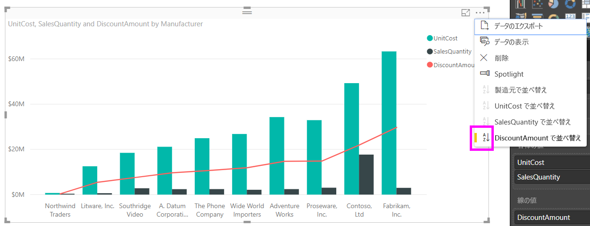
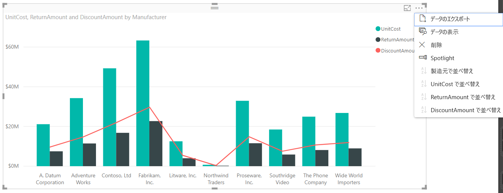

# Power BI Desktop での列による並べ替え
**Power BI Desktop** と **Power BI サービス**では、さまざまなデータ フィールドを並べ替えることで視覚効果を変更できます。 並べ替えで視覚化を変更することで、伝えたい情報を強調でき、その傾向 (あるいは強調したい点) を視覚化に反映させることができます。

数値データ (売り上げ高など) を使用している場合でも、テキスト データ (州名など) を使用している場合でも、必要に合わせて視覚エフェクトを並べ替え、目的に応じたスタイルで表示できます。  **Power BI** は柔軟な並べ替え機能とクイック メニューを備えています。 視覚効果画面で省略記号 (...) を選択し、並べ替えるフィールドを選択します。下の画像をご覧ください。

![[その他のオプション] メニュー](media/desktop-sort-by-column/sortbycolumn_2.png)

## 詳細と例
もっと詳しい例を見て、**Power BI Desktop** のしくみを確認しましょう。

次の視覚エフェクトでは、製造元の名前別に費用、数量、金額が示されています。 並べ替えを行う前は、ここに表示されているとおりの視覚エフェクトです。

この図では、**SalesQuantity** が並べ替えの基準になっています。昇順になっている縦棒の色と凡例を照合すると、そのことがわかります。しかし、並べ替えの基準になっている列を判断するにはもっと良い方法があります。図の右上隅にある省略記号のメニュー (...) を使用することです。 省略記号を選ぶと、次のように表示されます。

![[その他のオプション] メニュー](media/desktop-sort-by-column/sortbycolumn_2.png)

* 現在の並べ替えフィールドは **SalesQuantity** です。**SalesQuantity で並べ替え**が太字で、黄色の棒が付いていることからわかります。 

* 現在の並べ替えの方向は、最小値から最大値の順です。**A が Z より上になっている**ことと下向きの矢印でそれがわかります。

並べ替えフィールドと方向については、次の 2 つのセクションで別々に確認します。

## 並べ替えに使用する列を選ぶ
**[その他のオプション]** メニューの **SalesQuantity で並べ替え**の横に黄色の棒がありました。これは、視覚化が **SalesQuantity** 列を基準に並べ替えられていることを示します。 別の列を基準にして並べ替えるのは簡単です。省略記号 (...) を選んでメニューを表示させ、別の列を選ぶだけです。

次の図では、並べ替える条件列として *DiscountAmount* を選択しました。 図ではその列は、棒の 1 つで表示されるのではなく、線の 1 つで表示されています。 **[DiscountAmount で並べ替え]** を選択すると、このような表示になります。

図がどのように変更されたかに注目してください。 これで、このビジュアルでは、DiscountAmount 値が最も高い Fabrikam Inc. から最も低い Northwind Traders へと並べ替えられました。 

降順ではなく、昇順に並べ替える必要がある場合は、どうしたらよいでしょうか。 次のセクションで、それを簡単に行う方法をご紹介します。

## 最小値から最大値へ、最大値から最小値へ、並べ替え順序を選ぶ
上の図の **[オプション]** メニューをよく見ると、**[DiscountAmount で並べ替え]** の隣のアイコンで **Z が A よりも上になっている**ことがわかります。 どうぞ、ご覧ください。

**Z/A** と表示されている場合、その図では選ばれた列を最大値から最小値の順序で並べたという意味です。 変更する必要がありますか。 簡単です。**[Z/A]** アイコンをタップまたはクリックするだけで、並べ替え順序は **A/Z** に変更されます。図 (選ばれた列に基づく図) は最小値から最大値に向かう順序に並び替えられます。

以下に示すのは上と同じ図ですが、**[DiscountAmount で並べ替え]** メニューの **[Z/A]** アイコンをタップした後のものであり、順序が変更されています。 今度は製造元として Northwind Traders が最初に、Fabrikam Inc. が最後に表示されてます。前の図とは逆の順序です。

図に含まれる任意の列を基準にして並べ替えることができます。たとえば、並べ替えの基準列として SalesQuantity を選択できます。**SalesQuantity で並べ替え**を選択するだけで、売り上げが最も大きい製造元が最初に表示されます。図のその他の列は、それがどのようにその製造元に適用されるとしても、そのまま保持されます。 これは、それらの設定で表示された図です。

## [列で並べ替え] ボタンを使用して並び替える
データの並べ替えには別の方法があります。それは **[モデリング]** リボンの **[列で並べ替え]** ボタンを使用するというものです。

![[列で並べ替え] ボタン](media/desktop-sort-by-column/sortbycolumn_8.png)

この並べ替えのアプローチでは、**[フィールド]** ウィンドウで列を選択し、さらに **[列で並べ替え]** ボタンを選択してビジュアルの並べ替え方法 (列に基づく) をクリックする必要があります。 **[列で並べ替え]** ボタンをアクティブにするために、**[フィールド]** ウィンドウで、並び替える列 (フィールド) を選択する必要があります。そうしないと、このボタンは非アクティブのままです。

一般的な例を見てみましょう。年の各月のデータがあり、このデータを時系列に基づいて並べ替えるとします。 その手順を次に示します。

1. まず、ビジュアルは選択されているが、**[フィールド]** ウィンドウで列が選択されていない場合、**[列で並べ替え]** ボタンが非アクティブ (灰色表示) になっていることに注目してください。
   
   ![[列で並べ替え] ボタンが無効](media/desktop-sort-by-column/sortbycolumn_9.png)

2. **[フィールド]** ウィンドウで、並べ替える列を選択すると、**[列で並べ替え]** ボタンがアクティブになります。
   
   ![[列で並べ替え] ボタンが有効](media/desktop-sort-by-column/sortbycolumn_10.png)
3. 次に、ビジュアルが選択された状態で、既定値 (*MonthName*) の代わりに *MonthOfYear* を選択します。これにより、ビジュアルは目的の順序 (月順) に並べ替えられます。
   
   ![[列で並べ替え] メニュー](media/desktop-sort-by-column/sortbycolumn_11.png)

これで完了です。 **[列で並べ替え]** ボタンをアクティブにするために、**[フィールド]** ウィンドウで列を選択する必要があることに注意してください。

## 並べ替えを既定の列に戻す
任意の列を基準にして並べ替えることができますが、既定の並べ替えの基準の列に戻して、図を表示したい場合もあります。 問題はありません。 並べ替えの基準となる列を選んだ視覚化 (既に学習したように、省略記号 (...) メニューで、並べ替えの基準として選ばれた列には黄色の棒が付いています)、**[その他のオプション]** メニューを開いて、その列をもう一度選ぶだけで、視覚エフェクトが既定の並べ替え列に戻ります。

たとえば、前のグラフを次に示します。

メニューに戻り、**SalesQuantity** をもう一度選択すると、次の画像のように、アルファベット順の **[製造元]** で並べられた既定の図になります。

これほどたくさんの図の並べ替えのオプションがあるため、望みどおりのグラフやイメージを簡単に作成できます。

