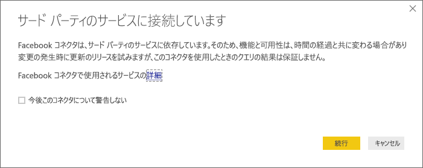
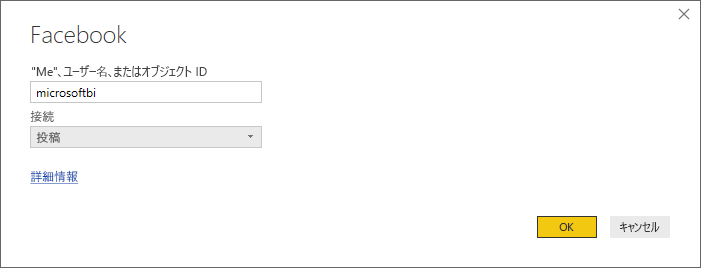
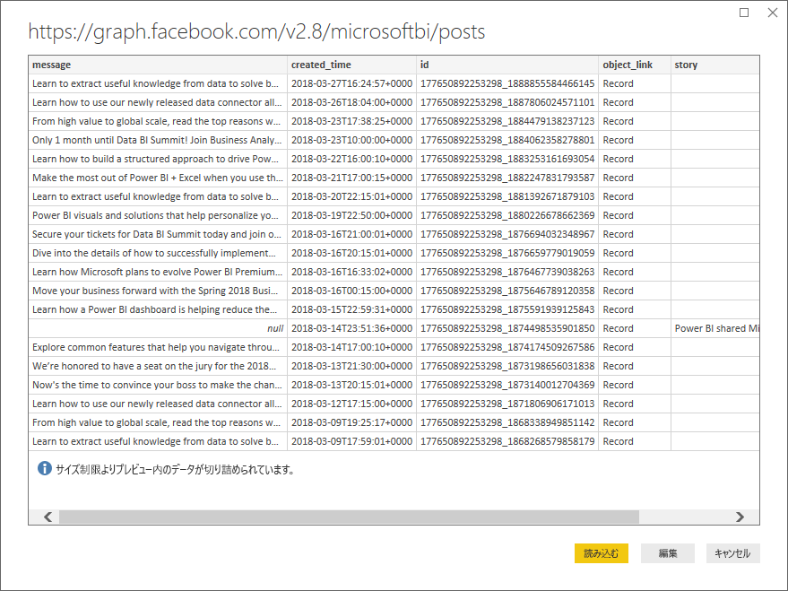
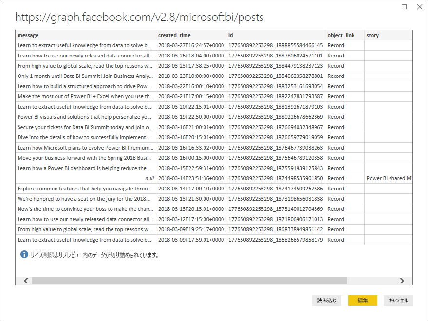
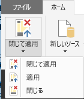
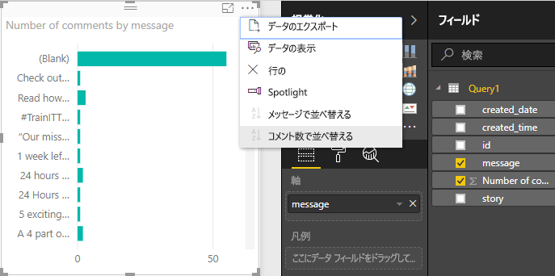
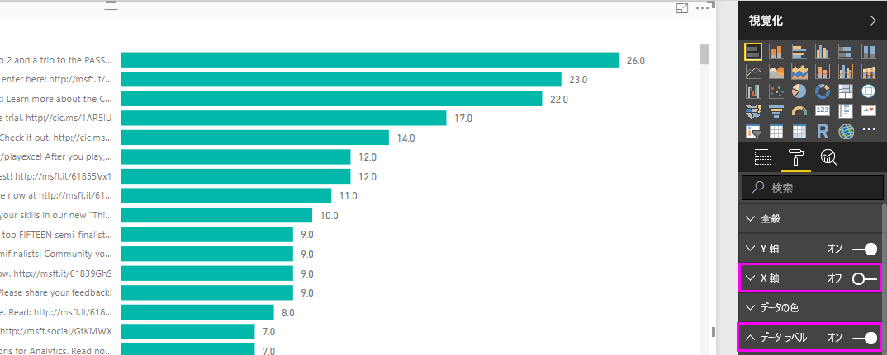
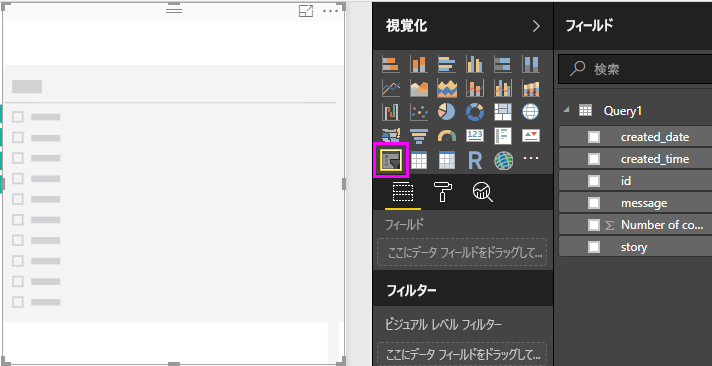
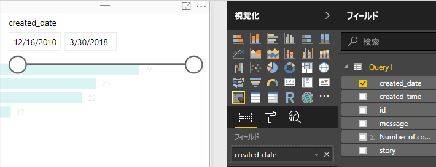

# チュートリアル:Power BI Desktop を使用した Facebook の分析

このチュートリアルでは、Facebook からデータをインポートして Power BI Desktop で使用する方法を学習します。 ここでは、Power BI Facebook ページに接続してデータをインポートし、インポートしたデータに変換を適用し、レポートの視覚化でデータを使用します。

> [!WARNING]
> Facebook アプリのアクセス許可の制限により、この記事で説明されているコネクタ機能は現在は正常に機能していません。 Facebook 社と協力して、できるだけ早くこの機能を元に戻します。

## Facebook ページに接続する

このチュートリアルでは、[Microsoft Power BI の Facebook ページ](https://www.facebook.com/microsoftbi) ( *https://www.facebook.com/microsoftbi* ) のデータを使用します。 このページのデータに接続し、インポートするには、個人の Facebook アカウント以外に特別な資格情報は必要ありません。

1. Power BI Desktop を開き、 **[作業の開始]** ダイアログまたは **[ホーム]** リボン タブで **[データの取得]** を選択し、 **[データの取得]** を選択し、 **[すべて表示]** を選択します。
   
2. **[データの取得]** ダイアログで、 **[Online Services]** グループから **[Facebook]** を選択し、 **[接続]** を選択します。
   
   
   
   サードパーティ サービスを使用する場合のリスクを警告するダイアログが表示されます。
   
   
   
3. **[続行]** を選択します。 **[Facebook]** ダイアログ ボックスが表示されます。
   
4. ページ名 (**microsoftbi**) を **[ユーザー名]** テキスト ボックスに入力するか貼り付け、 **[接続]** ドロップダウンから **[投稿]** を選択し、 **[OK]** を選択します。
   
   
   
5. 資格情報を求めるメッセージが表示されたら、自分の Facebook アカウントにサインインし、自分のアカウントを使って Power BI アクセスを可能にします。
   
   

   Power BI の Facebook ページに接続すると、ページの **[投稿]** データのプレビューが表示されます。 
   
   
   
## インポートしたデータの整形と変換

たとえば、最もコメントが多い投稿を時系列で確認したいとします。 **[投稿]** データのプレビューでは、**created_time** データが読みづらく、わかりづらく、コメント データもまったくありません。 データを最大限に活用するために、データの整形と整理を実行する必要があります。 Power BI Desktop にインポートする前または後に、Power BI Desktop の **Power Query エディター**を使用してデータを編集できます。 

### 日付と時刻の列を分割する

まず、**created_time** 列の日付と時刻の値を分かりやすくするために分割します。 

1. Facebook データのプレビューで、 **[編集]** を選択します。 
   
   
   
   Power BI Desktop の **Power Query エディター**が新しいウィンドウで開き、Power BI の Facebook ページのデータ プレビューが表示されます。 
   
   
   
2. **created_time** 列を選択します。 現在、これはテキスト データ型です (列ヘッダーに **ABC** アイコンが表示されます)。 列ヘッダーを右クリックし、ドロップダウンで **[列の分割] > [区切り記号による分割]** を選択するか、リボンの [ホーム] タブの **[変換]** にある **[列の分割] > [区切り記号による分割]** を選択します。  
   
   
   
3. **[区切り記号による列の分割]** ダイアログで、ドロップダウンから **[カスタム]** を選択し、入力フィールドに「**T**」(created_time 値の時刻部分の先頭文字) と入力し、 **[OK]** を選択します。 
   
   ![[区切り記号による列の分割] ダイアログ](media/desktop-tutorial-facebook-analytics/delimiter2.png)
   
   列は、区切り記号 **T** の前後にある文字列を含む 2 つの列に分割され、**created_time.1** および **created_time.2** という名前が付けられます。 Power BI では、データ型が自動的に検出され、最初の列のデータ型が **Date** に、2 列目が **Time** に変更されるので、読みやすくなります。
   
4. 列名を変更するには、各列ヘッダーをダブルクリックするか、各列を選択して、リボンの **[変換]** タブの **[任意の列]** グループで **[名前の変更]** を選択し、新しい列ヘッダー名の「**created_date**」と「**created_time**」をそれぞれに入力します。
   
   
   
### 入れ子の列を展開する

日付と時刻のデータの準備が完了したら、入れ子になった列を展開してコメント データを公開します。 

1. **object_link** 列を選択し、 アイコンを選択して **[展開/集計]** ダイアログを開きます。 **接続**を選択し、 **[OK]** を選択します。 
   
   
   
   列ヘッダーが **object_link.connections** に変わります。
2. **object_link.connections** 列の上部にある  アイコンを選択し、**コメント**を選択し、 **[OK]** を選択します。 列ヘッダーが **object_link.connections.comments** に変わります。
   
3. **object_link.connections.comments**列の上部にある  アイコンを選択し、今回はダイアログ ボックスの [展開] ではなく **[集計]** を選択します。 **# Count of id** を選択し、 **[OK]** を選択します。 
   
   
   
   列に各メッセージのコメント数が表示されるようになりました。 
   
4. **Count of object_link.connections.comments.id** 列の名前を **Number of comments** に変更します。
   
5. **Number of comments** ヘッダーの横にある下矢印を選択し、 **[降順で並べ替え]** を選択して、コメント数が多い投稿から少ない投稿の順に表示します。 
   
   
   
### クエリ ステップを確認する

**Power Query エディター**でデータを整形して変換すると、Power Query エディター ウィンドウの右側にある **[クエリ設定]** ウィンドウの **[適用したステップ]** 領域に各ステップが記録されています。 [適用したステップ] をさかのぼり、行った変更を正確に確認し、必要に応じて編集、削除、または再配置を行うことができます (ただし、前のステップを変更すると後のステップが動作しなくなる可能性があるため、危険な可能性があります)。 

これまでのデータ変換を適用すると、[適用したステップ] は次のようになります。
   
   
   
   >[!TIP]
   >[適用したステップ] の基礎は、**M** 言語とも呼ばれる **Power Query 言語**で記述された数式です。 数式を表示および編集するには、リボンの [ホーム] タブの **[クエリ]** グループで **[詳細エディター]** を選択します。 

### 変換されたデータをインポートする

データの確認を完了したら、リボンの [ホーム] タブで **[閉じて適用]**  >  **[閉じて適用]** の順に選択し、Power BI Desktop にインポートします。 
   
   
   
   ダイアログに、Power BI Desktop データ モデルへのデータ読み込みの進行状況が示されます。 
   
   
   
   データの読み込みが完了すると、レポート ビューに [フィールド] リストの新しいクエリとして表示されます。
   
   
   
## レポートの視覚化でデータを使用する 

Facebook ページからデータをインポートしたら、視覚化を使用してデータに関する考察を迅速かつ簡単に得ることができます。 視覚化の作成は簡単です。フィールドを選択するか、 **[フィールド]** リストからレポート キャンバスにドラッグするだけです。

### 横棒グラフを作成する

1. Power BI Desktop のレポート ビューで、フィールド リストから**メッセージ**を選択するか、キャンバスにドラッグします。 すべての投稿メッセージを示すテーブルがキャンバスに表示されます。 
   
   
   
2. そのテーブルを選択した状態で、[フィールド] リストから **Number of comments** を選択するか、テーブルにドラッグします。 
   
3. [視覚化] ウィンドウで**積み上げ横棒グラフ** アイコンを選択します。 テーブルは、投稿ごとのコメント数を示す横棒グラフに変わります。 
   
   
   
4. 視覚化の右上にある **[その他のオプション]** (...) を選択し、**Sort by Number of comments** を選択して、コメント数の降順でテーブルを並べ替えます。 
   
   
   
5. ほとんどのコメントは、**空白**のメッセージに関連付けられています (これらの投稿はストーリー、リンク、ビデオ、またはその他の非テキスト コンテンツだった可能性があります)。 空白行をフィルターで除外するには、[視覚化] ウィンドウの下部にある **[フィルター]** で**メッセージ (すべて)** を選択し、 **[すべて選択]** を選択し、 **[空白]** を選択して選択を解除します。 [フィルター] のエントリは **[message is not (Blank)]\(メッセージは (空白) ではありません\)** に変わり、グラフの視覚化の空白行が表示されなくなります。 
   
   
   
### グラフの書式を設定する

視覚化はさらに興味深くなっていますが、グラフの投稿テキストの多くは表示できません。 投稿テキストの詳細を表示するには:

1. グラフの視覚化のハンドルを使用して、可能な限り大きくなるようにグラフのサイズを変更します。 
   
2. グラフを選択した状態で、[視覚化] ウィンドウで**書式設定アイコン** (ペイント ローラー) を選択します。
   
3. **Y 軸**の横にある下矢印を選択し、 **[最大サイズ]** の横にあるスライダーを右端 (50%) までドラッグします。 
4. さらにテキストに合わせて **[テキスト サイズ]** を **10** に減らします。
   
   
   
   グラフには、より多くの投稿コンテンツが表示されるようになりました。 
   
   
   
グラフの X 軸 (コメント数) には正確な値が表示されず、グラフの下部が表示されていません。 代わりにデータ ラベルを使用することにします。 

1. 書式設定アイコンを選択し、 **[X 軸]** の横にあるスライダーを選択して **[オフ]** に切り替えます。 
   
2. **[データ ラベル]** の横にあるスライダーを選択して **[オン]** に切り替えます。 これで、各投稿の正確なコメント数がグラフに表示されます。
   
   
   
### データ型を編集する

改善されましたが、すべてのデータ ラベルに小数点以下の **.0** が付いています。**Number of posts** は必ず整数なので、これは邪魔で誤解を招きます。 **Number of posts** 列のデータ型を整数に変更する必要があります。

1. データ型を編集するには、[フィールド] リストで **[Query1]** を右クリックするか、マウス カーソルを移動して、 **[その他のオプション]** (...) を選択してから **[クエリの編集]** を選択します。 リボンの [ホーム] タブの **[外部データ]** 領域から **[クエリの編集]** を選択し、ドロップダウンから **[クエリの編集]** を選択することもできます。 Power BI Desktop の **Power Query エディター**が別のウィンドウに開きます。
   
   ![[フィールド] リストからクエリを編集する](media/desktop-tutorial-facebook-analytics/editquery1.png)     ![リボンの [フィールドの編集]](media/desktop-tutorial-facebook-analytics/t_fb_editquery.png)
   
2. Power Query エディターで **Number of comments** 列を選択し、次のいずれかの方法でデータ型を **[整数]** に変更します。 
   - **Number of comments** 列ヘッダーの横にある **1.2** アイコンを選択し、ドロップダウンから **[整数]** を選択します
   - 列ヘッダーを右クリックして **[型の変更] > [整数]** の順に選択します
   - **[データの種類:10 進数]** を [ホーム] タブの **[変換]** グループまたは **[変換]** タブの **[任意の列]** グループで選択し、 **[整数]** を選択します。
   
   列ヘッダーのアイコンは整数のデータ型であることを示す **123** に変わります。
   
   
   
3. **[閉じて適用]** を選択するか、Power Query エディター ウィンドウを開いたままで **[適用]** を選択して変更を適用します。 変更が読み込まれると、グラフのデータ ラベルは整数になります。 
   
   
   
### 日付スライサーを作成する

投稿のコメント数を時系列で視覚化するとします。 この場合、スライサーの視覚化を作成して、グラフ データをさまざまな時間枠にフィルター処理することができます。 

1. キャンバスの空白領域をクリックし、[視覚化] ウィンドウで**スライサー アイコン**を選択します。 空白のスライサーの視覚化が表示されます。 
   
   
   
2. [フィールド] リストから **created_date** フィールドを選択するか、新しいスライサーにドラッグします。 スライサーは、フィールドの日付データ型に基づいて日付範囲スライダーに変更されます。
   
   
   
3. スライダー ハンドルを移動して異なる日付範囲を選択し、それに応じてグラフ データがどのようにフィルター処理されるかを確認します。 また、スライサーの日付フィールドを選択し、特定の日付を入力するか、カレンダーのポップアップから日付フィールドを選択することもできます。
    
   
   
### 視覚化の書式を設定する

グラフのタイトルをよりわかりやすく魅力的にすることにしました。 

1. グラフを選択した状態で、**書式設定**アイコンを選択し、ドロップダウン矢印を選択して **[タイトル]** を展開します。
2. **[タイトル テキスト]** を「**Comments per post**」に変更します。 
3. **[フォントの色]** の横にあるドロップダウン矢印を選択し、視覚化の緑色のバーと一致する緑色を選択します。
4. **[テキスト サイズ]** を「**10**」に増やし、 **[フォント ファミリ]** を **[Segoe (Bold)]** に変更します。

他の書式設定オプションや設定を試して、視覚化の外観を変更してみてください。 

## 視覚化をさらに作成する

お分かりいただけたように、レポートの視覚化は簡単にカスタマイズできるため、希望どおりにデータを表示することができます。 たとえば、インポートした Facebook データを使用してこの折れ線グラフを作成し、時系列でコメント数を表示してみましょう。

Power BI Desktop は、さまざまなデータ ソースからデータを取得して分析のニーズに合わせてデータの形を整えることから、このデータを機能豊富な対話型の方法で視覚化することまで、シームレスなエンド ツー エンドのエクスペリエンスを提供します。 レポートが完成したら、[Power BI サービスにアップロード](desktop-upload-desktop-files.md)し、それに基づいて、他の Power BI ユーザーと共有可能なダッシュボードを作成できます。

## 次の手順
* [他の Power BI Desktop のチュートリアルを読む](https://go.microsoft.com/fwlink/?LinkID=521937)
* [Power BI Desktop のビデオを見る](https://go.microsoft.com/fwlink/?LinkID=519322)
* [Power BI フォーラムにアクセスする](https://go.microsoft.com/fwlink/?LinkID=519326)
* [Power BI ブログを読む](https://go.microsoft.com/fwlink/?LinkID=519327)

