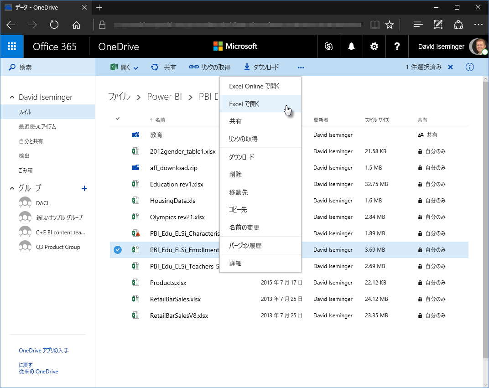
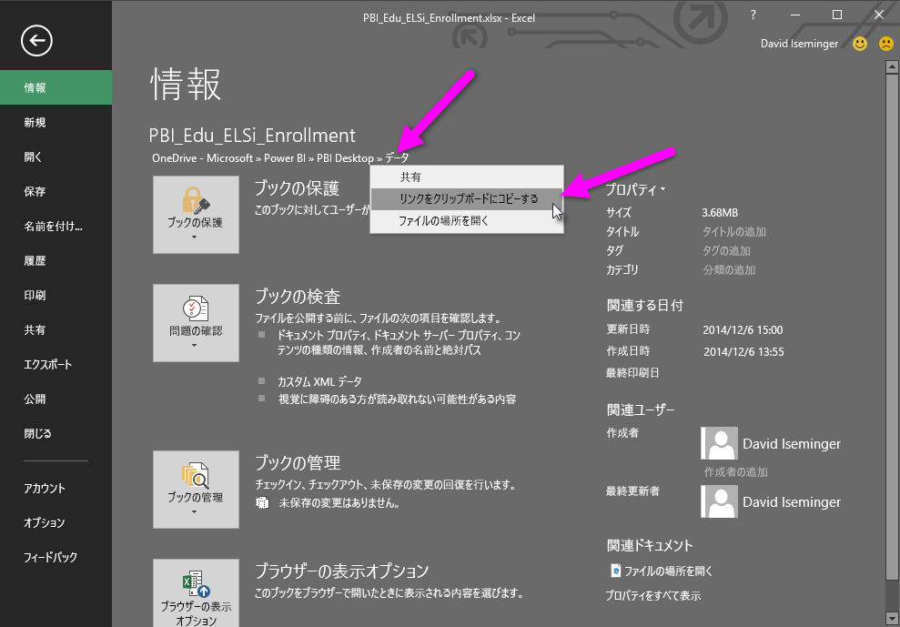

# Power BI Desktop で OneDrive for Business リンクを使用する
多くの人は、Power BI Desktop と相性の良い OneDrive for Business ドライブに Excel ブックを格納しています。 **Power BI Desktop** を使用すると、**OneDrive for Business** に格納されている **Excel** ファイルのオンライン リンクを使用して、レポートやビジュアルを作成できます。 **OneDrive for Business** のグループ アカウントか、個人の **OneDrive for Business** アカウントを使用できます。

**OneDrive for Business** からオンライン リンクを取得するには、いくつかの特定の手順が必要です。 次のセクションでは、それらの手順について説明します。グループ間、様々なコンピューター、同僚とファイル リンクを共有できるようになります。

## 最初にブラウザーから Excel からリンクを取得する
1. ブラウザーを使用して OneDrive for Business の場所に移動します。 使用するファイルを右クリックし、**[Excel で開く]** を選びます。
   
   > [!NOTE]
   > ブラウザーのインターフェイスは、次の画像のとおりではない場合もあります。 **OneDrive for Business** ブラウザー インターフェイスで、ファイルに対して **[Excel で開く]** を選ぶ方法はたくさんあります。 Excel でファイルを開くためのどのオプションでも使用することができます。
   > 
   > 
   
   
2. **Excel** で、**[ファイル] > [情報]** の順に選び、**[ブックの保護]** ボタンの上のリンクを選びます。 **[リンクをクリップボードにコピーする]** (使用しているバージョンによっては、**[パスをクリップボードにコピー]** の場合があります) を選択します。
   
   

## Power BI Desktop でリンクを使用する
直前にクリップボードにコピーしたリンクを Power BI Desktop で使用できます。 次の手順を実行します。

1. Power BI Desktop で、**[データを取得] > [Web]** の順に選びます。
   
   
2. リンクを **[Web から]** ダイアログに貼り付けます (まだ [OK] を選ば**ない**でください)。
   
    
3. リンクの末尾の *?web=1* 文字列をご確認ください。**Power BI Desktop** が正しくファイルに到達できるようにするには、**[OK]** を選ぶ**前**に、*Web URL 文字列のその部分を削除*します。
4. **Power BI Desktop** で資格情報の入力を求められた場合は、**[Windows]** (オンプレミスの SharePoint サイトの場合) または **[組織アカウント]** (Office 365 または OneDrive for Business のサイトの場合) のいずれかを選びます。
   
   

**[ナビゲーター]** ウィンドウが表示され、Excel ブックにあるテーブル、シート、範囲を一覧から選ぶことができます。 そこから、他のすべての Excel ファイルと同様に OneDrive for Business ファイルを使用して、レポートを作成し、他のデータ ソースでするのと同じようにデータセットで使用できます。

> [!NOTE]
> Power BI サービスのデータ ソースとして **OneDrive for Business** ファイルを使うには、そのファイルに対して **[Service Refresh]\(サービスの更新\)** を有効にし、更新の設定を構成するときに **[認証方法]** として **[OAuth2]** を選択します。 このようにしないと、接続または更新しようとしたときに、エラー ("*データ ソースの資格情報の更新に失敗しました*" など) が発生する可能性があります。 認証方法として **OAuth2** を選ぶと、資格情報エラーは発生しません。
> 
> 

