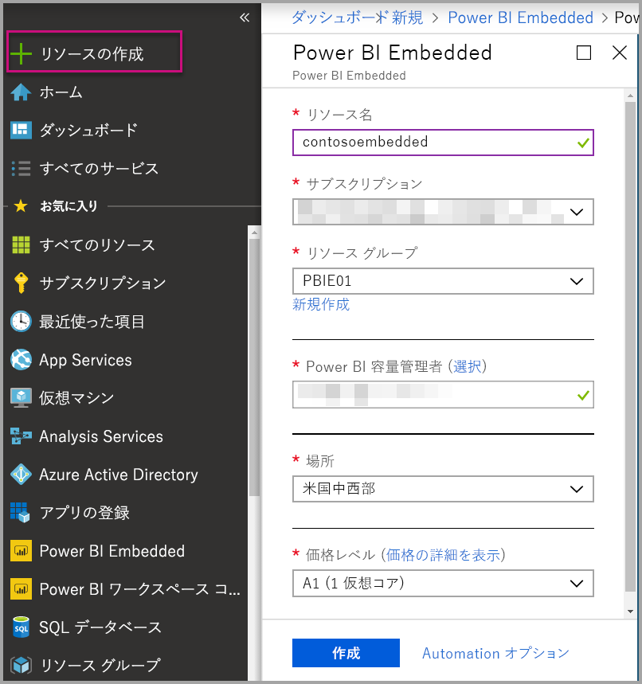

# Azure Portal での Power BI Embedded 容量の作成

この記事では、Microsoft Azure で [Power BI Embedded](azure-pbie-what-is-power-bi-embedded.md) の容量を作成する方法について説明します。 Power BI Embedded では Power BI の各種機能がシンプルになりました。目を見張るようなビジュアル、レポート、ダッシュボードをアプリに簡単に追加できます。

Azure サブスクリプションをお持ちでない場合は、始める前に[無料アカウントを作成](https://azure.microsoft.com/free/)してください。

> [!VIDEO https://www.youtube.com/embed/aXrvFfg_iSk]

## 始める前に

このクイック スタートを完了するには、以下が必要です。

* **Azure サブスクリプション:** [Azure 無料試用版](https://azure.microsoft.com/free/)にアクセスし、アカウントを作成してください。
* **Azure Active Directory:** お使いのサブスクリプションは Azure Active Directory (AAD) テナントに関連付けられている必要があります。 また、***そのテナントのアカウントで Azure にサインインする必要があります***。 Microsoft アカウントはサポートされていません。 詳細については、「[認証とユーザーのアクセス許可](https://docs.microsoft.com/azure/analysis-services/analysis-services-manage-users)」を参照してください。
* **Power BI テナント:** ご利用の AAD テナントの少なくとも 1 つのアカウントを Power BI に登録しておく必要があります。
* **リソース グループ:** 既にあるリソース グループを使用するか、[新しく作成](https://docs.microsoft.com/azure/azure-resource-manager/resource-group-overview)します。

## 容量を作成する

1. [Azure Portal ](https://portal.azure.com/)にサインインします。

2. 検索ボックスで *Power BI Embedded* を検索します。

3. Power BI Embedded 内で **[作成]** を選択します。

4. 必須情報を入力し、 **[作成]** を選択します。

    

    |設定 |説明 |
    |---------|---------|
    |**リソース名**|容量を識別するための名前。 このリソース名は、Azure Portal に加えて Power BI 管理者ポータル内に表示されます。|
    |**サブスクリプション**|容量を作成するサブスクリプション。|
    |**リソース グループ**|この新しい容量が含まれるリソース グループ。 既存のリソース グループから選択するか、新しく作成します。 詳細については、「[Azure Resource Manager の概要](https://docs.microsoft.com/azure/azure-resource-manager/resource-group-overview)」を参照してください。|
    |**Power BI 容量管理者**|Power BI 容量管理者は、Power BI 管理ポータルで容量を確認し、割り当てのアクセス許可を他のユーザーに付与できます。 既定では、容量管理者は自分のアカウントになります。 容量管理者は Power BI テナント内に存在する必要があります。|
    |**場所**|お使いのテナントの Power BI がホストされている場所。 既定の場所はホーム領域ですが、[Multi-Geo オプション](embedded-multi-geo.md)を使用して場所を変更できます。
    |**価格レベル**|自分のニーズに合った SKU (仮想コア数とメモリ サイズ) を選択してください。  詳細については、「[Power BI Embedded の価格](https://azure.microsoft.com/pricing/details/power-bi-embedded/)」を参照してください。|

**[すべてのサービス]** 、 **[Power BI Embedded]** の順に移動し、容量を使用する準備ができているか確認できます。 あるいは、通知セクションまたはブレード内から **[ダッシュボードにピン留めする]** を選択し、ダッシュボードに移動して新しい容量を確認できます。

## 次の手順

新しい Power BI Embedded 容量を使用するには、Power BI 管理者ポータルに移動し、ワークスペースを割り当てます。 詳細については、「[Power BI Premium および Power BI Embedded の容量を管理する](https://powerbi.microsoft.com/documentation/powerbi-admin-premium-manage/)」を参照してください。

この容量を使用する必要がない場合、一時停止して請求を停止できます。 詳細については、「[Pause and start your Power BI Embedded capacity in the Azure portal](azure-pbie-pause-start.md)」 (Azure Portal で Power BI Embedded を一時停止し、開始する) を参照してください。

自分のアプリケーションに Power BI コンテンツを埋め込む方法については、[Power BI ダッシュボード、レポート、タイルを埋め込む方法](https://powerbi.microsoft.com/documentation/powerbi-developer-embedding-content/)に関するページを参照してください。

他にわからないことがある場合は、 [Power BI コミュニティで質問してみてください](http://community.powerbi.com/)。