# <a name="tutorial-embed-a-power-bi-report-dashboard-or-tile-into-an-application-for-your-customers"></a>チュートリアル:顧客向けのアプリケーションに Power BI のレポート、ダッシュボード、タイルを埋め込む

**Azure の Power BI Embedded** を使うと、アプリ所有データを使用して、レポート、ダッシュボード、またはタイルをアプリケーション内に埋め込むことができます。 **アプリ所有データ**がある場合、Power BI を埋め込み分析プラットフォームとして使用するアプリケーションが含まれます。 **ISV 開発者**は、完全に統合された対話型のアプリケーションにレポート、ダッシュボード、またはタイルを表示する Power BI コンテンツを作成できます。ユーザーに Power BI ライセンスは必要ありません。 このチュートリアルでは、顧客向けに **Power BI Embedded in Azure** を使用しているときに、Power BI .NET SDK と Power BI JavaScript API を使って、アプリケーション内にレポートを統合する方法を説明します。

このチュートリアルで学習する内容は次のとおりです。
> [!div class="checklist"]
> * Azure にアプリケーションを登録します。
> * Power BI レポートをアプリケーションに埋め込みます。

## <a name="prerequisites"></a>前提条件

作業を始めるには、**Power BI Pro** アカウント (このアカウントは**マスター アカウント**です) と **Microsoft Azure** サブスクリプションが必要です。

* **Power BI Pro** にサインアップしていない場合は、[無料の試用版にサインアップ](https://powerbi.microsoft.com/pricing/)してください。
* Azure サブスクリプションをお持ちでない場合は、始める前に[無料アカウントを作成](https://azure.microsoft.com/free/?WT.mc_id=A261C142F)してください。
* 独自の [Azure Active Directory テナント](create-an-azure-active-directory-tenant.md)のセットアップが必要です。
* [Visual Studio](https://www.visualstudio.com/) がインストールされている必要があります (バージョン 2013 以降)。

## <a name="set-up-your-embedded-analytics-development-environment"></a>埋め込み分析開発環境を設定する

アプリケーションへのレポート、ダッシュボード、タイルの埋め込みを開始する前に、使用している環境で Power BI での埋め込みが許可されていることを確認する必要があります。

[埋め込みセットアップ ツール](https://aka.ms/embedsetup/AppOwnsData)を使うと、環境の作成とレポートの埋め込みを段階的に行うのに役立つサンプル アプリケーションをすぐに使い始めたり、ダウンロードしたりできます。

ただし、手動で環境をセットアップする場合は、以下を続行できます。

### <a name="register-an-application-in-azure-active-directory-azure-ad"></a>Azure Active Directory (Azure AD) にアプリケーションを登録する

アプリケーションを Azure Active Directory に登録すると、アプリケーションは Power BI REST API にアクセスできるようになります。 アプリケーションを登録すると、アプリケーションの ID を設定し、Power BI REST リソースへのアクセス許可を指定することができます。

1. [Microsoft Power BI API 条項](https://powerbi.microsoft.com/api-terms)に同意します。

2. [Azure Portal ](https://portal.azure.com)にサインインします。

    

3. 左側のナビゲーション ウィンドウで、**[すべてのサービス]**、**[アプリの登録]**、**[新しいアプリケーションの登録]** の順に選択します。

    </br>
    

4. 画面の指示に従って、新しいアプリケーションを作成します。 アプリ所有データの場合、アプリケーションの種類には **[ネイティブ]** を使う必要があります。 また、**Azure AD** がトークンの応答を返すために使用する**リダイレクト URI** を指定する必要もあります。 アプリケーション固有の値を入力します (例: `http://localhost:13526/Redirect`)。

    

### <a name="apply-permissions-to-your-application-within-azure-active-directory"></a>Azure Active Directory でアプリケーションにアクセス許可を適用する

アプリケーション (アプリ登録ページで指定したものを含む) に対する追加のアクセス許可を有効にします。 埋め込みのために使用する*マスター* アカウントでサインインします。 マスター アカウントは、グローバル管理者アカウントである必要があります。

### <a name="use-the-azure-active-directory-portal"></a>Azure Active Directory ポータルを使用する

1. Azure portal 内で [[アプリの登録]](https://portal.azure.com/#blade/Microsoft_AAD_IAM/ApplicationsListBlade) を参照して、埋め込みに使うアプリを選びます。

    

2. **[設定]** を選び、**[API アクセス]** で **[必要なアクセス許可]** を選びます。

    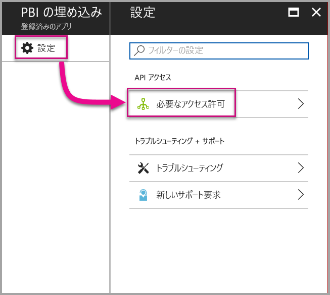

3. **[Windows Azure Active Directory]** を選択してから、**[サインインしたユーザーとしてディレクトリにアクセスします]** が選択されていることを確認します。 **[保存]** を選択します。

    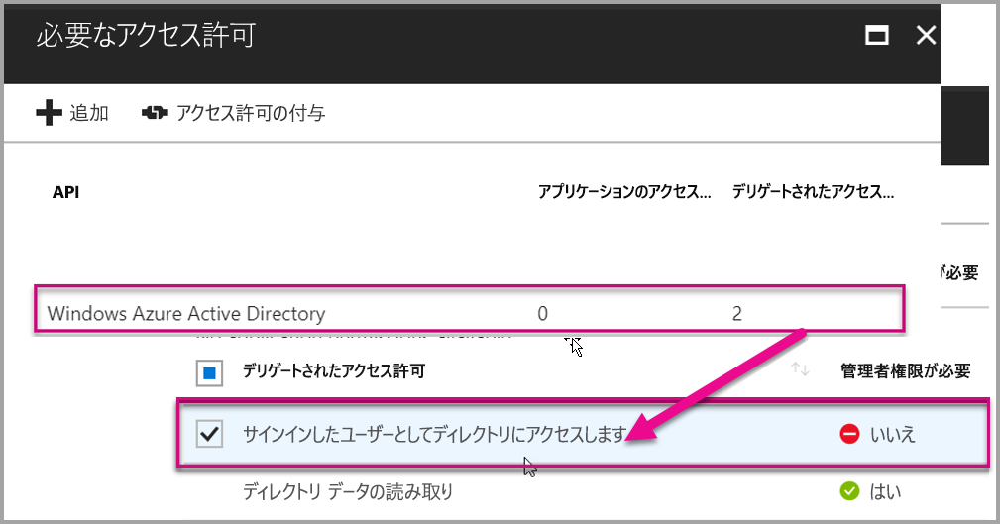

4. **[追加]** を選択します。

    

5. **[API を選択します]** を選びます。

    

6. **[Power BI サービス]** を選んでから、**[選択]** を選びます。

    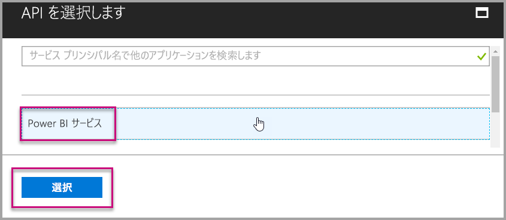

7. **[デリゲートされたアクセス許可]** のすべてのアクセス許可を選択します。 完了したら、**[保存]** を選択します。

    

8. **[必要なアクセス許可]** 内で、**[アクセス許可の付与]** を選択します。

    Azure AD により同意を求めるプロンプトが表示されないようにするには、**[アクセス許可の付与]** アクションで "*マスター アカウント*" が必要です。 このアクションを実行するアカウントがグローバル管理者である場合は、このアプリケーションに対するアクセス許可を組織内のすべてのユーザーに付与する必要があります。 このアクションを実行するアカウントが*マスター アカウント*であり、グローバル管理者ではない場合は、このアプリケーションに対するアクセス許可を*マスター アカウント*にのみ付与する必要があります。

    ![[必要なアクセス許可] ダイアログの [アクセス許可の付与]](media/embed-sample-for-customers/embed-sample-for-customers-016.png)

## <a name="set-up-your-power-bi-environment"></a>Power BI 環境を設定する

### <a name="create-an-app-workspace"></a>アプリ ワークスペースを作成する

顧客向けのレポート、ダッシュボード、またはタイルを埋め込む場合は、コンテンツをアプリ ワークスペース内に配置する必要があります。 "*マスター*" アカウントは、アプリ ワークスペースの管理者である必要があります。

1. 最初に、ワークスペースを作成します。 **[ワークスペース]**  > **[アプリのワークスペースの作成]** の順に選びます。 [アプリのワークスペースの作成] では、アプリケーションでアクセスする必要があるコンテンツを配置します。

    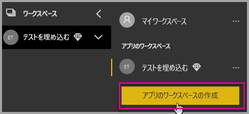

2. ワークスペースの名前を付けます。 対応する**ワークスペース ID** が使用できない場合は、一意の ID になるように編集します。

    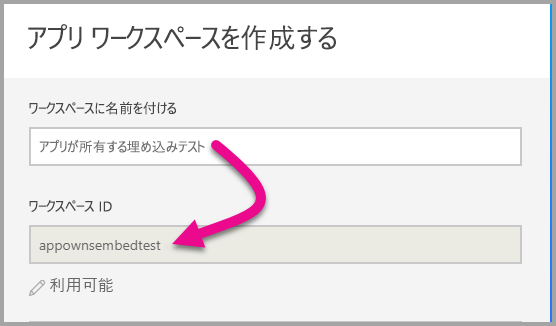

3. 設定にはいくつかのオプションがあります。 **[パブリック]** を選択すると、組織内のすべてのユーザーがワークスペースの内容を表示できます。 **[Private]\(プライベート\)** を選択した場合、ワークスペースのメンバーしかその内容を表示できません。

    

    グループを作成した後は、公開/非公開を変更することはできません。

4. メンバーが**編集**可能かどうか、**表示専用**のアクセス許可を持つかどうかも選択できます。

    

5. ワークスペースへのアクセス許可を与えるユーザーの電子メール アドレスを追加して、**[追加]** を選択します。 追加できるのは個別ユーザーのみで、グループのエイリアスは追加できません。

6. ユーザーごとにメンバーか管理者かを判断します。管理者は、他のメンバーの追加を含め、ワークスペース自体を編集できます。 メンバーは、表示専用のアクセス許可を持っていない限り、ワークスペースのコンテンツを編集できます。 管理者とメンバーの両方がアプリを発行できます。

    新しいワークスペースを表示できるようになります。 Power BI でワークスペースが作成され、開きます。 メンバーであるワークスペースの一覧に表示されます。 管理者は、省略記号 (...) を選択すると、前の画面に戻って新しいメンバーの追加やアクセス許可の変更などの変更を加えることができます。

    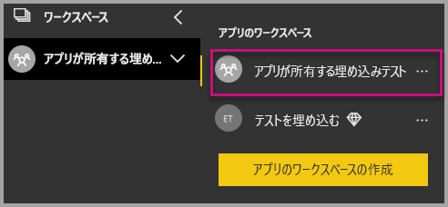

### <a name="create-and-publish-your-reports"></a>レポートを作成して発行する

Power BI Desktop を使用してレポートとデータセットを作成し、アプリ ワークスペースにこれらのレポートを発行できます。 レポートを発行するエンド ユーザーには、アプリ ワークスペースに発行するための Power BI Pro ライセンスが必要です。

1. GitHub からサンプルの [Blog Demo](https://github.com/Microsoft/powerbi-desktop-samples) をダウンロードします。

    

2. **Power BI Desktop** でサンプルの PBIX レポートを開きます

   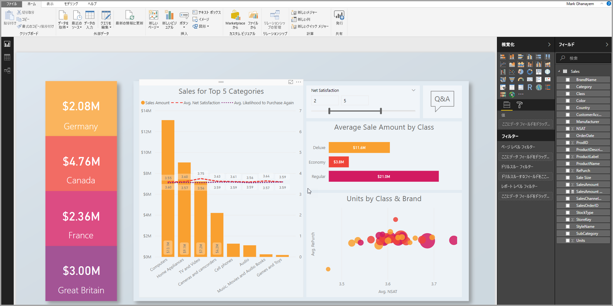

3. **アプリ ワークスペース**に発行します

   

    Power BI サービスを使ってオンラインでレポートを表示できるようになります。

   

## <a name="embed-your-content-using-the-sample-application"></a>サンプル アプリケーションを使用してコンテンツを埋め込む

次の手順に従い、サンプル アプリケーションを使用してコンテンツの埋め込みを開始します。

1. 最初に、GitHub から [App Owns Data サンプル](https://github.com/Microsoft/PowerBI-Developer-Samples)をダウンロードします。

    

2. サンプル アプリケーションで Web.config ファイルを開きます。 アプリケーションを正常に実行するには、5 つのフィールドに入力する必要があります。 **applicationId**、**workspaceId**、**reportId**、**pbiUsername**、および **pbiPassword** です。

    

    **applicationId** 情報には、**Azure** の**アプリケーション ID** を入力します。 **applicationId** は、アクセス許可を要求しているユーザーに対して、アプリケーションが自身を識別するために使用します。 **applicationId** を取得するには、次の手順に従います。

    [Azure Portal ](https://portal.azure.com)にサインインします。

    

    左側のナビゲーション ウィンドウで、**[すべてのサービス]**、**[アプリの登録]** の順に選択します。

    

    **applicationId** を取得するアプリケーションを選択します。

    

    **アプリケーション ID** が GUID として一覧表示されます。 この**アプリケーション ID** を、アプリケーションの **applicationId** として使用します。

    

    **workspaceId** 情報には、Power BI の**アプリ ワークスペースの GUID** を入力します。

    

    **reportId** には、Power BI から**レポートの GUID** を設定します。

    

    * **pbiUsername** には、Power BI マスター ユーザー アカウントを設定します。
    * **pbiPassword** には、Power BI マスター ユーザー アカウントのパスワードを設定します。

3. アプリケーションを実行します。

    最初に、**Visual Studio** で **[実行]** を選びます。

    

    次に、**[Embed Report]** を選びます。 テスト対象に選んだコンテンツ (レポート、ダッシュボード、タイル) に応じて、アプリケーションでそのオプションを選びます。

    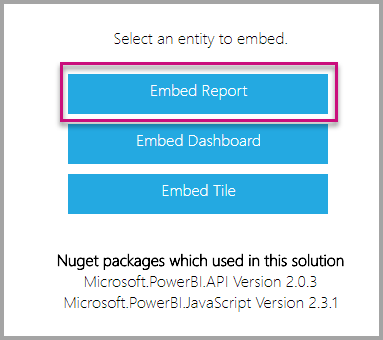

    サンプル アプリケーションでレポートを表示できるようになります。

    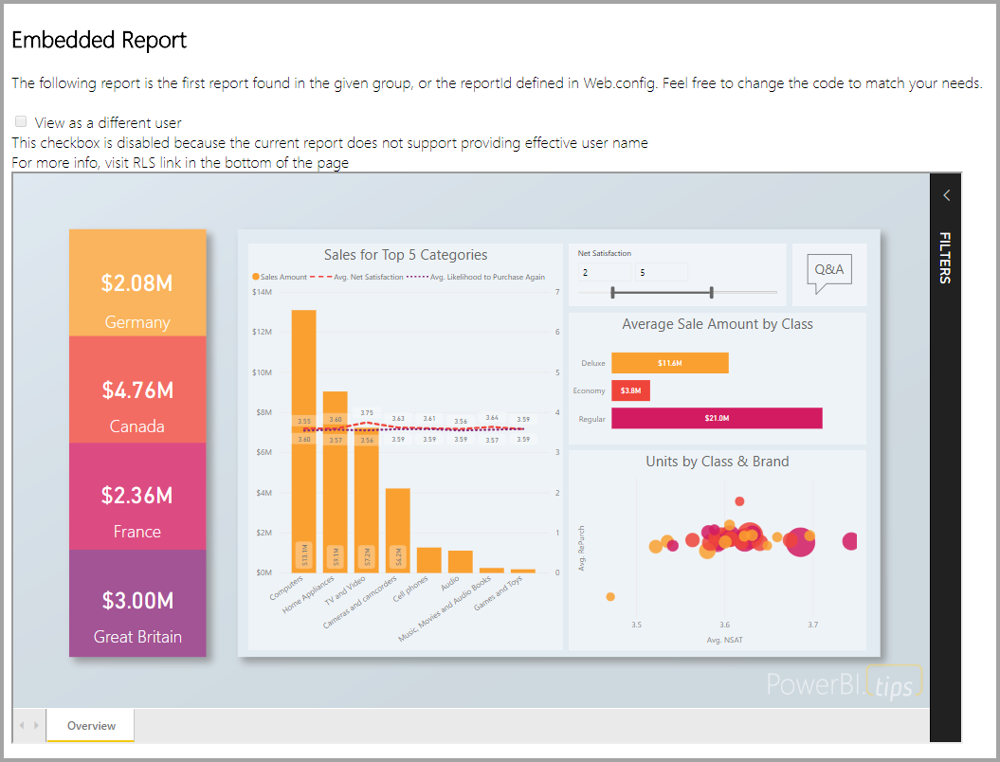

## <a name="embed-your-content-within-your-application"></a>アプリケーション内にコンテンツを埋め込む

コンテンツを埋め込む手順は [Power BI REST API](https://docs.microsoft.com/rest/api/power-bi/) で実行できますが、この記事で説明するコード例は **.NET SDK** で作成されています。

アプリケーション内で顧客向けの埋め込みを行うには、**Azure AD** からマスター アカウントの**アクセス トークン**を取得する必要があります。 [Power BI REST API](https://docs.microsoft.com/rest/api/power-bi/) への呼び出しを行う前に、**アプリ所有データ**を使用する Power BI アプリケーションのための [Azure AD アクセス トークン](get-azuread-access-token.md#access-token-for-non-power-bi-users-app-owns-data)を取得する必要があります。

**アクセス トークン**を使用して Power BI Client を作成するには、[Power BI REST API](https://docs.microsoft.com/rest/api/power-bi/) とやりとりするための Power BI クライアント オブジェクトを作成する必要があります。 **AccessToken** を ***Microsoft.Rest.TokenCredentials*** オブジェクトでラップして、Power BI クライアント オブジェクトを作成します。

```csharp
using Microsoft.IdentityModel.Clients.ActiveDirectory;
using Microsoft.Rest;
using Microsoft.PowerBI.Api.V2;

var tokenCredentials = new TokenCredentials(authenticationResult.AccessToken, "Bearer");

// Create a Power BI Client object. it's used to call Power BI APIs.
using (var client = new PowerBIClient(new Uri(ApiUrl), tokenCredentials))
{
    // Your code to embed items.
}
```

### <a name="get-the-content-item-you-want-to-embed"></a>埋め込むコンテンツ アイテムを取得する

Power BI クライアント オブジェクトを使って、埋め込むアイテムへの参照を取得できます。

指定したワークスペースから最初のレポートを取得する方法のコード例を次に示します。

*埋め込みたいコンテンツ アイテムがレポート、ダッシュボード、またはタイルのいずれかであるかに関係なく、それらを取得するサンプルは、[サンプル アプリケーション](#embed-your-content-within-a-sample-application)の Controllers\HomeController.cs ファイル内にあります。*

```csharp
using Microsoft.PowerBI.Api.V2;
using Microsoft.PowerBI.Api.V2.Models;

// You need to provide the workspaceId where the dashboard resides.
ODataResponseListReport reports = await client.Reports.GetReportsInGroupAsync(workspaceId);

// Get the first report in the group.
Report report = reports.Value.FirstOrDefault();
```

### <a name="create-the-embed-token"></a>埋め込みトークンを作成する

JavaScript API から使うことができる埋め込みトークンを作成します。 埋め込みトークンは、埋め込むアイテムに固有のものです。 そのため、Power BI コンテンツを埋め込むときは常に、そのための埋め込みトークンを新しく作成する必要があります。 使う **accessLevel** など詳しくは、「[GenerateToken API](https://msdn.microsoft.com/library/mt784614.aspx)」をご覧ください。

アプリケーションへのレポートとして埋め込みトークンを追加する例を次に示します。

*レポート、ダッシュ ボード、またはタイル用の埋め込みトークンを作成するサンプルは、[サンプル アプリケーション](#embed-your-content-within-a-sample-application)内の Controllers\HomeController.cs ファイルにあります。*

```csharp
using Microsoft.PowerBI.Api.V2;
using Microsoft.PowerBI.Api.V2.Models;

// Generate Embed Token.
var generateTokenRequestParameters = new GenerateTokenRequest(accessLevel: "view");
EmbedToken tokenResponse = client.Reports.GenerateTokenInGroup(workspaceId, report.Id, generateTokenRequestParameters);

// Generate Embed Configuration.
var embedConfig = new EmbedConfig()
{
    EmbedToken = tokenResponse,
    EmbedUrl = report.EmbedUrl,
    Id = report.Id
};
```

**EmbedConfig** および **TileEmbedConfig** のクラスが作成されます。 **Models\EmbedConfig.cs** ファイルおよび **Models\TileEmbedConfig.cs ファイル**内にサンプルがあります。

### <a name="load-an-item-using-javascript"></a>JavaScript を使ってアイテムを読み込む

JavaScript を使って、Web ページの div 要素にレポートを読み込むことができます。

JavaScript API を使用する完全なサンプルの場合、[Playground ツール](https://microsoft.github.io/PowerBI-JavaScript/demo)を使用できます。 プレイグラウンド ツールを使うと、さまざまな種類の Power BI Embedded のサンプルを簡単に試すことができます。 JavaScript API について詳しくは、[PowerBI-JavaScript wiki](https://github.com/Microsoft/powerbi-javascript/wiki) のページも参照してください。

**EmbedConfig** モデルと **TileEmbedConfig** モデルをレポートのビューと一緒に使用するサンプルを次に示します。

*レポート、ダッシュボード、またはタイルのビューを追加するサンプルは、[サンプル アプリケーション](#embed-your-content-within-a-sample-application)内の Views\Home\EmbedReport.cshtml, Views\Home\EmbedDashboard.cshtml ファイルまたは Views\Home\Embedtile.cshtml ファイルにあります。*

```javascript
<script src="~/scripts/powerbi.js"></script>
<div id="reportContainer"></div>
<script>
    // Read embed application token from Model
    var accessToken = "@Model.EmbedToken.Token";

    // Read embed URL from Model
    var embedUrl = "@Html.Raw(Model.EmbedUrl)";

    // Read report Id from Model
    var embedReportId = "@Model.Id";

    // Get models. models contains enums that can be used.
    var models = window['powerbi-client'].models;

    // Embed configuration used to describe the what and how to embed.
    // This object is used when calling powerbi.embed.
    // This also includes settings and options such as filters.
    // You can find more information at https://github.com/Microsoft/PowerBI-JavaScript/wiki/Embed-Configuration-Details.
    var config = {
        type: 'report',
        tokenType: models.TokenType.Embed,
        accessToken: accessToken,
        embedUrl: embedUrl,
        id: embedReportId,
        permissions: models.Permissions.All,
        settings: {
            filterPaneEnabled: true,
            navContentPaneEnabled: true
        }
    };

    // Get a reference to the embedded report HTML element
    var reportContainer = $('#reportContainer')[0];

    // Embed the report and display it within the div container.
    var report = powerbi.embed(reportContainer, config);
</script>
```

## <a name="move-to-production"></a>運用開始

これでアプリケーションの開発が完了したため、専用の容量を持つアプリ ワークスペースに戻ります。 運用を開始するには、専用の容量が必要です。

### <a name="create-a-dedicated-capacity"></a>専用の容量を作成する

専用の容量を作成することで、顧客専用のリソースを所有する利点が得られます。 [Microsoft Azure Portal](https://portal.azure.com) 内で専用の容量を購入できます。 Power BI Embedded 容量の作成方法の詳細については、「[Create Power BI Embedded capacity in the Azure portal](azure-pbie-create-capacity.md)」 (Azure Portal で Power BI Embedded 容量を作成する) をご覧ください。

下の表を参照し、自分のニーズに最適な Power BI Embedded 容量を判断します。

| 容量ノード | 合計コア<br/>*(バックエンド + フロントエンド)* | バックエンド コア | フロントエンド コア | DirectQuery/ライブ接続の制限|
| --- | --- | --- | --- | --- | --- |
| A1 |1 仮想コア |0.5 コア、3 GB RAM |0.5 コア |1 秒あたり 0.5 |
| A2 |2 仮想コア |1 コア、5 GB RAM |1 コア | 1 秒あたり 10 |
| A3 |4 仮想コア |2 コア、10 GB RAM |2 コア | 1 秒あたり 15 |
| A4 |8 仮想コア |4 コア、25 GB RAM |4 コア |1 秒あたり 30 |
| A5 |16 仮想コア |8 コア、50 GB RAM |8 コア |1 秒あたり 60 |
| A6 |32 仮想コア |16 コア、100 GB RAM |16 コア |1 秒あたり 120 |

**_A SKU の場合、無料 Power BI ライセンスでは Power BI コンテンツにアクセスできません。_**

埋め込みトークンと PRO ライセンスを一緒に使用するのは、開発テストのためのものです。そのため、Power BI マスター アカウントで生成できる埋め込みトークンの数には限りがあります。 運用環境で埋め込むには、専用の容量が必要です。 専用の容量があると、生成できる埋め込みトークンの数に制限がなくなります。 現在の埋め込み使用パーセンテージを示す使用状況の値を確認するには、[使用可能な機能](https://docs.microsoft.com/rest/api/power-bi/availablefeatures/getavailablefeatures)に関するページに移動します。 使用量はマスター アカウント別となっています。

詳細については、「[Embedded analytics capacity planning whitepaper](https://aka.ms/pbiewhitepaper)」 (埋め込み分析の容量計画に関するホワイト ペーパー) をご覧ください。

### <a name="assign-an-app-workspace-to-a-dedicated-capacity"></a>専用の容量にアプリ ワークスペースを割り当てる

専用の容量を作成すると、アプリ ワークスペースをその専用の容量に割り当てることができます。 専用の容量をワークスペースに割り当てるには、次の手順に従います。

1. **Power BI サービス**内でワークスペースを展開し、コンテンツを埋め込むために使用しているワークスペースの省略記号ボタンを選択します。 次に、**[Edit workspaces]\(ワークスペースの編集\)** を選択します。

    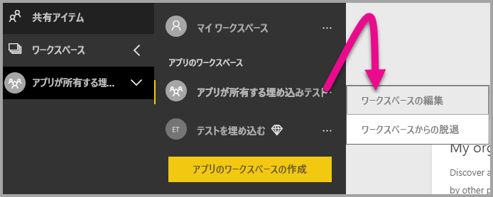

2. **[詳細]** を展開し、**[専用の容量]** を有効にして、作成した専用の容量を選びます。 その後、**[保存]** を選びます。

    

3. **[保存]** を選択すると、アプリ ワークスペース名の横に**ひし形**が表示されます。

    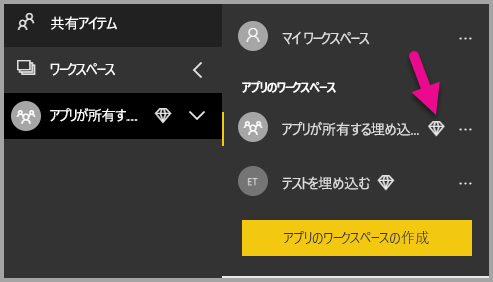

## <a name="next-steps"></a>次の手順

このチュートリアルでは、顧客向けアプリケーションに Power BI コンテンツを埋め込む方法を説明しました。 組織向けの Power BI コンテンツの埋め込みを試すこともできます。

> [!div class="nextstepaction"]
>[組織向けの埋め込み](embed-sample-for-your-organization.md)

他にわからないことがある場合は、 [Power BI コミュニティで質問してみてください](http://community.powerbi.com/)。
