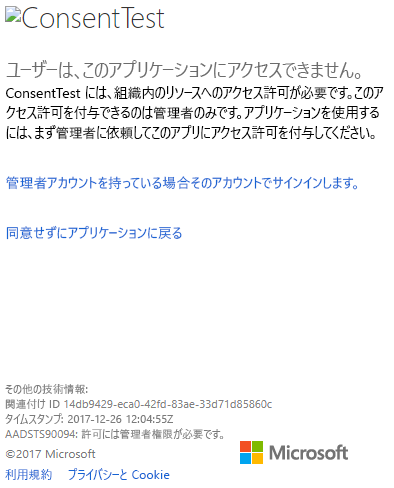
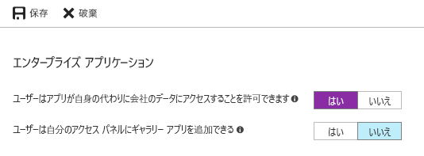

# <a name="troubleshoot-your-embedded-application"></a>埋め込みアプリケーションのトラブルシューティング

この記事では、Power BI からコンテンツを埋め込むときに発生する一般的な問題について説明します。

## <a name="tools-to-troubleshoot"></a>トラブルシューティング ツール

### <a name="fiddler-trace"></a>Fiddler のトレース

[Fiddler](http://www.telerik.com/fiddler) は、HTTP トラフィックを監視する Telerik 提供の無償ツールです。  クライアント コンピューターから Power BI API によるトラフィックを確認できます。 このツールでは、エラーとその他の関連する情報が表示される場合があります。


### <a name="f12-in-browser-for-front-end-debugging"></a>フロントエンド デバッグにはブラウザーで F12

F12 を押すと、ブラウザー内で開発者ウィンドウが起動します。 このツールでは、ネットワーク トラフィックやその他の情報を見ることができます。


### <a name="extract-error-details-from-power-bi-response"></a>Power BI 応答からエラーの詳細を抽出する

このコード スニペットは、HTTP 例外からエラーの詳細を抽出する方法を示しています。

```csharp
public static string GetExceptionText(this HttpOperationException exc)
{
    var errorText = string.Format("Request: {0}\r\nStatus: {1} ({2})\r\nResponse: {3}",
    exc.Request.Content, exc.Response.StatusCode, (int)exc.Response.StatusCode, exc.Response.Content);
    if (exc.Response.Headers.ContainsKey("RequestId"))
    {
        var requestId = exc.Response.Headers["RequestId"].FirstOrDefault();
        errorText += string.Format("\r\nRequestId: {0}", requestId);
    }

    return errorText;
}
```

要求 ID (およびエラーの詳細をトラブルシューティングのために) をログに記録することをお勧めします。
Microsoft サポートに連絡する際に、要求 ID を指定してください。

## <a name="app-registration"></a>アプリの登録

### <a name="app-registration-failure"></a>アプリ登録エラー

Azure Portal または Power BI アプリ登録ページ内のエラー メッセージは、特権が不十分であることを伝えます。 アプリケーションを登録するには、Azure AD テナントの管理者になる必要があります。または、非管理者ユーザーのアプリケーション登録を有効にする必要があります。

### <a name="power-bi-service-doesnt-appear-in-the-azure-portal-when-registering-a-new-app"></a>新しいアプリを登録したとき、Power BI サービスが Azure portal に表示されない

少なくとも 1 名のユーザーを Power BI に登録する必要があります。 API 一覧に **Power BI サービス**が表示されない場合、Power BI にユーザーが登録されていません。

## <a name="rest-api"></a>REST API

### <a name="api-call-returning-401"></a>API の呼び出しで 401 が返される

さらに調査するには、Fiddler キャプチャが必要になる場合があります。 Azure AD 内の登録済みアプリケーションに対して、必要なアクセス許可スコープがない可能性があります。 Azure Portal 内で Azure AD のアプリ登録内に必要なスコープがあることを確認します。

### <a name="api-call-returning-403"></a>API の呼び出しで 403 が返される

さらに調査するには、Fiddler キャプチャが必要になる場合があります。 403 エラーにはいくつかの理由が考えられます。

* ユーザーが共有容量で生成できる埋め込みトークンの量を超えました。 埋め込みトークンを生成するための Azure 容量を購入し、ワークスペースをその容量に割り当てます。 「[Azure Portal での Power BI Embedded 容量の作成](https://docs.microsoft.com/azure/power-bi-embedded/create-capacity)」をご覧ください。
* Azure AD 認証トークンの有効期限が切れています。
* 認証されたユーザーがグループ (アプリ ワークスペース) に属していません。
* 認証されたユーザーがグループ (アプリ ワークスペース) の管理者ではありません。
* Authorization ヘッダーが正しく記載されていない可能性があります。 入力ミスがないことを確認してください。

場合によっては、GenerateToken を呼び出す前にアプリケーションのバックエンドで認証トークンを更新する必要があります。

    ```
    GET https://wabi-us-north-central-redirect.analysis.windows.net/metadata/cluster HTTP/1.1
    Host: wabi-us-north-central-redirect.analysis.windows.net
    ...
    Authorization: Bearer eyJ0eXAiOi...
    ...

    HTTP/1.1 403 Forbidden
    ...

    {"error":{"code":"TokenExpired","message":"Access token has expired, resubmit with a new access token"}}
    ```

## <a name="authentication"></a>認証

### <a name="authentication-failed-with-aadsts90002-tenant-authorize-not-found"></a>AADSTS90002 で認証が失敗しました:テナント 'authorize' が見つかりません

 ***error: invalid_request, error_description:AADSTS90002:テナント 'authorize' が見つかりません*** などのログインに関するメッセージを受信している場合、ADAL 4.x で権限 URL として "https://login.microsoftonline.com/{Tenant}/oauth2/authorize/" がサポートされていないことが原因です。
 
この問題を解決するには、権限 URL の末尾から "oauth2/authorize/" をトリミングする必要があります。[Power BI の開発者向けサンプル](https://github.com/Microsoft/PowerBI-Developer-Samples)に関するページを参照してください。

 ADAL 4.x リリース ノートの「[Better Authority validation](https://github.com/AzureAD/azure-activedirectory-library-for-dotnet/wiki/Changes-adalnet-4.0#better-authority-validation)」 (権限検証の改善) を確認してください。

### <a name="authentication-failed-with-aadsts70002-or-aadsts50053"></a>AADSTS70002 または AADSTS50053 で認証が失敗しました

** _(AADSTS70002: 資格情報の検証エラー。AADSTS50053: 正しくないユーザー ID またはパスワードでのサインインの試行回数が上限に達しました)_ **

Power BI Embedded を使用、および Azure AD Direct Authentication を利用している場合、次のようなログインに関するメッセージを受信する場合があります: ***error:unauthorized_client,error_description:AADSTS70002: 資格情報の検証エラー。AADSTS50053: 正しくないユーザー ID またはパスワードでのサインインの試行回数が上限に達しました***。これは、2018 年 6 月 14 日から直接認証が使われていないことが原因です。

組織または[サービス プリンシパル](https://docs.microsoft.com/azure/active-directory/develop/active-directory-application-objects#service-principal-object)にスコープ設定された [Azure AD ポリシー](https://docs.microsoft.com/azure/active-directory/manage-apps/configure-authentication-for-federated-users-portal#enable-direct-authentication-for-legacy-applications)を使用して、直接認証をオンに戻す方法があります。

このポリシーは、アプリごとにのみ有効にすることをお勧めします。

このポリシーを作成するには、ポリシーを作成して割り当てるディレクトリに対して**グローバル管理者**であることが必要です。 ポリシーを作成して、このアプリケーションの SP に割り当てるのためのサンプル スクリプトを次に示します。

1. [Azure AD プレビュー PowerShell モジュール](https://docs.microsoft.com/powershell/azure/active-directory/install-adv2?view=azureadps-2.0)をインストールします。

2. 次の PowerShell コマンドを 1 行ずつ実行します (結果として、変数 $sp に複数のアプリケーションが含まれていないことを確認します)。

```powershell
Connect-AzureAD
```

```powershell
$sp = Get-AzureADServicePrincipal -SearchString "Name_Of_Application"
```

```powershell
$policy = New-AzureADPolicy -Definition @("{`"HomeRealmDiscoveryPolicy`":{`"AllowCloudPasswordValidation`":true}}") -DisplayName EnableDirectAuth -Type HomeRealmDiscoveryPolicy -IsOrganizationDefault $false
```

```powershell
Add-AzureADServicePrincipalPolicy -Id $sp.ObjectId -RefObjectId $policy.Id 
```

ポリシーを割り当てたら、テストを行う前に、約 15 秒から 20 秒、伝達のための時間を待機します。

### <a name="generate-token-fails-when-providing-effective-identity"></a>有効な ID が与えられた GenerateToken が失敗する

いくつかの理由から、有効な ID が与えられた GenerateToken が失敗することがあります。

* データセットが有効な ID に対応していない
* ユーザー名が指定されていない
* ロールが指定されていない
* DatasetId が指定されていない
* ユーザーに正しいアクセス許可が与えられていない

これらのうちどれが原因かを検証するには、次の手順を試します。

* [get dataset](https://docs.microsoft.com/rest/api/power-bi/datasets) を実行します。 プロパティ IsEffectiveIdentityRequired は true ですか?
* ユーザー名はあらゆる EffectiveIdentity で必須です。
* IsEffectiveIdentityRolesRequired が true であれば、ロールが必要です。
* DatasetId はあらゆる EffectiveIdentity で必須です。
* Analysis Services の場合、マスター ユーザーをゲートウェイ管理者にする必要があります。

### <a name="aadsts90094-the-grant-requires-admin-permission"></a>AADSTS90094: 許可には管理者権限が必要です

**_症状:_ **<br>
同意を与えるとき、管理者以外のユーザーがアプリケーションに初めてサインインすると、次のいずれかのエラーが返されます。

* ConsentTest は、管理者のみが付与することができる組織内のリソースへのアクセス許可を必要とします。 アプリケーションを使用するには、まず管理者に依頼してこのアプリにアクセス許可を付与してください。
* AADSTS90094: 許可には管理者権限が必要です。

    

管理者ユーザーは正常にサインインし、同意を許可することができます。

**_根本原因:_ **<br>
ユーザーの同意がテナントに対して無効です。

**_いくつかの修正方法が可能です:_ **

*テナント全体に対するユーザーの同意を有効にする (すべてのユーザー、すべてのアプリケーション)*

1. Azure portal で、[Azure Active Directory]、[ユーザーとグループ]、[ユーザー設定] の順に移動します。
2. [ユーザーはアプリが自身の代わりに会社のデータにアクセスすることを許可できます] 設定を有効にし、変更を保存します。

    

テナント全体または特定のユーザーのいずれかを対象として、管理者がアプリケーションへの*アクセス許可を付与*します。

### <a name="cs1061-error"></a>CS1061 エラー

ダウンロード[Microsoft.IdentityModel.Clients.ActiveDirectory](https://www.nuget.org/packages/Microsoft.IdentityModel.Clients.ActiveDirectory/2.22.302111727)が発生した場合、"'AuthenticationContext' に 'AcquireToken' のないアクセス可能な 'AcquireToken' 型の最初の引数を受け付ける定義が含まれていません 'AuthenticationContext' が見つかりませんでした (が存在することを使用して、ディレクティブまたはアセンブリ参照。)"エラー。

## <a name="data-sources"></a>データ ソース

### <a name="isv-wants-to-have-different-credentials-for-the-same-data-source"></a>ISV が同じデータ ソースに対して複数の資格情報を求める

データ ソースには、1 つのマスター ユーザーに対して 1 つの資格情報セットを与えることができます。 異なる資格情報を使用する必要がある場合、追加のマスター ユーザーを作成します。 次に、マスター ユーザーごとに異なる資格情報を割り当て、そのユーザーの Azure AD トークンを利用して埋め込みます。

## <a name="troubleshoot-your-embedded-application-with-the-ierror-object"></a>IError オブジェクトによる埋め込みアプリケーションのトラブルシューティング

[**JavaScript SDK** から *error* イベントによって返される **IError オブジェクト**](https://github.com/Microsoft/PowerBI-JavaScript/wiki/Troubleshooting-and-debugging-of-embedded-parts)を使用して、アプリケーションをデバッグし、エラーの原因に対する理解を深めます。

IError オブジェクトを取得したら、使用している埋め込みの種類に応じた、該当する一般的なエラーのテーブルを確認する必要があります。 **IError のプロパティ**とテーブル内のプロパティを比較し、エラーの考えられる理由を見つけてください。

### <a name="typical-errors-when-embedding-for-power-bi-users"></a>Power BI ユーザー向けに埋め込む場合に発生する一般的なエラー

| メッセージ | 詳細なメッセージ | エラー コード | 考えられる理由 |
|-------------------------------------------------------|-----------------------------------------------------------------------------------------------------------------------------|-----------|--------------------------------------------------------|
| TokenExpired | Access token has expired, resubmit with a new access token (アクセス トークンの期限が切れました。新しいアクセス トークンを使用して再送信してください) | 403 | トークンの有効期限が切れました  |
| PowerBIEntityNotFound | Get report failed (レポートの取得に失敗しました) | 404 | <li> レポート ID が正しくありません <li> レポートが存在しません  |
| 正しくないパラメーター | powerbiToken parameter not specified (powerbiToken パラメーターが指定されていません) | N/A | <li> アクセス トークンが指定されていません <li> レポート ID が指定されていません |
| LoadReportFailed | Fail to initialize - Couldn't resolve cluster (初期化できません - クラスターを解決できませんでした) | 403 | * アクセス トークンが無効です * 埋め込みの種類がトークンの種類に一致しません |
| PowerBINotAuthorizedException | Get report failed (レポートの取得に失敗しました) | 401 | <li> グループ ID が正しくありません <li> 許可されていないグループです |
| TokenExpired | Access token has expired, resubmit with a new access token. (アクセス トークンの期限が切れました。新しいアクセス トークンを使用して再送信してください。) Couldn't render a report visual titled: (次のタイトルのレポートのビジュアルを表示できませんでした:) <visual title> | N/A | クエリ データのトークンの有効期限が切れました |
| OpenConnectionError | ビジュアルを表示できません。 Couldn't render a report visual titled: (次のタイトルのレポートのビジュアルを表示できませんでした:) <visual title> | N/A | 容量に関連するレポートをセッションで開いているときに容量が一時停止または削除されました |
| ExplorationContainer_FailedToLoadModel_DefaultDetails | このレポートに関連付けられているモデル スキーマを読み込むことができません。 サーバーに接続できることを確認して、もう一度やり直してください。 | N/A | <li> 容量が一時停止されました <li> 容量が削除されました |

### <a name="typical-errors-when-embedding-for-non-power-bi-users-using-an-embed-token"></a>Power BI 以外のユーザー向けに埋め込む場合に発生する一般的なエラー (埋め込みトークンを使用)

| メッセージ | 詳細なメッセージ | エラー コード | 理由 |
|-------------------------------------------------------|-------------------------------------------------------------------------------------------------------------------------------|------------|-------------------------------------------------|
| TokenExpired | Access token has expired, resubmit with a new access token (アクセス トークンの期限が切れました。新しいアクセス トークンを使用して再送信してください) | 403 | トークンの有効期限が切れました  |
| LoadReportFailed | Get report failed (レポートの取得に失敗しました) | 404 | <li> レポート ID が正しくありません <li> レポートが存在しません  |
| LoadReportFailed | Get report failed (レポートの取得に失敗しました) | 403 | レポート ID がトークンに一致しません |
| LoadReportFailed | Get report failed (レポートの取得に失敗しました) | 500 | レポートが指定した ID が GUID ではありません |
| 正しくないパラメーター | powerbiToken parameter not specified (powerbiToken パラメーターが指定されていません) | N/A | <li> アクセス トークンが指定されていません <li> レポート ID が指定されていません |
| LoadReportFailed | Fail to initialize - Couldn't resolve cluster (初期化できません - クラスターを解決できませんでした) | 403 | トークンの種類が正しくありません。無効なトークンです |
| PowerBINotAuthorizedException | Get report failed (レポートの取得に失敗しました) | 401 | グループ ID が正しくありません/許可されていないグループ ID です |
| TokenExpired | Access token has expired, resubmit with a new access token. (アクセス トークンの期限が切れました。新しいアクセス トークンを使用して再送信してください。) Couldn't render a report visual titled: (次のタイトルのレポートのビジュアルを表示できませんでした:) <visual title> | N/A | クエリ データのトークンの有効期限が切れました |
| OpenConnectionError | ビジュアルを表示できません。 Couldn't render a report visual titled: (次のタイトルのレポートのビジュアルを表示できませんでした:) <visual title> | N/A | 容量に関連するレポートをセッションで開いているときに容量が一時停止または削除されました |
| ExplorationContainer_FailedToLoadModel_DefaultDetails | このレポートに関連付けられているモデル スキーマを読み込むことができません。 サーバーに接続できることを確認して、もう一度やり直してください。 | N/A | <li> 容量が一時停止されました <li> 容量が削除されました |

## <a name="content-rendering"></a>コンテンツ レンダリング

### <a name="performance"></a>パフォーマンス

[Power BI Embedded のパフォーマンス](embedded-performance-best-practices.md)

### <a name="rendering-or-consumption-of-embedded-content-fails-or-times-out"></a>埋め込みコンテンツをレンダリングできない、使用できない、またはタイムアウトになる

埋め込みトークンの有効期限が切れていないことを確認します。 埋め込みトークンの有効期限を確認し、更新してください。 詳細については、「[Refresh token using JavaScript SDK](https://github.com/Microsoft/PowerBI-JavaScript/wiki/Refresh-token-using-JavaScript-SDK-example)」 (JavaScript SDK を利用してトークンを更新する) を参照してください。

### <a name="report-or-dashboard-doesnt-load"></a>レポートまたはダッシュボードが読み込まれない

ユーザーがレポートまたはダッシュボードを表示できない場合、それが powerbi.com 内で正しく読み込まれることを確認してください。 powerbi.com 内で読み込まれない場合、レポートまたはダッシュボードがアプリケーション内で機能することはありません。

### <a name="report-or-dashboard-is-performing-slowly"></a>レポートまたはダッシュボードの動きが遅い

Power BI Desktop から、あるいは powerbi.com 内でファイルを開き、パフォーマンスがアプリケーションまたは埋め込み API の問題として除外できる範囲であることを確認します。

## <a name="embed-setup-tool"></a>埋め込みセットアップ ツール

[埋め込みセットアップ ツール](https://aka.ms/embedsetup)に関するページに移動し、サンプル アプリケーションをすばやくダウンロードすることができます。 その後、アプリケーションとサンプルを比較できます。

### <a name="prerequisites"></a>前提条件

埋め込みセットアップ ツールを使う前に、適切な前提条件がすべてあることを確認します。 **Power BI Pro** アカウントと **Microsoft Azure** サブスクリプションが必要です。

* **Power BI Pro** にサインアップしていない場合は、[無料の試用版にサインアップ](https://powerbi.microsoft.com/pricing/)してください。
* Azure サブスクリプションをお持ちでない場合は、始める前に[無料アカウントを作成](https://azure.microsoft.com/free/?WT.mc_id=A261C142F)してください。
* 独自の [Azure Active Directory テナント](create-an-azure-active-directory-tenant.md)のセットアップが必要です。
* [Visual Studio](https://www.visualstudio.com/) がインストールされている必要があります (バージョン 2013 以降)。

### <a name="common-issues"></a>一般的な問題

埋め込みセットアップ ツールを使ってテストするときに発生する可能性がある一般的な問題は次のとおりです。

#### <a name="using-the-embed-for-your-customers-sample-application"></a>顧客サンプル アプリケーションへの埋め込みの使用

**顧客向けの埋め込み**エクスペリエンスを使用している場合、*PowerBI-Developer-Samples.zip* ファイルを保存して解凍します。 その後、*PowerBI-Developer-Samples-master\App Owns Data* フォルダーを開き、*PowerBIEmbedded_AppOwnsData.sln* ファイルを実行します。

**[アクセス許可の付与]** を選ぶと ([アクセス許可の付与] ステップ)、次のエラーが発生します。

    AADSTS70001: Application with identifier <client ID> wasn't found in the directory <directory ID>

解決するには、ポップアップを閉じ、数秒待ってから、もう一度やり直してください。 この操作を数回繰り返す必要があるかもしれません。 アプリケーション登録プロセス完了から外部 API で使用可能になるまでの時間間隔が問題の原因です。

サンプル アプリを実行すると、次のエラー メッセージが表示されます。

    Password is empty. Please fill password of Power BI username in web.config.

このエラーは、サンプル アプリケーションに挿入されていない唯一の値がユーザー パスワードであるために発生します。 ソリューションの Web.config ファイルを開き、pbiPassword フィールドにユーザーのパスワードを入力します。

"AADSTS50079: ユーザーは多要素認証を使用する必要があります" というエラーが表示された場合。

    Need to use an AAD account that doesn't have MFA enabled.

#### <a name="using-the-embed-for-your-organization-sample-application"></a>組織サンプル アプリケーションへの埋め込みの使用

**組織向けの埋め込み**エクスペリエンスを使用している場合、*PowerBI-Developer-Samples.zip* ファイルを保存して解凍します。 *PowerBI-Developer-Samples-master\User Owns Data\integrate-report-web-app* フォルダーを開き、*pbi-saas-embed-report.sln* ファイルを実行します。

**組織向けの埋め込み**サンプル アプリを実行すると、次のエラーが発生します。

    AADSTS50011: The reply URL specified in the request doesn't match the reply URLs configured for the application: <client ID>

このエラーは、Web サーバー アプリケーションに対して指定されているリダイレクト URL が、サンプルの URL と異なるためです。 サンプル アプリケーションを登録する場合は、リダイレクト URL として `http://localhost:13526/` を使います。

登録済みのアプリケーションを編集する場合は、[Azure AD 登録済みアプリケーションの更新](https://docs.microsoft.com/azure/active-directory/develop/quickstart-v1-update-azure-ad-app)方法を確認し、アプリケーションが Web API へのアクセスを提供できるようにします。

Power BI ユーザー プロファイルまたはデータを編集する場合は、[Power BI データ](https://docs.microsoft.com/power-bi/service-basic-concepts)の編集方法をご覧ください。

"AADSTS50079: ユーザーは多要素認証を使用する必要があります" というエラーが表示された場合。

    Need to use an AAD account that doesn't have MFA enabled.

詳しくは、「[Power BI Embedded に関してよく寄せられる質問](embedded-faq.md)」をご覧ください。

他にわからないことがある場合は、 [Power BI コミュニティを利用してください](http://community.powerbi.com/)。

さらなる支援が必要な場合は、[サポートに問い合わせる](https://powerbi.microsoft.com/support/pro/?Type=documentation&q=power+bi+embedded)か、[Azure portal でサポート チケットを作成](https://ms.portal.azure.com/#blade/Microsoft_Azure_Support/HelpAndSupportBlade/newsupportrequest)し、発生したエラー メッセージを指定してください。

## <a name="next-steps"></a>次の手順

詳細については、[よくあるご質問](embedded-faq.md)をご覧ください。

他にわからないことがある場合は、 [Power BI コミュニティを利用してください](http://community.powerbi.com/)。
