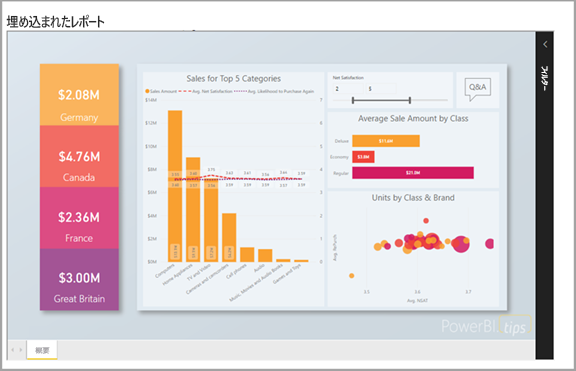
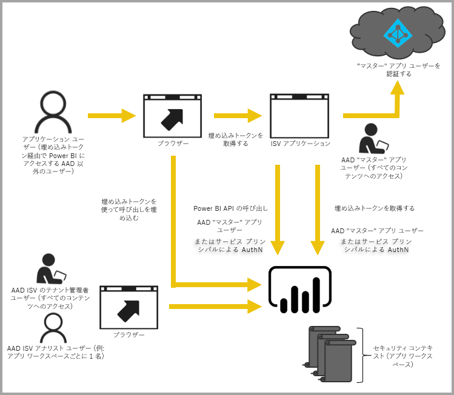

# Power BI で埋め込み

Power BI サービス (SaaS) と Azure (PaaS) の Power BI Embedded サービスには、ダッシュボードとレポートの埋め込み用の API があります。 この機能は、コンテンツを埋め込む際に、ダッシュボード、ゲートウェイ、アプリ ワークスペースなどの最新の Power BI 機能を用意してそれらにアクセスできることを意味します。

[埋め込みセットアップ ツール](https://aka.ms/embedsetup)に移動し、すばやく開始してサンプル アプリケーションをダウンロードすることができます。

適切なソリューションを選択します。

* [組織向けの埋め込み](embedding.md#embedding-for-your-organization)を使って、Power BI サービスを拡張することができます。 [組織向けの埋め込み](https://aka.ms/embedsetup/UserOwnsData)ソリューションを実行します。
* [顧客向けの埋め込み](embedding.md#embedding-for-your-customers)では、Power BI のアカウントがないユーザーのためにダッシュボードとレポートを埋め込むことができます。 [顧客向けの埋め込み](https://aka.ms/embedsetup/AppOwnsData)ソリューションを実行します。

## API を使用する

Power BI コンテンツを埋め込む主なシナリオは 2 つあります。  組織内の (Power BI のライセンスを所有している) ユーザー向けの埋め込みと、Power BI ライセンスを所有する必要がないユーザーおよび顧客向けの埋め込みです。 Power BI REST API は両方のシナリオに対応します。

Power BI ライセンスのない顧客やユーザーの場合、同じ API を使用して、組織用と顧客用のダッシュボードやレポートをカスタム アプリケーションに埋め込むことができます。 顧客は、アプリケーションで管理されているデータを参照します。 組織内の Power BI ユーザーの場合は、埋め込みアプリケーションのコンテキストまたは Power BI で*組織のデータ*を直接表示するための追加オプションが提供されます。 埋め込みのニーズに合わせて JavaScript や REST API を最大限に活用できます。

埋め込みの動作のサンプルについては、[JavaScript 埋め込みサンプル](https://microsoft.github.io/PowerBI-JavaScript/demo/)をご覧ください。

## 組織向けの埋め込み

**組織向けの埋め込み**を使って、Power BI サービスを拡張することができます。 組織向けの埋め込みの場合、コンテンツを表示する際に、アプリケーションのユーザーは Power BI サービスにサインインする必要があります。 サインインした組織のユーザーは、自分が所有しているか、あるいは Power BI サービスで共有されているダッシュボードとレポートにのみアクセスできます。

*組織向けの埋め込みの例としては、[SharePoint Online](https://powerbi.microsoft.com/blog/integrate-power-bi-reports-in-sharepoint-online/)、[Microsoft Teams の統合 (管理者権限が必要です)](https://powerbi.microsoft.com/blog/power-bi-teams-up-with-microsoft-teams/)、[Microsoft Dynamics](https://docs.microsoft.com/dynamics365/customer-engagement/basics/add-edit-power-bi-visualizations-dashboard) などの内部のアプリケーションがあります。*

組織向けの埋め込みについては、以下をご覧ください。

* [レポートをアプリに統合する](embed-sample-for-your-organization.md)

編集や保存などのセルフサービス機能は、Power BI ユーザー向けの埋め込みの際に [JavaScript API](https://github.com/Microsoft/PowerBI-JavaScript) を介して使用できます。

[埋め込みセットアップ ツール](https://aka.ms/embedsetup/UserOwnsData)を利用すれば、組織向けの埋め込みをすぐに始めることができます。サンプル アプリケーションをダウンロードし、組織向けのレポートを段階的に組み込むことができます。

## 顧客向けの埋め込み

**顧客向けの埋め込み**では、Power BI のアカウントがないユーザーのためにダッシュボードとレポートを埋め込むことができます。 顧客向けの埋め込みは、**Power BI Embedded** とも呼ばれます。

[Power BI Embedded](azure-pbie-what-is-power-bi-embedded.md) は **Microsoft Azure** サービスの 1 つです。独立系ソフトウェア ベンダー (ISV) と開発者はこのサービスを使用して、容量ベースの時間単位の課金モデルでビジュアル、レポート、ダッシュボードをアプリケーションに簡単に埋め込むことができます。

Power BI Embedded は ISV とその開発者、顧客に対して利点があります。 たとえば、ISV は、Power BI Desktop を使用して無料でビジュアルの作成を開始できます。 ISV は、ビジュアル分析開発の労力を最小化することで市場投入までの時間を短縮でき、差別化されたデータによって競合他社の中で際立つことができます。 ISV はさらに埋め込み分析によって生じる付加価値に対する追加料金を請求することも選択できます。

Power BI Embedded を使用する場合、顧客は Power BI について何も知る必要がなくなります。 埋め込みアプリケーションを作成するために必要な Power BI Pro アカウントは 1 つのみです。 Power BI Pro アカウントは、アプリケーションのマスター アカウントとして機能します (プロキシ アカウントと考えることができます)。 Power BI Pro アカウントを使用して、アプリケーションが所有/管理する Power BI サービス内のダッシュボードとレポートにアクセスできる埋め込みトークンも生成できます。

開発者は Power BI Embedded を使用すると、ビジュアルと分析の開発ではなく、自社のアプリケーションのコア コンピテンシーの構築に時間を費やすことができます。 開発者は顧客のレポートとダッシュボードの需要をすばやく満たし、完全に文書化された API と SDK に簡単に埋め込むことができます。 ナビゲーションが簡単なデータ探索をアプリで有効にすることで、ISV の顧客は、どのデバイスからでも迅速にデータ ドリブンの意思決定を下すことができるようになります。

> [!IMPORTANT]
> 埋め込みが Power BI サービスに依存する場合でも、顧客が Power BI に依存することはありません。 ユーザーは、アプリケーションに埋め込まれたコンテンツを表示するために Power BI にサインアップする必要はありません。

運用環境に移行する準備ができたら、アプリ ワークスペースを専用の容量に割り当てる必要があります。 Microsoft Azure の Power BI Embedded には、アプリケーションに使用できる[専用の容量](azure-pbie-create-capacity.md)が用意されています。

埋め込み方法の詳細については、「[Power BI ダッシュボード、レポート、およびタイルを埋め込む方法](embed-sample-for-customers.md)」を参照してください。

## 次の手順

Power BI コンテンツをアプリケーションに埋め込んだり、顧客向けに Power BI コンテンツを埋め込んだりすることができます。

> [!div class="nextstepaction"]
> [組織向けの埋め込み](embed-sample-for-your-organization.md)

> [!div class="nextstepaction"]
> [Power BI Embedded とは何ですか?](azure-pbie-what-is-power-bi-embedded.md)

> [!div class="nextstepaction"]
>[顧客向けに埋め込む](embed-sample-for-customers.md)

他にわからないことがある場合は、 [Power BI コミュニティで質問してみてください](http://community.powerbi.com/)。