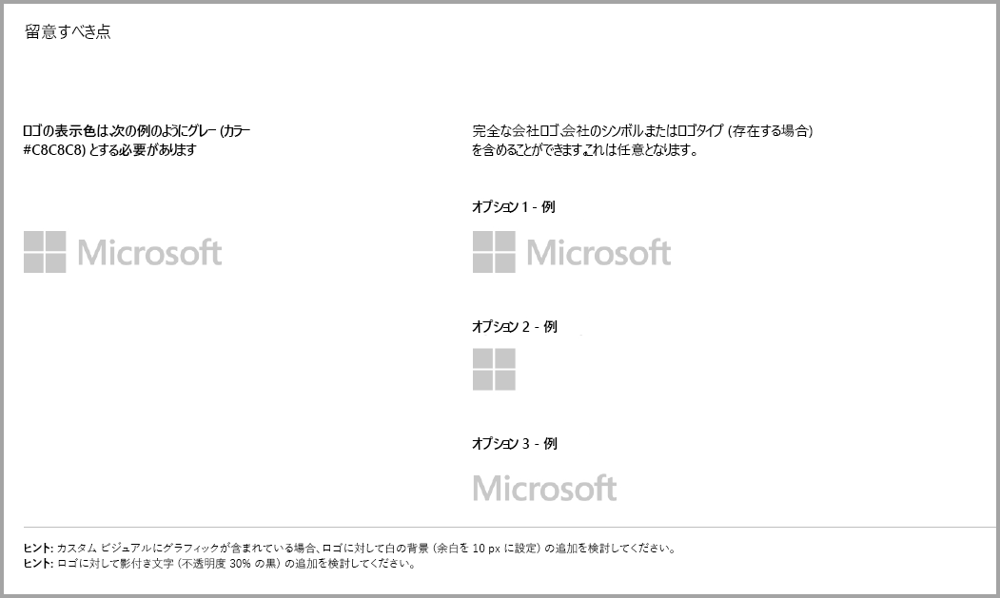
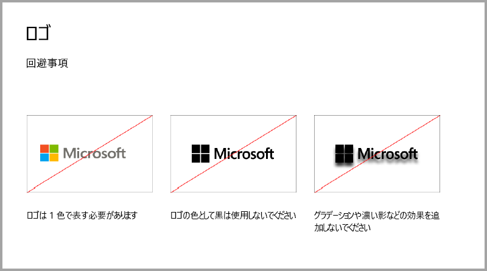
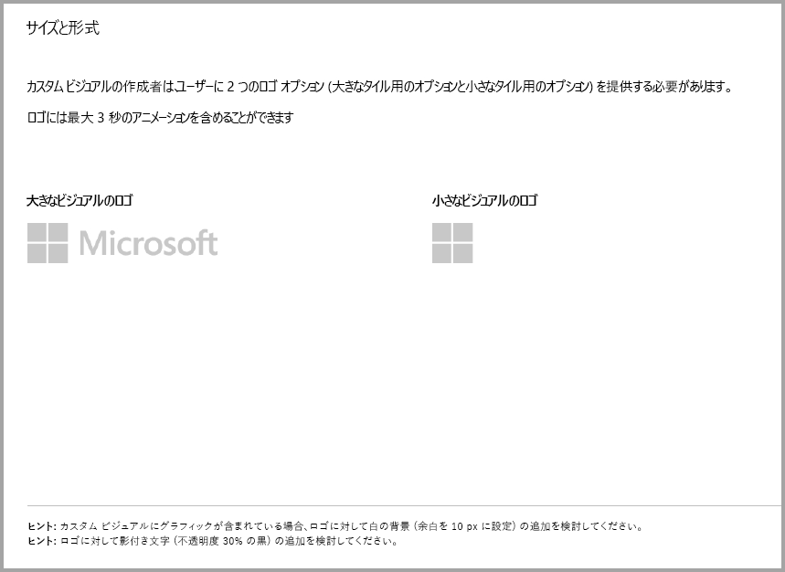
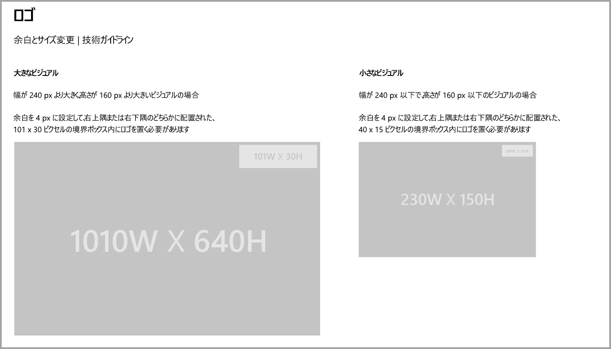
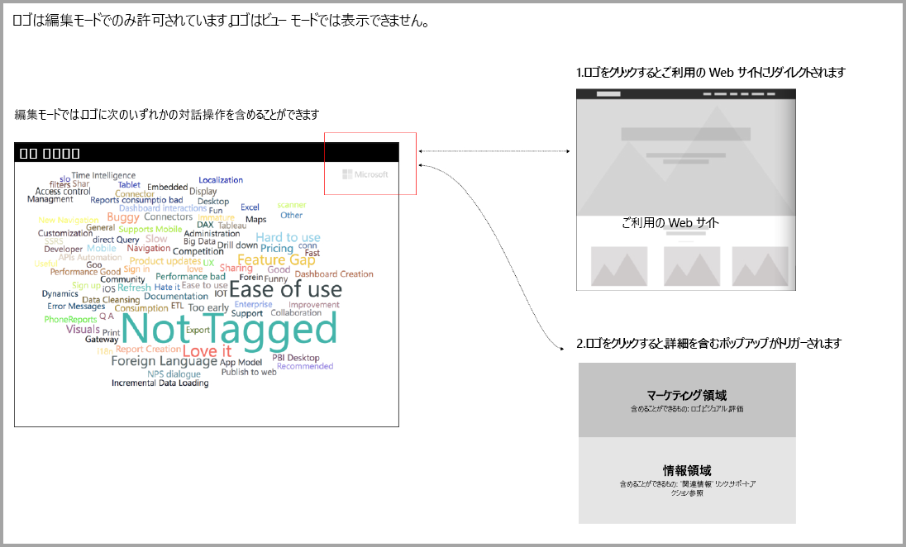

# Power BI ビジュアルのガイドライン
他のユーザーが検出して使用できるように自分のビジュアルを AppSource に[発行](https://docs.microsoft.com/power-bi/developer/office-store)する前に、ユーザー向けに優れたエクスペリエンスを作成するためのガイドラインに従っていることを確認してください。 

## コンテキスト メニュー
コンテキスト メニューは、ユーザーがビジュアルの上にマウス ポインターを置いたときに表示される右クリック メニューです。
すべての Power BI ビジュアルでは、コンテキスト メニューを使用して、統一されたエクスペリエンスを実現できます。 コンテキスト メニューを追加する方法については、[こちらの記事](https://github.com/Microsoft/PowerBI-visuals/blob/gh-pages/tutorials/building-bar-chart/adding-context-menu-to-the-bar.md)をご覧ください。

## ロゴのガイドライン
> [!NOTE]
> この記事に含まれている単語のロゴは、以下の図で説明されているように任意の営利企業のアイコンを示しています。 

このセクションでは、Power BI ビジュアルにロゴを追加するための仕様について説明します。 ロゴは必須ではありません。 追加する場合、これらのガイドラインに従う必要があります。 

> [!IMPORTANT]
> ロゴは*編集モードでのみ*許可されます。 ロゴはビュー モードでは表示*できません*。

閲覧モードにおけるわかりやすいアイコンが存在する場合は、上記のロゴのように色、サイズ、場所に従う必要があります。

## Power BI ビジュアルの追加購入のガイドライン

最近まで、Marketplace (AppSource) では、無料の Power BI ビジュアルのみが受け付けられていました。 このポリシーが変更され (2018 年 12 月)、"追加購入が必要になる場合があります" の価格タグが付いているビジュアルも AppSource に送信できるようになりました。 

"追加購入が必要になる場合がある" ビジュアルは、Office ストアのアプリ内購入 (IAP) アドインと似ています。 開発者はこれらのビジュアルを、AppSource チームの承認後、認定の要件に準拠していることを確認してから、認定のために送信することも可能です。 要件の詳細については、[認定済み Power BI ビジュアル](../power-bi-custom-visuals-certified.md)に関するページをご覧ください。

> [!NOTE]
> ビジュアルが認定されるには、外部サービスやリソースにはアクセスしないようにする必要があります。

>[!IMPORTANT]  
> ビジュアルを無料から "追加購入が必要になる場合があります" に更新する場合、ユーザーは、更新前に同じレベルの無料の機能を受け取る必要があります。 既存の無料機能に加えて、オプションの高度な有料機能を追加できます。 高度な機能を備えた IAP ビジュアルは新しいビジュアルとして送信し、既存の無料のものを更新しないようにすることをお勧めします。

## 送信プロセスの変更点

開発者は IAP ビジュアルを、無料のビジュアルと同様に販売者のダッシュボードを使用して AppSource にアップロードします。 開発者は、送信したビジュアルに IAP 機能が含まれることを示すために、販売者のダッシュボードのメモに "Visual with in-app purchase" (アプリ内購入があるビジュアル) と記載する必要があります。 また、開発者は検証チームが IAP 機能を検証できるように、ライセンス キーやトークンを提供する必要があります。 ビジュアルが検証されて承認されたら、IAP ビジュアル用の AppSource の一覧で、価格オプションの下に "追加購入が必要になる場合があります" と記載されます。

## IAP 機能のある Power BI ビジュアルとは

IAP ビジュアルは*無料の機能*を提供する*無料の*ビジュアルです。 これは、操作するために追加料金が適用される場合がある、いくつかの高度な機能も持っています。 開発者は、ビジュアルの説明で、操作のために追加購入が必要となる機能についてユーザーに通知する必要があります。 現在、Microsoft は、アプリおよびアドインの購入をサポートするためのネイティブ API を提供していません。

開発者は、これらの購入に対し、任意のサードパーティ製の支払いシステムを使うことができます。 詳細については、[ストアのポリシー](https://docs.microsoft.com/office/dev/store/validation-policies#2-apps-or-add-ins-can-display-certain-ads)に関する記事をご覧ください。

> [!NOTE]
> 無料の機能または無料のビジュアルでは、透かしを使用できません。 透かしは、有効なライセンスなしに使用される有料の機能でのみ使用できます。 有効なライセンスなしに高度な有料機能が使用される場合は、すべてのライセンス関連情報を含むポップアップ ウィンドウを表示することをお勧めします。  

## ベスト プラクティス

### ビジュアルのランディング ページ

ランディング ページを使用すると、ユーザーにご自分のビジュアルの使用方法およびライセンスの購入場所を明確にできます。 自動でトリガーされる動画は含めないでください。 ライセンス購入の詳細に関する情報やリンク、および IAP 機能の使用方法など、ユーザーのエクスペリエンスの向上に役立つ資料のみを追加してください。

### ライセンス キーおよびトークン

ユーザーの利便性のために、書式ウィンドウの上部にライセンス キーやトークン関連のフィールドを追加します。

## よく寄せられる質問

ビジュアルについて詳しくは、[追加購入を含むビジュアルについてよく寄せられる質問](https://docs.microsoft.com/power-bi/power-bi-custom-visuals-faq#visuals-with-additional-purchases)に関する記事をご覧ください。

## 次の手順

[AppSource](office-store.md) にカスタム ビジュアルを発行して、他のユーザーが見つけたり使用したりすることができるようにする方法について説明します。
