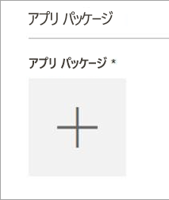

# カスタム ビジュアルを AppSource に発行する

AppSource にカスタム ビジュアルを発行して、他のユーザーが見つけたり使用したりすることができるようにする方法について説明します。

カスタム ビジュアルを作成した後は、AppSource に発行することで、他のユーザーがそれを探して使用できるようにすることができます。 これを可能にするには、事前に終えておく必要がある準備がいくつかあります。 カスタム ビジュアルの作成方法に関する詳細については、「[Developing a Power BI Custom Visual](custom-visual-develop-tutorial.md)」(Power BI カスタム ビジュアルの作成) を参照してください。

   

## AppSource とは

**AppSource** は、Microsoft 製品とサービスの SaaS アプリとアドインを検索する場所です。 [AppSource](https://appsource.microsoft.com/marketplace/apps?product=power-bi-visuals) は、Office 365、Dynamics 365、Cortana Intelligence などの何百万人ものユーザーを、これまでより効率よく、より洞察的で美しい仕事をするのに役立つソリューションに結び付けます。

## カスタム ビジュアルを送信する準備

カスタム ビジュアルのコーディングと[テスト](https://github.com/Microsoft/PowerBI-visuals/blob/master/Tutorial/SubmissionTesting.md)が完了し、pbiviz ファイルにパッケージ化した後は、次のものも送信できる状態にする必要があります。

| 項目 | 必須 | 説明 |
| --- | --- | --- |
| 必要なすべてのメタデータを含む pbiviz パッケージ |はい |ビジュアル名 表示名 GUID バージョン 説明 作成者名とメール アドレス |
| サンプルの .pbix レポート ファイル |はい |ビジュアルを紹介するには、ユーザーがビジュアルをよく理解できるようにする必要があります。 ユーザーにとってのビジュアルの価値を強調し、使用例や書式設定オプションなどを示す必要があります。ヒントと秘訣や避けるべきことなどを説明した "*ヒント*" ページを最後に追加することもできます。 サンプルの .pbix レポート ファイルは、外部に接続していないオフラインの状態で動作する必要があります |
| アイコン |はい |ストアの先頭に表示されるカスタム ビジュアルのロゴを含める必要があります。 使用できる形式は、.png、.jpg、.jpeg、.gif です。 大きさはちょうど 300 (幅) x 300 (高さ) ピクセルにする必要があります。 **重要!** アイコンを送信する前に[簡単なガイド](https://docs.microsoft.com/office/dev/store/craft-effective-appsource-store-images)をよくお読みください。 |
| スクリーンショット |はい |少なくとも 1 つのスクリーンショットを提供する必要があります。 使用できる形式は、.png、.jpg、.jpeg、.gif です。 大きさはちょうど 1366 (幅) x 768 (高さ) ピクセルにする必要があります。 ファイルのサイズは 1024 KB 以下でなければなりません。 *使いやすくするには、各スクリーンショットの重要な機能の価値提案がはっきりわかる吹き出しを追加します。* |
| サポート ダウンロード リンク |はい |ビジュアルに問題がある顧客をサポートするための URL を提供します。 このリンクは SellerDashboard リストの一部として入力され、AppSource 上のビジュアルのリストにアクセスしたユーザーに表示されます。 https:// または http:// を含む URL の形式を使う必要があります。 |
| プライバシーに関するドキュメントへのリンク |はい |ビジュアルを使うユーザーに対するプライバシー ポリシーへのリンクを提供します。 このリンクは SellerDashboard リストの一部として入力され、AppSource 上のビジュアルのリストにアクセスしたユーザーに表示されます。 https:// または http:// を含むリンクの形式にする必要があります。 |
| エンド ユーザー使用許諾契約 (EULA) |はい |EULA ファイルをアップロードする必要があります。 独自の EULA を使うことも、Power BI カスタム ビジュアル向けの Office ストアで用意されている既定の EULA を使うこともできます。 既定の EULA を使うには、販売者ダッシュボードの "使用許諾契約書" ファイル アップロード ダイアログ ボックスに[https://visuals.azureedge.net/app-store/Power BI - Default Custom Visual EULA.pdf](https://visuals.azureedge.net/app-store/Power%20BI%20-%20Default%20Custom%20Visual%20EULA.pdf) の URL を貼り付けます。 |
| ビデオへのリンク |いいえ |カスタム ビジュアルに対するユーザーの関心を高めるには、ビジュアルに関するビデオへのリンクを提供することをお勧めします。 https:// または http:// を含む URL の形式を使う必要があります。 |
| GitHub リポジトリ |いいえ |他の開発者がフィードバックを提供したりコードの改善を提案したりできるように、ビジュアルのソースとサンプル データを置いた [GitHub](https://www.github.com) リポジトリへの有効なパブリック リンクを提供することをお勧めします。 |

## Power BI に送信する

送信は、Power BI カスタム ビジュアル送信チームに電子メールを送ることで開始します。 [pbivizsubmit@microsoft.com](mailto:pbivizsubmit@microsoft.com) にメールを送ってください。

> [!IMPORTANT]
> .pbiviz パッケージを作成する前に、pbiviz.json ファイルの "description"、"supportUrl"、"author"、"name"、"email" の各フィールドを入力する必要があります。

メールには、**.pbiviz ファイル**と**サンプル レポートの .pbix ファイル**を添付します。 Power BI チームは、アップロードの説明とアプリ パッケージ XML ファイルを返信します。 Office デベロッパー センターを通じてビジュアルを送信するには、この XML アプリ パッケージが必要です。

> [!NOTE]
> 品質を高め、既存のレポートが壊れていないことを確認するため、既存のビジュアルの更新が運用環境に提供されるには、ストアでの承認後さらに 2 週間かかります。

## AppSource への送信

Power BI チームからアプリ パッケージ XML を受け取った後は、[デベロッパー センター](https://sellerdashboard.microsoft.com/Application/Summary)に移動して、AppSource にビジュアルを送信します。

> [!NOTE]
> [Office デベロッパー センター](https://dev.office.com/)にログインするには、有効な Office 開発者アカウントが必要です。 Office 開発者アカウントは、Microsoft アカウント (Live ID、hotmail.com、outlook.com など) である必要があります。

> [!IMPORTANT]
> AppSource に送信する前に、.pbiviz ファイルと .pbix ファイルをメールで Power BI チームに送る必要があります。 これにより、Power BI チームはパブリック共有サーバーにファイルをアップロードできるようになります。 それ以外の場合、ストアはファイルを取得できません。 新しいビジュアルの送信、既存のビジュアルの更新、および拒否された送信に対する修正を行うたびに、ファイルを送信する必要があります。

### ビジュアルの送信手順

以下の手順に従って、送信を行います。

1. **[新しいアプリの追加]** を選びます。

    

2. **[Power BI カスタム ビジュアル]** を選び、**[次へ]** を選びます。

3. **[アプリ パッケージ]** の下の **[+]** を選び、[ファイルを開く] ダイアログ ボックスで、Power BI チームから提供されたアプリ パッケージ XML ファイルを選びます。

    

4. これが有効な Power BI アプリ パッケージである承認を受ける必要があります。

    

5. **[全般情報]** の詳細を入力します。

   * *[Submission title]\(送信タイトル\):* デベロッパー センターで送信に名前を付ける方法です
   * *[バージョン]:* バージョン番号はアドイン アプリ パッケージから自動的に入力されます。
   * *[リリース日 (UTC)]:* アプリをストアにリリースする日付を選びます。 将来の日付を選んだ場合、その日になるまでアプリはストアで提供されません。
   * *[カテゴリ]:* 最初のカテゴリには、"データのビジュアル化 + BI" が自動的に入力されます。 すべての Power BI カスタム ビジュアルにはこのようにタグ付けされます。 ユーザーがビジュアルを簡単に検索できるように、最大 2 つのカテゴリを追加指定できます。
   * *[テスト用メモ]:* (省略可能) Microsoft のテスト担当者に対する説明がある場合は入力します。
   * *[このアプリは、暗号化を呼び出したり、サポートしたり、組み込んだり、使用したりします]:* オフのままにします。
   * *[このアドインを iPad の Office アドイン カタログで利用できる状態にする]:* オフのままにします。
6. **[アプリ ロゴ]** の **[+]** を選んで、ビジュアルのロゴをアップロードします。 [ファイルを開く] ダイアログ ボックスでアイコン ファイルを選びます。 ファイルは、.png、.jpg、.jpeg、または .gif でなければなりません。 大きさはちょうど 300 (幅) x 300 (高さ) ピクセル、サイズは 512 KB 以下にする必要があります。

    

7. **[サポート ドキュメント]** の詳細を入力します。

   * サポート ドキュメントへのリンク
   * プライバシーに関するドキュメントへのリンク
   * ビデオへのリンク
   * 使用許諾契約書 (EULA)

       EULA ファイルをアップロードする必要があります。 独自の EULA を使うことも、Power BI カスタム ビジュアル向けの Office ストアで用意されている既定の EULA を使うこともできます。 既定の EULA を使うには、販売者ダッシュボードの "使用許諾契約書" ファイル アップロード ダイアログ ボックスに[https://visuals.azureedge.net/app-store/Power BI - Default Custom Visual EULA.pdf](https://visuals.azureedge.net/app-store/Power%20BI%20-%20Default%20Custom%20Visual%20EULA.pdf) の URL を貼り付けます。

8. **[次へ]** を選び、**[詳細]** ページに進みます。

9. **[言語]** を選び、一覧から言語を選びます。

    

10. [説明] の詳細を入力します。

    * *[アプリケーション名 (この言語)]:* ストアに表示するアプリのタイトルを入力します。
    * *[簡潔な説明]:* ストアに表示するアプリの簡単な説明を入力します (半角 100 文字以下)。 この説明は、ロゴと共に最上位のページに表示されます。 pbiviz パッケージの説明を使うことができます。
    * *[詳細な説明]:* 顧客がアプリの詳細ページで見るアプリのより詳細な説明を提供します。 コミュニティで改善できるようにビジュアルをオープン ソースにする場合は、GitHub などのパブリック リポジトリへのリンクをここで提供します。

11. 少なくとも 1 つのスクリーンショットをアップロードします。 使用できる形式は、.png、.jpg、.jpeg、.gif です。 大きさはちょうど 1366 (幅) x 768 (高さ) ピクセルにする必要があります。 ファイルのサイズは 1024 KB 以下でなければなりません。 *使いやすくするには、各スクリーンショットの重要な機能の価値提案がはっきりわかる吹き出しを追加します。*

12. 言語をさらに追加したい場合は、**[言語の追加]** を選び、手順 10 と 11 を繰り返します。 言語を追加すると、ユーザーは自分の言語でカスタム ビジュアルの詳細を読むことができます。 一覧に表示されない言語は、既定で最初に選んだ言語に設定されます。

13. 言語の追加が済んだら、**[次へ]** を選んで、**[アクセス禁止]** ページに進みます。

14. 特定の国または地域の顧客がアプリを使用または購入できないようにする場合は、チェック ボックスをオンにして一覧から選びます。

15. **[次へ]** を選び、**[価格]** ページに進みます。

16. 現在は、"*無料*" のビジュアルのみがサポートされており、ビジュアルの内部での追加購入 (アプリ内購入) は許可されていません。 **[このアプリは無料です]** を選びます。

    > [!NOTE]
    > 無料以外の他のオプションを選んだ場合、または提出されたビジュアルにアプリ内購入コンテンツが含まれる場合、申請は却下されます。

17. **[下書きとして保存]** を選んで後で送信するか、または **[承認のため送信]** を選んでカスタム ビジュアルを Office ストアに送信することができます。

## 送信の状態と使用状況の追跡

[検証ポリシー](https://dev.office.com/officestore/docs/validation-policies#13-power-bi-custom-visuals)を確認できます。

送信後は、[アプリ ダッシュボード](https://sellerdashboard.microsoft.com/Application/Summary/)で送信の状態を見ることができます。

## 視覚エフェクトの認定

視覚エフェクトが作成されたら、任意でそれを認定できます。 これは Power BI サービス内で実行できること、PowerPoint へのエクスポートなど、このサービスの他の機能と連動できることを意味します。 詳細については、「[カスタム ビジュアルの*認定*を受ける](../power-bi-custom-visuals-certified.md)」を参照してください。

## 次の手順

[Power BI カスタム ビジュアルの開発](custom-visual-develop-tutorial.md)  
[Power BI での視覚化](../visuals/power-bi-report-visualizations.md)  
[Power BI でのカスタム ビジュアル](../power-bi-custom-visuals.md)  
[カスタム ビジュアルの*認定*を受ける](../power-bi-custom-visuals-certified.md)

他にわからないことがある場合は、 [Power BI コミュニティで質問してみてください](http://community.powerbi.com/)。
