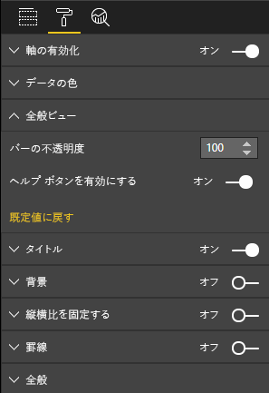

# <a name="launch-url"></a>URL の起動

Launch URL では、実際の作業を Power BI に委任することによって、新しいブラウザー タブ (またはウィンドウ) を開くことができます。

## <a name="sample"></a>サンプル

```typescript
   this.host.launchUrl('https://powerbi.microsoft.com');
```

## <a name="usage"></a>Usage

`host.launchUrl()` API 呼び出しを使用して、送信先 URL を文字列引数として渡します。

```typescript
this.host.launchUrl('http://some.link.net');
```

## <a name="restrictions"></a>制限事項

* 絶対パスのみを使用します。相対パスは使用しません。 `http://some.link.net/subfolder/page.html` は問題ありませんが、`/page.html` では開きません。
* 現在、`http` および `https` のプロトコルのみがサポートされています。 `ftp` や `mailto` などは避けてください。

## <a name="best-practices"></a>ベスト プラクティス

1. ほとんどの場合で、ユーザーの明示的なアクションへの応答としてのみリンクを開くことをお勧めします。 リンクまたはボタンをクリックすると新しいタブが開くことを、ユーザーが容易に理解できるようにしてください。ユーザーのアクションがないまま、または別のアクションの副作用として `launchUrl()` 呼び出しをトリガーすると、ユーザーを混乱させたりユーザーに不満を抱かせたりする場合があります。
2. ビジュアルが正しく機能するためにリンクが重要というわけでない場合、レポートの作成者に、リンクを無効にしたり非表示にしたりする方法を提供することをお勧めします。 これは特に、サードパーティのアプリケーションにレポートを埋め込む場合や、それを Web に公開する場合など、特殊な Power BI ユースケースに関連します。
3. `launchUrl()` 呼び出しを、ループ内、ビジュアルの `update` 関数、またはその他の頻繁に繰り返されるコードからトリガーしないようにします。

## <a name="step-by-step-example"></a>ステップ バイ ステップの例

### <a name="adding-a-link-launching-element"></a>リンク起動要素の追加

次の行がビジュアルの `constructor` 関数に追加されました。

```typescript
    this.helpLinkElement = this.createHelpLinkElement();
    options.element.appendChild(this.helpLinkElement);
```

また、アンカー要素を作成およびアタッチするプライベート関数が追加されました。

```typescript
private createHelpLinkElement(): Element {
    let linkElement = document.createElement("a");
    linkElement.textContent = "?";
    linkElement.setAttribute("title", "Open documentation");
    linkElement.setAttribute("class", "helpLink");
    linkElement.addEventListener("click", () => {
        this.host.launchUrl("https://docs.microsoft.com/power-bi/developer/custom-visual-develop-tutorial");
    });
    return linkElement;
};
```

最後に、visual.less ファイル内のエントリによって、リンク要素のスタイルが次のように定義されます。

```less
.helpLink {
    position: absolute;
    top: 0px;
    right: 12px;
    display: block;
    width: 20px;
    height: 20px;
    border: 2px solid #80B0E0;
    border-radius: 20px;
    color: #80B0E0;
    text-align: center;
    font-size: 16px;
    line-height: 20px;
    background-color: #FFFFFF;
    transition: all 900ms ease;

    &:hover {
        background-color: #DDEEFF;
        color: #5080B0;
        border-color: #5080B0;
        transition: all 250ms ease;
    }

    &.hidden {
        display: none;
    }
}
```

### <a name="adding-a-toggling-mechanism"></a>切り替え機構の追加

これには、レポートの作成者がリンク要素の表示を切り替えることができるように (既定では非表示に設定されます)、静的オブジェクトの追加が必要です ([静的オブジェクトのチュートリアル](https://microsoft.github.io/PowerBI-visuals/docs/concepts/objects-and-properties)に関する記事を参照)。
`showHelpLink` ブール型静的オブジェクトが `capabilities.json` オブジェクト エントリに追加されました。

```typescript
"objects": {
    "generalView": {
            "displayName": "General View",
            "properties":
                "showHelpLink": {
                    "displayName": "Show Help Button",
                    "type": {
                        "bool": true
                    }
                }
            }
        }
    }
```



また、ビジュアルの `update` 関数に次の行が追加されました。

```typescript
if (settings.generalView.showHelpLink) {
    this.helpLinkElement.classList.remove("hidden");
} else {
    this.helpLinkElement.classList.add("hidden");
}
```

要素の表示を制御するために、`hidden` クラスが visual.less で定義されています。
