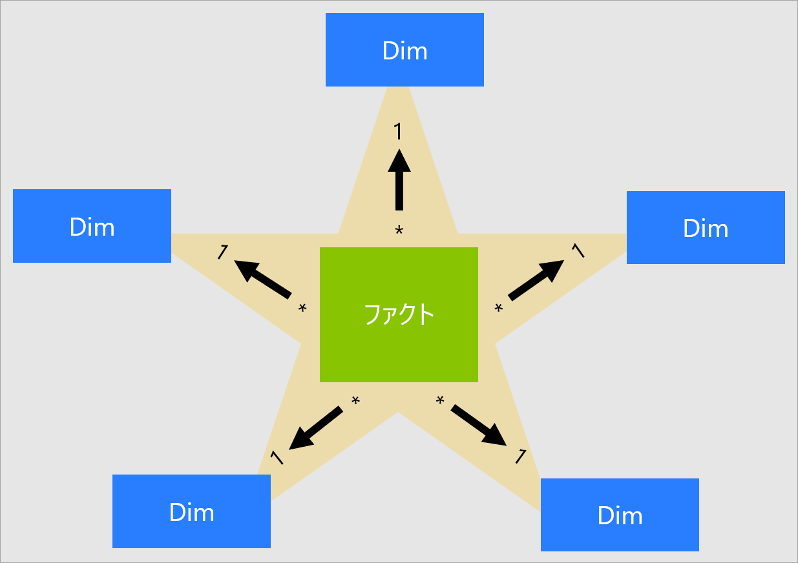
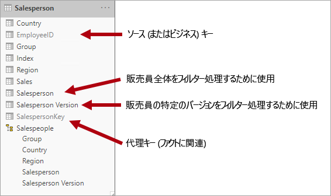

# スター スキーマと Power BI での重要性を理解する

この記事は、Power BI Desktop データ モデラーを対象としています。 スター スキーマの設計と、パフォーマンスおよび使いやすさのために最適化された Power BI データ モデルの開発とのその関連性について説明します。

この記事は、スター スキーマの設計に関する完全な説明を提供するためのものではありません。 詳細については、次のような出版されているコンテンツを直接参照してください: **The Data Warehouse Toolkit: The Complete Guide to Dimensional Modeling** (データ ウェアハウス ツールキット: ディメンション モデリングに関する詳細なガイド) (2002 年第 2 版) (著者: Ralph Kimball 他)。

## スター スキーマの概要

**スター スキーマ**は、リレーショナル データ ウェアハウスで広く採用されている成熟したモデリング手法です。 モデラーは、モデル テーブルを "_ディメンション_" または "_ファクト_" として分類する必要があります。

**ディメンション テーブル**では、ビジネス エンティティ (モデル化の "対象") について説明します。 エンティティには、時間自体を含め、製品、人、場所および概念を含めることができます。 スター スキーマに存在する最も一貫性のあるテーブルは、日付ディメンション テーブルです。 ディメンション テーブルには、一意の識別子として機能する 1 つのキー列 (または複数の列) と説明列が含まれています。

**ファクト テーブル**には、観測値やイベントが格納されます。 これらには、販売注文、在庫量、為替レート、気温などがあります。ファクト テーブルには、ディメンション テーブルに関連するディメンション キー列と、数値メジャー列が含まれています。 ディメンション キー列によってファクト テーブルの "_次元_" が決まり、ディメンション キーの値によってファクト テーブルの "_粒度_" が決まります。 たとえば、**Date** と **ProductKey** という 2 つのディメンション キー列がある販売目標を格納するように設計されたファクト テーブルについて考えてみます。 このテーブルに 2 つのディメンションがあることは簡単に理解できます。 しかし、粒度は、ディメンション キーの値を考慮せずに決定することはできません。 この例では、**Date** 列に格納されている値が各月の最初の日であると考えます。 この場合、粒度は月単位の製品レベルとなります。

一般に、ディメンション テーブルには比較的少数の行が含まれます。 一方、ファクト テーブルには非常に多くの行を含めることができ、時間の経過と共に増加し続ける場合があります。

## スター スキーマの Power BI モデルとの関連性

この記事で紹介するスター スキーマの設計と関連する多くの概念は、パフォーマンスと使いやすさのために最適化された Power BI モデルの開発と非常に関連性があります。

各 Power BI レポートのビジュアルで、Power BI モデルに送信されるクエリが生成されるとします (Power BI サービスでデータセットが呼び出される)。 これらのクエリは、モデル データのフィルター処理、グループ化、および集計に使用されます。 適切に設計されたモデルは、フィルター処理とグループ化用のテーブルと、集計用のテーブルを提供するモデルです。 これは、スター スキーマの設計原則に十分適しています。

- ディメンション テーブルでは、"_フィルター処理_" と "_グループ化_" がサポートされます
- ファクト テーブルでは "_集計_" がサポートされます

モデラーによってテーブルの種類 (ディメンションまたはファクト) を構成するために設定されたテーブル プロパティがない場合は、モデル リレーションシップによって決まります。 モデル リレーションシップによって、2 つのテーブル間のフィルター伝達パスが確立されます。これは、テーブルの種類を決定するリレーションシップの**カーディナリティ** プロパティです。 一般的なリレーションシップのカーディナリティは、"一対多" またはその逆の "多対一" です。 "一" 側は常にディメンションの種類のテーブルであり、一方、"多" 側は常にファクトの種類のテーブルとなります。

適切に構造化されたモデル設計には、ディメンションの種類のテーブルまたはファクトの種類のテーブルのいずれかであるテーブルが含まれる必要があります。 単一のテーブルに 2 つの種類を混在させないようにしてください。 また、適所に正しいリレーションシップがある正しい数のテーブルを提供するよう心がけることをお勧めします。 また、ファクトの種類のテーブルでは常に一貫した粒度でデータを読み込むことが重要です。

最後に、最適なモデル設計は科学と芸術にまたがっていることを理解することが重要です。 場合によっては、そうすることが妥当な場合、適切なガイダンスを守らないこともあります。

Power BI モデルに適用できるスター スキーマの設計に関連する概念は、他にも多数あります。 次のようなものが含まれます。

- [メジャー](#measures)
- [代理キー](#surrogate-keys)
- [スノーフレーク ディメンション](#snowflake-dimensions)
- [多様ディメンション](#role-playing-dimensions)
- [緩やかに変化するディメンション](#slowly-changing-dimensions)
- [ジャンク ディメンション](#junk-dimensions)
- [逆ディメンション](#degenerate-dimensions)
- [ファクトレス ファクト テーブル](#factless-fact-tables)

## メジャー

スター スキーマの設計では、**メジャー**は集計する値を格納するファクト テーブルの列です。

Power BI モデルでは、**メジャー**の定義は異なりますが、似ています。 これは、集計を実現する [Data Analysis Expressions (DAX)](https://docs.microsoft.com/dax/data-analysis-expressions-dax-reference) で記述された数式です。 メジャー式では、多くの場合、SUM、MIN、MAX、AVERAGE などの DAX 集計関数を利用して、クエリ時にスカラー値の結果を生成します (値がモデルに格納されることはありません)。 メジャー式には、シンプルな列集計から、フィルター コンテキストやリレーションシップの伝達をオーバーライドする、より高度な数式までさまざまなものがあります。 詳細については、「[Power BI Desktop における DAX の基本事項](https://docs.microsoft.com/power-bi/desktop-quickstart-learn-dax-basics)」の記事をお読みください。

Power BI モデルでは集計を実現するための 2 つ目の方法がサポートされていることを理解しておくことが重要です。 すべての列 (通常は数値列) は、レポートのビジュアルまたは Q&A で集計できます。 これは、メジャーを作成する必要がない多くの場合と同じように、モデル開発者にとって便利です。 たとえば、Adventure Works の再販業者の販売の **[売上高]** 列は、考えられる集計の種類ごとにメジャーを作成することなく、さまざまな方法 (合計、カウント、平均、中央値、最小、最大など) で集計できます。

ただし、シンプルな列レベルの集計の場合でも、メジャーを作成する説得力のある 2 つの理由があります。

- レポート作成者が[多次元式 (MDX)](https://docs.microsoft.com/sql/analysis-services/multidimensional-models/mdx/mdx-query-the-basic-query?view=sql-server-2017) を使用してモデルに対してクエリを実行することがわかっている場合は、モデルにメジャーを含める必要があります。 MDX では列値の集計を実現できません。 これは、MDX を使用して Power BI データセットのクエリが実行される場合に非常に関連があります。これは、[[Excel で分析]](https://docs.microsoft.com/power-bi/service-analyze-in-excel) (ピボットテーブルで MDX クエリを実行する) を使用する場合に当てはまります。
- レポート作成者が特定の方法でのみ列を集計できるようにする必要がある場合、 たとえば、再販業者の販売の **[単価]** 列 (単位あたりのレートを表す) を集計できますが、それは特定の集計関数を使用する場合のみです。 これは、合計することはできませんが、他の集計関数 (min、max、average など) を使用して集計するには適しています。 この場合、モデラーは **[単価]** 列を非表示にして、適切なすべての集計関数のメジャーを作成できます。

この設計手法は、Power BI サービスで作成されたレポートと、Q&A に適していることに注意してください。 ただし、Power BI Desktop のライブ接続を使用すれば、レポート作成者は **[フィールド]** ウィンドウで非表示フィールドを表示できます。これにより、この設計手法が回避される可能性があります。

## 代理キー

**代理キー**は、スター スキーマ モデリングをサポートするためにテーブルに追加する一意の識別子です。 定義上、ソース データに定義されたり、格納されたりすることはありません。 通常、代理キーは、ディメンション テーブルの各行に一意の識別子を提供するために、リレーショナル データ ウェアハウスのディメンション テーブルに追加されます。

Power BI モデルのリレーションシップは、1 つのテーブル内の単一の一意の列に基づいており、フィルターは別のテーブルの単一の列に伝達されます。 モデル内のディメンションの種類のテーブルに単一の一意の列が含まれていない場合は、リレーションシップの "一" の側になるように一意の識別子を追加する必要があります。 Power BI Desktop では、[Power Query のインデックス列](https://docs.microsoft.com/powerquery-m/table-addindexcolumn)を作成することによって、これを簡単に実現できます。

インデックス列も追加できるように、このクエリを "多" 側のクエリと結合する必要があります。 これらのクエリをモデルに読み込むと、モデル テーブル間に一対多のリレーションシップを作成できます。

## スノーフレーク ディメンション

**スノーフレーク ディメンション**は、単一のビジネス エンティティの正規化されたテーブルのセットです。 たとえば、Adventure Works では、商品がカテゴリとサブカテゴリ別に分類されます。 カテゴリがサブカテゴリに割り当てられ、その後、製品がサブカテゴリに割り当てられます。 Adventure Works のリレーショナル データ ウェアハウスでは、製品ディメンションが正規化され、次の 3 つの関連テーブルに格納されます: **DimProductCategory**、**DimProductSubcategory** および **DimProduct**。

想像力を働かせれば、スノーフレーク設計を形成する、ファクト テーブルから外に向けて配置された正規化テーブルを思い描くことができます。

Power BI Desktop では、スノーフレーク ディメンションの設計を模倣したり (おそらく、ソース データで行われているため)、ソース テーブルを単一のモデル テーブルに統合 (非正規化) したりするように選択できます。 一般に、単一のモデル テーブルの利点は、複数のモデル テーブルの利点を上回ります。 最適な決定は、データの量とモデルの使いやすさの要件によって異なる場合があります。

スノーフレーク ディメンションの設計を模倣するように選択した場合:

- Power BI によってより多くのテーブルが読み込まれるため、ストレージとパフォーマンスの観点からは効率が悪くなります。 これらのテーブルには、モデルのリレーションシップをサポートするための列を含める必要があります。これにより、モデルのサイズがより大きくなる可能性があります。
- より長いリレーションシップのフィルター伝達チェーンを走査する必要があり、これにより、単一のテーブルに適用されるフィルターよりも効率が悪くなる可能性があります。
- **[フィールド]** ウィンドウには、レポート作成者に対してより多くのモデル テーブルが示されます。これにより、特にスノーフレーク ディメンション テーブルに 1 つまたは 2 つの列のみが含まれている場合は、直感的な操作が少なくなる可能性があります。
- テーブルにまたがる階層を作成することはできません。

単一のモデル テーブルに統合するように選択した場合は、ディメンションの粒度が最も高いものと低いものを含む階層を定義することもできます。 場合によっては、冗長な非正規化データを格納すると、特に非常に大きなディメンション テーブルでは、モデル ストレージのサイズが増加する可能性があります。

## 緩やかに変化するディメンション

**緩やかに変化するディメンション** (SCD) は、時間の経過に伴うディメンション メンバーの変化を適切に管理するものです。 これは、ビジネス エンティティの値が時間の経過と共に、また、アドホックに変化する場合に適用されます。 _緩やかに_変化するディメンションの良い例として、顧客ディメンション (具体的には、電子メール アドレスや電話番号などの連絡先詳細列) があります。 これに対して、株価など、ディメンションの属性が頻繁に変化する場合、一部のディメンションは_急速に_変化すると見なされます。 このような場合の一般的な設計手法は、急速に変化する属性値をファクト テーブル メジャーに格納することです。

スター スキーマの設計理論では、次の 2 つの一般的な SCD の種類を参照します: 種類 1 と種類 2。 ディメンションの種類のテーブルは、種類 1 や種類 2 の場合もあれば、異なる列に対して両方の種類が同時にサポートされる場合もあります。

### 種類 1 の SCD

**種類 1** の **SCD** では常に最新の値が反映され、ソース データの変更が検出されると、ディメンション テーブルのデータが単に上書きされます。 この設計手法は、顧客の電子メール アドレスや電話番号などの補足値を格納する列では一般的なものです。 顧客の電子メール アドレスまたは電話番号が変更されると、ディメンション テーブルで顧客の行が新しい値で更新されます。 顧客が常にこの連絡先情報を持っているかのように見えます。

Power BI モデルのディメンションの種類のテーブルの非増分更新では、種類 1 の SCD の結果が得られます。 テーブル データを更新し、確実に最新の値が読み込まれるようにします。

### 種類 2 の SCD

**種類 2** の **SCD** では、ディメンション メンバーのバージョン管理がサポートされます。 ソース システムにバージョンが格納されていない場合、これは通常、変更を検出し、ディメンション テーブルの変更を適切に管理するデータ ウェアハウスの読み込みプロセスとなります。 この場合、ディメンション テーブルでは、ディメンション メンバーの "_バージョン_" への一意の参照を提供するために、代理キーを使用する必要があります。 また、バージョンの有効期間の日付範囲 (**StartDate** や **EndDate** など) を定義する列と、場合によってはフラグ列 (**IsCurrent** など) が含まれます。これらは、現在のディメンション メンバーで簡単にフィルター処理するためのものです。

たとえば、Adventure Works では販売員を販売地域に割り当てます。 販売員が地域を再配置した場合、新しいバージョンの販売員を作成し、履歴ファクトを元の地域に関連付けたままにする必要があります。 販売員ごとの売上の正確な履歴分析をサポートするには、ディメンション テーブルに販売員のバージョンと、それらに関連付けられている地域 (複数可) を格納する必要があります。 テーブルには、有効期間を定義するための開始日と終了日の値も含まれている必要があります。 現在のバージョンでは、空の終了日 (または 12/31/9999) を定義できます。これは、その行が現在のバージョンであることを示します。 ビジネス キー (この場合は、従業員 ID) が一意ではないため、テーブルで代理キーも定義する必要があります。

ソース データにバージョンが格納されていない場合は、中間システム (データ ウェアハウスなど) を使用して変更を検出し、格納する必要があることを理解しておくことが重要です。 テーブルの読み込みプロセスでは、既存のデータを保持し、変更を検出する必要があります。 変更が検出された場合、テーブルの読み込みプロセスで現在のバージョンを期限切れにする必要があります。 これを行うには、**EndDate** 値を更新し、前の **EndDate** 値から始まる **StartDate** 値を使用して新しいバージョンを挿入します。 また、関連するファクトでは、時間ベースの参照を使用して、ファクトの日付に関連するディメンション キー値を取得する必要があります。 Power Query を使用する Power BI モデルでは、これを実現できません。 しかし、事前に読み込まれた SCD の種類 2 のディメンション テーブルからデータを読み込むことはできます。

Power BI モデルでは、変更に関係なく、メンバー、およびメンバーの特定の時点の状態を表すメンバーのバージョンの履歴データに対するクエリをサポートする必要があります。 Adventure Works のコンテキストでは、割り当てられた販売地域に関係なく、販売員、または販売員の特定のバージョンに対してクエリを実行することができます。

これを実現するには、Power BI モデルのディメンションの種類のテーブルに、販売員をフィルター処理するための列と、販売員の特定のバージョンをフィルター処理するための別の列を含める必要があります。 バージョン列では、"Michael Blythe (12/15/2008-06/26/2019)" や "Michael Blythe (current)" など、あいまいでない説明を提供することが重要です。 また、レポートの作成者やコンシューマーに SCD 種類 2 の基本と、正しいフィルターを適用して適切なレポート設計を実現する方法について教えることが重要です。

また、ビジュアルでバージョン レベルにドリルダウンできるようにする階層を含めることをお勧めします。

## 多様ディメンション

**多様ディメンション**は、関連するファクトを異なる方法でフィルター処理できるディメンションです。 たとえば、Adventure Works では、日付ディメンション テーブルに再販業者の販売ファクトとの 3 つのリレーションシップがあります。 同じディメンション テーブルを使用して、注文日、出荷日、または納品日でファクトをフィルター処理することができます。

データ ウェアハウスで、受け入れられる設計手法は、単一の日付ディメンション テーブルを定義することです。 クエリ時には、日付ディメンションの "ロール" が、テーブルの結合に使用するファクト列によって確立されます。 たとえば、注文日別に売上を分析する場合、テーブルの結合は再販業者の販売注文日列に関連します。

Power BI モデルでは、2 つのテーブル間に複数のリレーションシップを作成することで、この設計を模倣できます。 Adventure Works の例では、日付および再販業者の販売テーブルに 3 つのリレーションシップがあります。 これは可能ですが、2 つの Power BI モデル テーブル間にはアクティブなリレーションシップが 1 つだけ存在できることを理解することが重要です。 残りのすべてのリレーションシップは非アクティブに設定する必要があります。 単一のアクティブなリレーションシップを持つということは、日付から再販業者の販売への既定のフィルター伝達があることを意味します。 この例では、アクティブなリレーションシップは、レポートで使用される最も一般的なフィルターに設定されます。これは、Adventure Works では注文日のリレーションシップとなります。

非アクティブなリレーションシップを使用する唯一の方法は、[USERELATIONSHIP 関数](https://docs.microsoft.com/dax/userelationship-function-dax)を使用する DAX 式を定義することです。 この例では、モデル開発者は、出荷日と納品日で再販業者の販売を分析できるようにするためのメジャーを作成する必要があります。 これは、特に再販業者テーブルで多くのメジャーが定義されているときに、面倒な場合があります。 また、 **[フィールド]** ウィンドウが乱雑になり、メジャーが過剰になります。 他にも制限があります。

- レポート作成者が、メジャーの定義ではなく、列の集計に依存している場合、レポートレベルのメジャーを記述せずに非アクティブなリレーションシップの集計を実現することはできません。 レポートレベルのメジャーは、Power BI Desktop でレポートを作成する場合にのみ定義できます。
- 日付と再販業者の販売の間のアクティブなリレーションシップ パスが 1 つのみである場合、異なる種類の日付で再販業者の販売を同時にフィルター処理することはできません。 たとえば、出荷済みの販売別に注文日の販売をプロットするビジュアルを生成することはできません。

これらの制限を克服するための一般的な Power BI モデリング手法は、多様インスタンスごとにディメンションの種類のテーブルを作成することです。 通常は、DAX を使用して、[計算テーブル](https://docs.microsoft.com/dax/calculatetable-function-dax)として追加のディメンション テーブルを作成します。 計算テーブルを使用することで、モデルに**日付**テーブル、**出荷日**テーブル、および**納品日**テーブルを含めることができます。各テーブルには、それぞれの再販業者の販売テーブル列との単一のアクティブなリレーションシップがあります。

この設計手法では、異なる日付ロールに対して複数のメジャーを定義する必要はなく、異なる日付ロールで同時にフィルター処理を行うことができます。 しかし、この設計手法の小さな代償として、日付ディメンション テーブルが重複し、その結果、モデルのストレージ サイズが増加することになります。 ディメンションの種類のテーブルでは、通常、ファクトの種類のテーブルと比べて少ない行が格納されるため、これはほとんど問題になりません。

ロールごとにモデルのディメンションの種類のテーブルを作成するときは、次のような優れた設計プラクティスを確認してください。

- 列名が自己記述型であることを確認します。 すべての日付テーブルに **[年]** 列を含めることはできますが (列名がテーブル内で一意である)、既定のビジュアル タイトルでは自己記述されません。 **[出荷日]** テーブルに**出荷年**などの名前の年の列が含まれるように、各ディメンション ロール テーブルの列の名前変更を検討してください。
- 関連性がある場合は、テーブルの説明で、フィルター伝達がどのように構成されているかについて、( **[フィールド]** ウィンドウのヒントを通じて) レポート作成者にフィードバックが提供されることを確認します。 この明確さが重要なのは、モデルに汎用的な名前のテーブル (**日付**など) が含まれている場合です。これは、多くのファクトの種類のテーブルをフィルター処理するために使用されます。 このテーブルに、たとえば、再販業者の販売注文日列とのアクティブなリレーションシップがある場合、"再販業者の販売を注文日別にフィルター処理する" のようなテーブルの説明を指定することを検討してください。

## ジャンク ディメンション

**ジャンク ディメンション**は、特に少数の属性 (おそらく 1 つ) で構成されているディメンションが多数存在し、これらの属性の値が少ない場合に便利です。 適切な候補としては、注文状態列や、顧客人口統計列 (性別、年齢グループなど) があります。

ジャンク ディメンションの設計目標は、多くの "小さな" ディメンションを単一のディメンションに統合し、モデルのストレージ サイズを小さくするだけでなく、モデル テーブルの表示数を減らして **[フィールド]** ウィンドウの乱雑さを減らすことです。

ジャンク ディメンション テーブルは、通常、すべてのディメンションの属性メンバーのデカルト積であり、代理キー列があります。 代理キーでは、テーブルの各行への一意の参照が提供されます。 データ ウェアハウスでディメンションを構築することができます。あるいは、[完全外部クエリ結合](https://docs.microsoft.com/powerquery-m/table-join)を実行してから、代理キー (インデックス列) を追加するクエリを作成するための Power Query を使用することもできます。

このクエリを、ディメンションの種類のテーブルとしてモデルに読み込みます。 また、このクエリをファクト クエリと結合する必要があるため、"一対多" モデル リレーションシップの作成をサポートするために、インデックス列がモデルに読み込まれます。

## 逆ディメンション

**逆ディメンション**では、フィルター処理に必要なファクト テーブルの属性を参照します。 Adventure Works の再販業者の販売注文番号が良い例です。 この場合、この 1 つの列のみで構成される独立したテーブルを作成することは、優れたモデル設計的に意味がありません。モデルのストレージ サイズが大きくなり、 **[フィールド]** ウィンドウが乱雑になるためです。

Power BI モデルでは、販売注文番号列をファクトの種類のテーブルに追加し、販売注文番号でフィルター処理またはグループ化できるようにすることが適切な場合があります。 これは、テーブルの種類を混在させないようにする必要がある (つまり、通常、モデル テーブルはディメンションの種類またはファクトの種類のいずれかである必要がある) という、以前に導入されたルールの例外です。

## ファクトレス ファクト テーブル

**ファクトレス ファクト** テーブルには、メジャー列は含まれません。 ディメンション キーのみが含まれます。

ファクトレス ファクト テーブルには、ディメンション キーによって定義された観測値を格納できます。 たとえば、特定の日付と時刻に、特定の顧客が Web サイトにログインしたとします。 メジャーを定義してファクトレス ファクト テーブルの行をカウントし、顧客がいつログインしたかと、その顧客の数を分析することができます。

ファクトレス ファクト テーブルのより説得力のある用途として、ディメンション間のリレーションシップの格納があります。これは、Power BI モデルの設計手法であり、多対多ディメンションのリレーションシップを定義することをお勧めします。 多対多ディメンション リレーションシップの設計では、ファクトレス ファクト テーブルは "_ブリッジング テーブル_" と呼ばれます。

たとえば、販売者を 1 つ_または複数_の販売地域に割り当てることができるとします。 ブリッジング テーブルは、販売員キーと地域キーという 2 つの列で構成されるファクトレス ファクト テーブルとして設計されます。 両方の列に重複する値を格納できます。

この多対多の設計手法は十分に立証されており、ブリッジング テーブルがなくても実現できます。 しかし、2 つのディメンションを関連付ける場合は、ブリッジング テーブル手法がベスト プラクティスと見なされます。 詳細については、「[Power BI Desktop での多対多カーディナリティのリレーションシップ](https://docs.microsoft.com/power-bi/desktop-many-to-many-relationships)」を参照してください。

## 次の手順

スター スキーマ設計または Power BI モデル設計の詳細については、次の記事を参照してください。

- [ディメンション モデリングに関する Wikipedia の記事](https://go.microsoft.com/fwlink/p/?linkid=246459)
- [Power BI Desktop でのリレーションシップの作成と管理](https://docs.microsoft.com/power-bi/desktop-create-and-manage-relationships)
- [Power BI Desktop での多対多カーディナリティのリレーションシップ](https://docs.microsoft.com/power-bi/desktop-many-to-many-relationships)
- [モデリングに関するガイド付き学習エクスペリエンス](https://docs.microsoft.com/power-bi/guided-learning/modeling)