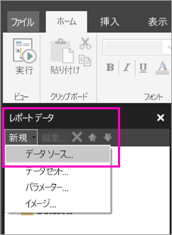

# Power BI サービスでページ分割されたレポート用の埋め込みデータ ソースを作成する (プレビュー)

この記事では、Power BI サービスでページ分割されたレポートの埋め込みデータ ソースを作成および変更する方法について説明します。 埋め込みデータ ソースは、1 つのレポートで定義し、そのレポート内のみで使用します。 現時点では、Power BI サービスに発行されるページ分割されたレポートには、埋め込みデータセットと埋め込みデータ ソースが必要であり、次のデータ ソースに接続できます。

- Azure SQL Database と Data Warehouse
- SQL Server
- SQL Server Analysis Services
- Oracle 
- Teradata 

これらのデータ ソース、使用、 [SQL Server Analysis Services 接続](service-premium-connect-tools.md)オプション。

- Azure Analysis Services
- Power BI Premium のデータセット

ページ分割されたレポートは、ゲートウェイを使用してオンプレミスのデータ ソースに接続します。 ゲートウェイの設定は、Power BI サービスにレポートを発行した後で行います。 詳しくは、「[Power BI ゲートウェイとは](service-gateway-getting-started.md)」をご覧ください。 

## 埋め込みデータ ソースを作成する
  
1. Power BI のレポート ビルダーを開きます。

1. [レポート データ] ペインのツール バーで、 **[新規]**  >  **[データ ソース]** の順に選択します。 **[データ ソースのプロパティ]** ダイアログ ボックスが開きます。

    
  
2.  **[名前]** テキスト ボックスにデータ ソースの名前を入力するか、または既定値をそのまま使用します。  
  
3.  **[レポートに埋め込まれた接続を使用する]** を選択します。  
  
1.  **[接続の種類の選択]** の一覧から、データ ソースの種類を選択します。 

1.  次のいずれかの方法を使用して、接続文字列を指定します。  
  
    -   **[接続文字列]** テキスト ボックスに接続文字列を直接入力します。 
  
    -   式 ( **[fx]** ) ボタンを選択して、接続文字列に評価される式を作成します。 **[式]** ダイアログ ボックスで、[式] ペインに式を入力します。 **[OK]** を選択します。 
  
    -   **[構築]** を選択し、手順 2 で選択したデータ ソースの **[接続プロパティ]** ダイアログ ボックスを開きます。  
  
        **[接続プロパティ]** ダイアログ ボックス内のフィールドに、データソースの種類に応じて適切に入力します。 接続のプロパティには、データ ソースの種類、データ ソースの名前、および使用する資格情報が含まれます。 このダイアログ ボックスで値を指定した後、 **[接続テスト]** を選択して、データ ソースが使用可能であり、指定した資格情報が正しいことを確認します。  
  
4.  **[資格情報]** を選択します。  
  
     このデータ ソースに使用する資格情報を指定します。 データ ソースの所有者は、サポートされている資格情報の種類を選択します。 詳しくは、「[レポート データ ソースに関する資格情報と接続情報を指定する](https://docs.microsoft.com/sql/reporting-services/report-data/specify-credential-and-connection-information-for-report-data-sources)」をご覧ください。
  
5.  **[OK]** を選択します。  
  
     データ ソースが [レポート データ] ペインに表示されます。  

## 次の手順

- [Power BI サービスのページ分割されたレポート用の埋め込みデータセットを作成する](paginated-reports-create-embedded-dataset.md)
- [Power BI Premium のページ分割されたレポートとは(プレビュー)](paginated-reports-report-builder-power-bi.md)
