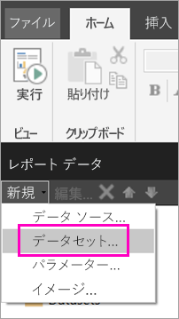
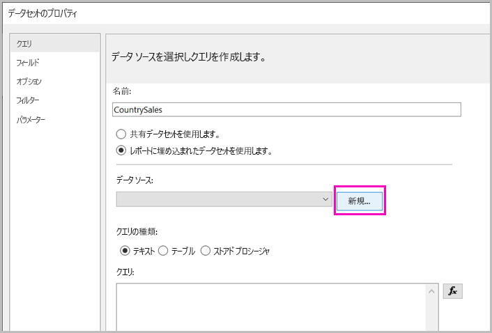
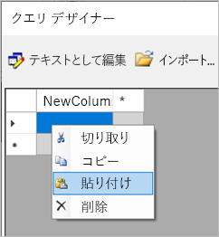
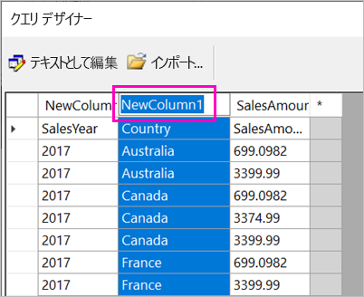
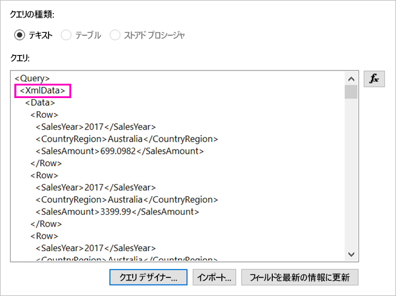

# <a name="enter-data-directly-in-a-paginated-report-in-report-builder-preview---power-bi"></a>レポート ビルダーでページ分割されたレポートにデータを直接入力する (プレビュー) - Power BI

この記事では、新しいバージョンの SQL Server 2016 レポート ビルダーに搭載された、埋め込みデータセットとして RDL レポートにデータを直接入力できる機能を紹介します。  この機能は Power BI Desktop によく似ています。 レポートのデータセットにデータを直接入力したり、Microsoft Excel など、別のプログラムから貼り付けたりできます。 データを入力してデータセットを作成したら、作成した他の埋め込みデータセットの場合と同じようにそれを利用できます。 また、複数のテーブルを追加したり、他のテーブルのフィルターとしてテーブルを利用したりできます。 この機能は特に、レポート パラメーターなど、レポートで場合によっては使用する必要がある、少量の固定データセットに便利です。
 
## <a name="prerequisites"></a>前提条件

- ページ分割されたレポートにデータを直接入力するには、[Microsoft ダウンロード センターからレポート ビルダー](https://www.microsoft.com/download/details.aspx?id=53613)の新しいバージョンをインストールします。 
- ページ分割されたレポートを Power BI サービスに保存するには、[Power BI Pro アカウント](service-self-service-signup-for-power-bi.md)と [Power BI Premium 容量](service-premium.md)のワークスペースへの書き込み許可が必要です。
- ページ分割されたレポートをレポート サーバーに保存するには、[RsReportServer.config ファイルを編集する](#upload-the-paginated-report-to-a-report-server)アクセス許可が必要です。

## <a name="get-started"></a>作業の開始

レポート ビルダーをダウンロードし、インストールしたら、埋め込みのデータ ソースやデータセットをレポートに追加するときと同じワークフローを実行します。 次の手順で、**[データ ソース]** の下に次の新しいオプションが表示されます:**[データの入力]**。  このデータ ソースはレポートで 1 回だけ設定します。 その後、その 1 つのデータ ソースを使用し、入力したデータから複数のテーブルを個々のデータセットとして作成できます。

1. **[レポート データ]** ペインで、**[新規作成]**、**[データセット]** を選択します。

    

1. **[データセットのプロパティ]** ダイアログ ボックスで **[レポートに埋め込まれたデータセットを使用する]** を選択します。

1. **[データ ソース]** の隣にある **[新規作成]** を選択します。

    

1. **[データ ソースのプロパティ]** ダイアログ ボックスで **[レポートに埋め込まれた接続を使用する]** を選択します。
2. **[接続の種類の選択]** ボックスで **[データの入力]**、**[OK]** の順に選択します。

    ![データ ソースの [データの入力]](media/paginated-reports-enter-data/paginated-data-source-properties-enter-data.png)

1. **[データセットのプロパティ]** ダイアログ ボックスに戻り、**[クエリ デザイナー]** を選択します。
2. **[クエリ デザイナー]** ウィンドウで右クリックし、テーブルにデータを貼り付けます。

    

1. 列名を設定するには、各 **NewColumn** をダブルクリックし、列名を入力します。

    

1. 元のデータからの列見出しが最初の行に含まれる場合、右クリックして削除します。
    
9. 既定では、各列のデータ型は文字列です。 データ型を変更するには、列ヘッダーを右クリックして **[型の変更]** を選択し、日付や浮動小数点など、別のデータ型に設定します。

    

1. テーブルの作成が完了したら、**[OK]** を選択します。  

    生成されたクエリは、XML データ ソースの場合と同じになります。 実際には、データ プロバイダーとして XML を使用しています。  このシナリオも有効にするために転用しています。

    

12. **[データセットのプロパティ]** ダイアログ ボックスで、**[OK]** を選択します。

13. **[レポート データ]** ウィンドウにデータ ソースやデータセットが表示されます。

    ![[レポート データ] ウィンドウのデータセット](media/paginated-reports-enter-data/paginated-report-data-pane.png)

レポートのデータ視覚化の基礎として自分のデータセットを使用できます。 別のデータセットを追加し、それに対して同じデータ ソースを使用することもできます。

## <a name="upload-the-paginated-report-to-the-power-bi-service"></a>ページ分割されたレポートを Power BI サービスにアップロードする

これで Power BI サービスでページ分割されたレポートがサポートされたので、ページ分割されたレポートを Premium 容量にアップロードできます。 詳細については、「[ページ分割されたレポートをアップロードする](paginated-reports-save-to-power-bi-service.md#upload-a-paginated-report)」を参照してください。

## <a name="upload-the-paginated-report-to-a-report-server"></a>ページ分割されたレポートをレポート サーバーにアップロードする

ページ分割されたレポートは、Power BI Report Server や SQL Server Reporting Services 2016 または 2017 のレポート サーバーにアップロードすることもできます。 アップロードする前に、追加のデータ拡張機能として RsReportServer.config に次の項目を追加する必要があります。 問題が発生した場合に備え、変更前に RsReportServer.config ファイルのバックアップを作成してください。

```xml
<Extension Name="ENTERDATA" Type="Microsoft.ReportingServices.DataExtensions.XmlDPConnection,Microsoft.ReportingServices.DataExtensions">
    <Configuration>
        <ConfigName>ENTERDATA</ConfigName>
    </Configuration>
</Extension>
```

編集後、構成ファイルのデータ プロバイダー一覧は次のようになります。


作業はここまでです。これで、この新機能を使用するレポートをレポート サーバーに公開できます。

## <a name="next-steps"></a>次の手順

- [Power BI Premium のページ分割されたレポートとは(プレビュー)](paginated-reports-report-builder-power-bi.md)
- [Power BI Report Server とは](report-server/get-started.md)
