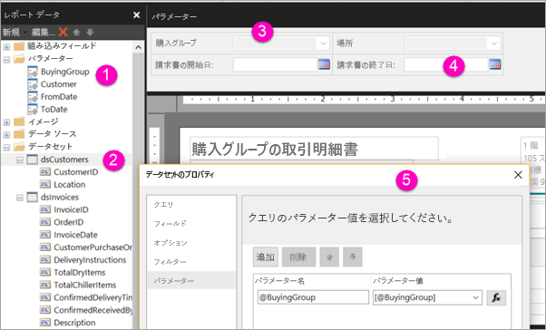

# Power BI サービスでページ分割されたレポートのパラメーターを作成する

この記事では、Power BI サービスでページ分割されたレポートのパラメーターを作成する方法について説明します。  レポート パラメーターは、レポート データを選択し、レポートの体裁を変更する方法を提供します。 ユーザーが既定値および使用可能な値の一覧を指定し、レポート閲覧者が選択内容を変更できます。  

次の図は、@BuyingGroup、@Customer、@FromDate、@ToDate の各パラメーターを指定したレポートの Power BI レポート ビルダーのデザイン ビューを示しています。 
  

  
1.  レポート データ ペインに表示されるレポート パラメーター。  
  
2.  データセット内のいずれかのパラメーターを含むテーブル。  
  
3.  パラメーター ペイン。 パラメーター ペインでは、パラメーターのレイアウトをカスタマイズできます。 
  
4.  @FromDate パラメーターと @ToDate パラメーターのデータ型は **DateTime** です。 レポートを表示する場合は、テキスト ボックスに日付を入力するか、カレンダー コントロールで日付を選択できます。 

5.  **[データセットのプロパティ]** ダイアログ ボックスに表示される 1 つのプロパティ。  

  
## レポート パラメーターを作成または編集する  
  
1.  ページ分割されたレポートを Power BI レポート ビルダーで開きます。

1. **レポート データ** ペインで、 **[パラメーター]** ノードを右クリックして **[パラメーターの追加]** を選択します。 **[レポート パラメーターのプロパティ]** ダイアログ ボックスが表示されます。  
  
2.  **[名前]** にパラメーターの名前を入力するか、または既定の名前をそのまま使用します。  
  
3.  **[プロンプト]** に、ユーザーがレポートを実行するときにパラメーター テキスト ボックスの横に表示するテキストを入力します。  
  
4.  **[データ型]** で、パラメーター値のデータ型を選択します。  
  
5.  パラメーターに空白の値を含めることができるようにする場合は、 **[空白の値を許可する]** を選択します。  
  
6.  パラメーターに null 値を含めることができるようにする場合は、 **[NULL 値を許可する]** を選択します。  
  
7.  ユーザーが 1 つのパラメーターに対して複数の値を選択できるようにするには、 **[複数の値を許可]** を選択します。  
  
8.  表示オプションを設定します。  
  
    -   レポートの上部にあるツール バーにパラメーターを表示するには、 **[表示]** を選択します。  
  
    -   パラメーターを非表示にしてツール バーに表示されないようにするには、 **[非表示]** を選択します。  
  
    -   パラメーターを非表示にして、レポートの発行後にレポート サーバーでパラメーターを変更できないようにするには、 **[内部]** を選択します。 これにより、レポート パラメーターをレポート定義でのみ確認することができます。 このオプションでは、既定値を設定するか、パラメーターが null 値を受け入れるようにする必要があります。  
  
9. **[OK]** を選択します。 
  
## 次の手順

Power BI サービスにおけるパラメーターの表示方法を確認するには、「[View parameters for paginated reports](paginated-reports-view-parameters.md)」(ページ分割されたレポートのパラメーターを表示する) を参照してください。

ページ分割されたレポートのパラメーターの詳細については、「[Report parameters in Power BI Report Builder](report-builder-parameters.md)」 (Power BI レポート ビルダーのレポート パラメーター) を参照してください。
