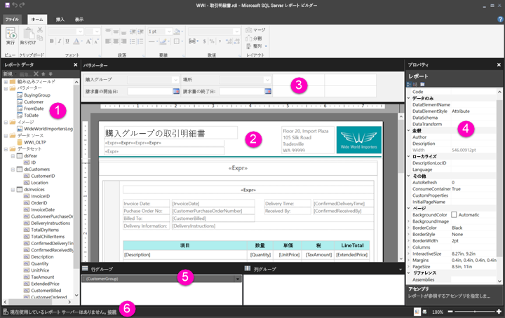

# ページ分割されたレポート用のレポート デザイン ビュー内を移動する (プレビュー)

Power BI のレポート ビルダーでレポート デザイン ビューは、Power BI サービスに公開できる改ページ調整されたレポートを作成するためのデザイン領域です。 デザイン サーフェイスはレポート ビルダーの中央に表示され、周囲にはリボンやペインがあります。 デザイン サーフェイスでは、レポート アイテムを追加して整理します。 この記事では、レポート リソースの追加、選択、整理およびレポート アイテムのプロパティの変更に使用するペインについて説明します。  

1. [[レポート データ] ペイン](#1-report-data-pane) 
2. [レポート デザイン サーフェイス](#2-report-design-surface)  
3. [[パラメーター] ペイン](#3-parameters-pane) 
4. [[プロパティ] ペイン](#4-properties-pane) 
5. [[グループ化] ペイン](#5-grouping-pane) 
6. [現在のレポート ステータス バー](#6-current-report-status-bar)  
  
## 1 [レポート データ] ペイン  
 [レポート データ] ウィンドウでは、レポートのレイアウトをデザインする前に、レポートに必要なレポート データとレポート リソースを定義します。 たとえば、データ ソース、データセット、計算フィールド、レポート パラメーター、画像を [レポート データ] ペインに追加できます。  
  
 [レポート データ] ペインにアイテムを追加した後、フィールドをデザイン サーフェイス上のレポート アイテムにドラッグして、レポート内でデータを表示する場所を制御できます。  
  
> [!TIP]  
>  テーブルやグラフなどのデータ領域に配置するのではなく、[レポート データ] ペインからレポート デザイン サーフェイスにフィールドを直接ドラッグすると、レポートを実行したときに、そのフィールド内のデータの最初の値のみが表示されます。  
  
 [レポート データ] ペインからレポート デザイン サーフェイスに組み込みフィールドをドラッグすることもできます。 レンダリングすると、これらのフィールドでは、レポート名、レポートの総ページ数、現在のページ番号など、レポートに関する情報が提供されます。  
  
 一部のものは、レポート デザイン サーフェイスに追加すると [レポート データ] ペインに自動的に追加されます。 たとえば、レポートに画像を埋め込むと、[レポート データ] ペインの画像フォルダーに追加されます。  
  
> [!NOTE]  
>  **[新規]** ボタンを使用して、[レポート データ] ペインに新しいアイテムを追加できます。 同じデータ ソースから、または他のデータ ソースから、複数のデータセットをレポートに追加できます。 同じデータ ソースから新しいデータセットを追加するには、データ ソースを右クリックして、 **[データセットの追加]** を選択します。  
  
## 2 レポート デザイン サーフェイス  
 レポート ビルダーのレポート デザイン サーフェイスは、レポートをデザインするためのメイン作業領域です。 データ領域、サブレポート、テキスト ボックス、画像、四角形、線などのレポート アイテムをレポートの配置するには、リボンまたはレポート パーツ ギャラリーからデザイン サーフェイスに追加します。 そこで、グループ、式、パラメーター、フィルター、アクション、可視性、および書式設定をレポート アイテムに追加できます。  
  
 次の変更を行うこともできます。  
  
-   罫線や塗りつぶし色などのレポート本文のプロパティ。デザイン サーフェイスでレポート アイテムの外側の空白領域を右クリックして、 **[本文のプロパティ]** を選択します。  
  
-   罫線や塗りつぶし色などのヘッダーとフッターのプロパティ。デザイン サーフェイスでレポート アイテムの外側のヘッダーまたはフッター領域の空白領域を右クリックして、 **[ヘッダーのプロパティ]** または **[フッターのプロパティ]** を選択します。  
  
-   ページ設定などのレポート自体のプロパティ。デザイン サーフェイスの周りの灰色の領域を右クリックして、 **[レポートのプロパティ]** を選択します。  
  
-   レポート アイテムのプロパティ。アイテムを右クリックして、 **[プロパティ]** を選択します。  
  
### デザイン サーフェイスのサイズと印刷領域  
デザイン サーフェイスのサイズは、レポートを印刷するために指定するページ サイズの印刷領域と異なる可能性があります。 デザイン サーフェイスのサイズを変更しても、レポートの印刷領域は変更されません。 レポートの印刷領域に対するサイズ設定に関係なく、完全なデザイン領域のサイズは変わりません。 詳細については、レンダリングの動作に関する記事を参照してください。 
  
- ルーラーを表示するには、 **[表示]** タブで **[ルーラー]** チェック ボックスをオンにします。  
  
## 3 [パラメーター] ペイン  
 レポート パラメーターを使用すると、レポート データを制御し、関連するレポートを接続し、レポートの表示方法を変更できます。 [パラメーター] ペインでは、レポートのパラメーターに対する柔軟なレイアウトが提供されます。  
  
 詳細については、レポート パラメーターに関する記事を参照してください   
  
## 4 [プロパティ] ペイン
 データ領域、画像、テキスト ボックス、レポート本文など、レポート内のすべてのアイテムには、プロパティが関連付けられています。 たとえば、テキスト ボックスの BorderColor プロパティはテキスト ボックスの境界線の色の値を示し、レポートの PageSize プロパティはレポートのページ サイズを示します。  
  
 これらのプロパティは、[プロパティ] ペインに表示されます。 ペイン内のプロパティは、選択したレポート アイテムによって変化します。  
  
- [プロパティ] ペインを表示するには、 **[表示]** タブの **[表示/非表示]** グループで **[プロパティ]** を選択します。  
  
### プロパティの値の変更  
 レポート ビルダーでは、レポート アイテムのプロパティを複数の方法で変更できます。  
  
-   リボンのボタンとリストを選択します。  
  
-   ダイアログ ボックスで設定を変更します。  
  
-   [プロパティ] ペインでプロパティの値を変更します。  
  
 最もよく使用されるプロパティは、ダイアログ ボックスおよびリボンで設定できます。  
  
 プロパティにより、ドロップダウン リストからプロパティ値を設定したり、値を入力したり、`<Expression>` を選択して式を作成したりできます。  
  
### [プロパティ] ペインの表示の変更  
 既定では、[プロパティ] ペインに表示されるプロパティは、[アクション]、[枠線]、[塗りつぶし]、[フォント]、[全般] などの広範なカテゴリに整理されています。 各カテゴリには、それに関連付けられたプロパティのセットがあります。 たとえば、[フォント] カテゴリには、次のプロパティが一覧表示されます:Color、FontFamily、FontSize、FontStyle、FontWeight、LineHeight、TextDecoration。 好みに応じて、ペインのすべてのプロパティをアルファベット順に一覧表示できます。 このようにすると、カテゴリが削除され、カテゴリに関係なく、すべてのプロパティがアルファベット順に表示されます。  
  
 [プロパティ] ペインの上部には、次の 3 つのボタンがあります: **[カテゴリ]** 、 **[Alphabetize]\(アルファベット順\)** 、 **[Property Page]\(プロパティ ページ\)** 。 [プロパティ] ペインの表示を切り替えるには、[カテゴリ] ボタンと [Alphabetize]\(アルファベット順\) ボタンを選択します。 選択したレポート アイテムの [プロパティ] ダイアログ ボックスを開くには、 **[Property Page]\(プロパティ ページ\)** 選択します。  
  
  
## 5 [グループ化] ペイン

 グループは、ビジュアル階層にレポート データを整理し、合計を計算するために使用されます。 デザイン サーフェイス上のデータ領域内および [グループ化] ペインで、行および列のグループを表示できます。 [グループ化] ペインには、次の 2 つのペインがあります:[行グループ] と [列グループ]。 データ領域を選択すると、[グループ化] ペインにそのデータ領域内のすべてのグループが階層リストとして表示されます。子グループが親グループの下にインデントされて表示されます。  
  
 [レポート データ] ペインからフィールドをドラッグして、デザイン サーフェイスまたは [グループ化] ペインにドロップすることで、でグループを作成できます。 [グループ化] ペインでは、親グループ、隣接グループ、子グループを追加し、グループのプロパティを変更し、グループを削除することができます。  
  
 [グループ化] ペインは既定で表示されますが、[表示] タブで [グループ化ペイン] チェック ボックスをオフにして閉じることができます。グラフまたはゲージ データ領域については、[グループ化] ペインを使用できません。  
  
 詳細については、グループ化ペインおよびグループの概要に関する記事を参照してください。  
  
## 6 現在のレポート ステータス バー

現在のレポート ステータス バーには、レポートの接続先サーバーの名前または "現在使用しているレポート サーバーはありません" が表示されます。 **[接続]** を選択して、サーバーに接続できます。

## 次の手順

[Power BI Premium のページ分割されたレポートとは(プレビュー)](paginated-reports-report-builder-power-bi.md) 

  
  
