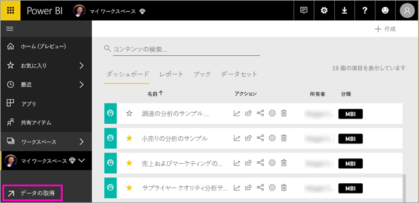
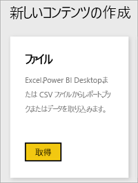
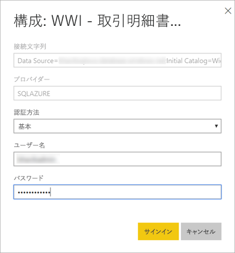
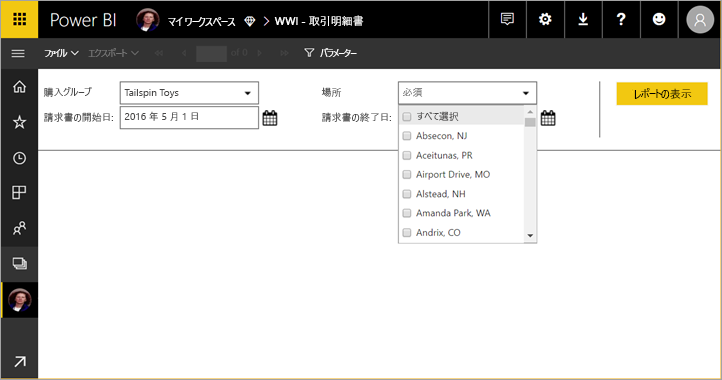

# ページ分割されたレポートを Power BI サービスに発行する (プレビュー)

この記事では、ページ分割されたレポートをローカル コンピューターからアップロードすることによって Power BI サービスに発行することについて学びます。 ワークスペースが Premium 容量である限り、ページ分割されたレポートをマイ ワークスペースまたは他のワークスペースにアップロードできます。 ワークスペース名の横にあるダイヤモンド形のアイコン  を探します。 

レポートのデータ ソースがオンプレミスにある場合は、レポートをアップロードした後で、[ゲートウェイを作成する](#create-a-gateway)必要があります。

## Premium 容量にワークスペースを追加する

ワークスペースの名前の横にダイヤモンド形のアイコン  がない場合は、Premium 容量にワークスペースを追加する必要があります。 

1. **[ワークスペース]** を選択し、ワークスペース名の横にある省略記号 **[...]** を選択して、 **[ワークスペースの編集]** を選択します。

    ![[ワークスペースの編集] を選択する](media/paginated-reports-save-to-power-bi-service/power-bi-paginated-edit-workspace.png)

1. **[ワークスペースの編集]** ダイアログ ボックスで、 **[詳細設定]** を展開し、 **[専用の容量]** を **[オン]** にスライドします。

    ![[専用の容量] を選択する](media/paginated-reports-save-to-power-bi-service/power-bi-paginated-edit-workspace-dialog.png)

   変更できない場合があります。 できない場合は、Power BI Premium 容量の管理者に連絡し、ワークスペースを Premium 容量に追加するための割り当て権限を付与してもらってください。

## ページ分割されたレポートをアップロードする

1. レポート ビルダーでページ分割されたレポートを作成し、ローカル コンピューターに保存します。

1. ブラウザーで Power BI サービスを開き、レポートを発行する Premium ワークスペースを参照します。 名前の横にあるダイヤモンド形のアイコン  を確認します。 

1. **[データを取得]** を選択します。

    

1. **[ファイル]** ボックスで、 **[取得]** を選択します。

    

1. **[ローカル ファイル]** を選択し、ページ分割されたレポートを参照して、 **[開く]** を選択します。

    ![[ローカル ファイル] を選択する](media/paginated-reports-save-to-power-bi-service/power-bi-paginated-local-file.png)

1. **[続行]**  >  **[資格情報の編集]** の順に選択します。

    ![[資格情報の編集] を選択する](media/paginated-reports-save-to-power-bi-service/power-bi-paginated-select-edit-credentials.png)

1. 資格情報を構成し、 **[サインイン]** を選択します。

    

   自分のレポートがレポートの一覧に表示されます。

    

1. それを選択して Power BI サービスで開きます。 パラメーターがある場合は、レポートを表示する前に、選択する必要があります。
 
    

## ゲートウェイを作成する

他の Power BI レポートと同じように、レポートのデータ ソースがオンプレミスにある場合は、データにアクセスするために、ゲートウェイを作成するか、ゲートウェイに接続する必要があります。

1. レポート名の横にある **[管理]** を選択します。

   

1. 詳細と以降の手順については、[ゲートウェイのインストール](service-gateway-install.md)に関する Power BI サービスの記事をご覧ください。

### ゲートウェイの制限

現在、ゲートウェイでは、複数値のパラメーターはサポートされていません。

## 次の手順

- [ページ分割されたレポートを Power BI サービスで表示する](paginated-reports-view-power-bi-service.md)
- [Power BI Premium のページ分割されたレポートとは(プレビュー)](paginated-reports-report-builder-power-bi.md)

