# Power BI でのカスタム ビジュアル

を作成または Power BI レポートを編集する場合は、さまざまな種類のビジュアルを使用できます。 これらのビジュアルのアイコンが表示されます、**視覚化**ウィンドウ。 ダウンロードするときに、これらのビジュアルが事前にパッケージされた[Power BI Desktop](https://powerbi.microsoft.com/desktop/)を開いたり、 [Power BI サービス](https://app.powerbi.com)します。

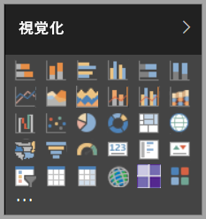

ただし、このビジュアルのセットに制限がないです。 下部にある省略記号 (...) を選択すると、別のレポートのビジュアルのソースが利用可能 -*カスタム ビジュアル*します。

開発者は、カスタム ビジュアル SDK を使用するカスタム ビジュアルを作成します。 これらのビジュアルでは、ビジネス ユーザーが、データは、ビジネスに合った最適な方法で表示を有効にします。 レポート作成者は各自のレポートにカスタム ビジュアル ファイルをインポートし、その他の Power BI ビジュアルのように使用します。 カスタム ビジュアルは Power BI での第一級され、強調表示されている、編集、共有、およびこれをフィルターできます。

カスタム ビジュアルは 3 つの方法でデプロイできます。

* カスタム ビジュアル ファイル
* 組織のビジュアル
* Marketplace ビジュアル

## カスタム ビジュアル ファイル

カスタム ビジュアルは、それらに提供されるデータをレンダリングするコードを含むパッケージです。 カスタム ビジュアルを作成し、1 つとしてパッケージ化するすべてのユーザー`.pbiviz`ファイル、Power BI レポートにインポートできます。

> [!WARNING]
> カスタム ビジュアルには、セキュリティやプライバシーのリスクでコードが含まれます。 レポートにインポートする前に、作成者とカスタム ビジュアルのソースを信頼することを確認します。

## 組織のビジュアル

Power BI 管理者は、承認し、カスタム ビジュアルをレポート作成者できます簡単に検出、更新、および使用する組織に展開します。 管理者が簡単に管理できます (たとえば、更新プログラムのバージョン、有効/無効に) これらのビジュアル。

 [詳細については、組織のビジュアル](power-bi-custom-visuals-organization.md)します。

## Marketplace ビジュアル

コミュニティ メンバーと Microsoft が公共の利益のカスタム ビジュアルを提供し、公開、 [AppSource](https://appsource.microsoft.com/marketplace/apps?product=power-bi-visuals) marketplace。 これらをダウンロードするビジュアルを Power BI レポートに追加します。 Microsoft がテストされ、これらのカスタム ビジュアルの機能と品質を承認します。

[AppSource](developer/office-store.md) とは これには、Microsoft のソフトウェア アプリ、アドイン、および拡張機能を見つけることができます。 [AppSource](https://appsource.microsoft.com/)何百万もの製品と同様に Office 365、Azure、Dynamics 365、Cortana、および Power BI をするのに役立つソリューションに効率的に、結び付けます、作業の美しく伝えますより前にユーザーを接続します。

### 認定済みビジュアル

Power BI の認定のビジュアルがマーケットプ レース ビジュアルでは追加の厳格な品質テストに合格し、などその他のシナリオではサポートされて[電子メール サブスクリプション](https://docs.microsoft.com/power-bi/service-report-subscribe)、および[をPowerPointにエクスポート](https://docs.microsoft.com/power-bi/service-publish-to-powerpoint).
認定済みカスタム ビジュアルの一覧の表示またはカスタム ビジュアルの申請については、「[Certified custom visuals](https://docs.microsoft.com/power-bi/power-bi-custom-visuals-certified)」 (認定済みカスタム ビジュアル) をご覧ください。

独自の視覚エフェクトを作成して AppSource に追加することに興味がある Web 開発者の方は、 参照してください[Power BI カスタム ビジュアルの開発](developer/custom-visual-develop-tutorial.md)学び方法[カスタム ビジュアルを AppSource に発行する](https://docs.microsoft.com/power-bi/developer/office-store)します。

### カスタム ビジュアルをファイルからインポートする

1. 下部にある省略記号を選んで、**視覚化**ウィンドウ。

    

2. ドロップダウンで **[ファイルからインポートする]** を選択します。

    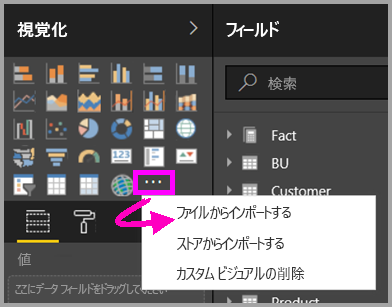

3. ファイルを開く メニューから選択、`.pbiviz`ファイルをインポートしを選択する**オープン**します。 カスタム ビジュアルのアイコンの下に追加、**視覚化**ウィンドウは、レポートで使用できるようになりました。

    

### 組織のビジュアルをインポートする

1. 下部にある省略記号を選んで、**視覚化**ウィンドウ。

    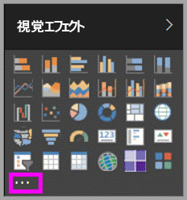

2. ドロップダウンで **[Marketplace からインポートする]** を選択します。

    

3. 一番上のタブ メニューから **[自分の所属組織]** を選択します。

    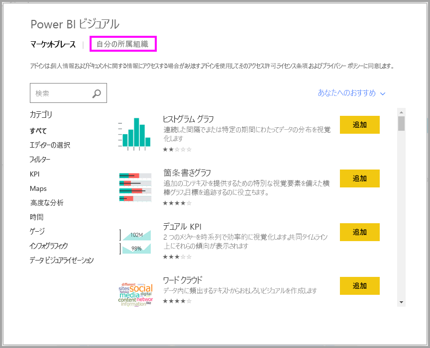

4. 一覧をスクロールして、インポートするビジュアルを探します。

    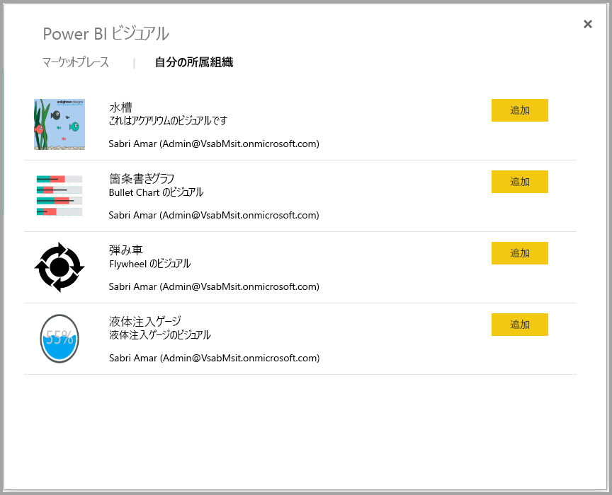

5. 選択**追加**カスタム ビジュアルをインポートします。 そのアイコンの下に追加、**視覚化**ウィンドウは、レポートで使用できるようになりました。

    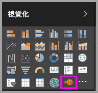

## Microsoft AppSource からカスタム ビジュアルをダウンロードまたはインポートする

ダウンロードおよびカスタム ビジュアルをインポートするための 2 つのオプションがあります: から Power BI 内でとの間、 [AppSource web サイト](https://appsource.microsoft.com/)します。

### Power BI からカスタム ビジュアルをインポートする

1. 下部にある省略記号を選んで、**視覚化**ウィンドウ。

    

2. ドロップダウンで **[Marketplace からインポートする]** を選択します。

    

3. 一覧をスクロールして、インポートするビジュアルを探します。

    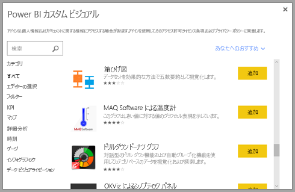

4. 各ビジュアルの詳細を確認するには、ビジュアルを強調表示して選択します。

    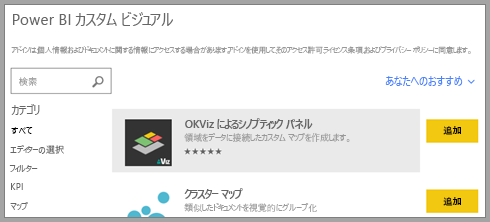

5. 詳細ページでは、スクリーンショット、ビデオ、詳細な説明、その他を見ることができます。

    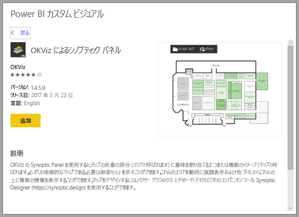

6. レビューを表示するには最下部までスクロールします。

    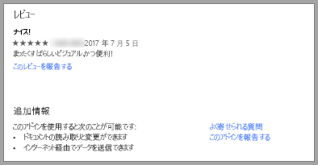

7. 選択**追加**カスタム ビジュアルをインポートします。 そのアイコンの下に追加、**視覚化**ウィンドウは、レポートで使用できるようになりました。

    

### Microsoft AppSource からカスタム ビジュアルをダウンロードおよびインポートする

1. [Microsoft AppSource](https://appsource.microsoft.com) から、 **[アプリ]** のタブを選択します。

    

2. [アプリの結果ページ](https://appsource.microsoft.com/marketplace/apps)に移動すると、 *[Power BI apps]* を含めた各カテゴリの上位アプリを確認できます。 カスタム ビジュアルを選択しましょう探している**Power BI ビジュアル**結果を絞り込むために、左側のナビゲーション一覧から。

    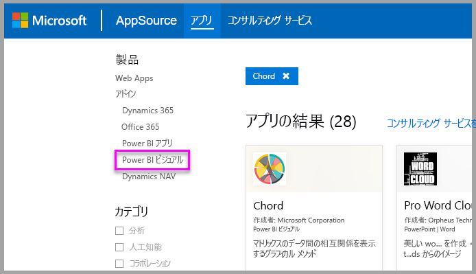

3. AppSource に、各カスタム ビジュアルのタイルが表示されます。  各タイルには簡単な説明とダウンロード リンクにカスタム ビジュアルのスナップショット。 詳細を表示するには、タイルを選択します。

    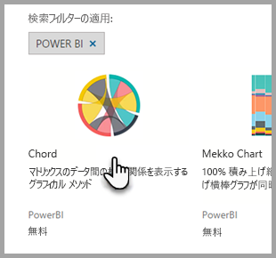

4. 詳細ページでは、スクリーンショット、ビデオ、詳細な説明、その他を見ることができます。 選択**今すぐ入手**カスタム ビジュアルをダウンロードして使用条件に同意します。

    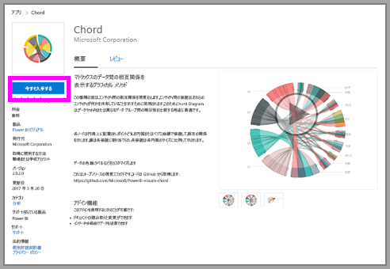

5. カスタム ビジュアルをダウンロードするリンクを選択します。

    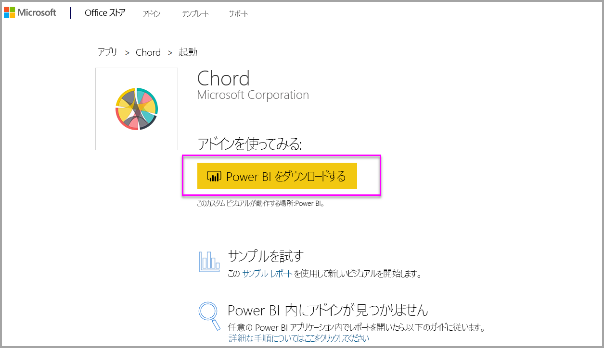

    ダウンロード ページには、Power BI Desktop と Power BI サービスにカスタム ビジュアルをインポートする方法についても含まれています。

    カスタム ビジュアルが含まれ、その機能を見ることができる、サンプル レポートをダウンロードすることもできます。

    

6. 保存、`.pbiviz`ファイルを Power BI を開きます。

7. インポート、`.pbiviz`ファイルをレポートします。 (上記の「[カスタム ビジュアルをファイルからインポートする](#import-a-custom-visual-from-a-file)」セクションを参照してください)。

## 考慮事項と制限事項

* カスタム ビジュアルをインポートすると、特定のレポートに追加されます。 ビジュアルを別のレポートで使用する場合は、そのレポートにもインポートする必要があります。 カスタム ビジュアルを含むレポートを **[名前を付けて保存]** オプションで保存すると、カスタム ビジュアルのコピーが新しいレポートと共に保存されます。

* 表示されない場合、**視覚化**ウィンドウで、レポートの編集アクセス許可がないことを意味します。  カスタム ビジュアルは編集できるレポートにのみ追加でき、共有されているレポートには追加できません。

## トラブルシューティング

トラブルシューティングについては、次を参照してください。 [、Power BI カスタム ビジュアルをトラブルシューティング](power-bi-custom-visuals-troubleshoot.md)します。

## よく寄せられる質問

詳細情報と質問の回答については、[Power BI カスタム ビジュアルについてよく寄せられる質問](power-bi-custom-visuals-faq.md#organizational-custom-visuals)に関するページをご覧ください。

## 次の手順

* [Power BI レポートでの視覚化](visuals/power-bi-report-visualizations.md)

他にわからないことがある場合は、 [Power BI コミュニティを利用してください](http://community.powerbi.com/)。
