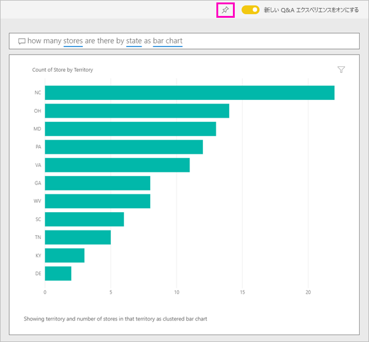

# Power BI Q & A を使用して、データの探索し、ビジュアルを作成するには

自然言語を使用して質問するのが、データから回答を得る最も速い方法である場合があります。 Power BI の Q & A 機能を使用して、自分の言葉でデータを探索できます。  この記事の最初の部分は、Power BI サービスでダッシュ ボードで Q & A を使用する方法を示しています。 2 番目の部分は、何ができる Q & A で、Power BI サービスまたは Power BI Desktop でレポートを作成する場合を示しています。 詳細については、次を参照してください。、 [Q & A のコンシューマー](consumer/end-user-q-and-a.md)記事。 

[Q & A Power BI モバイル アプリで](consumer/mobile/mobile-apps-ios-qna.md)と[Power BI Embedded による Q & A](developer/qanda.md)は個別の記事で説明します。 

Q & A は対話型、楽しくです。 多くの場合、1 つの質問は、視覚化によってさらに他のユーザーにつながります。 Q&A を使って視覚エフェクトを作成し、それを詳しく調べて、ダッシュボードに表示する、Amanda のデモンストレーションをご覧ください。

<iframe width="560" height="315" src="https://www.youtube.com/embed/qMf7OLJfCz8?list=PL1N57mwBHtN0JFoKSR0n-tBkUJHeMP2cP" frameborder="0" allowfullscreen></iframe>

## パート 1:Power BI サービスでダッシュ ボードで Q & A を使用します。

Power BI サービス (app.powerbi.com) では、ダッシュ ボードには、それらのデータセットのいずれかに含まれるデータのいずれかについて質問することができますので、1 つまたは複数のデータセットからピン留めされたタイルが含まれています。 どのようなレポートとデータセットは、ダッシュ ボードの作成に使用されたを表示する選択**関連ビュー**メニュー バーから。

Q & A 質問ボックスは、自然言語を使用して質問を入力して、ダッシュ ボードの左上隅にあります。 Q & A ボックスが表示されません。 参照してください[考慮事項とトラブルシューティング](consumer/end-user-q-and-a.md#considerations-and-troubleshooting)で、 **Q & A のコンシューマー**記事。  Q & A は、入力し、して解答を探す (データセット) 内の場所を判別した単語を認識します。 さらに、オートコンプリート、書き換え、その他のテキストや視覚による支援を使用して質問の作成を助けます。

質問を変更すると、質問に対する回答は、対話型の視覚化と更新として表示されます。

1. ダッシュボードを開き、質問ボックスにカーソルを置きます。 右上隅にある次のように選択します。**新しい Q & A エクスペリエンス**します。

    

1. 入力を開始する前に、Q & A で質問を作るときに役立つ情報が新しい画面に表示されます。 フレーズと基になるデータセット内のテーブルの名前を含む完全な質問に表示され、可能性がありますも一覧表示されるデータセットの所有者が作成された場合、完全な質問を参照してください[おすすめの質問](service-q-and-a-create-featured-questions.md)、

   

   開始点として、これらの質問のいずれかを選択し、特定の回答を検索する質問を絞り込むに続行できます。 または、テーブル名を使用して、新しい質問を言葉できます。

2. 質問の一覧から選択しますまたは、独自の質問の入力を開始し、ドロップダウン候補から選択します。

   

3. 質問を入力すると、Q & A の質問の答えを表示する最適な視覚化が選択されます。

   

4. 動的に視覚エフェクトの変更は、質問を変更します。

   

1. 質問を入力すると、Power BI によりダッシュボードにタイルがあるデータセットを使って最善の回答が検索されます。  すべてのタイルが *datasetA*のものである場合、回答は *datasetA*から取得されます。  タイルがある場合*datasetA*と*datasetB*、これら 2 つのデータセットから最適な回答の Q & A が検索されます。

   > [!TIP]
   > そのため *datasetA* からのタイルが 1 つしかない場合は、それをダッシュボードから削除すると、Q&A が *datasetA* にアクセスできなくなるのでご注意ください。
   >

5. 右上隅のピン アイコンを選択してダッシュ ボードに視覚化のピン留め、結果に満足したら。 他のユーザーから共有を受けているダッシュボード、またはアプリの一部であるダッシュボードの場合は、ピン留めできません。

   

## パート 2:Power BI サービスおよび Power BI Desktop のレポートで Q&A を使う

Q&A を使ってデータセットを探索し、レポートとダッシュボードに視覚エフェクトを追加します。 レポートは単一のデータセットに基づいており、完全に空白にすることも、ページいっぱいに視覚エフェクトを表示することもできます。 ただし、レポートが空白でも探索するデータが何もないということではありません。データセットはレポートにリンクされており、ユーザーが探索を行って視覚エフェクトを作成するのを待っているのです。  レポートの作成に使われているデータセットを確認するには、Power BI サービスの読み取りビューでレポートを開き、メニュー バーから **[関連の表示]** を選びます。

レポートで Q & A を使用するには、基になるデータセットとレポートの編集アクセス許可が必要です。 [コンシューマー向け Q & A](consumer/end-user-q-and-a.md)とこれに言及記事、*作成者*シナリオ。 代わりになら*消費*と、Q & a を共有されたレポートは使用できません。

1. 編集ビュー (Power BI サービス) またはレポート ビュー (Power BI Desktop) でレポートを開き、選択**質問**メニュー バーから。

    **Power BI Desktop**    
    

    **サービス**    
    

2. Q&A 質問ボックスがレポート キャンバスに表示されます。 次の例では、別の視覚エフェクトの上に質問ボックスが表示されています。 これでも問題はありませんが、質問する前にレポートに空のページを追加した方がよい場合があります。

    

3. 質問ボックスにカーソルを置きます。 入力を進めるにつれて、質問の作成に役立つ候補が表示されます。

   

4. 質問を入力していくと、Q&A は回答の表示に最適な[視覚エフェクト](visuals/power-bi-visualization-types-for-reports-and-q-and-a.md)を選び、質問を変更するにつれ視覚エフェクトが動的に変化します。

   

5. 好みの視覚エフェクトが表示されたら、Enter キーを押します。 視覚エフェクトをレポートと共に保存するには、 **[ファイル] > [保存]** を選びます。

6. 新しい視覚エフェクトを操作します。 視覚エフェクトをどのようにして作成したかは関係ありません。どの場合でも同じ操作、書式設定、機能を利用できます。

   

   Power BI サービスで視覚エフェクトを作成した場合は、[視覚エフェクトをダッシュボードにピン留めする](service-dashboard-pin-tile-from-q-and-a.md)こともできます。

## 使用する視覚化を Q&A で指定する
Q&A では、データ自身に語らせるだけでなく、Power BI に回答の表示方法を指示することもできます。 質問の最後に "as a <visualization type>" を追加して、視覚化の種類を指定するだけです。  たとえば、「show inventory volume by plant as a map」(工場ごとの在庫量をマップとして表示する)、「show total inventory as a card」(在庫合計をカードとして表示する) などです。  自分で試してみてください。

## 考慮事項とトラブルシューティング
- ライブ接続またはゲートウェイを使ってデータセットに接続した場合は、Q&A を[そのデータセットで有効にする](service-q-and-a-direct-query.md)必要があります。

- レポートを開いていた場合、Q&A のオプションは表示されません。 Power BI サービスを使っている場合は、編集ビューでレポートを開いていることを確認します。 そのレポートの編集アクセス許可がありませんし、その特定のレポートで Q & A を使用できる、編集ビューを開くことができません。 場合、

## 次の手順

- [Q & A のコンシューマー](consumer/end-user-q-and-a.md)   
- [Q&A で質問するためのヒント](consumer/end-user-q-and-a-tips.md)   
- [Q&A のためのブックの準備](service-prepare-data-for-q-and-a.md)  
- [Q & A のため、オンプレミスのデータセットを準備します。](service-q-and-a-direct-query.md)   
- [Q&A からダッシュボードにタイルをピン留めする](service-dashboard-pin-tile-from-q-and-a.md)
