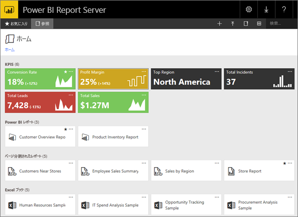

# Web ポータルでコンテンツを管理する 
Power BI レポート サーバー Web ポータルは、Power BI レポート、モバイル レポート、およびページ分割されたレポート、および KPI を表示、格納、および管理するためのオンプレミスの場所です。

どの最新ブラウザーでも Web ポータルを表示できます。 Web ポータルでは、レポートと KPI がフォルダーに整理されて表示され、それらをお気に入りとしてマークすることができます。 ポータルには Excel ブックを格納することもできます。 Web ポータルからレポートを作成するために必要なツールを起動できます。

* Power BI Desktop で作成された **Power BI レポート**:それらを Web ポータルおよび Power BI モバイル アプリで表示します。
* レポート ビルダーで作成された**ページ分割されたレポート**:印刷用に最適化された現代的な外観の固定レイアウトのドキュメント。
* **KPI**: Web ポータルで正常に作成されました。

Web ポータルでは、レポート サーバー フォルダーを参照したり、特定のレポートを検索したりできます。 レポートとその全般的なプロパティを表示し、レポート履歴でキャプチャされているレポートの過去のコピーを表示できます。 アクセス許可に応じて、電子メールの受信トレイ フォルダーまたはファイル システム上の共有フォルダーに配信するためのレポートをサブスクライブできる必要もあります。

## Web ポータルのロールとアクセス許可
Web ポータル アプリケーションはブラウザーで実行されます。 Web ポータルを起動したときに表示されるページ、リンク、オプションは、レポート サーバー上で持っているアクセス許可によって異なります。 完全なアクセス許可を持つロールに割り当てられた場合は、レポート サーバーを管理するためのアプリケーションのメニューとページの完全なセットにアクセスすることができます。 レポートを表示および実行するアクセス許可を持つロールに割り当てられた場合は、それらのアクティビティに必要なメニューとページのみ表示されます。 異なるロールをさまざまなレポート サーバーに対して割り当てられることもあれば、1 つのレポート サーバー上のさまざまなレポートやフォルダーに対して割り当てられることもあります。

## Web ポータルを起動する
1. Web ブラウザーを開きます。
   
    [サポートされる Web ブラウザーとバージョン](browser-support.md)のリストが表示されます。
2. アドレス バーに、Web ポータルの URL を入力します。
   
    既定の URL は <em>https://<コンピューター名>/reports</em> です。
   
    レポート サーバーは、特定のポートを使用するように構成される可能性があります。 たとえば、<em>https://<コンピューター名>:80/reports</em>または<em>https://<コンピューター名>:8080/reports</em> のようになります。
   
    Web ポータル グループ項目が以下のカテゴリに分類されます。
   
   * KPI
   * モバイル レポート
   * ページ分割されたレポート
   * Power BI Desktop レポート
   * Excel ブック
   * データセット
   * データ ソース
   * リソース

## Web ポータルで項目を管理する
Power BI レポート サーバーでは、Web ポータルに格納する項目を細かく制御することができます。 たとえば、個々のページ分割されたレポートのサブスクリプション、キャッシュ、スナップショット、およびセキュリティを設定することができます。

1. 項目の右上隅にある**その他のオプション** (...) を選択し、 **[管理]** を選択します。
   
    ![[管理] を選択](media/getting-around/report-server-web-portal-manage-ellipsis.png)
2. プロパティまたは設定するその他の機能を選択します。
   
    ![[プロパティ] を選択](media/getting-around/report-server-web-portal-manage-properties.png)
3. **[適用]** を選びます。

[Web ポータルでサブスクリプションの使用](https://docs.microsoft.com/sql/reporting-services/working-with-subscriptions-web-portal)の詳細を参照してください。

## 次の手順
[Power BI Report Server とは](get-started.md)

他にわからないことがある場合は、 [Power BI コミュニティで質問してみてください](https://community.powerbi.com/)。

