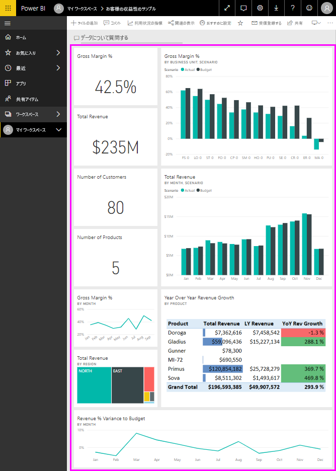
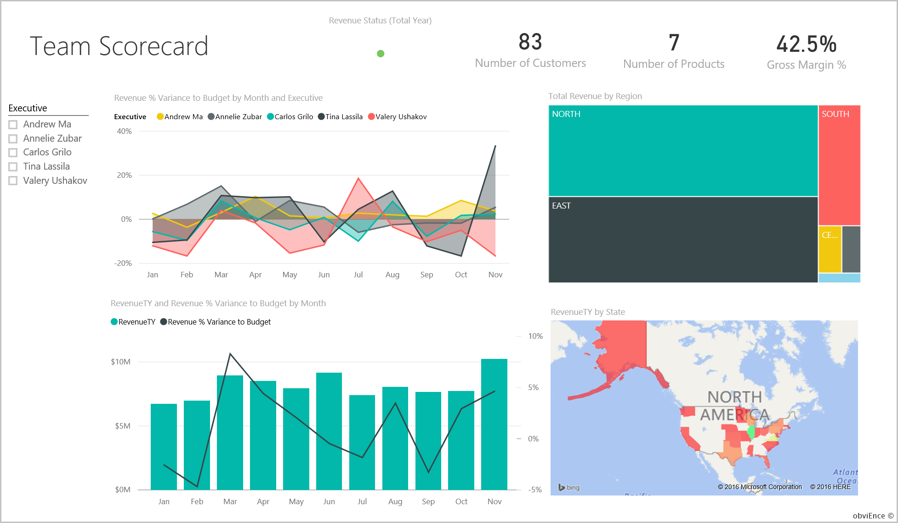
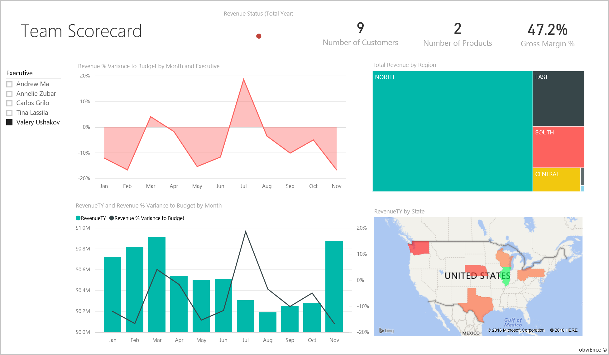
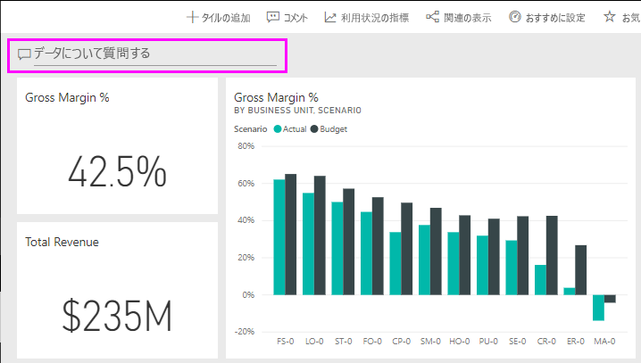
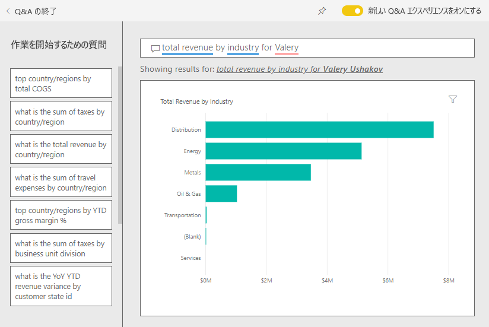
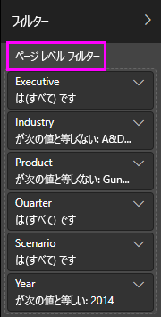
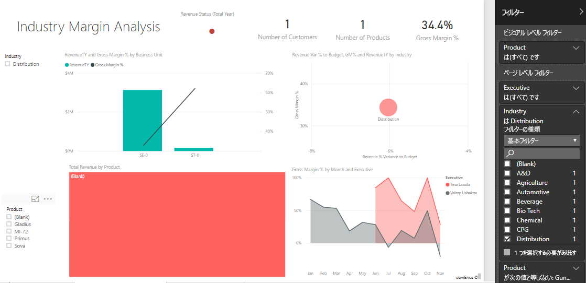
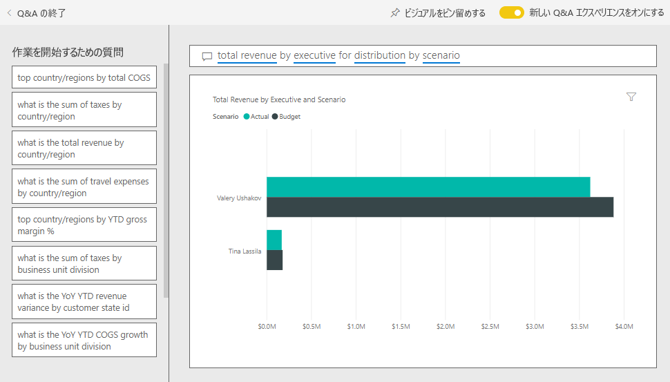

# Power BI のお客様の収益性のサンプル:ツアーを開始する

## お客様の収益性のサンプルの概要
「お客様の収益性のサンプル」のコンテンツ パックには、マーケティング資料を製作する会社向けのダッシュボード、レポート、データセットが含まれています。 このダッシュボードは、5 つの事業部のマネージャー (経営陣とも言う)、製品、顧客、粗利益 (GM) に関する主要なメトリックを確認するために、CFO によって作成されました。 これにより、収益性に影響する要因をひとめで確認できます。

このサンプルは、ビジネス用のデータ、レポート、ダッシュボードを用いて Power BI を使う方法について説明するシリーズの一部です。 これは、obviEnce ([www.obvience.com](http://www.obvience.com/)) が収集している匿名化された実データです。 データは次の複数の形式で使用できます: コンテンツ パック/コンテンツ アプリ、Excel ブック、.pbix Power BI Desktop ファイル。 [サンプル データセット](sample-datasets.md)をご覧ください。

## 前提条件
どうしたらよいでしょうか? このチュートリアルでは、Power BI サービスと "お客様の収益性" のサンプル コンテンツ パックを使用します。  これは、レポートの作業がよく似ているので、Power BI Desktop とサンプルの PBIX ファイルを使用する場合でも作業を進められるためです。 コンテンツ パックと PBIX ファイルに接続する手順については以下の通りです。

### このサンプルのコンテンツ パックを入手する

1. Power BI サービス (app.powerbi.com) を開いてログインします。
2. 左下隅にある **[データの取得]** を選びます。

    
3. 表示される [データの取得] ページで、 **[サンプル]** アイコンを選びます。

   
4. **[お客様の収益性のサンプル]** を選び、 **[接続]** を選びます。  

   
5. Power BI がコンテンツ パックをインポートし、新しいダッシュボード、レポート、データセットを現在のワークスペースに追加します。 新しいコンテンツは黄色のアスタリスクで示されます。 サンプルを使って Power BI を試してみます。  

   

### このサンプルの .pbix ファイルを取得する

あるいは、Power BI Desktop で使用するために設計された .pbix ファイルとして、サンプルをダウンロードすることもできます。
[お客様の収益性のサンプル](http://download.microsoft.com/download/6/A/9/6A93FD6E-CBA5-40BD-B42E-4DCAE8CDD059/Customer%20Profitability%20Sample%20PBIX.pbix)

### このサンプルの Excel ブックを取得する

このサンプルのデータソースについて詳しく調べたい場合は、[(Excel ブック)](http://go.microsoft.com/fwlink/?LinkId=529781) として使用することもできます。 ブックには、表示および変更可能な Power View シートが含まれています。 生データを表示するには、 **[Power Pivot] > [管理]** を選択します。

## ダッシュボードからわかること

お客様の収益性のサンプルのダッシュボードは、 **[マイ ワークスペース]** の下にあります。

### 会社全体のダッシュボードのタイル
1. Power BI サービスで、ダッシュボードを開きます。 CFO はこのダッシュボードのタイルから、自身にとって重要な、会社の高水準なメトリックに関する概要を得ることができます。  何か興味深いものがある場合は、タイルを選んで詳しいデータを確認できます。

2. 左側にあるダッシュボードのタイルを確認します。

    

- 粗利益は 42.5% です。
- 80 の顧客が存在します。
- 5 つの異なる製品を販売しています。
- 予算に対する収益差異 % が最低だったのは 2 月で、その後の 3 月は最高でした。
- 収益のほとんどは東部および北部の地域からです。 粗利益が予算を超えたことはなく、ER-0 と MA-0 はさらに調査を必要とします。
- 年間の総収益はほぼ予算どおりです。

### マネージャー固有のダッシュボード タイル
ダッシュボードの右側にあるタイルには、チームのスコアカードが表示されます。 CFO はマネージャーについて把握しておく必要があり、これらのタイルは GM% を使用して利益の概要を説明します。 いずれかのマネージャーに関して予期しない GM% の傾向が見られる場合は、さらに調査できます。

- Carlos を除いた経営陣全員が、既に売上目標を上回っています。 ただし、Carlos の売上実績はもっとも高い値です。
- Annelie の GM% は最低ですが、3 月以降、安定的に増加しているのがわかります。
- その一方で、Valery は GM% が大幅に低下しています。
- また、Andrew は不安定な 1 年でした。

## ダッシュボードの基になるデータの調査
このダッシュボードのタイルはレポートと Excel ブックにリンクされています。

### Excel Online のデータ ソースを開く
ダッシュボード上の [Target vs Actual]\(目標と実績\)、[Year Over Year Revenue Growth]\(前年比の収益成長率\) の 2 つのタイルは、Excel ブックからピン留めされたものです。 そのためこのタイルのどちらを選択しても、Power BI によってデータ ソース、この場合は Excel Online が開かれます。

1. Excel からピン留めされたこれらのタイルのいずれかを選択します。 Excel Online が Power BI サービス内で開かれます。
2. ブックにはタブ 3 つ分のデータがあることに注意してください。 [収益] を開きます。
3. Carlos がまだ目標に達していない理由を見てみましょう。  
    a. [エグゼクティブ] のスライダーから、 **[Carlos Grilo]** を選択します。   
    b. 最初のピボットテーブルからは、Carlos がもっとも高い収益を上げている [製品] である [Primus] が、昨年と比べて 152% の減益となっていることがわかります。 また、前年比のグラフでは、ほとんどの月で予算以下になっています。  

    

    

4. 調査を続けて興味のあるものが見つかったら右上隅にある **[ピン留め]** ![[ピン留め] アイコン](media/sample-customer-profitability/power-bi-excel-pin.png) を選択して、[ダッシュボードにピン留め](service-dashboard-pin-tile-from-excel.md)します。

5. ダッシュボードに戻るには、ブラウザーの戻る矢印を使用します。

### 基になる Power BI レポートを開く
お客様の収益性サンプルのタイルは、その大部分が、基になっているお客様の収益性サンプルのレポートからピン留めされたものです。

1. これらのタイルのいずれかを選択して、読み取りビューでレポートを開きます。

2. レポートは 3 ページからなります。 レポートの下部にあるタブは、それぞれページを表します。

    

    * "チーム スコアカード" では、5 人のマネージャーの業績とその "顧客管理手法" に焦点を合わせます。
    * "業界の利益分析" では、業界全体の状況と比較して収益性を分析する方法が提供されます。
    * "役員スコアカード" では、Cortana での表示用に書式設定されたマネージャーのそれぞれのビューが提供されます。

### 「チーム スコアカード」ページ

2 人のチーム メンバーを詳しく考察し、どのような洞察が得られるかを確認してみましょう。 左側のスライサーで Andrew の名前を選んで、Andrew のデータのみが表示されるようにレポート ページをフィルター処理します。

* クイック KPI の場合、Andrew の**収益状態**を見ます。- Andrew は緑色です。 Andrew の業績は良好です。
* 「月別の予算に対する収益差異 %」面グラフには、2 月の落ち込みを除き、Andrew は全体として良好な結果を出していることが示されています。 Andrew の主要な地域は東部で、49 社の顧客と (7 つのうち) 5 つの製品を扱っています。 Andrew の GM% は最高でも最低でもありません。
* 「月別の RevenueTY と予算に対する収益差異 %」には、安定した一様の収益履歴が示されています。ところが、地域ツリーマップ内の **[Central]** (中部) の四角形をクリックしてフィルター処理すると、Andrew は 3 月にインディアナ州でのみ売上があることがわかります。 これは計画的なものでしょうか、それとも検討する必要があるでしょうか。

次は Valery です。 スライサーで Valery の名前を選んで、Valery のデータのみを表示するようにレポート ページをフィルター処理します。  

* **[RevenueTY Status]** (RevenueTY の状態) の赤の KPI にご注意ください。 これは明らかにさらなる調査が必要です。
* Valery の収益差異は懸念点を示しています。Valery は収益マージンを満たしていません。
* Valery の顧客はわずか 9 社で、2 製品のみを扱い、取引先はほぼ北部の顧客のみに限られています。 この特殊性は、Valery の変動幅が大きいことの説明になる可能性があります。
* ツリーマップ内の **[North]** (北部) の四角形を選ぶと、北部での Valery の粗利益が彼女の全体的な利益と一貫性があることがわかります。
* 他の **[Region]** (地域) の四角形を選ぶと興味深いことがわかります。Valery の GM% の範囲は 23% から 79% で、北部を除く全地域での収益値は大きく季節に依存します。

なぜ Valery の領域で業績が良くないかを知るためにデータの詳しい考察を続けます。 複数の地域、他の事業部、レポートの次のページ「業界の利益分析」をご覧ください。

### 業界の利益分析
このレポート ページでは、データの別のスライスを提供します。 これは、セグメントごとに分割した、業界全体の粗利益を考察します。 CFO はこのページを利用して、会社と事業部のメトリックを業界のメトリックと比較し、傾向と収益性の説明に役立てます。 「月と役員名別の粗利益」面グラフはチーム固有であるにもかかわらず、なぜこのページ上にあるのか不思議に思われるかもしれません。 ここに表示することで、事業部のマネージャー別にページをフィルター処理することができます。  
![[Industry Margin Analysis] レポート ページ](media/sample-customer-profitability/customer6.png)

業界によって収益性はどのように異なるでしょうか。 製品と顧客は業界別にどのように分類されるでしょうか。 左上から、1 つまたは複数の業界を選びます。 (CPG 業界から開始) フィルターを消去するには、消しゴムのアイコンを選びます。

バブル チャートで、CFO は最大のバブルを検索します。これらが収益に最も大きく影響するものだからです。 面グラフ内のマネージャー名をクリックし、マネージャーごとにページをフィルター処理すると、業界セグメント別の各マネージャーの影響を確認しやすくなります。

* Andrew が影響を与える領域は多数のさまざまな業界セグメントにまたがり、GM% (ほとんどの正の側) と Var% は大きく異なります。
* Annelie のグラフは似ていますが、少数の業界セグメントにのみ集中し、連邦政府セグメントと Gladius 製品に焦点を合わせています。
* Carlos は明らかにサービスのセグメントに重点を置き、良好な収益を得ています。 Carlos はハイテク セグメントで差異 % を大幅に向上させ、彼にとっての新しいセグメントである製造業では、業界では、予算に対して特に優れた業績を上げています。
* Tina がいくつかのセグメントを担当し、最高の GM% を実現していますが、バブルのほとんどが小さいことは、企業の最終的な収益への影響が最小限であることを示しています。
* Valery が扱っている製品は 1 つのみで、担当の業界セグメントはわずかに 5 つです。 Valery の業界への影響は季節的ですが常に大きなバブルを生み出すことは、会社の最終的な収益に大きな影響を与えていることを示します。 業界は彼女の業績が悪いことの説明になりますか。

### 役員スコアカード
このページは Cortana の回答カードとして書式が設定されています。 詳細については、[Cortana の回答カードの作成方法のページ](service-cortana-answer-cards.md)を参照してください。

## Q&A で質問をすることによるデータの詳しい考察
どの業界が Valery の最大の収益を生み出すかを判別することは分析に役立つ場合があります。 Q&A を利用してみましょう

1. **[レポートの編集]** を選択して、レポートを編集ビューで開きます。 編集ビューは、レポートを "所有" している場合にのみ使用できます。これは**作成者**モードと呼ばれることもあります。 もしこのレポートが所有しているものではなく、共有されているものである場合は、編集ビューで開くことはできません。

2.  上部のメニューバーから、 **[質問する]** を選択して Q&A 質問ボックスを開きます。

    

3. **「total revenue by industry for Valery (Valery の業界別合計売上)」** と入力します。 質問を入力するに従って視覚化が更新されることにご注意ください。

    

   流通は Valery にとって最大の売上領域です。

### フィルターの追加による詳しい調査
*流通* 業界を見てみましょう。  

1. [Industry Margin Analysis]\(業界の利益分析\) レポートのページを開きます。
2. レポート ページで視覚エフェクトが選択されていない状態で、(まだ展開されていない場合は) 右側のフィルター ウィンドウを展開します。 フィルター ウィンドウには、ページ レベル フィルターのみが表示されます。  

   
3. **[Industry]** フィルターを選択し、矢印を選択して一覧を展開します。 流通業界のページ フィルターを追加してみましょう。 まず **[Select All]** チェックボックスをオフにして、すべての選択を解除します。 次に **[運輸/物流]** だけを選択します。  

   
4. 「月および役員名別の粗利益」面グラフから、この業種の顧客を担当しているのは Valery と Tina だけで、Valery がこの業種を担当していたのは 6 月から 11 月までの間だけであることがわかります。   
5. 「月および役員名別の粗利益」面グラフの凡例で、 **[Tina]** 、 **[Valery]** の順に選びます。 「製品別の合計売上」の Tina の部分は、Valery と比較して非常に小さい点にご注意ください。
6. 実売上を確認するには、Q&A を使用して、**役員のシナリオ別の流通業の合計売上**を尋ねます。  

     

    同様に他の業界を調査して、視覚化に顧客を追加し、Valery の業績の原因を理解することもできます。

これは、試してみるのに安全な環境です。 変更内容を保存しないようにいつでも選択できます。 一方、保存すると、常にこのサンプルの新しいコピーに対する **データの取り込み** に進むことができます。

[このサンプルのデータセット (Excel ブック) だけをダウンロード](http://go.microsoft.com/fwlink/?LinkId=529781)することもできます。

## 次の手順:データへの接続
この記事から、Power BI ダッシュボード、Q&A、レポートから顧客データへの洞察をどのように得られるかがご理解いただけたでしょうか。 次はあなたの番です。ご自分のデータを接続してみてください。 Power BI を使用すると、広範なデータ ソースに接続することができます。 詳細については、「[Power BI の概要](service-get-started.md)」をご覧ください。

[Power BI のサンプルに戻る](sample-datasets.md)  
