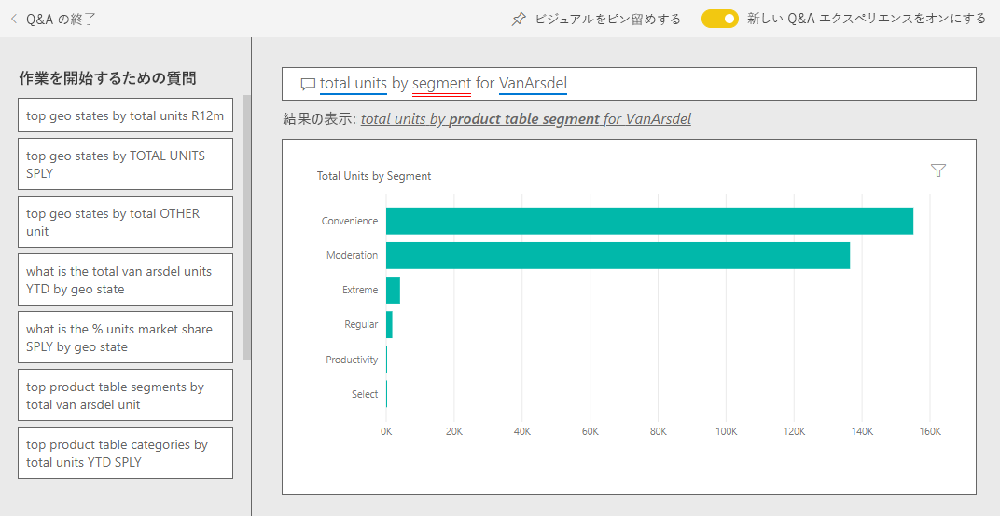

# Power BI の売上およびマーケティングのサンプル:ツアーを開始する

## 売上およびマーケティングのサンプルの概要
**売上およびマーケティングのサンプル** には、VanArsdel Ltd という名前の架空の製造会社のダッシュボードとレポートが含まれています。このダッシュボードは VanArsdel 社の最高マーケティング責任者 (CMO) によって作成され、業界動向、マーケットに占める会社の製品のシェア、製品の数量や売上、センチメントなどについて確認できます。

VanArsdel 社には多くの競合他社が存在しますが、その業界における市場リーダーです。 CMO は市場シェアの拡大と成長の機会を狙っています。 しかし何らかの理由から、VanArsdel 社の市場シェアが縮小し始め、6 月には急激な落ち込みを見せました。

このサンプルは、ビジネス用のデータ、レポート、ダッシュボードを用いて Power BI を使う方法について説明するシリーズの一部です。 これは、obviEnce (www.obvience.com) が収集している非特定化された実データです。

## 前提条件

 このサンプルを使用するには、事前にサンプルを[コンテンツ パック](https://docs.microsoft.com/power-bi/sample-sales-and-marketing#get-the-content-pack-for-this-sample)、[.pbix](http://download.microsoft.com/download/9/7/6/9767913A-29DB-40CF-8944-9AC2BC940C53/Sales%20and%20Marketing%20Sample%20PBIX.pbix)、または [Excel ブック](http://go.microsoft.com/fwlink/?LinkId=529785)としてダウンロードしておく必要があります。

### このサンプルのコンテンツ パックを入手する

1. Power BI サービス (app.powerbi.com) を開いてログインします。
2. 左下隅にある **[データの取得]** を選びます。
   
    
3. 表示される [データの取得] ページで、**[サンプル]** アイコンを選びます。
   
   
4. **[売上およびマーケティングのサンプル]** を選択し、**[接続]** を選択します。  
  
   
   
5. Power BI がコンテンツ パックをインポートし、新しいダッシュボード、レポート、データセットを現在のワークスペースに追加します。 新しいコンテンツは黄色のアスタリスクで示されます。 
   
   
  
### このサンプルの .pbix ファイルを取得する

あるいは、Power BI Desktop で使用するために設計された .pbix ファイルとして、サンプルをダウンロードすることもできます。 

 * [売上およびマーケティングのサンプル](http://download.microsoft.com/download/9/7/6/9767913A-29DB-40CF-8944-9AC2BC940C53/Sales%20and%20Marketing%20Sample%20PBIX.pbix)

### このサンプルの Excel ブックを取得する
[このサンプルのデータセット (Excel ブック) だけをダウンロード](http://go.microsoft.com/fwlink/?LinkId=529785)することもできます。 ブックには、表示および変更可能な Power View シートが含まれています。 生データを表示するには、**[Power Pivot] > [管理]** を選択します。

## ダッシュボードからわかること
ダッシュボードのツアーを開始し、CMO がピン留めしたタイルを確認してみましょう。 市場シェア、売上、センチメントに関する情報が表示されます。 さらに、それらのデータは地域、時刻、競合会社別に分類されています。

* 左側に縦に並んでいる数値タイルは、過去 1 年間の業界販売高 (50K)、市場シェア (32.86%)、販売高 (16K)、センチメント スコア (68)、センチメント ギャップ (4)、販売個数合計 (1M) を示しています。
* 一番上の折れ線グラフは、一定期間にわたる市場シェアの変動を示しています。 市場シェアが 6 月に大幅に落ち込んでいることがわかります。 また、しばらく上昇を見せていた R12M (連続する 12 か月間) のシェアも失速し始めています。
* 最大の競合他社は Aliqui 社です (中央の縦棒グラフ タイルから読み取ることができます)。
* ビジネスのほとんどが東部および中部地域に集中しています。
* 下部にある折れ線グラフは、6 月の急落が季節によるものでないことを示しています。同時期に同様の落ち込みを見せている競合他社はありません。
* 2 つの \[Total Units] \(個数合計) タイルは、セグメント別および地域/メーカー別の個数を示しています。 この業界の最大の市場セグメントは、 **\[Productivity]** \(生産性) と **\[Convenience]** \(利便性) です。

### Q&A を使用した詳しい調査
#### 売上に影響するセグメントは? 業界の傾向に一致しているか?
1. [Total Units Overall by Segment] \(セグメント別個数合計\) タイルを選ぶと、Q&A が開きます。
2. 既存のクエリの最後に **for VanArsdel (VanArsdel 社)** と入力します。 Q&A が質問を解釈し、更新されたグラフと回答を表示します。 製品の数量は \[Convenience] \(利便性) と \[Moderation] \(モデレーション) に由来します。

   
3. **\[Moderation]** \(モデレーション) および **\[Convenience]** \(利便性) カテゴリにおけるシェアは非常に高く、競争力のあるセグメントだといえます。
4. 上部のナビゲーション バー (階層リンク) でダッシュボードの名前を選択して、ダッシュボードに移動します。

#### 各カテゴリ (対地域) における個数合計の市場シェアの動向は?
1. [Total Units YTD by Manufacturer, Region] \(メーカー別、地域別個数合計 YTD\) というタイルに注目します。 個数合計の市場シェアをカテゴリ別に見るとどう分析できるでしょうか。

   
2. ダッシュボードの上部にある [質問] ボックスに、「**total units by manufacturer and category for 2014 as a treemap**」(2014 年のメーカー別およびカテゴリ別合計個数をツリーマップとして表示) という質問を入力します。 質問を入力するに従って視覚化が更新されることにご注意ください。
   
3. 結果を比較するには、ダッシュボードにグラフをピン留めします。 非常に興味深い結果が表示されます。2014 年に **\[Urban]** \(都市) カテゴリに該当する製品を販売したのは VanArsdel 社のみです。
4. ダッシュボードに戻ります。

ダッシュボードも、レポートのエントリ ポイントの 1 つです。  基となるレポートからタイルが作成された場合、そのタイルをクリックすると、レポートが開きます。

ダッシュボードで R12M (連続する 12 か月間) の折れ線グラフから、市場シェアが一定期間上昇していないどころか、低下しつつあることがわかります。 さらに、6 月にはなぜ市場シェアが急落を見せたのでしょうか? さらに深く調査するために、この視覚化をクリックして、基となっているレポートを開きます。

### レポートに含まれる 4 ページ
#### レポートの 1 ページ目には、VanArsdel 社の市場シェアに関する情報が表示されます。

1. 下方にある縦棒グラフ \[Total Units by Month and isVanArsdel] \(VanArsdel 社の月次個数合計) をご覧ください。 黒い列は VanArsdel 社 (弊社製品) を表しており、緑色は競合他社を表しています。 VanArsdel 社で 2014 年 6 月に発生した急落は、競合他社では起きていません。
2. 中央右側にある横棒グラフ \[Total Category Volume by Segment] \(セグメント別カテゴリ数量合計) はフィルター処理され、VanArsdel 社の上位 2 セグメントが表示されています。 このフィルターの作成方法を確認しましょう。  

   a.  右側の [フィルター] ウィンドウを展開します。  
   b.  視覚化をクリックして選びます。  
   c.  [ビジュアル レベル フィルター] で **[セグメント]** のフィルター処理が行われて、**\[Convenience]** \(利便性) と **\[Moderation]** \(モデレーション) のみが表示されています。  
   d.  フィルターを変更するには、[セグメント] を選んでそのセクションを展開し、**[Productivity]\(生産性\)** をオンにしてそのセグメントを追加します。  
3. [Total Units by Month and isVanArsdel]\(VanArsdel 社の月次個数合計\) で、凡例の黒い [はい] を選び、VanArsdel でページにクロス フィルターを適用します。 \[Productivity] \(生産性) セグメントでは競合他社が優位であることがわかります。
4. 黒い [はい] をもう一度選ぶと、フィルターが解除されます。
5. 折れ線グラフを確認してみましょう。 毎月の市場シェアと 12 か月連続の市場シェアが表示されます。 12 か月連続のデータは、毎月の変動を平滑化したもので、長期的な傾向を示します。 横棒グラフの [Convenience]\(利便性\) と [Moderation]\(モデレーション\) を選んで、セグメントごとに市場シェアの変動の様子を確認します。 \[Moderation] \(モデレーション) セグメントは \[Convenience] \(利便性) セグメントよりも、市場シェアの変動が大きくなっています。

引き続き、6 月に市場シェアが急落した理由を解明していきます。 センチメントを確認してみましょう。

#### レポートの 3 ページ目には、センチメントに関する情報が表示されます。

ツイート、Facebook、ブログ、記事などが基となって、センチメントが 2 本の折れ線グラフで表されます。 左上のセンチメントのグラフから、VanArsdel 社製品のセンチメントが 2 月までは中程度であったことがわかります。 その後、2 月に大きく低下し始め、6 月に底を打っています。 センチメントがこのように悪化した原因は何でしょうか? 外部ソースを確認する必要があります。 2 月に投稿されたいくつかの記事やブログで、VanArsdel 社のカスタマー サービスが業界内で最悪だと評価されました。 この悪評が顧客のセンチメントや販売に直接影響したのです。 VanArsdel 社がカスタマー サービスを向上させる努力を重ねた結果、顧客と業界がそのことに気づきました。 7 月にはポジティブなセンチメントが上昇し始め、60 台というこれまでにない高い値を保てるようになりました。 センチメントのこの回復は、1 ページ目と 3 ページ目の \[Total Units by Month] \(月別個数合計) に反映されています。 おそらくこのことが、6 月に市場シェアが低下した原因の一部です。

センチメント ギャップについても調査する必要があります。どの地域のセンチメント ギャップが最も大きいか、この事実を管理側で利用するにはどうすればいいのか、他の地域で同様の成果を得るにはどうすればいいのか、といったことを検討する必要があります。

#### YTD カテゴリの傾向を読み取れるレポートの 2 ページ目

* このカテゴリに該当するあらゆる企業のうち、VanArsdel 社は最大規模を誇る企業であり、最大の競争相手は Natura、Aliqui、Pirium の 3 社です。 この 3 社の動向を監視しておく必要があります。
* Aliqui 社は成長を見せていますが、製品数量を VanArsdel 社と比較すると、依然低いことがわかります。
* ツリーマップでは VanArsdel 社は緑色で表示されています。 東部の顧客は競合他社を好み、中部では VanArsdel 社が強く、東部における VanArsdel 社のシェアが最低であることがわかります。
* 地理的要素が販売個数に影響しています。 東部はほとんどのメーカーにとって優勢な地域であり、VanArsdel 社は中部地域でも強力な存在感を示しています。
* 右下のグラフ \[Total Units YTD Var % by Month and Manufacturer] \(月別およびメーカー別個数合計 YTD の変化) を見ると、VanArsdel 社にポジティブな変化があり、よい兆候を示しています。昨年より数値が向上していますが、それは競合の 1 つ、Aliqui 社も同様です。

#### 競合製品分析が表示されるレポートの 4 ページ目

* 左下のグラフには、VanArsdel 社にとっての最強セグメント 2 つを除くすべてのカテゴリ セグメントが表示されています。 カテゴリをフィルター処理するためにバーをクリックすると、VanArsdel 社の潜在的な拡大領域を特定できます。 **\[Extreme]** \(エクストリーム) および **\[Productivity]** \(生産性) セグメントが他のセグメントよりも急速に成長しています。
* しかしこれらのセグメントで VanArsdel 社が優位を示しているわけではありません。 これらの領域を強化する場合は、データから、どの地域でどのセグメントが強いのかを読み取ることができます。 さらに、どの地域でより成長をみせているのか、そのセグメントにおける最大の競合他社はどこなのか、といった疑問についても深く調べることができます。
* 6 月の市場シェア低下についてはどうでしょう? 6 月は \[Productivity] \(生産性) セグメントが拡大する月ですが、VanArsdel 社は劣勢です。 これが 6 月の市場シェア低下の原因だと考えられます。

視覚化を VanArsdel 社、セグメント別、月別、地域別でフィルター処理すると、VanArsdel 社の成長機会を見い出すことができます。

これは、試してみるのに安全な環境です。 変更内容を保存しないようにいつでも選択できます。 一方、保存すると、常にこのサンプルの新しいコピーに対する **データの取り込み** に進むことができます。

## 次の手順:データへの接続
この記事から、Power BI ダッシュボード、Q&A、レポートから売上およびマーケティング データへの洞察をどのように得られるかがご理解いただけたでしょうか。 次はあなたの番です。ご自分のデータを接続してみてください。 Power BI を使用すると、広範なデータ ソースに接続することができます。 詳細については、「[Power BI の概要](service-get-started.md)」をご覧ください。  
