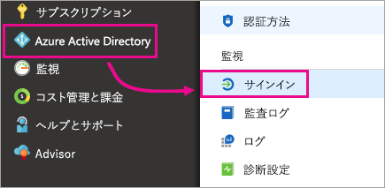

# サインインした Power BI ユーザーを見つける

テナント管理者の場合に Power BI を使用して署名したユーザーを表示する場合、 [Azure Active Directory のアクセスおよび使用状況レポート](/azure/active-directory/reports-monitoring/concept-sign-ins)可視性を取得します。

<iframe width="640" height="360" src="https://www.youtube.com/embed/1AVgh9w9VM8?showinfo=0" frameborder="0" allowfullscreen></iframe>

> [!NOTE]
> **サインイン**レポートが有益な情報を提供しますが、各ユーザーがライセンスの種類を識別しません。 ライセンスを表示するには、Microsoft 365 管理センターを使用します。

## 要件

(非管理者を含む) すべてのユーザーが自分のサインインのレポートを表示できますが、すべてのユーザーに関するレポートを表示するには、次の要件を満たす必要があります。

* Azure Active Directory Premium ライセンスが関連付けられて、テナントが必要です。

* 次のいずれかのロールである必要があります:全体管理者、セキュリティ管理者、セキュリティ閲覧者。

## Azure portal を使用してサインインを表示する

サインイン アクティビティを表示するには、次の手順のようにします。

1. **Azure portal** で、 **[Azure Active Directory]** を選択します。

1. **[監視]** で **[サインイン]** を選択します。
   
    

1. **[Microsoft Power BI]** または **[Power BI Gateway]** のいずれかを選択して、アプリケーションをフィルター処理し、 **[適用]** を選択します。

    **Microsoft Power BI**は、サインイン アクティビティにフィルターが、サービスに関連する**Power BI Gateway**サインイン アクティビティ、オンプレミス データ ゲートウェイを特定するためのフィルター。
   
    

## データをエクスポートする

できます[サインイン レポートのダウンロード](/azure/active-directory/reports-monitoring/quickstart-download-sign-in-report)で 2 つの形式のいずれかの: CSV ファイル、または JSON ファイルです。

![[ダウンロード] ボタンのスクリーン ショット。](media/service-admin-access-usage/download-sign-in-data-csv.png)

上部にある、**サインイン**レポートで、**ダウンロード**し、次のオプションのいずれかを選択します。

* **CSV**をフィルター処理されているデータを CSV ファイルをダウンロードします。

* **JSON**現在フィルター処理されたデータの JSON ファイルをダウンロードします。

## データのリテンション期間

サインイン関連のデータは、最大 30 日間使用できます。 詳細については、次を参照してください。 [Azure Active Directory レポートの保持ポリシー](/azure/active-directory/reports-monitoring/reference-reports-data-retention)します。

## 次の手順

[組織内での監査の使用](service-admin-auditing.md)

他にわからないことがある場合は、 [Power BI コミュニティで質問してみてください](https://community.powerbi.com/)。