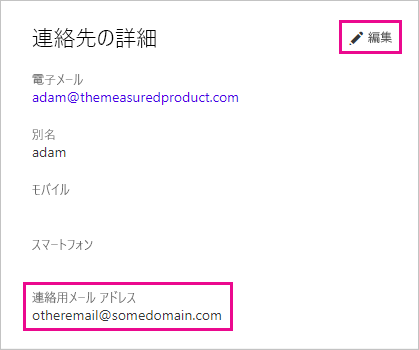

# <a name="use-an-alternate-email-address"></a>連絡用電子メール アドレスを使用します。

Power BI にサインアップするときには、メール アドレスを入力します。 既定では、Power BI はこのアドレスを使用して、サービスのアクティビティに関する更新を送信します。 たとえば、他のユーザーから送信される共有の招待は、このアドレスに配信されます。

場合によっては、サインアップ時のものとは異なるメール アドレスにメールを配信してほしいことがありあります。 この記事では、PowerShell および Office 365 で代替アドレスを指定する方法について説明します。 この記事では、Azure Active Directory (Azure AD) が電子メール アドレスを解決する方法についても説明します。

> [!NOTE]
> 代替アドレスを指定しても、サービス更新、ニュースレター、その他のプロモーション通信に Power BI で使用されるメール アドレスに影響はありません。 それらの通信は、常に、Power BI にサインアップするときに使用した電子メール アドレスに送信します。

## <a name="use-office-365"></a>Office 365 を使用する

Office 365 で代替アドレスを指定するには、次の手順のようにします。

1. [Office 365 の個人情報ページ](https://portal.office.com/account/#personalinfo)を開きます。 場合は、アプリが表示されたら、電子メール アドレスと Power BI を使用するパスワードでサインインします。

1. 左側のメニューで、 **[個人情報]** を選択します。

1. **[連絡先の詳細]** セクションで、 **[編集]** を選択します。

    詳細を編集することはできない場合は、Office 365 管理者が管理して、電子メール アドレスを意味します。 電子メール アドレスを更新する、管理者に問い合わせてください。

    

1. **代替電子メール**フィールドに、Office 365 に Power BI の更新プログラムを使用する電子メール アドレスを入力します。

## <a name="use-powershell"></a>PowerShell を使用する

PowerShell で代替アドレスを指定するには、[Set-AzureADUser](/powershell/module/azuread/set-azureaduser/) コマンドを使用します。

```powershell
Set-AzureADUser -ObjectId john@contoso.com -OtherMails "otheremail@somedomain.com"
```

## <a name="email-address-resolution-in-azure-ad"></a>Azure AD でのメール アドレスの解決

Azure をキャプチャするには、Power BI の埋め込みトークンを AD、電子メール アドレスの 3 つのさまざまな種類のいずれかを使用することができます。

* ユーザーの Azure AD のアカウントに関連付けられている主なメール アドレス

* UserPrincipalName (UPN) メール アドレス

* "*その他のメール アドレス*" 配列属性

Power BI では、次の順序で使用するメール アドレスが選択されます。

1. Azure AD テナントのユーザー オブジェクトにメール属性が存在する場合、Power BI はそのメール属性をメール アドレスに使います。

1. UPN メールが **\*.onmicrosoft.com** ドメイン メール アドレス ("\@" 記号の後の情報) では*ない* 場合、Power BI ではそのメール属性をメール アドレスに使用します。

1. 場合、*他の電子メール アドレス*Azure AD ユーザー オブジェクトの配列属性が存在し、Power BI は、(この属性に電子メールの一覧があります) からそのリストに最初の電子メールを使用します。

1. 上記の条件のいずれも存在する場合、Power BI は、UPN アドレスを使用します。

他にわからないことがある場合は、 [Power BI コミュニティを利用してください](http://community.powerbi.com/)。