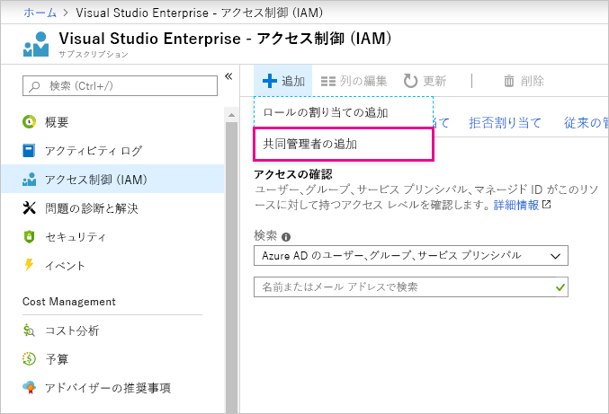

# Power BI と Azure で同じアカウントを使用する

Power BI と Azure を両方とも使っているユーザーであれば、両方のサービスに同じログインを使用して、パスワードを 2 回入力する手間を省きたいと思われることでしょう。

Power BI では、職場か学校のメール アドレスに関連付けられている組織アカウントを使ってサインインします。  Azure では、Microsoft アカウントまたは組織アカウントのいずれかを使用してサインインします。

Azure と Power BI の両方に同じログインを使用したい場合は、必ず組織アカウントを使用して Azure にサインインしてください。

**既に Microsoft アカウントを使用して Azure にサインインしている場合**

以下の手順のようにして、Azure の共同管理者として、組織アカウントを追加できます。

1. [Azure portal](http://portal.azure.com/) にサインインします。 複数の Azure ディレクトリでユーザーになっている場合は、 **[サブスクリプション]** を選択し、フィルター処理を行って編集するディレクトリとサブスクリプションのみを表示します。

1. ナビゲーション ウィンドウで、 **[アクセス制御 (IAM)]** を選択し、 **[追加]** \> **[共同管理者の追加]** を選択します。

    

1. 組織アカウントに関連付けられているメール アドレスを入力し、 **[追加]** を選択します。

1. 次に Azure portal にサインインするときに、組織のメール アドレスを使用します。

他にわからないことがある場合は、 [Power BI コミュニティを利用してください](http://community.powerbi.com/)。
